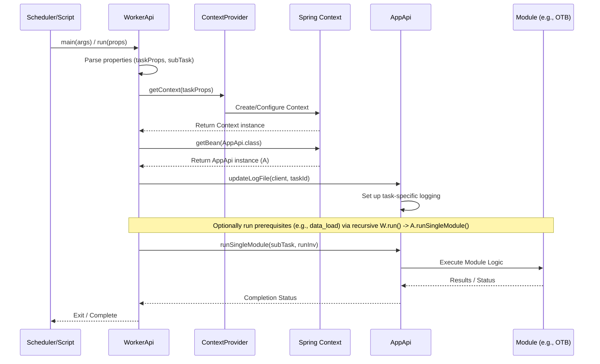

# Chapter 2: Worker API

In the [previous chapter](01_application_api__appapi__.md), we learned about the [Application API (AppApi)](01_application_api__appapi__.md), which acts as the central conductor for `irisx-algo`, initiating various tasks like running modules or synchronizing data. Think of `AppApi` as the factory manager who knows *how* to get different jobs done.

But how does a specific job actually get started, especially if it's triggered by an external system, like an automated schedule? Imagine a specific task, like calculating the "Open To Buy" (OTB) budget for the next season. This might be a long-running job that needs to be executed independently.

This is where the **Worker API** comes in.

## What Problem Does Worker API Solve?

While `AppApi` provides the *methods* to run tasks, the `WorkerApi` acts as a dedicated **entry point** or **wrapper** designed specifically for executing these tasks as standalone jobs.

Think of it like this:

*   **`AppApi`:** The factory manager who has the blueprints and knows how to operate all the machinery (run modules, sync data, etc.).
*   **`WorkerApi`:** A dedicated worker assigned to a specific task (like "Assemble Product X"). This worker receives instructions (task properties), sets up their workstation (initializes context), perhaps gathers some initial parts (prerequisites), uses the factory machinery (calls `AppApi` methods) to do the main job, and keeps a log of their work.

The `WorkerApi` is particularly useful when `irisx-algo` tasks need to be run:

1.  **Externally Triggered:** Started by job schedulers (like Jenkins, cron jobs) or other automated systems.
2.  **In Isolation:** Run as a separate process dedicated to a single, specific algorithm task (e.g., just running OTB, or just running Distribution).
3.  **With Specific Context:** Each run needs its own set of parameters like the client name, a unique task ID, the specific module to run, etc.

## Core Responsibilities of Worker API

*   **Entry Point:** Provides the `main` method or a `run` method that can be easily invoked by external systems.
*   **Context Initialization:** Takes task-specific properties (like client name, task ID, module name) and uses them to set up the correct application environment (database connections, configurations, etc.). This heavily relies on `ContextProvider`.
*   **Prerequisite Handling (Optional):** May run necessary preliminary steps, like ensuring data is loaded (`data_load`) or running input validations before the main task.
*   **Task Delegation:** Uses the initialized context to get an instance of [Application API (AppApi)](01_application_api__appapi__.md) and tells it *which* specific module(s) to execute for this job.
*   **Task-Specific Logging:** Ensures that logs generated during this specific job run are tagged appropriately (e.g., with the client and task ID), making it easier to track individual job executions.

## How to Use Worker API (Conceptual Example)

Typically, you wouldn't directly call `WorkerApi` methods from your own Java code within the `irisx-algo` project itself. Instead, it's designed to be run as a standalone application, often from a command line or script.

**Use Case:** A scheduler needs to run the `OtbGroupModule` (OTB Calculation) for the client "FashionForward" as task "otb-run-2024-q3".

1.  **Prepare Properties:** Create a configuration file (e.g., `worker.properties`) or gather the necessary parameters:
    *   `client_name=FashionForward`
    *   `task_id=otb-run-2024-q3`
    *   `task_name=otb_calculation` (This often maps to the main module)
    *   `task_type=RUN_ALGO`
    *   `subTask=otb_calculation` (The specific module to run in this step)
    *   Other configurations like database details, file paths, etc.

2.  **Invoke WorkerApi:** An external script or scheduler would typically invoke the `WorkerApi`'s `main` method, passing the path to the properties file and potentially the specific task/module to run. Conceptually, it might look like:

    ```bash
    java -cp irisx-algo.jar com.increff.irisx.WorkerApi /path/to/worker.properties RUN_ALGO otb_calculation
    ```

3.  **WorkerApi Executes:** The `WorkerApi` starts, reads the properties, initializes the application context, potentially runs prerequisites (like data loading if needed), and then tells `AppApi` to run the `otb_calculation` module.

**Inside the Code (Simplified Test Example):**

Let's look at a simplified version of how a test might interact with `WorkerApi`:

```java
// Simplified from WorkerTest.java

// 1. Create an instance of WorkerApi
WorkerApi workerApi = new WorkerApi();

// 2. Prepare task properties (often loaded from a file)
Properties taskProps = new Properties();
taskProps.put("client_name", "FashionForward");
taskProps.put("task_id", "otb-run-2024-q3");
taskProps.put("task_name", "otb_calculation");
taskProps.put("task_type", "RUN_ALGO");
// ... other properties ...

// 3. Create properties for the specific run step
Properties runProps = new Properties();
runProps.put("taskProps", taskProps); // Embed the main task properties
runProps.put("subTask", "otb_calculation"); // Specify the module for *this* run

// 4. Execute the worker task
// The '0' might be a flag (like 'runInv' for inventory) - not critical here
workerApi.run(runProps, 0);

System.out.println("Worker task for OTB calculation submitted.");
```

**Explanation:**

*   We create a `WorkerApi` instance.
*   We load or define the `taskProps` which contain overall job details (client, task ID).
*   We create `runProps` for this specific execution step, telling it *which* `subTask` (module) to run and embedding the `taskProps`.
*   Calling `workerApi.run()` kicks off the process described below.

**Expected Outcome:**

*   The `WorkerApi` initializes based on `taskProps`.
*   Logs will be configured with "client:FashionForward task:otb-run-2024-q3".
*   The `otb_calculation` module (specifically `OtbGroupModule`) will be executed via `AppApi`.
*   Results of the OTB calculation will be stored (e.g., in the database or output files).
*   Logs detailing the OTB calculation process will be generated.

## Under the Hood: How WorkerApi Works

Let's trace the steps when `WorkerApi.run()` (or its `main` method) is called.

**High-Level Steps:**

1.  **Receive Request:** `WorkerApi` starts, receiving task properties (either as arguments or loaded from a file).
2.  **Initialize Context:** It calls `init(taskProperties)`, which uses `ContextProvider.getContext(taskProperties)` to create and configure a Spring `AnnotationConfigApplicationContext`. This context contains all the necessary beans (like `AppApi`, database connections, etc.) tailored for *this specific task*.
3.  **Prepare for Module Run:** The `runModules()` method is called. It parses the properties (using `ModuleRunArgs`) to easily access details like client name, task ID, and the specific module (`subTask`) to run.
4.  **Get AppApi:** It asks the newly created Spring context for an instance of `AppApi`.
5.  **Configure Logging:** It calls `appApi.updateLogFile()` using the client name and task ID from the properties. Now, all subsequent logs from `AppApi` and the modules it runs will be tagged for this specific job.
6.  **Handle Prerequisites (Optional):** The `main` method often contains logic to run prerequisite tasks like `data_load` or validations before the main algorithm, calling `worker.run()` recursively for each step.
7.  **Delegate to AppApi:** It calls `appApi.runSingleModule(subTask, runInv)`, passing the name of the module to be executed (e.g., "otb_calculation").
8.  **Module Execution:** `AppApi` takes over (as described in [Chapter 1](01_application_api__appapi__.md)), finds the correct module code, and runs it.
9.  **Completion:** Once the module finishes, control returns through `AppApi` back to `WorkerApi`, and the worker process typically exits.

**Sequence Diagram:**



**Code Dive:**

Let's peek at some key parts of `WorkerApi.java`.

*   **Initialization (`init`)**:

    ```java
    // File: src/main/java/com/increff/irisx/WorkerApi.java
    import org.springframework.context.annotation.AnnotationConfigApplicationContext;
    import com.increff.irisx.provider.ContextProvider;
    import java.util.Properties;

    public class WorkerApi {
        private AnnotationConfigApplicationContext ctx; // Holds the app context

        private void init(Properties taskProperties) {
            // Use ContextProvider to get a tailored Spring context
            ctx = ContextProvider.getContext(taskProperties);
        }
        // ... rest of the class ...
    }
    ```

    **Explanation:** The `init` method is crucial. It takes the `taskProperties` (containing client info, task ID, etc.) and passes them to `ContextProvider`. `ContextProvider` uses these properties to build a specific Spring application context (`ctx`) for this worker instance. This context will have beans configured correctly for the given client and task.

*   **Running the Task (`run` and `runModules`)**:

    ```java
    // File: src/main/java/com/increff/irisx/WorkerApi.java
    import com.increff.irisx.api.AppApi;
    import com.increff.irisx.args.ModuleRunArgs;
    import com.increff.irisx.constants.TaskType;
    // ... other imports

    public void run(Properties properties, int runInv) {
        logger.info("Algo Modules Running");
        Properties taskProperties = (Properties) properties.get("taskProps");
        logger.info("Initializing properties");
        init(taskProperties); // <-- Initialize context first!
        logger.info("Running the task");
        // Get the specific module name for this run
        String subTask = properties.getProperty("subTask");
        runModules(taskProperties, subTask, runInv); // <-- Execute the module
        logger.info("Task execution completed");
    }

    private void runModules(Properties properties, String subTask, int runInv) {
        // Helper to easily access properties
        ModuleRunArgs moduleRunArgs = new ModuleRunArgs(properties);
        logger.info("Running task: " + moduleRunArgs.taskName + " and subtask: "+subTask+" for client " + moduleRunArgs.clientName);

        // Get AppApi bean from the initialized context
        AppApi api = ctx.getBean(AppApi.class);

        // Configure logging for *this* specific task run
        api.updateLogFile(moduleRunArgs.clientName, moduleRunArgs.taskId);

        // Basic check (simplified)
        if (!moduleRunArgs.taskType.equals(TaskType.RUN_ALGO))
            throw new ModuleException("Invalid Task Type");

        // Run the specific module requested (subTask) via AppApi
        api.runSingleModule(subTask, runInv);
    }
    ```

    **Explanation:**
    1.  The `run` method first extracts the main `taskProperties` and calls `init()` to set up the context.
    2.  It then calls `runModules()`, passing the `taskProperties`, the specific `subTask` (module name like "otb_calculation") to run now, and the `runInv` flag.
    3.  `runModules()` uses `ModuleRunArgs` to easily read properties like `clientName` and `taskId`.
    4.  Crucially, it gets the `AppApi` instance from the context (`ctx.getBean(AppApi.class)`). This ensures it's using the `AppApi` configured for this specific task.
    5.  It calls `api.updateLogFile()` to make sure logs are tagged correctly.
    6.  Finally, it delegates the actual module execution to `api.runSingleModule(subTask, runInv)`, telling the "factory manager" (`AppApi`) which specific piece of machinery to operate for this job.

*   **Handling Prerequisites (Conceptual from `main` method):**

    The `main` method often has logic like this (simplified):

    ```java
    // Simplified logic from WorkerApi.main()
    public static void main(String[] args) throws IOException {
        // ... parse args to get config_path, type, algo ...
        WorkerApi worker = new WorkerApi();
        Properties taskProps = getProperties(config_path);
        Properties props = new Properties();
        props.put("taskProps", taskProps);

        // Example: If the algo needs data_load first
        if (!moduleHasOwnSync(algo)) { // Check if module handles its own data sync
            props.put("subTask", "data_load"); // Set subTask for data loading
            worker.run(props, 0); // Run data load first
        }

        // Example: Run inventory computation (maybe always needed)
        props.put("subTask", "inventory_computation");
        // Run inventory (flag '0' might mean don't force re-run if not needed)
        worker.run(props, 0);

        // Now run the main algorithm requested
        props.put("subTask", algo); // Set subTask to the main algorithm
        worker.run(props, 0); // Run the main algorithm
    }
    ```

    **Explanation:** This shows how the `WorkerApi`'s entry point (`main`) can act as a mini-orchestrator for a specific job type. It might call `worker.run()` multiple times with different `subTask` values to ensure prerequisites like data loading or inventory calculation are done before running the main requested algorithm (`algo`). Each `worker.run()` call ensures the context is correct and logging is set up before delegating to `AppApi`.

## Conclusion

The **Worker API** provides a crucial bridge between external job schedulers or triggers and the internal execution logic managed by the [Application API (AppApi)](01_application_api__appapi__.md). It acts as a dedicated entry point for running specific algorithm tasks in isolation. Its key roles include initializing the correct application context based on task properties (using `ContextProvider`), setting up task-specific logging, potentially handling prerequisites, and ultimately delegating the core module execution to `AppApi`.

Now that we understand how `AppApi` orchestrates tasks and `WorkerApi` provides an entry point for specific jobs, how do these components get their detailed instructions and configurations? The next chapter explores how settings and parameters are managed using [Configuration & Arguments (Args Classes)](03_configuration___arguments__args_classes__.md).

[Next Chapter: Configuration & Arguments (Args Classes)](03_configuration___arguments__args_classes__.md)

---

Generated by [AI Codebase Knowledge Builder](https://github.com/The-Pocket/Tutorial-Codebase-Knowledge)