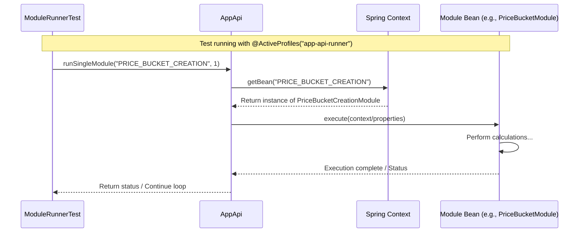

# Chapter 4: Module Runner

In the [previous chapter](03_configuration___arguments__args_classes__.md), we learned how modules get their specific settings using [Configuration & Arguments (Args Classes)](03_configuration___arguments__args_classes__.md). We saw how a class like `NoosArgs` acts like a settings sheet, loading parameters like `bestseller_duration` from a configuration source.

Now, imagine you're developing or testing a specific part of the `irisx-algo` system. You don't want to run the *entire* complex chain of calculations every single time. Maybe you just made a change to the `Price Bucket Creation` module, and you want to run *only* that module, or perhaps run it followed immediately by the `NOOS` module to see how they interact, without waiting for everything else.

How can you tell the system, "Just run this specific sequence of modules for me right now"?

## What Problem Does the Module Runner Solve?

Normally, `irisx-algo` runs modules based on a predefined structure and dependencies (which we'll explore more in chapters like [Abstract Module Group](61_abstract_module_group_.md) and [Module Dependencies & Validation Mapping](62_module_dependencies___validation_mapping_.md)). This ensures everything runs in the correct order for a standard production run.

However, during development or debugging, this standard flow can be slow and cumbersome. You might need to:

1.  **Test a specific module:** Run just one module in isolation to check its logic.
2.  **Test a specific sequence:** Run a small, custom chain of modules to see how they work together.
3.  **Debug an interaction:** Run Module A, then Module B, and examine the results immediately after B, without running Modules C, D, E...

The **Module Runner** concept (often facilitated by specific testing setups) provides a way to do exactly this. It allows you to define a **custom list of modules** to execute in the order you specify, effectively **bypassing the standard dependency logic**.

Think of it like having a playlist for your music player:

*   **Standard Run:** Like playing a pre-arranged album from start to finish (following defined dependencies).
*   **Module Runner:** Like creating your own custom playlist with just the songs (modules) you want to hear, in the order you choose.

This capability is primarily used for testing and development scenarios.

## Enabling the Module Runner Mode

To use this custom execution flow, `irisx-algo` uses a specific **Spring Profile** called `app-api-runner`. A Spring Profile is like a switch that tells the application to load a specific set of configurations. When the `app-api-runner` profile is active, the system is set up to allow this more direct, custom module execution, often within a testing environment.

We can see this profile being activated in a special test configuration file:

```java
// File: src/test/java/com/increff/irisx/spring/AppApiRunnerConfig.java
package com.increff.irisx.spring;

import org.springframework.context.annotation.*;
// ... other imports

@Configuration
// Load standard properties
@PropertySource(value = {"classpath:com/increff/irisx/config.properties"})
// Activate THIS configuration only when the 'app-api-runner' profile is used
@Profile("app-api-runner")
// Import the main application's Spring configuration
@Import(AppSpringConfig.class)
public class AppApiRunnerConfig {
    // This class mainly serves to group the annotations
    // It tells Spring: "If 'app-api-runner' is active,
    // load AppSpringConfig and the specified properties."
}
```

**Explanation:**

*   `@Configuration`: Marks this as a Spring configuration class.
*   `@Profile("app-api-runner")`: This is the key! It tells Spring to only use this configuration class if the application is started with the `app-api-runner` profile active.
*   `@Import(AppSpringConfig.class)`: It imports the main application configuration, ensuring all the necessary beans (like modules, APIs, etc.) are still available.

## How to Use the Module Runner (via a Test Class)

The most common way to use this concept is through a dedicated test class designed for running custom module sequences. Let's look at `ModuleRunnerTest.java`.

**Use Case:** A developer wants to run `Price Bucket Creation`, then `NOOS`, then a few other specific modules, plus the standard `Data Load` and `Inventory Computation` first.

```java
// File: src/test/java/com/increff/irisx/it/ModuleRunnerTest.java
package com.increff.irisx.it;

// ... imports for testing, logging, AppApi, ModuleName ...
import com.increff.irisx.api.AppApi;
import com.increff.irisx.constants.ModuleName;
import com.increff.irisx.util.AbstractAppApiTest;
import org.junit.Ignore; // Important!
import org.junit.Test;
import org.springframework.beans.factory.annotation.Autowired;
import org.springframework.test.context.ActiveProfiles; // For profile activation

import java.util.ArrayList;
import java.util.List;

// Activate the special profile for this test
@ActiveProfiles("app-api-runner")
// Usually ignored in automated builds, run manually by developers
@Ignore
public class ModuleRunnerTest extends AbstractAppApiTest { // Inherits test setup

    @Autowired // Get the main AppApi bean
    private AppApi app;

    // Define the main test method
    @Test
    public void runModules() throws Exception { // Simplified exception handling
        List<String> moduleNames = new ArrayList<>();
        // Define the custom sequence of modules
        moduleNames.add(ModuleName.PRICE_BUCKET_CREATION);
        moduleNames.add(ModuleName.NOOS);
        moduleNames.add(ModuleName.ATTRIBUTE_GROUP);
        // ... add more modules as needed ...

        // Call the helper method to run the sequence
        run(moduleNames);
        System.out.println("Custom module sequence executed!");
    }

    // Helper method to prepend standard setup and run all modules
    public void run(List<String> moduleNames) throws Exception { // Simplified
        List<String> finalSequence = new ArrayList<>();
        // Always run these first for setup
        finalSequence.add(ModuleName.DATA_LOAD);
        finalSequence.add(ModuleName.INVENTORY_COMPUTATION);
        // Add the custom list provided
        finalSequence.addAll(moduleNames);

        // Loop and execute each module using AppApi
        for (String module : finalSequence) {
            System.out.println("Running module: " + module);
            // Tell AppApi to run this specific module
            // The '1' might be a flag (like runInv) passed down
            app.runSingleModule(module, 1);
        }
    }
}
```

**Explanation:**

1.  **`@ActiveProfiles("app-api-runner")`**: This annotation on the class tells the testing framework to start the application context using the `app-api-runner` profile we saw earlier. This ensures the right configuration is loaded.
2.  **`@Ignore`**: This test is marked `@Ignore`. This means it won't run automatically during the standard build process (e.g., when running `mvn test`). Developers typically run this test manually from their IDE when they need to execute a custom module sequence for debugging or testing.
3.  **`@Autowired private AppApi app;`**: The test gets an instance of the [Application API (AppApi)](01_application_api__appapi__.md) injected by Spring. This is the entry point we use to trigger module execution.
4.  **`runModules()` method**:
    *   It creates a `List<String>` called `moduleNames`.
    *   It adds the desired module names (using constants from `ModuleName` for safety) in the specific order required: `PRICE_BUCKET_CREATION`, `NOOS`, `ATTRIBUTE_GROUP`, etc.
    *   It calls the helper method `run()` to execute this list.
5.  **`run(List<String> moduleNames)` method**:
    *   It takes the custom list.
    *   It creates a `finalSequence` list.
    *   It *prepends* essential setup modules: `ModuleName.DATA_LOAD` and `ModuleName.INVENTORY_COMPUTATION`. This ensures necessary data is loaded and basic inventory is calculated before the custom sequence runs.
    *   It adds all modules from the input `moduleNames` list to the `finalSequence`.
    *   It then **loops** through the `finalSequence`. Inside the loop, for *each* module name (`module`), it calls `app.runSingleModule(module, 1)`. This tells the `AppApi` to execute that specific module. Because the `app-api-runner` profile is active, `AppApi` (likely using the underlying `ModuleRunner` or similar logic) executes just that module.

**Expected Outcome:**

When a developer runs the `ModuleRunnerTest.runModules()` method manually:

1.  The Spring application context starts with the `app-api-runner` profile.
2.  The `run` method executes.
3.  The `DATA_LOAD` module runs.
4.  The `INVENTORY_COMPUTATION` module runs.
5.  The `PRICE_BUCKET_CREATION` module runs.
6.  The `NOOS` module runs.
7.  The `ATTRIBUTE_GROUP` module runs.
8.  ...and so on for any other modules added to the list.
9.  The modules are executed **sequentially** as defined in the test, bypassing the standard complex dependency checks. Logs will show the execution order.

## Under the Hood: How it Finds and Runs the Code

So, how does `app.runSingleModule("ModuleName", ...)` actually find and run the code for, say, `PriceBucketCreationModule` when the `app-api-runner` profile is active?

It relies heavily on the **Spring Framework's Dependency Injection** container.

1.  **Bean Creation:** When the application starts (with any profile, including `app-api-runner`), Spring reads the configuration (like `AppSpringConfig`). It finds classes annotated with `@Component` or similar annotations (modules in `irisx-algo` are typically Spring beans). Spring creates an instance (called a "bean") of each module class (e.g., an instance of `PriceBucketCreationModule`, an instance of `NoosGroupModule`, etc.) and manages these instances in its "context". Each bean usually has a name, often derived from its class name (e.g., "priceBucketCreationModule") or explicitly defined. The `ModuleName` constants likely map to these bean names.
2.  **Lookup:** When `app.runSingleModule("PRICE_BUCKET_CREATION", 1)` is called, the underlying code (potentially within `AppApi`, `ModuleApi`, or a dedicated `ModuleRunner` class from `iris-commons`) asks the Spring context: "Give me the bean whose name is 'PRICE_BUCKET_CREATION'".
3.  **Retrieval:** Spring looks up the bean named "PRICE_BUCKET_CREATION" in its context and returns the already created instance of `PriceBucketCreationModule`.
4.  **Execution:** The runner code then calls the standard execution method (e.g., `execute()`) on the retrieved module bean instance. It passes along necessary information, like the configuration `Properties` needed by the module's [Args Class](03_configuration___arguments__args_classes__.md).
5.  **Repeat:** The loop in `ModuleRunnerTest` repeats this process for the next module name in the list.

**Simplified Sequence Diagram:**



This mechanism allows the `ModuleRunnerTest` to precisely control which modules run and in what order, simply by providing a list of their registered names (bean names) to the `AppApi`.

## Conclusion

The **Module Runner** concept, enabled by the `app-api-runner` Spring profile and often utilized via test classes like `ModuleRunnerTest`, provides a powerful way for developers to execute **custom sequences of modules**.

*   It **bypasses** the standard module dependency logic.
*   It's primarily used for **testing, debugging, and development**.
*   It works by defining a list of module names (usually constants from `ModuleName`).
*   A loop iterates through the list, calling `AppApi.runSingleModule()` for each name.
*   Under the hood, it leverages the **Spring context** to look up the corresponding module bean by name and call its execution method.

This gives developers fine-grained control over module execution when needed.

Now that we understand how modules get configured ([Args Classes](03_configuration___arguments__args_classes__.md)) and how we can run custom sequences of them ([Module Runner](04_module_runner_.md)), let's look at a critical component that helps modules access data efficiently during their execution: the [Cache](05_cache_.md).

[Next Chapter: Cache](05_cache_.md)

---

Generated by [AI Codebase Knowledge Builder](https://github.com/The-Pocket/Tutorial-Codebase-Knowledge)