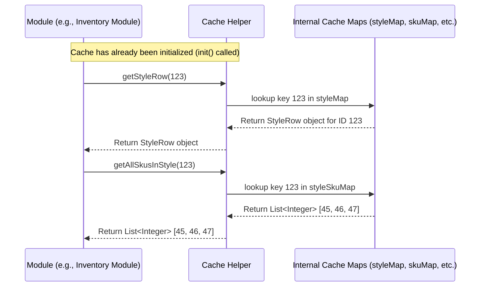

# Chapter 5: Cache

In the [previous chapter](04_module_runner_.md), we saw how the [Module Runner](04_module_runner_.md) allows us to execute specific algorithm modules. But for any module to do its work – whether calculating inventory, planning assortments, or figuring out distribution – it needs data! Lots of it. It needs to know about products (styles, SKUs), stores, historical sales, warehouse stock, and much more.

Imagine you're cooking a big meal with many different recipes (modules). Each recipe needs ingredients. Going to the main supermarket (database or files) every time you need a single ingredient (like one product's details or one store's information) would be incredibly slow and inefficient. You'd spend more time fetching than cooking!

## What Problem Does the Cache Solve?

`irisx-algo` modules often need the same pieces of information repeatedly during complex calculations. For instance, when planning for thousands of products across hundreds of stores, a module might need to look up:

*   The category of Product A.
*   The location of Store X.
*   The price of Product B.
*   The category of Product C.
*   The sales history of Product A in Store X.
*   The location of Store Y.
*   ...and so on, potentially millions of times.

Constantly fetching this from the main storage (databases or files) is a major bottleneck. It's like running to the supermarket for every single egg, cup of flour, or pinch of salt.

The **Cache** solves this by acting like a **well-organized kitchen pantry**.

Think of the Cache as a central storage area *within the application's memory* that holds frequently used data. Before the main cooking (calculations) starts, we go to the supermarket *once* and stock our pantry (the Cache) with all the essential ingredients (product details, store information, sales history, etc.).

Then, when a module needs information, instead of going back to the slow supermarket (database), it quickly grabs it from the nearby, super-fast pantry (Cache).

## Core Idea: A Fast, Local Pantry for Data

The Cache is essentially a collection of organized lists and lookup tables (specifically, Java `Map` objects) sitting in the computer's memory. It stores common data like:

*   **Product Data:** Details about styles (`StyleRow`) and individual SKUs (`SkuRow`), including their relationships (e.g., which SKUs belong to which style).
*   **Store Data:** Information about stores (`StoreRow`), their locations, channels, etc.
*   **Master Data:** Mappings, hierarchies (like style parent relationships), configuration data (like `PlanogramRow`).
*   **Transactional Data (sometimes):** Pre-loaded historical sales (`ProductSalesRow`), inventory snapshots (`WhStockRow`), or order data (`OpenOrdersRow`) if needed frequently across multiple modules.

Because this data is already loaded and organized in memory (often in `Map`s that allow very fast lookups by ID or key), modules can access it almost instantly. This dramatically speeds up calculations, especially complex ones involving many lookups.

## How to Use the Cache

Modules don't typically interact directly with databases to get this common data. Instead, they ask the Cache. Accessing the Cache is usually done through **Dependency Injection**, a concept provided by the Spring framework used in `irisx-algo`.

**1. Getting Access (Injection):**

A module declares that it needs the `Cache` helper. Spring automatically provides the single, shared instance of the Cache to the module when the module is created.

```java
// Inside a module class, e.g., InventoryCreationModule.java

import com.increff.irisx.helper.Cache; // Import the Cache helper class
import org.springframework.beans.factory.annotation.Autowired; // Import Spring's annotation
import org.springframework.stereotype.Component;
// ... other imports ...

@Component // Marks this class as a Spring-managed component
public class MyExampleModule extends AbstractModule { // Assuming it's a module

    @Autowired // Tell Spring to inject the Cache instance here
    private Cache cache;

    // ... rest of the module code ...
}
```

**Explanation:**

*   `@Autowired private Cache cache;`: This line tells the Spring framework, "When you create an instance of `MyExampleModule`, please find the already existing instance of `Cache` and assign it to this `cache` field."

**2. Using Cache Methods:**

Once the module has the `cache` object, it can call simple methods to retrieve data.

```java
// Inside a method within MyExampleModule.java

// ... inside some calculation logic ...

int styleId = 12345;
int storeId = 987;
int skuId = 54321;

// Get the StyleRow object for style 12345
StyleRow style = cache.getStyleRow(styleId);
if (style != null) {
    System.out.println("Style Name: " + style.name);
    System.out.println("Style Category: " + style.category);
}

// Get a list of all SKU IDs belonging to style 12345
List<Integer> skuIdsInStyle = cache.getAllSkusInStyle(styleId);
System.out.println("SKUs in Style " + styleId + ": " + skuIdsInStyle.size());

// Get the SkuRow object for SKU 54321
SkuRow sku = cache.getSkuRow(skuId);
if (sku != null) {
    System.out.println("SKU Size: " + sku.size);
    System.out.println("SKU MRP: " + sku.mrp);
}

// Get the StoreRow object for store 987
StoreRow store = cache.getStoreRow(storeId);
if (store != null) {
    System.out.println("Store Name: " + store.name);
    System.out.println("Store Channel: " + store.channel);
}

// ... use this retrieved data in calculations ...
```

**Explanation:**

*   `cache.getStyleRow(styleId)`: Looks up the `StyleRow` object for the given `styleId` in the Cache's internal `styleMap`. Returns the `StyleRow` object or `null` if not found.
*   `cache.getAllSkusInStyle(styleId)`: Looks up the list of SKU IDs associated with the given `styleId` in the Cache's internal `styleSkuMap`. Returns a `List<Integer>` (which might be empty if the style has no SKUs or doesn't exist).
*   `cache.getSkuRow(skuId)`: Looks up the `SkuRow` object for the given `skuId`.
*   `cache.getStoreRow(storeId)`: Looks up the `StoreRow` object for the given `storeId`.

**Expected Outcome:**

The module quickly retrieves the needed `StyleRow`, `SkuRow`, `StoreRow` objects, or lists of IDs directly from memory without needing to perform slow database queries. The `System.out.println` lines would print the details fetched from the Cache.

## Under the Hood: Filling the Pantry (Initialization)

The Cache doesn't magically have the data. It needs to be filled, typically once at the beginning of a process or job. This is often handled by a dedicated utility module, like `UtilCacheModule`.

**1. The `init()` Method:**

The core logic for loading data is inside the `Cache.java` class, specifically in its `init()` method.

```java
// Simplified snippet from src/main/java/com/increff/irisx/helper/Cache.java

import com.increff.iris.commons.db.ImDbService; // Service to interact with database
import com.increff.irisx.row.input.master.*; // Import Row classes for master data
import com.increff.irisx.util.ObjectMaps; // Helper to create Maps
// ... other imports ...

@Component // Marks Cache as a Spring-managed bean
public class Cache {
    @Autowired
    private ImDbService imdb; // Injected database service

    // Internal maps to hold the data
    private Map<Integer, StyleRow> styleMap;
    private Map<Integer, SkuRow> skuMap;
    private Map<Integer, StoreRow> storeMap;
    private Map<Integer, List<Integer>> styleSkuMap;
    // ... many other maps ...

    public void init() {
        // 1. Fetch raw data from the database (using ImDbService)
        List<StoreRow> allStores = imdb.select(StoreRow.class);
        List<StyleRow> allStyles = imdb.select(StyleRow.class);
        List<SkuRow> allSkus = imdb.select(SkuRow.class);
        List<StyleParentMapRow> styleParents = imdb.select(StyleParentMapRow.class);
        // ... fetch other necessary data (SizeMapping, Attributes, etc.) ...

        // 2. Apply Filtering/Preprocessing (Conceptual - actual logic might be complex)
        //    (e.g., filter out disabled stores, handle style/sku parenting)
        //    We use helper utilities like SkuStyleConversionUtil here (details omitted)
        Map<Integer, Integer> styleParentMap = ObjectMaps.createStyleParentMap(styleParents);
        List<StyleRow> filteredStyles = SkuStyleConversionUtil.getFilteredStyle(allStyles, styleParentMap);
        // ... filter SKUs similarly ...
        Set<Integer> allowedSkus = getFilteredSkus(); // Assume this gets valid SKUs
        List<SkuRow> filteredSkus = SkuStyleConversionUtil.getFilteredSku(allSkus, /*...*/, allowedSkus);

        // 3. Convert lists into efficient Maps using ObjectMaps helper
        storeMap = ObjectMaps.createStoreMap(allStores.stream().filter(s -> s.enabled).collect(Collectors.toList()));
        styleMap = ObjectMaps.createStyleMap(filteredStyles);
        skuMap = ObjectMaps.createSkuMap(filteredSkus, /* size normalization map */);
        styleSkuMap = ObjectMaps.createStyleSkuMap(filteredSkus);
        // ... create other maps (style attributes, price buckets, etc.) ...

        logger.info("Cache initialized: Style=" + styleMap.size() + ", Sku=" + skuMap.size());

        // Often clear the raw data source after loading to save memory
        imdb.clearAllTables(); // Clear the ImDbService internal store
    }

    // Method to clear the cache maps
    public void clear() {
        styleMap = null;
        skuMap = null;
        storeMap = null;
        styleSkuMap = null;
        // ... set all other maps to null ...
        logger.info("Cache cleared.");
    }
    // ... getter methods follow ...
}
```

**Explanation:**

1.  **Fetch Data:** The `init()` method uses the `ImDbService` (an in-memory database service provided by `iris-commons`, often loaded from files initially) to select all rows for essential data types like `StoreRow`, `StyleRow`, `SkuRow`, etc.
2.  **Filter/Preprocess:** It often performs necessary filtering (like removing disabled stores) or applies transformations (like resolving parent styles/SKUs using `SkuStyleConversionUtil`).
3.  **Create Maps:** It uses helper methods (often from a utility class like `ObjectMaps`) to convert these lists of objects into `Map` structures optimized for fast lookups. For example:
    *   `ObjectMaps.createStyleMap(styleList)` likely creates a `Map<Integer, StyleRow>` where the key is the `style.id`.
    *   `ObjectMaps.createStyleSkuMap(skuList)` likely creates a `Map<Integer, List<Integer>>` where the key is the `style.id` and the value is a list of `sku.id`s belonging to that style.
4.  **Clear Source (Optional):** Sometimes, after loading into the Cache maps, the original source in `ImDbService` is cleared to free up memory.
5.  **`clear()` Method:** Provides a way to empty the Cache, releasing the memory held by the maps. This is useful between runs or during testing.

**2. Triggering Initialization:**

The `init()` method is usually called by a specific module, often named something like `UtilCacheModule`, which is run early in the process flow.

```java
// Simplified from src/main/java/com/increff/irisx/module/util/UtilCacheModule.java
package com.increff.irisx.module.util;

import com.increff.iris.commons.module.AbstractModule;
import com.increff.irisx.helper.Cache; // Import the Cache helper
import org.springframework.beans.factory.annotation.Autowired;
import org.springframework.stereotype.Component;
import java.util.Properties;

@Component // Make this module a Spring bean
public class UtilCacheModule extends AbstractModule {

	@Autowired // Inject the Cache instance
	private Cache cache;

	@Override
	protected void runInternal(Properties props){
		// Main job of this module: Clear any old cache data and initialize it
		cache.clear();
		cache.init();
	}

	@Override
	protected void cleanUp() {
		// Nothing specific needed here for cache loading
	}
}
```

**Explanation:**

*   This module's only job (`runInternal`) is to call `cache.clear()` and then `cache.init()`.
*   By running this module before other modules that *use* the cache, we ensure the "pantry" is stocked before the "cooking" begins.

## Under the Hood: Quick Access (Data Retrieval)

Once the `init()` method has run, the Cache object holds populated maps like `styleMap`, `skuMap`, `styleSkuMap`, etc. The getter methods are then very simple and fast.

```java
// Simplified getters from src/main/java/com/increff/irisx/helper/Cache.java

public class Cache {
    // --- Maps are already populated by init() ---
    private Map<Integer, StyleRow> styleMap;
    private Map<Integer, SkuRow> skuMap;
    private Map<Integer, StoreRow> storeMap;
    private Map<Integer, List<Integer>> styleSkuMap;
    // ... many other maps ...

    // --- Getter Methods ---

    public StyleRow getStyleRow(int id) {
        // Directly access the map using the ID as the key
        return styleMap.get(id);
    }

    public SkuRow getSkuRow(int id) {
        // Directly access the map
        return skuMap.get(id);
    }

    public StoreRow getStoreRow(int id) {
        // Directly access the map
        return storeMap.get(id);
    }

    public List<Integer> getAllSkusInStyle(int styleId) {
        // Directly access the map. Return an empty list if the style isn't found.
        return styleSkuMap.getOrDefault(styleId, Collections.emptyList());
    }

    public Collection<StoreRow> getAllStoreRows() {
        // Return all values from the store map
        return storeMap.values();
    }

    // ... many other getter methods for different data types and combinations ...
}
```

**Explanation:**

*   These methods are very straightforward. They simply use the provided `id` (or other key) to look up the corresponding value directly in the pre-populated `Map`.
*   Map lookups by key are extremely fast (close to constant time complexity on average).
*   Methods like `getOrDefault` are used to safely handle cases where the key might not exist in the map, returning a default value (like `null` or an empty list) instead of causing an error.

**Sequence Diagram (Module Using Cache):**



This diagram shows how the module interacts only with the `Cache` helper, which efficiently retrieves data from its internal maps without any slow database access during the module's execution.

## Conclusion

The **Cache** is a fundamental component in `irisx-algo` designed for **performance**. It acts like a **fast, in-memory pantry**, holding frequently accessed data like product details, store information, and more.

*   It's **initialized** once (usually early) by fetching data from primary storage (like databases via `ImDbService`) and organizing it into efficient `Map` structures.
*   Modules **access** the Cache via simple getter methods (e.g., `getStyleRow`, `getStoreRow`, `getAllSkusInStyle`) after injecting the `Cache` object.
*   This avoids repeated, slow calls to databases or files during complex calculations, significantly **speeding up** the algorithms.

By keeping essential data readily available in memory, the Cache ensures that the different `irisx-algo` modules can run their computations efficiently.

Now that we understand the importance of the Cache for holding data, what kinds of data structures are commonly stored there? The next chapter explores the typical data objects, often referred to as [Common Data](06_common_data_.md).

[Next Chapter: Common Data](06_common_data_.md)

---

Generated by [AI Codebase Knowledge Builder](https://github.com/The-Pocket/Tutorial-Codebase-Knowledge)