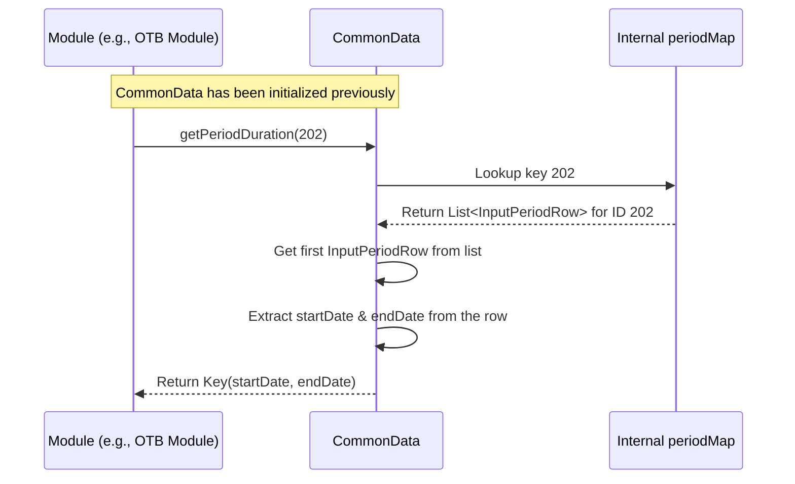

# Chapter 6: Common Data

Welcome back! In the [previous chapter](05_cache_.md), we learned about the [Cache](05_cache_.md), our fast, in-memory pantry that stores frequently needed data like product and store details. This helps modules run quickly without constantly asking the database.

Now, let's think about another type of information that many different parts of `irisx-algo` need: **time periods**. When planning sales, calculating performance, or managing inventory, we constantly need to know things like:

*   "When does the 'Spring Full Price' season start and end?"
*   "What are the exact dates for the 'End of Season Sale' (EOSS)?"
*   "Which 'season' does this specific week belong to?"
*   "Is this sales period considered 'high priority' for certain calculations?"

Managing this time-related information consistently across dozens of modules can be tricky. If each module tried to figure out these dates independently, we might get errors or inconsistencies.

## What Problem Does Common Data Solve?

Imagine you have a shared company wall calendar where all important events, seasons, and promotion periods are marked. Anyone in the company can look at this calendar to know the official dates. It prevents confusion and ensures everyone is working with the same timeline.

The **`CommonData`** component in `irisx-algo` acts like this shared calendar, specifically for **time periods** defined in the input data (represented by `InputPeriodRow` objects, which we'll cover more in [Chapter 9](09_row_input_output_classes_.md)).

It serves as a central, reliable source for information about different time periods used throughout the algorithms.

**Use Case Example:**

Let's say the `OTB Sell-Through Rate (STR) Computation` module ([Chapter 37](37_otb_sell_through_rate__str__computation_.md)) needs to calculate how quickly items sold during the "Summer Sale" period (let's say its ID is `202`). To do this, it needs to know:

1.  The exact `startDate` and `endDate` of period `202`.
2.  Maybe the specific `saleStart` and `saleEnd` dates if they differ from the overall period duration.
3.  Perhaps the total number of days within that period for its calculations.

Instead of reading files or databases itself, the OTB module will simply ask `CommonData` for this information.

## Core Idea: A Central Hub for Period Information

`CommonData` is essentially a helper class that gets initialized with all the period definitions (`InputPeriodRow` data) at the beginning of a run. It organizes this information, mainly in a map, and provides easy-to-use methods to query it.

**What it holds:**

*   A map where the key is the `period` ID (an integer) and the value is a list of `InputPeriodRow` objects associated with that ID. (Usually, there's just one `InputPeriodRow` per ID, but the structure allows for more complex cases).
*   Each `InputPeriodRow` contains details like:
    *   `period`: The unique ID for the period.
    *   `startDate`, `endDate`: The overall start and end dates of the period.
    *   `saleStart`, `saleEnd`: Specific start/end dates for sales activities within the period.
    *   `season`: The name of the season (e.g., "SS24").
    *   `seasonPriorityFlag`: A flag (true/false) indicating priority.
    *   `periodType`: The type of period, often an Enum like `FULL_PRICE`, `EOSS`, `PROMOTION` (more on Enums in the [next chapter](07_enumerations__enums__.md)).

**What it offers (Methods):**

*   Get all period rows.
*   Get the start/end date range for a specific period ID.
*   Get the number of days in a specific period ID.
*   Get all period IDs that match a certain `PeriodType` (e.g., give me all `EOSS` periods).
*   Find which period ID contains a given date.
*   Get specific sale start/end dates for a period, potentially filtered by priority.

## How to Use CommonData

Just like with the [Cache](05_cache_.md), modules typically get access to the `CommonData` instance through dependency injection provided by the Spring framework.

**1. Getting Access (Injection):**

A module declares that it needs the `CommonData` helper.

```java
// Inside a module class, e.g., OtbStrComputeModule.java
package com.increff.irisx.module.otb;

// Import the CommonData class
import com.increff.irisx.module.CommonData;
import org.springframework.beans.factory.annotation.Autowired;
import org.springframework.stereotype.Component;
// ... other imports ...

@Component // Marks this as a Spring-managed component
public class OtbStrComputeModule extends AbstractOtbModule {

    @Autowired // Ask Spring to inject the CommonData instance
    private CommonData commonData;

    // ... rest of the module code ...
}
```

**Explanation:**

*   `@Autowired private CommonData commonData;`: This tells Spring to provide the shared instance of `CommonData` and assign it to the `commonData` field when creating `OtbStrComputeModule`.

**2. Using CommonData Methods:**

Now, the module can use the `commonData` object to ask questions about periods.

```java
// Inside a method within OtbStrComputeModule.java

int targetPeriodId = 202; // Example: The "Summer Sale" period ID
LocalDate specificDate = LocalDate.of(2024, 7, 15);

// --- Example 1: Get the duration (start/end dates) ---
// Key is a simple helper class often holding pairs of values
com.increff.imdb.data.Key periodDuration = commonData.getPeriodDuration(targetPeriodId);
if (periodDuration != null) {
    LocalDate startDate = (LocalDate) periodDuration.part(0); // Get start date
    LocalDate endDate = (LocalDate) periodDuration.part(1);   // Get end date
    System.out.println("Period " + targetPeriodId + " runs from: " + startDate + " to " + endDate);
}
// Expected Output (example):
// Period 202 runs from: 2024-07-01 to 2024-08-15

// --- Example 2: Get the number of days in the period ---
long daysInPeriod = commonData.getDaysCount(targetPeriodId);
System.out.println("Total days in period " + targetPeriodId + ": " + daysInPeriod);
// Expected Output (example):
// Total days in period 202: 45

// --- Example 3: Get all EOSS period IDs ---
// PeriodType is an Enum, covered in the next chapter
Set<Integer> eossPeriodIds = commonData.getPeriodsOfType(PeriodType.EOSS);
System.out.println("EOSS Period IDs: " + eossPeriodIds);
// Expected Output (example):
// EOSS Period IDs: [202, 105]

// --- Example 4: Find the period containing a specific date ---
Integer periodForDate = commonData.getInputPeriodForDate(specificDate);
if (periodForDate != null) {
    System.out.println("Date " + specificDate + " falls into period: " + periodForDate);
} else {
    System.out.println("Date " + specificDate + " not found in any period.");
}
// Expected Output (example):
// Date 2024-07-15 falls into period: 202
```

**Explanation:**

*   We call methods like `getPeriodDuration`, `getDaysCount`, `getPeriodsOfType`, and `getInputPeriodForDate` on the injected `commonData` object.
*   These methods encapsulate the logic of looking up the information in the internal data structures.
*   The module gets back the exact information it needs (dates, counts, IDs) without worrying about how or where the period data is stored. The `Key` object is just a simple way to return a pair of dates (start and end).

## Under the Hood: How CommonData Works

`CommonData` isn't magic; it needs to be set up first.

**Initialization:**

Similar to the [Cache](05_cache_.md), `CommonData` needs to be populated with the period information, usually once near the beginning of an algorithm run. This typically involves:

1.  **Fetching Data:** Obtaining the list of all `InputPeriodRow` objects. This data might come from the initial input files loaded into the `ImDbService` used by the [Cache](05_cache_.md).
2.  **Organizing Data:** Grouping these `InputPeriodRow` objects by their `period` ID and storing them in an internal map.
3.  **Setting the Map:** Calling a method like `setInputPeriodMap` on the `CommonData` instance to give it this organized data.

**Internal Data Structure:**

The primary internal storage is a map:

```java
// File: src/main/java/com/increff/irisx/module/CommonData.java

// Key: Integer (the period ID)
// Value: List<InputPeriodRow> (all rows defining that period)
private Map<Integer, List<InputPeriodRow>> periodMap;
```

This `periodMap` holds all the raw information needed to answer the various period-related questions.

**Method Walkthrough (Conceptual):**

Let's see how some methods might work internally:

1.  **`getPeriodDuration(int periodId)`:**
    *   Looks up `periodId` in the `periodMap`.
    *   Gets the `List<InputPeriodRow>` associated with that ID.
    *   Takes the *first* `InputPeriodRow` from the list (assuming the main start/end dates are consistent if there are multiple rows for advanced scenarios).
    *   Extracts the `startDate` and `endDate` from that row.
    *   Creates and returns a `Key` object containing these two dates.

2.  **`getDaysCount(int periodId)`:**
    *   Similar to `getPeriodDuration`, it finds the relevant `InputPeriodRow`.
    *   Calculates the number of days between `startDate` and `endDate` using date/time functions.
    *   Returns the calculated number of days (as a `long`).

3.  **`getPeriodsOfType(PeriodType periodType)`:**
    *   Iterates through all the *values* (which are `List<InputPeriodRow>`) in the `periodMap`.
    *   For each list, it iterates through the `InputPeriodRow` objects within it.
    *   If an `InputPeriodRow`'s `periodType` matches the requested `periodType`, it adds the row's `period` ID to a result set (using a `Set` avoids duplicate IDs).
    *   Returns the final set of matching period IDs.

**Sequence Diagram (Getting Period Duration):**



This shows the module asks `CommonData`, which then efficiently consults its internal `periodMap` to find the answer.

**Code Dive (Simplified Examples):**

Let's look at simplified versions of the code:

*   **Storing the Data:**

    ```java
    // File: src/main/java/com/increff/irisx/module/CommonData.java
    import com.increff.irisx.row.input.ap.InputPeriodRow;
    import java.util.Map;
    import java.util.List;

    @Component // Makes it a Spring bean
    public class CommonData {
        // The main map holding period info
        private Map<Integer, List<InputPeriodRow>> periodMap;

        /** Sets the period map (called during initialization) */
        public void setInputPeriodMap(Map<Integer, List<InputPeriodRow>> periodMap) {
            this.periodMap = periodMap;
        }
        // ... other methods ...
    }
    ```

    **Explanation:** This shows the `periodMap` field and the `setInputPeriodMap` method used to load the data into the `CommonData` instance.

*   **Getting Period Duration:**

    ```java
    // File: src/main/java/com/increff/irisx/module/CommonData.java
    import com.increff.imdb.data.Key; // Helper for pairs
    import java.time.LocalDate;

    public class CommonData {
        private Map<Integer, List<InputPeriodRow>> periodMap;
        // ... constructor / setters ...

        public Key getPeriodDuration(int period) {
            // Get the list of rows for this period ID
            List<InputPeriodRow> rows = periodMap.get(period);
            // Basic check: does the period exist?
            if (rows == null || rows.isEmpty()) {
                return null;
            }
            // Get the first row (common case)
            InputPeriodRow row = rows.get(0);
            // Check if dates are valid
            if (row.startDate == null || row.endDate == null)
                return null;
            // Create a Key object holding start and end dates
            return new Key(row.startDate, row.endDate);
        }
        // ... other methods ...
    }
    ```

    **Explanation:** The code retrieves the list of rows for the given `period` ID from the `periodMap`. It handles cases where the period might not exist or lack valid dates. It then extracts the `startDate` and `endDate` from the first row and returns them packaged in a `Key` object.

*   **Getting Periods by Type:**

    ```java
    // File: src/main/java/com/increff/irisx/module/CommonData.java
    import com.increff.irisx.constants.otb.PeriodType;
    import java.util.Set;
    import java.util.HashSet;
    import java.util.stream.Collectors;

    public class CommonData {
        private Map<Integer, List<InputPeriodRow>> periodMap;
        // ... constructor / setters ...

        public Set<Integer> getPeriodsOfType(PeriodType periodType) {
            // Use Java Streams for concise iteration and filtering
            return periodMap.values().stream() // Stream over the lists of rows
                .flatMap(list -> list.stream()) // Flatten: treat all rows individually
                .filter(row -> row.periodType == periodType) // Keep only rows matching type
                .map(row -> row.period) // Extract the period ID from matching rows
                .collect(Collectors.toSet()); // Collect unique IDs into a Set
        }
        // ... other methods ...
    }
    ```

    **Explanation:** This uses Java Streams to efficiently process the data. It iterates through all `InputPeriodRow` objects stored in the `periodMap`, filters them based on the provided `periodType`, extracts the `period` ID from the matching rows, and collects these unique IDs into a `Set`.

## Conclusion

You've now learned about **`CommonData`**, the central hub in `irisx-algo` for managing information about **time periods**.

*   It acts like a **shared calendar**, holding details like start/end dates, sale dates, seasons, and period types, all derived from `InputPeriodRow` data.
*   It solves the problem of needing **consistent and easy access** to period information across many different modules.
*   Modules access it via **dependency injection** (`@Autowired`) and use simple methods (e.g., `getPeriodDuration`, `getPeriodsOfType`) to retrieve data.
*   Internally, it primarily uses a **map** (`periodMap`) to store the period data efficiently.

By centralizing period information, `CommonData` improves consistency and simplifies the logic within individual algorithm modules.

We saw that `CommonData` uses concepts like `PeriodType`. Often, predefined sets of constants like these are best managed using **Enumerations (Enums)**. In the next chapter, we'll explore how `irisx-algo` uses [Enumerations (Enums)](07_enumerations__enums__.md) to make code clearer and safer.

[Next Chapter: Enumerations (Enums)](07_enumerations__enums__.md)

---

Generated by [AI Codebase Knowledge Builder](https://github.com/The-Pocket/Tutorial-Codebase-Knowledge)