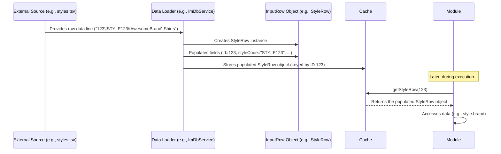
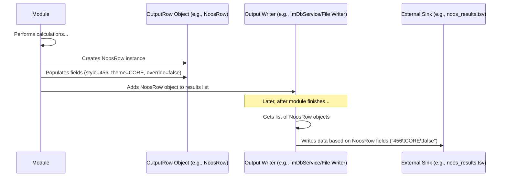

# Chapter 9: Row Input/Output Classes

Welcome back! In [Chapter 8](08_abstract_constants___language_util_.md), we learned how `irisx-algo` manages constant text values and handles different languages using [Abstract Constants & Language Util](08_abstract_constants___language_util_.md). Now, let's shift our focus from configuration and text to the actual *data* that flows into and out of our algorithms.

Imagine you have a recipe (an algorithm module). It needs specific ingredients listed in a particular format (input data), and it produces a finished dish with certain components (output data). How do we define the exact structure for these ingredients and the final dish?

## What Problem Do Row Input/Output Classes Solve?

`irisx-algo` modules don't work in isolation. They need data to start their calculations, and they produce results that need to be stored or passed on. This data usually comes from external sources like files (often Tab-Separated Value or TSV files) or database tables, and the results are often written back to similar places.

Consider these scenarios:

*   The **NOOS Identification** module needs to read information about product styles. How does it know what columns to expect in the "Style Master" input file (e.g., `styles.tsv`)? Does it expect `style_id`, `style_code`, `brand_name` or maybe `ID`, `Code`, `Brand`?
*   The **Optimum Width (OW)** module calculates the ideal number of options for a store and category. When it finishes, it needs to output its results (like store ID, attribute group ID, calculated width). What should the columns be named in the output file (e.g., `ow_results.tsv`)?

If every module just guessed the input format or invented its own output format, it would lead to chaos! Data wouldn't load correctly, and results would be unusable by other systems.

**Row Input/Output Classes** solve this by acting as **strict blueprints** or **data contracts**. They precisely define the structure (the "columns" or fields) expected for each type of input data and for each type of result generated by the modules.

Think of them like standardized forms:
*   An **Input Row Class** (like `StyleRow`) is like an official "Style Information Form". It dictates that the input *must* provide fields for `id`, `styleCode`, `brand`, `cat`, etc.
*   An **Output Row Class** (like `OwOutputRow`) is like a "Calculation Result Form". It specifies that the output *will* contain fields for `store`, `ag`, `period`, `initialBuyWidth`, etc.

## Core Idea: Blueprints for Data

We have two main types of these blueprint classes:

1.  **Input Row Classes:**
    *   **Purpose:** Define the structure of data read from external sources (files like `.tsv` or database tables).
    *   **Examples:** `StyleRow`, `SkuRow`, `StoreRow` (for master data), `SalesRow`, `WhStockRow` (for transactional data), `PlanogramRow` (for configuration data).
    *   **Mapping:** Each public field in the Java class usually maps directly to a column name expected in the input source. For example, a `StyleRow` class with a field `public String styleCode;` expects a column named `styleCode` in the input.
    *   **Nature:** They are typically simple **Plain Old Java Objects (POJOs)** – classes primarily holding data, with public fields or simple getters/setters.

2.  **Output Row Classes:**
    *   **Purpose:** Define the structure of the results calculated by algorithm modules.
    *   **Examples:** `NoosRow` (NOOS identification results), `OwOutputRow` (Optimum Width results), `DistOutputRow` (Distribution allocation results), `AgRow` (Attribute Grouping results).
    *   **Mapping:** Fields in the class define the columns that will be present in the output table or file.
    *   **Nature:** Also usually simple POJOs. Modules create instances of these classes, fill them with calculated values, and then hand them off to be written out.

These classes act as the **data contracts** between the `irisx-algo` modules and the outside world (data files, databases, other systems). They ensure everyone agrees on the exact format of the data being exchanged.

## How to Use Row Input/Output Classes

Modules typically don't read files directly or write files directly. They interact with these Row objects in two main ways:

**1. Accessing Input Data (Often via Cache):**

Input data is usually pre-loaded into memory (like the [Cache](05_cache_.md) we saw in [Chapter 5](05_cache_.md)) before a module runs. The loading mechanism (often handled by common libraries like `iris-commons` `ImDbService`) reads the input file/table line-by-line (or row-by-row), creates an instance of the corresponding Input Row Class (e.g., `StyleRow`) for each line, and populates its fields based on the columns. The module then accesses these pre-populated objects, usually from the Cache.

```java
// Simplified example: Inside a module needing style information

import com.increff.irisx.helper.Cache; // Access data from Cache
import com.increff.irisx.row.input.master.StyleRow; // Input Row Class blueprint
import org.springframework.beans.factory.annotation.Autowired;

// ... inside the module class ...
@Autowired
private Cache cache;

public void processStyle(int styleId) {
    // Get the pre-loaded StyleRow object from the Cache
    StyleRow style = cache.getStyleRow(styleId);

    if (style != null) {
        // Access the data using the fields defined in StyleRow
        String brand = style.brand;
        String category = style.cat;
        String code = style.styleCode;

        System.out.println("Processing Style: " + code + ", Brand: " + brand + ", Category: " + category);
        // ... use brand, category, etc. in calculations ...
    } else {
        System.out.println("Style ID not found in cache: " + styleId);
    }
}
```

**Explanation:**

*   The module gets the `StyleRow` object (which was populated earlier from an input source) from the `Cache`.
*   It then directly accesses the fields like `style.brand` and `style.cat`, relying on the structure defined by the `StyleRow` class. The module code itself doesn't need to know how to parse the original TSV file.

**Expected Output (if styleId 123 exists):**

```
Processing Style: STYLE123, Brand: AwesomeBrand, Category: Shirts
```

**2. Creating and Populating Output Data:**

When a module calculates a result, it creates a new instance of the appropriate Output Row Class, sets the values for its fields, and typically adds this object to a list or passes it to a service that will later write it to an output file or table.

```java
// Simplified example: Inside the NOOS module calculating style themes

import com.increff.irisx.row.output.noos.NoosRow; // Output Row Class blueprint
import com.increff.irisx.constants.ap.StyleTheme; // Enum for theme
import java.util.ArrayList;
import java.util.List;

// ... inside the module class ...
List<NoosRow> noosResults = new ArrayList<>();

public void determineNoosStatus(int styleId, StyleTheme calculatedTheme, boolean isOverride) {
    // 1. Create a new instance of the Output Row class
    NoosRow resultRow = new NoosRow();

    // 2. Populate its fields with calculated results
    resultRow.style = styleId;
    resultRow.theme = calculatedTheme; // e.g., StyleTheme.CORE
    resultRow.override = isOverride;

    // 3. Add the populated object to a list (to be saved later)
    noosResults.add(resultRow);

    System.out.println("Generated NOOS result for style " + styleId + ": Theme=" + calculatedTheme);
}

// Assume this method is called elsewhere
public void saveResults() {
    // Pass the list 'noosResults' to a component that writes it
    // to a file or database table, using the structure defined by NoosRow.
    // e.g., outputWriter.save(noosResults, NoosRow.class);
    System.out.println("Saving " + noosResults.size() + " NOOS results...");
}
```

**Explanation:**

*   The module calculates the `StyleTheme` for a given `styleId`.
*   It creates a new `NoosRow` object.
*   It sets the `style`, `theme`, and `override` fields of this object.
*   It adds the completed `resultRow` to a list. Later, this list will be processed, and each `NoosRow` object will become a row in the output, with columns matching the fields (`style`, `theme`, `override`).

**Expected Output (when `determineNoosStatus` is called):**

```
Generated NOOS result for style 456: Theme=CORE
```

## Under the Hood: Simple POJOs

These Row classes are intentionally kept simple. They are mostly containers for data.

*   **Structure:** They typically consist of `public` fields. This makes accessing and setting data straightforward (`myStyleRow.brand = "NewBrand";` or `String brand = myStyleRow.brand;`). Occasionally, they might have simple getters/setters or basic helper methods.
*   **No Complex Logic:** They generally do not contain complex business logic or calculations. Their job is just to define the *shape* of the data.
*   **Data Loading/Saving:** The complex work of parsing input files (like TSV), handling data type conversions (e.g., String "123" to integer 123), writing output files, or interacting with databases is handled by other specialized components, often from shared libraries like `iris-commons` (e.g., `ImDbService`) or frameworks like Spring Batch. The Row classes just provide the target structure for these components.

**Sequence Diagram (Input Flow):**



**Sequence Diagram (Output Flow):**



## Code Examples of Row Classes

Let's look at simplified versions of some Row classes mentioned in the project structure.

**Input Row Examples:**

```java
// Simplified from: src/main/java/com/increff/irisx/row/input/master/StyleRow.java
package com.increff.irisx.row.input.master;

// Blueprint for data expected in the Style Master input
public class StyleRow {
    public int id; // Expects an 'id' column (integer)
    public String styleCode; // Expects a 'styleCode' column (text)
    public String brand; // Expects a 'brand' column (text)
    public String cat; // Expects a 'cat' column (category, text)
    // ... other relevant fields like gender, subcat, etc.
}

// Simplified from: src/main/java/com/increff/irisx/row/input/transactional/SalesRow.java
package com.increff.irisx.row.input.transactional;
import java.time.LocalDate;

// Blueprint for data expected in the Sales input
public class SalesRow {
    public LocalDate day; // Expects a 'day' column (date)
    public int store; // Expects a 'store' column (integer ID)
    public int sku; // Expects an 'sku' column (integer ID)
    public int qty; // Expects a 'qty' column (quantity sold, integer)
    public double revenue; // Expects a 'revenue' column (decimal number)
}

// Simplified from: src/main/java/com/increff/irisx/row/input/master/PlanogramRow.java
package com.increff.irisx.row.input.master;

// Blueprint for Planogram configuration input
public class PlanogramRow {
	public int store; // Expects a 'store' column (integer ID)
	public String category; // Expects a 'category' column (text)
	public int quantity; // Expects a 'quantity' column (integer)
	public int options; // Expects an 'options' column (integer)
	// ... other attributes like attribute, attribute1 ...
}
```

**Output Row Examples:**

```java
// Simplified from: src/main/java/com/increff/irisx/row/output/noos/NoosRow.java
package com.increff.irisx.row.output.noos;
import com.increff.irisx.constants.ap.StyleTheme; // Enum for theme

// Blueprint for the NOOS Identification results output
public class NoosRow {
    public int style; // Will output a 'style' column (integer ID)
    public StyleTheme theme; // Will output a 'theme' column (text like "CORE")
    public boolean override; // Will output an 'override' column (true/false)

    // Constructor might initialize defaults
    public NoosRow() {
        this.theme = StyleTheme.EMPTY; // Default theme if not set
    }
}

// Simplified from: src/main/java/com/increff/irisx/row/output/ow/OwOutputRow.java
package com.increff.irisx.row.output.ow;

// Blueprint for the Optimum Width calculation results output
public class OwOutputRow {
    public int store; // Will output a 'store' column (integer ID)
    public int ag; // Will output an 'ag' column (Attribute Group ID)
    public int period; // Will output a 'period' column (integer ID)
    public int initialBuyWidth; // Will output 'initialBuyWidth' (integer)
    public int finalWidth; // Will output 'finalWidth' (integer)
    // ... other relevant calculated fields like asp, otbQty, etc.
}

// Simplified from: src/main/java/com/increff/irisx/row/output/distribution/DistOutputRow.java
package com.increff.irisx.row.output.distribution;
// Often inherits fields from other Row classes if output is similar
import com.increff.irisx.row.output.distribution.ist.IstAllocRow;

// Blueprint for Distribution Module output (inherits allocation details)
public class DistOutputRow extends IstAllocRow {
    // Inherits fields like:
    // public int sku;
    // public int fromLoc; // Source Location ID
    // public int toLoc; // Destination Location ID
    // public int allocQty; // Allocated Quantity

    // May add distribution-specific fields if needed

    // Helper method often included in output rows
    public DistOutputRow getObject() {
        return new DistOutputRow();
    }
}
```

These examples show the simple, data-centric nature of these classes. They clearly define the expected fields (columns) for interaction with external data sources and sinks.

## Conclusion

You've now learned about **Row Input/Output Classes**, the essential blueprints that define the structure of data entering and leaving `irisx-algo` modules.

*   They act as **data contracts**, ensuring consistency between modules and external data files/tables.
*   **Input Row Classes** (e.g., `StyleRow`, `SalesRow`) define the expected columns for input data. Modules typically access these as pre-populated objects (often from the [Cache](05_cache_.md)).
*   **Output Row Classes** (e.g., `NoosRow`, `OwOutputRow`) define the columns for module results. Modules create and populate instances of these classes, which are then written out.
*   They are usually simple **POJOs**, focusing solely on defining the data structure.

By using these standardized Row classes, `irisx-algo` ensures that data can be reliably read, processed, and written throughout its complex workflows.

Sometimes, we need to look at data not just row by row, but as a structured collection, perhaps applying filters or selecting specific columns dynamically. The next chapter introduces the concept of a [View](10_view_.md), which helps in querying and manipulating collections of data, often built upon these Row objects.

[Next Chapter: View](10_view_.md)

---

Generated by [AI Codebase Knowledge Builder](https://github.com/The-Pocket/Tutorial-Codebase-Knowledge)