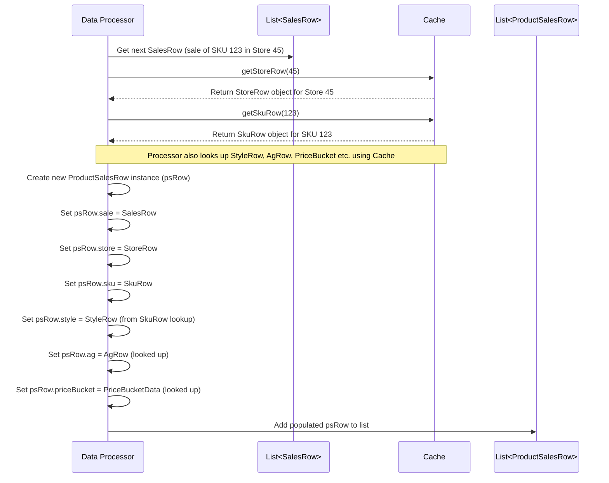

# Chapter 13: ProductSalesRow

Welcome back! In the [previous chapter](12_mathutil_.md), we explored [MathUtil](12_mathutil_.md), our handy toolbox for common calculations like rounding and percentages. Now, let's think about the core data we often analyze in merchandising: sales transactions.

Imagine you're trying to understand why a particular T-shirt sold well last Tuesday in the downtown store. You look at the basic sales record (`SalesRow`), and it tells you the date, store ID, SKU ID, quantity sold, and revenue. That's useful, but it doesn't tell the whole story! You might want to know:

*   What *category* and *brand* was the T-shirt? (From `StyleRow`)
*   What *size* was it, and what was its original price (MRP)? (From `SkuRow`)
*   What *channel* (online/offline) and *region* was the downtown store in? (From `StoreRow`)
*   Was it part of a specific *attribute group* you were tracking? (From `AgRow`)
*   Did it fall into a certain *price bucket*? (From `PriceBucketData`)

Finding all this information requires looking up details from many different places (like different files or database tables containing store master, product master, etc.). Doing this manually for every single sale would be incredibly tedious and slow.

## What Problem Does ProductSalesRow Solve?

The `ProductSalesRow` acts like a **super-detailed sales receipt**. It solves the problem of having sales transaction information scattered across multiple data sources. It brings together the basic details of a sale with all the relevant "master data" context about the product, the store, and other classifications into **one single, convenient object**.

Instead of just knowing *that* SKU 123 sold in Store 45, a `ProductSalesRow` tells you *everything* important about that specific transaction in one place: the quantity, revenue, date, store channel, store region, product category, product brand, product size, MRP, price bucket, attribute group, and more.

This "enriched" view makes analyzing sales data much, much simpler because all the context you need is readily available together.

## Core Idea: An Enriched Sales Transaction

A `ProductSalesRow` object isn't usually read directly from a single input file. It's typically **constructed** during data processing by combining information from several sources:

1.  **Base Sale:** Starts with a basic `SalesRow` record (date, store ID, SKU ID, qty, revenue).
2.  **Lookup & Enrich:** Uses the IDs from the `SalesRow` (like `storeId`, `skuId`) to look up related information, usually from the [Cache](05_cache_.md) (which was populated using helpers like [ObjectMaps](11_objectmaps_.md)). This includes:
    *   `StoreRow`: Found using `storeId`. Provides channel, region, city, etc.
    *   `SkuRow`: Found using `skuId`. Provides size, MRP, etc.
    *   `StyleRow`: Found using the `styleId` from the `SkuRow`. Provides category, brand, gender, etc.
    *   `PriceBucketData`: Determined based on the SKU's price.
    *   `AgRow`: Determined based on the product's attributes (Attribute Group, see [Chapter 16](16_agrow_.md)).
3.  **Combine:** Stores references to all these objects (`SalesRow`, `StoreRow`, `SkuRow`, `StyleRow`, `PriceBucketData`, `AgRow`) within the single `ProductSalesRow` object.

The result is a comprehensive snapshot of a single sales event.

## How ProductSalesRow is Used

Modules that perform sales analysis, demand forecasting, or reporting rely heavily on `ProductSalesRow` objects. They typically receive a list of these enriched rows (often prepared by an earlier step or utility like [ProductSalesUtil](14_productsalesutil_.md)) and can then easily access all the combined information.

**Example:** Imagine a module calculating total revenue by brand for offline stores.

```java
// Inside a reporting or analysis module

import com.increff.irisx.row.input.transactional.ProductSalesRow;
import com.increff.irisx.row.input.master.StoreRow;
import com.increff.irisx.row.input.master.StyleRow;
import com.increff.irisx.row.input.transactional.SalesRow;

import java.util.List;
import java.util.Map;
import java.util.HashMap;

// Assume 'enrichedSalesList' is a List<ProductSalesRow> provided to the module
public Map<String, Double> calculateOfflineRevenueByBrand(List<ProductSalesRow> enrichedSalesList) {

    Map<String, Double> revenueByBrand = new HashMap<>();

    // Loop through each enriched sales record
    for (ProductSalesRow psRow : enrichedSalesList) {

        // Access data from the linked objects directly!
        StoreRow storeInfo = psRow.store;
        StyleRow styleInfo = psRow.style;
        SalesRow saleInfo = psRow.sale;

        // Check if the store is offline and data exists
        if (storeInfo != null && "OFFLINE".equals(storeInfo.channel) &&
            styleInfo != null && saleInfo != null) {

            String brand = styleInfo.brand;
            double revenue = saleInfo.revenue;

            // Add revenue to the brand's total (using Map's merge function)
            revenueByBrand.merge(brand, revenue, Double::sum);
        }
    }
    System.out.println("Calculated revenue for brands: " + revenueByBrand.keySet());
    return revenueByBrand;
}

```

**Explanation:**

1.  The module receives a `List<ProductSalesRow>`.
2.  It iterates through each `psRow`.
3.  For each `psRow`, it can directly access the linked objects: `psRow.store`, `psRow.style`, `psRow.sale`.
4.  It can then easily get the `channel` from the `storeInfo`, the `brand` from the `styleInfo`, and the `revenue` from the `saleInfo`.
5.  It aggregates the revenue by brand for offline stores.

Notice how the module logic is clean and simple. It doesn't need to perform complex lookups; all the necessary data (`channel`, `brand`, `revenue`) is readily available within the `ProductSalesRow` object.

**Expected Output (Example):**

```
Calculated revenue for brands: [AwesomeBrand, CoolStuff, TrendyWear]
```
The function would return a map like `{"AwesomeBrand": 1500.75, "CoolStuff": 850.00, "TrendyWear": 2100.50}`.

## Under the Hood: Structure and Helpers

Let's look inside the `ProductSalesRow` class itself.

**1. Structure (`ProductSalesRow.java`):**

It's a simple Plain Old Java Object (POJO) designed to hold references to other Row objects.

```java
// Simplified from: src/main/java/com/increff/irisx/row/input/transactional/ProductSalesRow.java
package com.increff.irisx.row.input.transactional;

// Imports for other Row types and Key
import com.increff.imdb.data.Key;
import com.increff.irisx.row.input.master.PriceBucketData;
import com.increff.irisx.row.input.master.SkuRow;
import com.increff.irisx.row.input.master.StoreRow;
import com.increff.irisx.row.input.master.StyleRow;
import com.increff.irisx.row.output.ag.AgRow;

// Holds an enriched view of a sales transaction
public class ProductSalesRow {

    // References to the constituent data objects
    public SalesRow sale;          // Basic sale details
    public StoreRow store;        // Store master data
    public StyleRow style;        // Style master data
    public SkuRow sku;            // SKU master data
    public PriceBucketData priceBucket; // Price bucket classification
    public AgRow ag;              // Attribute Group info

    // Sometimes includes duplicated fields for convenience or aggregation results
    public double discountBucket; // e.g., calculated discount %
    public double qty;            // often copied from sale.qty
    public int seq;             // sequence number if needed

    // Constructor (usually default or minimal)
    public ProductSalesRow() {
        // Initialization if necessary
    }

    // --- Helper methods for creating Keys ---
    // (See below)
}
```

**Explanation:**

*   The core of the class is the set of public fields (`sale`, `store`, `style`, `sku`, `priceBucket`, `ag`). Each field holds an instance of the corresponding Row object, providing access to all its data.
*   It might also contain a few extra fields like `qty` (often duplicated from `sale.qty` for easier access) or `discountBucket`.

**2. Helper Methods (`create...Key()`):**

`ProductSalesRow` contains numerous methods like `createStoreStyleKey()`, `createCategoryKey()`, `createChannelCatKey()`, etc. What do these do?

*   **Purpose:** These methods are shortcuts for creating **composite keys**. A composite key is needed when you want to group or aggregate data based on *multiple* fields simultaneously (e.g., group sales by Store *and* Category).
*   **`com.increff.imdb.data.Key`:** They use a simple helper class `Key` from the `iris-commons` library. A `Key` object simply acts as a wrapper around one or more values, allowing this combination of values to be used as a single key in a Java `Map`.
*   **Example:** If you want to create a `Map` where the key represents the combination of a store ID and a style ID, you would call `psRow.createStoreStyleKey()`. This method takes the `store.id` and `style.id` from the `ProductSalesRow` and bundles them into a `Key` object. You can then use this `Key` object as the key when putting data into your map.

```java
// Simplified examples of create...Key() methods in ProductSalesRow.java

public class ProductSalesRow {
    // ... fields (sale, store, style, sku, etc.) ...

    /** Creates a Key object containing the Store ID */
    public Key createStoreIdKey() {
        // Wraps the store's ID in a Key object
        return new Key(store.id);
    }

    /** Creates a Key object containing the Style's Category */
    public Key createCategoryKey() {
        // Wraps the style's category string in a Key object
        return new Key(style.cat);
    }

    /** Creates a Key object containing Store ID and Style ID */
    public Key createStoreStyleKey() {
        // Wraps both IDs, in order, into a single Key object
        return new Key(store.id, style.id);
    }

    /** Creates a Key object containing Channel and Category */
    public Key createChannelCatKey() {
        // Wraps store's channel and style's category
        return new Key(store.channel, style.cat);
    }

    // ... many other similar methods for different combinations ...
}
```

**Explanation:**

*   Each method combines one or more fields from the linked `StoreRow`, `StyleRow`, `SkuRow`, etc.
*   It passes these values to the `new Key(...)` constructor.
*   The returned `Key` object can then be used as a key in a `Map` for grouping or aggregation tasks.

**3. Creation Process (Conceptual):**

As mentioned, `ProductSalesRow` objects are usually created by a dedicated process that reads basic `SalesRow` data and enriches it using lookups (often via the [Cache](05_cache_.md)).



This diagram illustrates how a processor takes a basic `SalesRow`, uses the `Cache` to find all related master data objects, and then bundles them together into a new `ProductSalesRow`.

## Conclusion

The **`ProductSalesRow`** is a fundamental data structure in `irisx-algo` that provides an **enriched view of a single sales transaction**.

*   It combines basic sales details (`SalesRow`) with related master data (`StoreRow`, `StyleRow`, `SkuRow`, `PriceBucketData`, `AgRow`).
*   This **consolidated view** makes analyzing sales data much easier, as all relevant context is available in one object.
*   It contains helper methods (`create...Key()`) for generating composite `Key` objects, useful for grouping and aggregation tasks based on multiple attributes.
*   Modules performing analysis or reporting heavily rely on `ProductSalesRow` objects, typically processed in lists.

By bringing together scattered information, `ProductSalesRow` simplifies complex analysis and provides a solid foundation for many merchandising algorithms.

Now that we have this enriched sales data, how do we perform common operations on lists of these objects, like filtering or aggregating them? The next chapter introduces [ProductSalesUtil](14_productsalesutil_.md), a utility class designed for exactly these tasks.

[Next Chapter: ProductSalesUtil](14_productsalesutil_.md)

---

Generated by [AI Codebase Knowledge Builder](https://github.com/The-Pocket/Tutorial-Codebase-Knowledge)