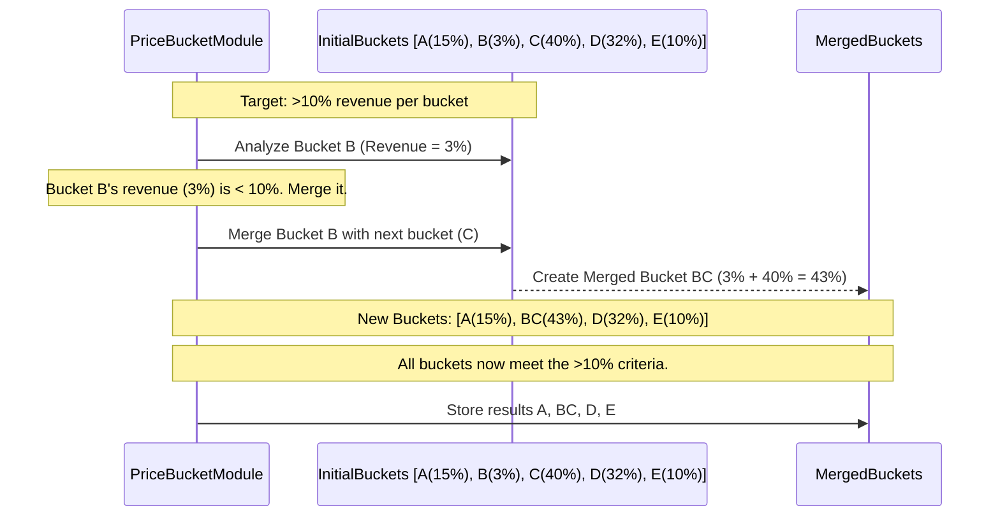

# Chapter 15: Price Bucket Creation Module

Welcome back! In the [previous chapter](14_productsalesutil_.md), we learned about [ProductSalesUtil](14_productsalesutil_.md), our toolbox for analyzing lists of detailed sales records ([ProductSalesRow](13_productsalesrow_.md)). Now that we can slice and dice sales data, let's think about another common way to analyze products: by their price.

Imagine you're managing a clothing store. You have hundreds of different T-shirts, each with a specific price (Maximum Retail Price, or MRP). Analyzing each T-shirt individually based on its exact price (like $19.99, $21.50, $24.99, $49.95) can be overwhelming. Wouldn't it be easier if you could group them into simpler price ranges, like "Budget" ($0-$20), "Mid-Range" ($20-$40), and "Premium" ($40+)?

## What Problem Does the Price Bucket Creation Module Solve?

Looking at every single unique price point across thousands of products is often too detailed for high-level planning or applying general rules. For example, you might want to apply a certain marketing strategy to all "Premium" priced items in a category, regardless of whether they cost $49.95 or $55.00.

The **Price Bucket Creation Module** solves this problem by acting like an automatic price sorter. It looks at all the products within a specific category (like "T-Shirts"), analyzes the distribution of their MRPs, and groups them into a manageable number of price ranges, which we call **"price buckets"**.

Instead of dealing with dozens of exact prices, you can now work with maybe 5 distinct price buckets per category. This simplifies analysis, reporting, and applying rules based on price points.

## Core Idea: Grouping Products into Meaningful Price Ranges

The main goal is to divide the products in each category into a predefined number of buckets (e.g., 5 buckets per category). However, just splitting the price range evenly isn't always helpful. What if the "$0-$20" bucket contains hundreds of products but only accounts for 2% of the category's total revenue, while the "$20-$40" bucket accounts for 60%? The first bucket might not be very significant from a revenue perspective.

Therefore, the module aims to create buckets that are more **meaningful**, often based on **revenue contribution**. It tries to ensure each bucket represents a significant chunk of the category's sales.

Here's the general process:

1.  **Analyze Prices:** For each product category, look at the range of MRPs of the products sold.
2.  **Initial Bucketing:** Divide the MRP range into an initial set of small price buckets (e.g., based on fixed ranges).
3.  **Calculate Revenue:** Determine how much total revenue was generated by products within each initial bucket.
4.  **Merge Small Buckets:** If an initial bucket contributes very little revenue (below a certain threshold), merge it with a neighboring bucket. This continues until the target number of buckets is reached, or until all remaining buckets meet the minimum revenue contribution criteria.
5.  **Define Final Buckets:** The result is a set of price buckets (e.g., "$0-$25", "$26-$50", "$51-$100", "$101+") for each category, along with their revenue contribution.

Think of it like sorting your socks. You could sort them by exact color shade (too complex!), or you could group them into broader buckets like "Whites", "Blacks", "Colors". This module does the latter, but for prices, and it tries to make sure each bucket (sock drawer) has a reasonable amount of "value" (revenue) in it.

## How to Use the Price Bucket Creation Module

This module is usually run as part of the overall `irisx-algo` data preparation process. You don't typically call its methods directly from other business logic modules.

**1. Execution:**
   The module is triggered, often via the [Module Runner](04_module_runner_.md) or as part of a predefined sequence ([Abstract Module Group](61_abstract_module_group_.md)).

**2. Input:**
   *   **Sales Data:** Needs historical sales, usually in the form of [ProductSalesRow](13_productsalesrow_.md) objects, which link sales to SKU and Style details (including MRP).
   *   **Product Data:** Access to [SkuRow](09_row_input_output_classes_.md) (for MRP) and [StyleRow](09_row_input_output_classes_.md) (for category). This is often accessed via the [Cache](05_cache_.md).
   *   **Configuration:** Uses `PriceBucketCreationArgs` ([Configuration & Arguments (Args Classes)](03_configuration___arguments__args_classes_.md)) to know things like:
        *   `bucketsPerCat`: The target number of price buckets per category (e.g., 5).
        *   `stage1BucketRange`, `stage2BucketRange`, `stage3BucketRange`: Initial price ranges used for splitting.
        *   Minimum revenue contribution thresholds for merging (though this might be a fixed constant).

**3. Output:**
   The module produces data defining the final price buckets. This is typically stored in objects like `ExportPriceBucketRow` ([Row Input/Output Classes](09_row_input_output_classes_.md)). Each row represents a final bucket and contains:
   *   `category`: The product category (e.g., "T-Shirts").
   *   `minMrp`: The lowest MRP in this bucket.
   *   `maxMrp`: The highest MRP in this bucket.
   *   `priceBucket`: A string representation (e.g., "51-100").
   *   `revenue`: Total revenue generated by products in this bucket.
   *   `revContri`: The percentage of the category's total revenue this bucket represents.

```java
// Simplified structure of ExportPriceBucketRow
public class ExportPriceBucketRow {
    public String priceBucket; // e.g., "51-100"
    public String category;    // e.g., "T-Shirts"
    public Double revenue;     // e.g., 15000.0
    public Double revContri;   // e.g., 35.5 (%)
    public int minMrp;        // e.g., 51
    public int maxMrp;        // e.g., 100
}
```

**4. Usage Downstream:**
   The generated `ExportPriceBucketRow` data is usually saved (e.g., to a file or database) and often loaded back into the [Cache](05_cache_.md). Other modules can then quickly determine the price bucket for any given product by comparing its MRP against the `minMrp` and `maxMrp` values defined for its category in the cached bucket data.

## Under the Hood: Creating and Merging Buckets

Let's walk through the steps conceptually when the module runs for a single category, say "T-Shirts".

**High-Level Steps:**

1.  **Load Sales Data:** Get the list of relevant [ProductSalesRow](13_productsalesrow_.md) objects for the "T-Shirts" category.
2.  **Map MRP to Revenue:** Create a map showing how much revenue is associated with each distinct MRP value within the T-shirt category (e.g., MRP 19.99 -> $500 revenue, MRP 24.99 -> $1200 revenue, etc.).
3.  **Initial Split (Stage 1):** Divide the entire MRP range for T-shirts into initial small buckets using the `stage1BucketRange` from the configuration (e.g., maybe split into $0-50, $51-100, $101-150, etc.).
4.  **Calculate Initial Revenue Contribution:** For each initial bucket, calculate its total revenue and what percentage of the total T-shirt revenue it represents.
5.  **Check and Split Further:** For any bucket whose revenue contribution is *too high* (e.g., above `100 / bucketsPerCat`), split it further using finer ranges (`stage2BucketRange`, `stage3BucketRange`) until its contribution is acceptable or the finest granularity is reached.
6.  **Merge Small Buckets:** Now, look for buckets whose revenue contribution is *too low* (e.g., below a defined threshold like 10%). Merge these small buckets with their neighbors (either the next lower or next higher bucket). This is often done iteratively until all remaining buckets meet the minimum threshold.
7.  **Adjust Ranges:** Ensure there are no gaps between the final merged buckets (e.g., if one ends at $50 and the next starts at $55, adjust the first to end at $54 or the second to start at $51). Also, adjust the lowest min MRP and highest max MRP to match the actual min/max MRP observed in the category's sales data.
8.  **Store Results:** Create `ExportPriceBucketRow` objects for each final bucket and store them.

**Sequence Diagram (Conceptual Merging):**

Imagine we have initial buckets A, B, C, D, E and bucket B has too little revenue.



**Code Dive:**

Let's peek at simplified versions of some key methods.

*   **Overall Flow (`runInternal`):**

    ```java
    // Simplified from PriceBucketCreationModule.java
    @Override
    protected void runInternal(Properties properties) {
        // 1. Initialize args, load product/sales data into maps
        init(properties); // Reads PriceBucketCreationArgs
        createStyleSkuMaps(); // Loads StyleRow, SkuRow etc.
        List<ProductSalesRow> productSalesList = loadProductSales(); // Loads enriched sales

        // 2. Group sales by Category -> Map<Key(Category), List<ProductSalesRow>>
        Map<Key, List<ProductSalesRow>> catAggSales =
            new Data<>(productSalesList)
                .groupBy(ProductSalesRow::createCategoryKey).getMap();

        // 3. Process each category separately
        catAggSales.forEach((key, catSales) -> {
            String category = (String) key.part(0);
            createPbRowsForCat(category, catSales); // Create initial buckets
        });

        // 4. Merge small buckets for each category
        catPbRowsMap.forEach((cat, pbRows) -> mergePriceBuckets(pbRows));

        // 5. Persist the final bucket definitions
        persistOutputs();
    }
    ```
    **Explanation:** The main method orchestrates the process: load data, group by category, create initial buckets per category, merge small buckets, and save the results.

*   **Creating Initial Buckets (`createPbRowsForCat`, `divideIntoPriceBuckets`):**

    ```java
    // Simplified from PriceBucketCreationModule.java

    // Map to hold Category -> List<BucketDefinition>
    private Map<String, ArrayList<ExportPriceBucketRow>> catPbRowsMap = new HashMap<>();
    private PriceBucketCreationArgs args; // Holds bucket ranges

    private void createPbRowsForCat(String category, List<ProductSalesRow> catSales) {
        // Calculate total revenue for this category
        double catRev = ProductSalesUtil.getTotalRevenue(catSales);
        if (catRev <= 0) return; // Skip if no revenue

        // Create a map of MRP -> Revenue for this category
        Map<Integer, Double> skuMrpRevMap = new TreeMap<>();
        catSales.forEach(psRow -> {
            int mrp = (int) psRow.sku.mrp;
            skuMrpRevMap.merge(mrp, psRow.sale.revenue, Double::sum);
        });
        if (skuMrpRevMap.isEmpty()) return;

        // Start the recursive division process using the first bucket range
        PriceBucketData initialData = new PriceBucketData(category, catRev);
        initialData.mrpRevMap = skuMrpRevMap;
        divideIntoPriceBuckets(initialData, args.stage1BucketRange);
    }

    private void divideIntoPriceBuckets(PriceBucketData parentData, int bucketRange) {
        // Determine the MRP range for this division step
        int minMrpOverall = parentData.mrpRevMap.firstKey();
        int maxMrpOverall = parentData.mrpRevMap.lastKey();
        // Align maxMrp to the bucket range for easier splitting
        int alignedMaxMrp = ((maxMrpOverall / bucketRange) + 1) * bucketRange;

        // Loop through potential buckets within the parent's range
        for (int mrp = minMrpOverall; mrp < alignedMaxMrp; mrp += bucketRange) {
            PriceBucketData currentBucket = new PriceBucketData(parentData);
            currentBucket.minMrp = mrp;
            currentBucket.maxMrp = Math.min(mrp + bucketRange - 1, maxMrpOverall);
            // Filter the MRP->Rev map for only MRPs within this bucket's range
            currentBucket.mrpRevMap = getFilteredMrpRevMap(parentData.mrpRevMap,
                                                          currentBucket.minMrp,
                                                          currentBucket.maxMrp);

            // Check if this bucket needs further splitting or can be finalized
            checkPbRevContri(currentBucket);
        }
    }
    ```
    **Explanation:** `createPbRowsForCat` calculates total category revenue and creates a map of MRP to its associated revenue. It then calls `divideIntoPriceBuckets`. This method iteratively splits the MRP range based on the configured `bucketRange` values (`stage1`, `stage2`, `stage3`), filtering the revenue map for each potential sub-bucket and then checking if that sub-bucket needs further division (`checkPbRevContri`).

*   **Checking and Finalizing/Splitting Further (`checkPbRevContri`):**

    ```java
    // Simplified from PriceBucketCreationModule.java
    private int maxPercPerBucket; // Calculated as 100 / bucketsPerCat

    private void checkPbRevContri(PriceBucketData currentBucket) {
        if (currentBucket.mrpRevMap.isEmpty()) return; // Skip empty buckets

        // Calculate revenue and contribution for this potential bucket
        double bucketRevenue = currentBucket.mrpRevMap.values().stream().mapToDouble(d->d).sum();
        currentBucket.revenue = bucketRevenue;
        currentBucket.revContri = MathUtil.getPercent(bucketRevenue, currentBucket.catRev, 1);

        // Compare contribution to the target percentage per bucket
        if (currentBucket.revContri <= maxPercPerBucket) {
            // If contribution is acceptable, finalize this bucket
            addToCatPbRowMap(currentBucket);
        } else {
            // If contribution is too high, try splitting with the next finer range
            int nextRange = getNextBucketRange(currentBucket.bucketRange);
            if (nextRange == -1) { // No finer range available
                addToCatPbRowMap(currentBucket); // Finalize even if large
            } else {
                divideIntoPriceBuckets(currentBucket, nextRange); // Split further
            }
        }
    }

    private void addToCatPbRowMap(PriceBucketData bucketData) {
        // Create the final ExportPriceBucketRow and add to category map
        ExportPriceBucketRow row = new ExportPriceBucketRow();
        // ... set fields like category, minMrp, maxMrp, revenue, revContri ...
        catPbRowsMap.computeIfAbsent(bucketData.category, k -> new ArrayList<>()).add(row);
    }
    ```
    **Explanation:** This method calculates the revenue contribution of a potential bucket. If the contribution is below the target maximum percentage, the bucket is finalized and added to the `catPbRowsMap`. If it's too high, it attempts to call `divideIntoPriceBuckets` again with a smaller `bucketRange`.

*   **Merging Small Buckets (`mergePriceBuckets`, `combineWithNextPb`):**

    ```java
    // Simplified from PriceBucketCreationModule.java
    private double minRevContriForPb = 10.0; // Min % revenue for a final bucket

    private void mergePriceBuckets(ArrayList<ExportPriceBucketRow> pbRows) {
        if (pbRows.isEmpty()) return;
        // Combine small buckets forward
        pbRows = combineWithNextPb(pbRows);
        // Combine small buckets backward (handles cases at the end)
        Collections.reverse(pbRows);
        pbRows = combineWithNextPb(pbRows);
        Collections.reverse(pbRows);
        // Adjust ranges to remove gaps and match overall min/max
        adjustMissingRanges(pbRows);
        changeMinMaxMrp(pbRows);
        // Add the final merged buckets to the main output list
        exportPriceBucketRows.addAll(pbRows);
    }

    private ArrayList<ExportPriceBucketRow> combineWithNextPb(ArrayList<ExportPriceBucketRow> pbRows) {
        ArrayList<ExportPriceBucketRow> mergedList = new ArrayList<>();
        if (pbRows.isEmpty()) return mergedList;

        ExportPriceBucketRow currentMerged = pbRows.get(0);
        for (int i = 1; i < pbRows.size(); i++) {
            ExportPriceBucketRow nextRow = pbRows.get(i);
            // If the current merged bucket is too small...
            if (currentMerged.revContri < minRevContriForPb) {
                // Merge it with the next one
                currentMerged = mergePriceRows(currentMerged, nextRow);
            } else {
                // Otherwise, add the completed merged bucket to the list
                mergedList.add(currentMerged);
                // Start a new merged bucket with the next row
                currentMerged = nextRow;
            }
        }
        // Add the last merged bucket
        mergedList.add(currentMerged);
        return mergedList;
    }

    private ExportPriceBucketRow mergePriceRows(ExportPriceBucketRow b1, ExportPriceBucketRow b2) {
        // Create a new row combining data from b1 and b2
        ExportPriceBucketRow merged = new ExportPriceBucketRow();
        merged.category = b1.category;
        merged.revContri = b1.revContri + b2.revContri;
        merged.revenue = b1.revenue + b2.revenue;
        merged.minMrp = Math.min(b1.minMrp, b2.minMrp);
        merged.maxMrp = Math.max(b1.maxMrp, b2.maxMrp);
        merged.priceBucket = merged.minMrp + "-" + merged.maxMrp;
        return merged;
    }
    ```
    **Explanation:** `mergePriceBuckets` orchestrates the merging process. `combineWithNextPb` iterates through the current buckets. If a bucket's `revContri` is below the minimum threshold (`minRevContriForPb`), it's merged with the next bucket using `mergePriceRows`. Otherwise, it's added to the final list, and the process continues. Merging happens in both forward and reverse directions to handle edge cases properly. Finally, `adjustMissingRanges` and `changeMinMaxMrp` clean up the boundaries.

## Conclusion

The **Price Bucket Creation Module** is a crucial data preparation step in `irisx-algo`.

*   It simplifies analysis by **grouping products into meaningful price ranges (buckets)** based on their MRP within each category.
*   It aims to create buckets that represent a **significant portion of revenue**, potentially merging smaller, less significant buckets.
*   It analyzes sales data ([ProductSalesRow](13_productsalesrow_.md)), uses configuration ([PriceBucketCreationArgs](03_configuration___arguments__args_classes__.md)), and outputs bucket definitions ([ExportPriceBucketRow](09_row_input_output_classes_.md)).
*   The generated buckets are then used by downstream modules for price-based analysis and rule application.

By transforming detailed price information into manageable buckets, this module provides a valuable layer of abstraction for various merchandising tasks.

Another important way to group products for analysis is by their attributes (like color, fabric, sleeve length). Before we dive into how attributes are grouped, we first need to understand how the results of such groupings are stored. The next chapter introduces [AgRow](16_agrow_.md), the Row class used for attribute grouping results.

[Next Chapter: AgRow](16_agrow_.md)

---

Generated by [AI Codebase Knowledge Builder](https://github.com/The-Pocket/Tutorial-Codebase-Knowledge)