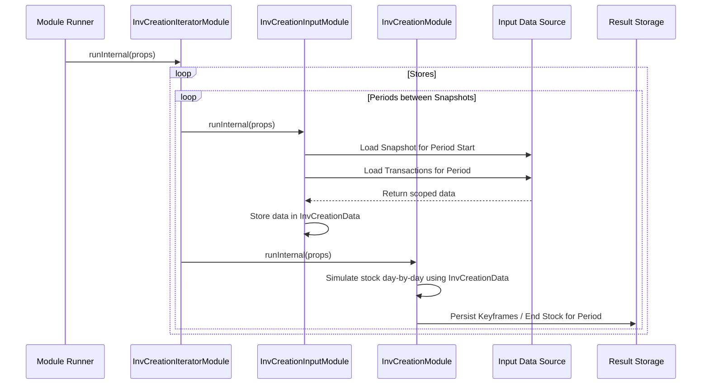

# Chapter 20: Inventory Creation Module

Welcome back! In the [previous chapter](19_inventorycomputationutil_.md), we dove into the calculator engine, [InventoryComputationUtil](19_inventorycomputationutil_.md), which simulates the day-by-day stock changes for products. We saw how it uses snapshots and transactions to figure out historical inventory levels.

But knowing *how* to calculate is only part of the story. Imagine you have hundreds of stores and a year's worth of data. You can't just run the calculator once for everything. You need a manager or coordinator to:
*   Break the work down into manageable pieces (e.g., one store at a time, one month at a time).
*   Gather the *correct* starting snapshots and transactions for *each* piece of work.
*   Run the calculator engine (`InventoryComputationUtil`'s logic) for that specific piece.
*   Collect and save the results properly (like new snapshots or end-of-period stock levels).

## What Problem Does the Inventory Creation Module Solve?

The **Inventory Creation Module** (often represented by classes like `InvCreationIteratorModule`, `InvCreationInputModule`, and `InvCreationModule`) acts as this **coordinator** for the historical inventory reconstruction process.

While [InventoryComputationUtil](19_inventorycomputationutil_.md) provides the *formula* for calculating stock changes, the Inventory Creation Module provides the *workflow* and *orchestration*. It manages the process of applying this calculation across potentially vast amounts of data and time periods.

Its main job is to generate the historical inventory snapshots (keyframes) and potentially daily stock levels that other modules, like the one using [InventoryComputationUtil](19_inventorycomputationutil_.md) for "live day" calculation, need. It takes the raw ingredients – initial snapshots (`InvCreationStoreStockRow`), daily sales (`InvCreationSalesRow`), returns (`InvCreationReturnsRow`), inwards (`InvCreationInwardsRow`), and outwards (`InvCreationOutwardsRow`) – and builds the detailed, day-by-day stock ledger for every SKU in every store over a specified period.

Think of `InventoryComputationUtil` as a brilliant but focused accountant who can calculate one day's stock change perfectly. The Inventory Creation Module is the accounting department manager who assigns work to the accountant store-by-store, month-by-month, ensures they have the right ledgers (input data), and files the results correctly.

## Core Idea: Orchestrating the Historical Ledger Reconstruction

The Inventory Creation Module doesn't usually contain fundamentally new calculation logic for inventory itself. Instead, it focuses on managing the process:

1.  **Iteration:** It often breaks down the calculation by store and by periods between available snapshots. For example, if snapshots are available monthly, it calculates inventory month by month for each store.
2.  **Scoped Input Loading:** For each store and period it's processing, it loads only the relevant data (the starting snapshot for that period, and the sales, returns, inwards, outwards that occurred *within* that period for that store). This is handled by `InvCreationInputModule`.
3.  **Calculation Execution:** It then calls the core inventory calculation logic (found in `InvCreationModule`, which implements the formulas similar to what we saw in `InventoryComputationUtil`) to simulate the stock changes day-by-day *for that specific store and period*.
4.  **Output Management:** It takes the results of the calculation (e.g., the calculated stock level at the *end* of the period, or keyframe snapshots at specific intervals within the period) and saves them, often to temporary files or tables (like `KeyframeTempRow` or `EndDateStockTempRow`). These temporary results are often consolidated later.

This iterative, piece-by-piece approach allows the system to handle large datasets without needing to load everything into memory at once.

## How It's Used (The Workflow)

Like the Attribute Grouping modules, the Inventory Creation Module is typically part of the data preparation pipeline. You run it *before* modules that need the final historical inventory picture.

**Inputs:**
*   Raw transactional data files/tables (often specific to this module, like `InvCreationSalesRow`, `InvCreationStoreStockRow`, etc.). These are loaded iteratively.
*   Product attribute data (`InvCreationSkuAttribsRow`) to link SKUs to styles.
*   Store data (`InvCreationStoreRow`) to know which stores to process.
*   Configuration ([`InvCreationArgs`](03_configuration___arguments__args_classes__.md)) specifying the overall start and end dates.

**Outputs:**
*   Intermediate or final inventory snapshots (`KeyframeTempRow`).
*   Intermediate or final end-date stock levels (`EndDateStockTempRow`). These outputs are typically saved to files or tables that can then be used to populate the Cache or serve as input for other processes.

**Example Scenario:**
A user wants to reconstruct the inventory history for all active stores between Jan 1st and Mar 31st. Snapshots are available on Jan 1st and Feb 1st.

1.  The `InvCreationIteratorModule` starts.
2.  It iterates through each active store (e.g., Store #101).
3.  For Store #101, it identifies the first period: Jan 1st (snapshot date) to Jan 31st (day before next snapshot).
4.  `InvCreationInputModule` loads the Jan 1st snapshot and all Jan transactions (sales, returns, etc.) for Store #101.
5.  `InvCreationModule` simulates inventory day-by-day from Jan 1st to Jan 31st using the loaded data.
6.  It saves the calculated stock for Jan 31st (as an `EndDateStockTempRow`) and possibly keyframes for specific days in January (like weekly ones, as `KeyframeTempRow`).
7.  The iterator moves to the next period for Store #101: Feb 1st to Mar 31st.
8.  `InvCreationInputModule` loads the Feb 1st snapshot and Feb/Mar transactions for Store #101.
9.  `InvCreationModule` simulates inventory day-by-day from Feb 1st to Mar 31st.
10. It saves the results for this period.
11. The iterator moves to the next store and repeats the process.

## Under the Hood: Iteration, Input, Compute, Output

The process involves coordination between a few key classes within the `inventoryCreation` package.

**1. The Iterator (`InvCreationIteratorModule`):**
This module manages the high-level loops, typically iterating through stores and the time periods defined by available snapshots.

```java
// Simplified from InvCreationIteratorModule.java
public class InvCreationIteratorModule extends AbstractModule {
    // ... (Autowired Input & Compute modules) ...

    @Override
    protected void runInternal(Properties properties) {
        // ... (Load overall start/end dates, store list, snapshot dates) ...

        // Loop through each store marked for processing
        for (InvCreationStoreRow storeRow : storeRows) {
            // Create inventory period by period for this store
            createInventoryForStore(storeRow, snapshotDatesForStore, endDate, properties);
            // Optional: Clear memory periodically
            if (count++ % 10 == 0) db().clearAllTables();
        }
        // ... (Clean up) ...
    }

    private void createInventoryForStore(InvCreationStoreRow storeRow, Set<LocalDate> distinctDaysSet, String endDate, Properties properties) {
        // Get snapshot dates + overall end date, sort them
        List<LocalDate> distinctDays = new ArrayList<>(distinctDaysSet);
        distinctDays.add(LocalDateProvider.plusDays(LocalDateProvider.getLocalDate(endDate), 1));
        distinctDays.sort(Comparator.naturalOrder());

        localData.setStore(storeRow.store); // Set context for current store

        // Loop through periods defined by snapshot dates
        for (int i = 0; i < distinctDays.size() - 1; i++) {
            LocalDate periodStartDate = distinctDays.get(i); // Snapshot date
            LocalDate calculationStartDate = LocalDateProvider.plusDays(periodStartDate, 1);
            LocalDate calculationEndDate = LocalDateProvider.minusDays(distinctDays.get(i + 1), 1);

            localData.setInvDate(periodStartDate); // Store the snapshot date being used
            localData.setStartDate(calculationStartDate);
            localData.setEndDate(calculationEndDate);

            logger.info("Creating inventory for store: " + storeRow.store + " from " + calculationStartDate + " to " + calculationEndDate);

            // *** Run Input Module for this specific store/period ***
            inputModule.runInternal(properties);
            // *** Run Computation Module for this specific store/period ***
            invCreationModule.runInternal(properties);

            // *** Move generated output files (keyframes, etc.) ***
            moveOutputs();
        }
    }
    // ... (Other helpers: moveOutputs, etc.) ...
}
```
**Explanation:** The `InvCreationIteratorModule` gets the list of stores and snapshot dates. Its `createInventoryForStore` method loops through the periods between snapshots for a given store, sets the date context (`localData`), and then sequentially calls the `inputModule` and `invCreationModule` for each period. Finally, it might move the generated output files.

**2. The Input Loader (`InvCreationInputModule`):**
This module is responsible for loading only the data relevant to the *current* store and time period being processed by the iterator.

```java
// Simplified from InvCreationInputModule.java
public class InvCreationInputModule extends AbstractModule {

    @Autowired private InvCreationData invCreationData; // Holds current context & data

    @Override
    protected void runInternal(Properties properties) {
        invCreationData.initForStore(); // Clear data from previous store/period

        // Get current store ID, start/end dates from invCreationData
        int storeId = invCreationData.getStore();
        LocalDate startDate = invCreationData.getStartDate();
        LocalDate endDate = invCreationData.getEndDate();
        LocalDate invDate = invCreationData.getInvDate(); // Snapshot date

        // Load Store Stock snapshot for 'invDate' and current 'storeId'
        invCreationData.setStoreStockMap(ObjectMaps.createInvCreationStoreStockMap(
            db().select(InvCreationStoreStockRow.class).stream()
                .filter(o -> o.sku_matches_filter // Check if SKU is relevant
                        && o.day.equals(invDate)
                        && o.store == storeId)
                .collect(Collectors.toList())
        ));

        // Load Sales, Returns, Inwards, Outwards for the current store
        // filtering by date range (startDate to endDate) AND the snapshot date (invDate)
        invCreationData.setSalesMap(/* ... load InvCreationSalesRow filtered by storeId, dates ... */);
        invCreationData.setRetAndInwMap(/* ... load Returns/Inwards filtered by storeId, dates ... */);
        invCreationData.setOutwardsMap(/* ... load Outwards filtered by storeId, dates ... */);

        // ... (other initializations like createDummyStyles, addStoreStockToComputedInventory) ...
    }
    // ...
}
```
**Explanation:** This module uses the context (store ID, start/end dates, snapshot date) set by the iterator in `invCreationData`. It queries the database/input source for snapshot data matching the `invDate` and transactional data falling within the `startDate` to `endDate` range (plus the `invDate` itself), all filtered for the current `storeId`. It loads this scoped data into maps within `invCreationData` for the compute module to use.

**3. The Compute Engine (`InvCreationModule`):**
This module performs the day-by-day inventory calculation for the loaded data. It uses logic very similar to `InventoryComputationUtil`.

```java
// Simplified from InvCreationModule.java
public class InvCreationModule extends AbstractModule {
    @Autowired private InvCreationData invCreationData; // Holds current context & data
    @Autowired private InvCreationGlobalData globalData; // For collecting results

    @Override
    protected void runInternal(Properties properties) {
        logger.info("Running module: " + InvCreationModule.class);

        // Iterate through all Store-SKU combinations loaded for this period
        for (Key storeSkuKey : invCreationData.getStoreSkuSet()) {
            int store = (int) storeSkuKey.part(0);
            int sku = (int) storeSkuKey.part(1);

            // *** Simulate inventory day-by-day for this SKU/Store/Period ***
            computeDayWiseInventory(store, sku);

            // (Optional post-processing steps: computeMinInv, adjustForGivenInvDiff etc.
            // These try to reconcile calculated vs snapshot values or apply heuristics)
            // computeMinInvForEachDay(store, sku);
            // addMaxInwAndInvDiffToInv(store, sku);
            // adjustForGivenInvDiff(store, sku);
            // dropInvBeforeStyleMinDay(store, sku); // Ensure no inv before first activity
            // cleanComputedInventory(store, sku); // Remove zero entries
        }

        // Collect the calculated keyframes and end-date stock
        insertToGlobalData();
    }

    /** stock(n) = stock(n-1) - sales(n-1) - outwards(n-1) + returns(n-1) + inwards(n-1) */
    private void computeDayWiseInventory(int store, int sku) {
        // Loop from calculation start date to end date + 1
        LocalDate endDatePlusOne = LocalDateProvider.plusDays(invCreationData.getEndDate(), 1);
        for (LocalDate day = invCreationData.getStartDate(); day.isBefore(endDatePlusOne); day = LocalDateProvider.plusDays(day, 1)) {
            LocalDate dayPrev = LocalDateProvider.minusDays(day, 1);
            Key keyPrev = new Key(store, sku, dayPrev); // Key for previous day
            Key keyCurr = new Key(store, sku, day);     // Key for current day

            // Get previous day's calculated stock (starts with snapshot value)
            int stockPrev = invCreationData.getComputedInventoryQty(keyPrev);

            // Apply transactions from the previous day
            int stockCurr = stockPrev
                    - invCreationData.getSalesQty(keyPrev)
                    - invCreationData.getOutwardsQty(keyPrev)
                    + invCreationData.getRetAndInwQty(keyPrev); // RetAndInw already combined

            // Store the calculated stock for the current day
            invCreationData.addComputedInventory(keyCurr, stockCurr);
        }
    }

    // Helper to collect results (simplified)
    private void insertToGlobalData() {
        ArrayList<KeyframeTempRow> keyframeResults = new ArrayList<>();
        // ... Iterate through invCreationData.getCreatedInventoryKeySet() ...
        // ... If a day is a keyframe date (e.g., 1st of month or week start),
        //     create KeyframeTempRow and add to list ...
        db().persistTable(KeyframeTempRow.class); // Save keyframes for this period

        // ... Similarly collect EndDateStockTempRow for relevant dates ...
        db().persistTable(EndDateStockTempRow.class); // Save end date stock
    }
    // ...
}

```
**Explanation:** The `InvCreationModule` gets the filtered data prepared by the `InvCreationInputModule` (via `invCreationData`). Its core method `computeDayWiseInventory` implements the basic inventory formula, calculating stock day by day for each SKU in the current store/period context. It then collects the results (keyframes, end-date stock) and persists them (e.g., using `db().persistTable`).

**Sequence Diagram (High-Level Iteration):**



## Conclusion

The **Inventory Creation Module** (comprising the Iterator, Input, and Compute components) orchestrates the complex task of reconstructing historical inventory levels.

*   It acts as the **manager** for the calculation process described in [InventoryComputationUtil](19_inventorycomputationutil_.md).
*   It **iterates** through stores and time periods defined by available snapshots.
*   It loads **scoped input data** (snapshots, transactions) for each iteration.
*   It executes the core **day-by-day inventory simulation** for that scope.
*   It saves the results, typically as **keyframes** (`KeyframeTempRow`) and **end-date stock** (`EndDateStockTempRow`), which form the basis for the historical inventory picture used by other modules.

By managing this process iteratively, it allows `irisx-algo` to build a comprehensive historical stock ledger even for large datasets.

With a clear picture of past inventory and sales, we can start identifying important product behaviors. The next chapter introduces [NOOS Identification (NoosGroupModule)](21_noos_identification__noosgroupmodule__.md), which focuses on identifying products that should ideally "Never Be Out Of Stock".

[Next Chapter: NOOS Identification (NoosGroupModule)](21_noos_identification__noosgroupmodule__.md)

---

Generated by [AI Codebase Knowledge Builder](https://github.com/The-Pocket/Tutorial-Codebase-Knowledge)