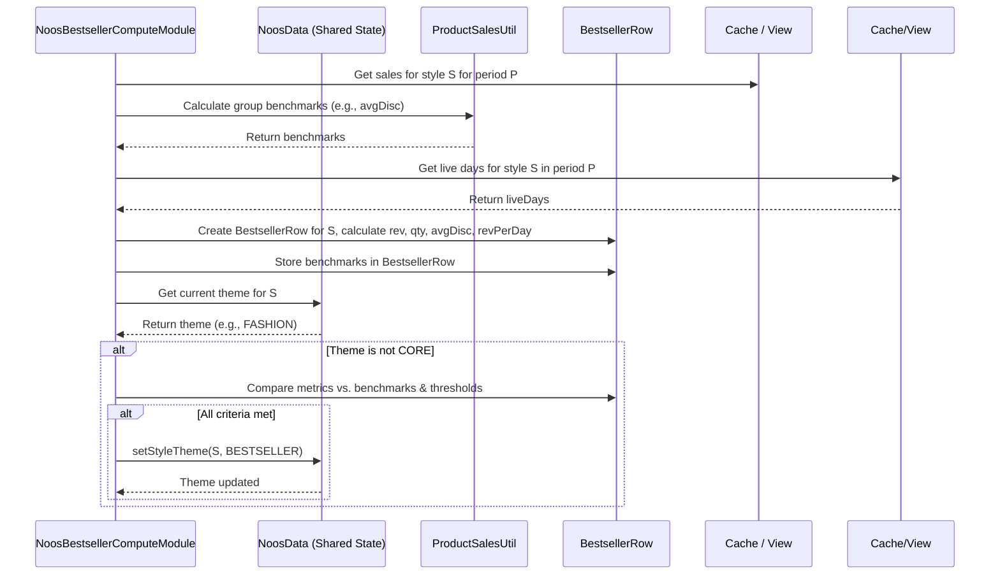

# Chapter 23: NoosBestsellerComputeModule

Welcome back! In the [previous chapter](22_nooscorecomputemodule_.md), we met the `NoosCoreComputeModule`, the specialist that identifies the steady, essential "Core" items in our assortment. These are like the basic white T-shirts – always needed, always expected.

But what about those items that aren't necessarily basics, but fly off the shelves? Maybe it's a specific trendy graphic tee or a uniquely comfortable pair of joggers that everyone wants *this season*. These items might not be "Core" essentials, but they are incredibly popular and contribute significantly to sales. We call these **"Bestsellers"**.

How do we automatically identify these current hot items? That's the job of the second specialist in the NOOS team: the `NoosBestsellerComputeModule`.

## What Problem Does This Module Solve?

While "Core" items provide stability, "Bestsellers" often drive excitement and significant revenue. We want to identify them so we can:
*   Try to keep them in stock while they are popular.
*   Understand what makes them successful.
*   Potentially consider them for future "Core" status if their popularity lasts.

Identifying Bestsellers requires looking at different factors than Core items. We're less concerned about long-term consistency and more focused on **current sales performance**:

*   **High Revenue:** Does this item bring in a lot more money compared to similar items?
*   **Good Sell-Through:** When it's in stock, does it sell well?
*   **Acceptable Discounts:** Is it selling well without needing massive discounts?
*   **Sufficient Time on Sale:** Has it been available long enough to prove its performance?

The `NoosBestsellerComputeModule` solves the problem of analyzing recent sales data to automatically flag styles that are performing exceptionally well right now, focusing on those *not already identified as Core*.

## Core Idea: Finding High-Performing Stars

The `NoosBestsellerComputeModule` works by evaluating styles based on their recent sales performance metrics over a defined period (e.g., the last 3 or 6 months, set by `bestsellerDuration` in `NoosArgs`). It compares a style's performance against its peers (often within the same category/brand segment/price bucket grouping) and applies specific thresholds.

Here's what it typically looks for:

1.  **High Revenue Contribution (Within Group):**
    *   It looks at all styles within a comparable group (e.g., Men's Premium T-Shirts from BrandX).
    *   It ranks them by the total revenue they generated during the period.
    *   **Bestseller Criteria:** Does this style fall into the top percentage (e.g., top 20%, defined by `bestsellerTopXRevContri`) of revenue contributors within its group?

2.  **Acceptable Discount Level:**
    *   It calculates the average discount percentage for the style.
    *   It also calculates the average discount for the entire peer group (the benchmark).
    *   **Bestseller Criteria:** Is the style's discount *at or below* the benchmark for its group (perhaps with a small tolerance factor)? We want items that sell well without huge markdowns.

3.  **Sufficient Live Days:**
    *   It checks how many days the style was actually available for sale ("live days") during the period.
    *   **Bestseller Criteria:** Was the style live for at least a minimum number of days (e.g., `bestSellerLiveDays` from `NoosArgs`)? This ensures we're looking at items with a reasonable sales history.

4.  **Minimum Sales Quantity:**
    *   It checks if the total quantity sold meets a minimum threshold (similar to the Core check, using `minQtySold` potentially adjusted by category).
    *   **Bestseller Criteria:** Did it sell enough units to be considered significant?

5.  **(Optional) Revenue Per Day Comparison:**
    *   It might compare the style's average revenue per live day against the average revenue per day per style for its category, looking for styles that significantly outperform the average.

If a style meets these criteria **AND** it hasn't already been marked as `CORE`, the `NoosBestsellerComputeModule` flags it by setting its theme to `StyleTheme.BESTSELLER`.

## How It Works (The Process)

This module runs as part of the sequence managed by [NOOS Identification (NoosGroupModule)](21_noos_identification__noosgroupmodule_.md), typically *after* `NoosCoreComputeModule`.

**Inputs:**
*   Sales data ([ProductSalesRow](13_productsalesrow_.md) list, often filtered for the `bestsellerDuration` and potentially cleaned, from `NoosData`).
*   Historical availability data (via the [View](10_view_.md) helper).
*   Product Master Data ([Cache](05_cache_.md)).
*   Configuration ([NoosArgs](03_configuration___arguments__args_classes__.md) for `bestsellerDuration`, `bestsellerTopXRevContri`, `bestSellerLiveDays`, discount multipliers, `minQtySold`).
*   Existing theme classifications (especially the `CORE` tags from the previous step, stored in `NoosData`).
*   Category minimum quantities (`CatQtyRow`).

**Calculation Steps (Simplified):**
1.  Initialize: Set up date ranges, load config, clear previous results.
2.  Load & Filter Sales: Get sales data for the specified `bestsellerDuration`.
3.  Calculate Group Benchmarks:
    *   Group sales data by relevant peer groups (e.g., Cat/Subcat/BrandSeg/PriceBucket).
    *   For each group, calculate the average discount percentage (`avgDisc`).
    *   (Optional: Calculate average revenue per day per style for each category - `catDailyRevPerStyle`).
4.  Calculate Style Metrics & Identify Top Revenue Contributors:
    *   Within each peer group, further group by Style.
    *   Identify the styles contributing to the top X% of revenue within that group (`topKStyles`).
    *   For each Style:
        *   Calculate its total revenue, quantity sold, average discount (`avgStyleDiscount`), live days (`daysLive`), and revenue per live day (`revPerDay`).
        *   Store these metrics (e.g., in a `BestsellerRow` object).
5.  Identify Bestsellers: Iterate through the calculated style metrics (`BestsellerRow` objects):
    a.  Check if `style.theme` is already `CORE`. If yes, skip.
    b.  Check if `style.qtySold >= minQtySold`.
    c.  Check if `style.daysLive >= bestSellerLiveDays`.
    d.  Check if `style.avgStyleDiscount <= groupAvgDisc` (benchmark for its group).
    e.  Check if the style is in the `topKStyles` set for its group.
    f.  (Optional: Check if `style.revPerDay > categoryAvgRevPerDayPerStyle * multiplier`).
    g.  If ALL relevant checks pass, set the style's theme to `BESTSELLER` (e.g., update `noosData.setStyleTheme`).
6.  Apply Caps (Optional): Sometimes, limits are applied (e.g., only the top N bestsellers per category are kept). See `noosUtil.applyNoosUpperCaps`.
7.  Save Results: Persist the detailed `BestsellerRow` objects and ensure the `NoosData` theme map is updated.

**Outputs:**
*   `BestsellerRow` data is saved (contains calculated performance metrics for each style).
*   The central `NoosData.styleThemeMap` is updated, marking relevant non-Core styles with `StyleTheme.BESTSELLER`.

## Under the Hood: Calculations and Comparisons

Let's look at the key calculations involved.

**1. Calculating Group Benchmarks (Discount):**
Similar to the Core module, it groups sales and calculates the average discount for the peer group.

```java
// Simplified logic for group average discount from NoosBestsellerComputeModule.java

private double getRolledUpAvgDisc(List<ProductSalesRow> salesInGroup) {
    // Use ProductSalesUtil to get the overall discount % for the group
    double avgDiscount = ProductSalesUtil.getDiscountPercent(salesInGroup);
    // Apply a multiplier from config if needed
    double avgDiscMultiplier = noosArgs.avgDiscCatSubcatBrsegPbMultiplier; // Config value
    // Return the benchmark discount threshold
    return avgDiscMultiplier * avgDiscount;
}
```
**Explanation:** It calculates the average discount for all sales within the peer group using `ProductSalesUtil` and potentially adjusts it with a multiplier from `NoosArgs`. This result (`avgDiscBenchmark`) is used later to check individual styles.

**2. Calculating Style Metrics (`getBestsellerRow` helper):**
This function calculates the performance metrics for a single style over the period.

```java
// Simplified from NoosBestsellerComputeModule.getBestsellerRow
private BestsellerRow getBestsellerRow(StyleRow styleRow, List<ProductSalesRow> sales,
                                     /*... other inputs like benchmarks ...*/) {
    BestsellerRow row = new BestsellerRow();
    row.style = styleRow.id;
    row.theme = noosData.getStyleTheme(styleRow.id); // Get current theme (e.g., CORE or FASHION)

    // Calculate totals using helpers
    row.rev = ProductSalesUtil.getTotalRevenue(sales);
    row.qtySold = ProductSalesUtil.getTotalQtySold(sales);
    row.discValue = ProductSalesUtil.getTotalDiscountValue(sales);

    // Calculate average discount for the style
    row.avgStyleDisc = MathUtil.getPercent(row.discValue, row.discValue + row.rev, 1);

    // Get live days using NoosUtil/View helper
    row.daysLive = noosUtil.getStyleLiveDays(styleRow, startDate, endDate, /*...*/);

    // Calculate revenue per live day
    row.revPerDay = MathUtil.divide(row.rev, row.daysLive);

    // Store benchmarks calculated earlier for comparison later
    row.discBenchmark = discBenchmark; // Passed in from group calculation
    // ... store other metrics like cutoffRev, catRevPerDayStyle ...

    return row;
}
```
**Explanation:** This populates a `BestsellerRow` object with key performance stats for the style: total revenue, quantity, average discount, live days, and revenue per day. It also stores the relevant benchmarks.

**3. Identifying Bestsellers (`computeBestsellerStyleMetrics` loop):**
The core decision logic compares the style's metrics against criteria.

```java
// Simplified logic within NoosBestsellerComputeModule.computeBestsellerStyleMetrics

// Get the set of styles that are top revenue contributors for this group
Set<Key> topKStyles = new HashSet<>(ProductSalesUtil.getTopKPercent(styleAggMap, bestsellerTopXRevContri));

for (Key styleKey : styleAggMap.keySet()) { // Loop through styles in the group
    StyleRow styleRow = (StyleRow) styleKey.part(0);
    // 'r' is the BestsellerRow calculated above, holding style metrics & benchmarks
    BestsellerRow r = bestsellerMap.get(styleRow.id);

    // --- Apply Checks ---
    // 1. Skip if already Core
    if (StyleTheme.isCore(r.theme)) continue;

    // 2. Check Min Quantity (using category threshold or default)
    Integer qty = catQtyMap.get(new Key(styleRow.cat, StyleTheme.BESTSELLER));
    double minQtySoldCategory = qty != null ? qty : noosArgs.minQtySold;

    // 3. Apply all criteria
    boolean isBestseller =
            topKStyles.contains(styleKey)       // Is it a top revenue contributor?
            && r.avgStyleDisc <= r.discBenchmark // Is discount acceptable?
            // Optional: && avgRevPerDayPerStyleInCat < r.revPerDay // Does it outperform category avg rev/day?
            && minQtySoldCategory <= r.qtySold   // Did it sell enough units?
            && r.daysLive >= noosArgs.bestSellerLiveDays; // Was it live long enough?

    if (isBestseller) {
        bestsellerCount++;
        r.theme = StyleTheme.BESTSELLER1; // Internal flag, maybe?
        // *** Update the central theme map ***
        noosData.setStyleTheme(styleRow.id, StyleTheme.BESTSELLER);
    }
}
```
**Explanation:** This loop checks each style within a peer group. It skips Core items. It then applies a series of checks: Is it in the top revenue set? Is its discount acceptable compared to the benchmark? Did it meet minimum quantity and live day thresholds? If all checks pass, it updates the central `NoosData` map to mark the style as a `BESTSELLER`.

**Sequence Diagram (Evaluating One Style):**



## Conclusion

The **`NoosBestsellerComputeModule`** is the specialist that identifies the current high-flying stars in the assortment – the **Bestsellers**.

*   It focuses on styles that show **strong recent sales performance** (high revenue contribution, good sell-through) without excessive discounts.
*   It analyzes sales data over a defined period (`bestsellerDuration`) and compares style metrics against **peer group benchmarks** and configuration thresholds.
*   It specifically looks for styles that are **not already classified as Core**.
*   Styles meeting the criteria are assigned the `StyleTheme.BESTSELLER`, influencing downstream inventory and planning decisions.

By identifying these popular items, this module helps businesses capitalize on current trends and maximize revenue from their top-performing styles.

Now that we've identified Core and Bestseller items, how do we determine the most important *sizes* for these key products? The next chapter delves into the [NoosParamountSizesModule](24_noosparamountsizesmodule_.md).

[Next Chapter: NoosParamountSizesModule](24_noosparamountsizesmodule_.md)

---

Generated by [AI Codebase Knowledge Builder](https://github.com/The-Pocket/Tutorial-Codebase-Knowledge)