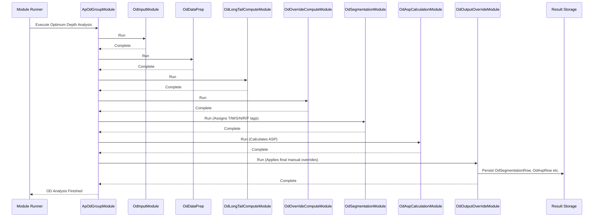

# Chapter 28: Optimum Depth (OD) Module (ApOdGroupModule)

Welcome! In the [previous chapter](27_pivotal_tag___pivotalrow_.md), we learned how the **Pivotal Tag** (P/NP/E) classifies the importance of each *size* within a product group and store, using the **`PivotalRow`** to store this information. Knowing that size 'M' is Pivotal (P) tells us it's important, but it doesn't tell us *how many* size 'M' items we should actually stock.

Should we aim to keep 5 units of that Pivotal size M T-shirt in Store 101? Or 10? Or 20? Stocking too few means we'll likely run out and miss sales (especially for important P sizes). Stocking too many means our money is tied up in inventory that might not sell quickly, potentially leading to discounts later and taking up valuable shelf space. How do we find that "just right" number?

## What Problem Does This Module Solve?

Determining the ideal quantity to stock for every single specific item (SKU - the combination of style, color, and size) in every single store or channel is a huge challenge. This ideal quantity is often called the **"Optimum Depth" (OD)**. "Depth" refers to the number of units of a particular SKU you stock. "Optimum" means finding the sweet spot – enough stock to meet likely customer demand but not so much that you're overstocked.

Manually calculating this ideal depth for thousands of SKUs and hundreds of locations, considering factors like past sales, seasonality, how long items were actually available, and strategic goals, is practically impossible.

The **Optimum Depth (OD) Module**, orchestrated by `ApOdGroupModule`, aims to solve this. It coordinates a sophisticated analysis of product performance to help determine this ideal stock level or, more accurately, to classify products in ways that *inform* the final depth decision. It doesn't just look at raw sales; it segments products based on their performance and applies various adjustments, laying the groundwork for recommending the right quantity.

## Core Concepts

The OD process involves several key ideas:

1.  **Depth:** Simply means the quantity of a specific SKU (e.g., 10 units of "Blue V-Neck T-Shirt", Size M).
2.  **Optimum:** Finding the balance between having enough stock to satisfy demand (avoiding lost sales) and not having too much stock (avoiding excess inventory costs and markdowns).
3.  **Performance Analysis:** The calculation relies heavily on analyzing historical data:
    *   **Sales Rate:** How quickly does an item sell when it's available?
    *   **Live Days:** How many days was the item actually in stock and available for purchase? (Crucial info from the [Inventory Creation Module](20_inventory_creation_module_.md) accessed via [View](10_view_.md)).
    *   **Seasonality:** Are sales different in different periods?
    *   **Revenue Contribution:** How much does this item contribute to the overall business?

4.  **OD Segmentation:** A major part of the OD process is classifying products (often at the Attribute Group or [AgRow](16_agrow_.md) level within a store/period) into performance segments. These segments help tailor the depth strategy. Common segments defined by the `OdSegment` enum include:
    *   `TOP`: High-performing items. Strong sales rate, good contribution. Depth should likely be generous.
    *   `MODERATE`: Decent performers. Steady but not stellar. Depth should be reasonable.
    *   `SLOW`: Low sales rate or contribution. Depth should be minimal or potentially zero.
    *   `N1` (New Introduction 1): Items performing well enough to be potentially introduced into a store where they weren't previously sold.
    *   `N2` (New Introduction 2): Items performing exceptionally well, strong candidates for introduction elsewhere.
    *   `R` (Reintroduction): Items that were previously sold, stopped, but are performing well enough elsewhere to be considered for reintroduction.
    *   `F` (Failure): Items with virtually no sales or very poor performance, often marked for exit. Depth should be zero.
    *   `UA` (Unassigned): Items that haven't been segmented yet (an initial state).

5.  **Adjustments & Overrides:** The process allows for incorporating business rules, manual overrides (like forcing a certain segment), and adjustments based on specific strategies (like handling very niche "long tail" items differently).

## The Orchestrator (`ApOdGroupModule`)

Just like the NOOS and ISS processes, the calculation of Optimum Depth metrics and segments involves multiple complex steps. The `ApOdGroupModule` doesn't do the heavy lifting itself; it acts as the **conductor** or **manager**, ensuring that a sequence of specialized sub-modules runs in the correct order to perform the analysis.

The main sub-modules orchestrated by `ApOdGroupModule` are:

*   `OdInputModule`: Loads necessary input data, including sales, inventory, and override rules.
*   `OdDataPrep`: Cleans, filters, and prepares the sales and inventory data, applying filters like brokenness or liquidation.
*   `OdLongTailComputeModule`: Identifies "long tail" items (products with very low sales volume) which might need special handling.
*   `OdOverrideComputeModule`: Applies initial calculated overrides based on category performance.
*   `OdSegmentationModule`: This is a key module that assigns the `TOP`, `MODERATE`, `SLOW`, `N1`, `N2`, `R`, `F` segments based on performance metrics.
*   `OdAspCalculationModule`: Calculates the Average Selling Price (ASP) for relevant product groups.
*   `OdOutputOverrideModule`: Applies final manual overrides provided by users to the calculated segments or contributions.

## How It Works (The Workflow)

You typically run `ApOdGroupModule` as part of the overall planning data preparation process, after things like NOOS and ISS have been determined.

**Inputs:**
*   Sales Data ([ProductSalesRow](13_productsalesrow_.md)).
*   Inventory / Live Days data (from the [Cache](05_cache_.md) / [View](10_view_.md)).
*   Attribute Group data ([AgRow](16_agrow_.md)).
*   Store/Product Master data ([Cache](05_cache_.md)).
*   Configuration ([OdArgs](03_configuration___arguments__args_classes__.md) defining thresholds, multipliers, relevant weeks).
*   User Overrides (`OdInputOverrideRow`).
*   Output from previous OD steps (like long tail flags).

**Processing Sequence (Simplified):**
1.  **Load & Prepare:** `OdInputModule` and `OdDataPrep` load, clean, and filter the sales and inventory data for the relevant periods.
2.  **Long Tail:** `OdLongTailComputeModule` identifies and potentially flags very low-selling style/store combinations.
3.  **Initial Overrides/Revenue Calc:** `OdOverrideComputeModule` applies some calculated adjustments and prepares revenue metrics.
4.  **Segmentation:** `OdSegmentationModule` analyzes the performance (revenue per day, etc.) of attribute groups within stores/channels and assigns the crucial T/M/S/N1/N2/R/F tags.
5.  **ASP Calculation:** `OdAspCalculationModule` calculates the average selling price.
6.  **Final Overrides:** `OdOutputOverrideModule` takes the segmented results and applies any final user-provided overrides.
7.  **Output:** The process saves the results, primarily the segmentation data.

**Outputs:**
*   **`OdSegmentationRow`:** This is a key output. Each row contains information for a specific `store`, `period`, and attribute group (`ag`), including:
    *   `segment`: The final assigned `OdSegment` (TOP, MODERATE, SLOW, N1, N2, R, F).
    *   Performance metrics like `revPerLiveDay`, `initialStoreRevContri`, `finalStoreRevContri`.
    *   Flags indicating if overrides were applied (`odOverrideOutputLevel`).
*   `OdAspRow`: Contains the calculated Average Selling Price.
*   Other intermediate or detailed output rows (like `OdAgRevenueRow`, `OdRawSalesRow`, etc.) used for debugging or further analysis.

This segmented data, especially the `OdSegment` tag, is the primary input used by later modules (like Width/Depth Suggestion or Buying modules) to determine the final recommended stock quantity (depth). For example, a 'TOP' segment AG might get a higher depth target than a 'SLOW' segment AG.

## Under the Hood

**1. Orchestration (`ApOdGroupModule.java`):**
This class defines the execution order of the sub-modules.

```java
// Simplified from ApOdGroupModule.java
@Component
public class ApOdGroupModule extends AbstractUtilModuleGroup {

    // --- Autowire all the sub-modules ---
    @Autowired private OdInputModule odInput;
    @Autowired private OdDataPrep odDataPrep;
    @Autowired private OdLongTailComputeModule odLongTailComputeModule;
    @Autowired private OdOverrideComputeModule odOverrideComputeModule;
    @Autowired private OdSegmentationModule odSegmentationModule;
    @Autowired private OdAspCalculationModule odAspCalculationModule;
    @Autowired private OdOutputOverrideModule odOutputOverrideModule;
    // ... Standard snapshot/sync modules ...

    @PostConstruct // Run after creation
    public void init() {
        captureSnapshot(); // Standard step
        // --- Define the execution order ---
        add(odInput);
        add(odDataPrep);
        add(odLongTailComputeModule);
        add(odOverrideComputeModule);
        add(odSegmentationModule);
        add(odAspCalculationModule);
        add(odOutputOverrideModule);
        uploadOutput(); // Standard step
    }
    // ... captureSnapshot() and uploadOutput() methods ...
}
```
**Explanation:** The `init()` method clearly lists the sequence: Input -> Prep -> LongTail -> Override -> Segment -> ASP -> Output Override. `ApOdGroupModule` ensures each step runs in turn.

**Sequence Diagram (High-Level Flow):**


**2. Key Logic Sneak Peek:**
The real complexity lies within the sub-modules, which we'll explore in subsequent chapters. However, we can get a glimpse:

*   **`OdDataPrep`:** Uses helpers like `OdCleanupHelper` and potentially `ProductSalesUtil` to filter sales based on date ranges, seasons, and potentially quality criteria (like removing sales during heavy liquidation periods).
*   **`OdLongTailComputeModule`:** Calculates revenue per day for styles within an AG, sorts them, and identifies styles falling below a revenue contribution benchmark (e.g., bottom 10%).
*   **`OdSegmentationModule`:** This is central. It compares performance metrics (like revenue per live day per style) against benchmarks (often derived from peer groups or configuration) to assign the T/M/S segments. It also has logic to identify potential N1/N2 (New Introductions) or R (Reintroductions) based on performance in other stores or previous periods.
*   **`OdOutputOverrideModule`:** Reads `OdInputOverrideRow` data and updates the calculated contributions or segments before the final output is saved, similar in concept to the `NoosBsOverrideModule`.

## Conclusion

The **Optimum Depth (OD) Module**, orchestrated by **`ApOdGroupModule`**, coordinates the complex analysis required to understand product performance and inform stocking depth decisions.

*   It manages a sequence of specialized modules that **prepare data, identify long-tail items, calculate performance metrics (like ASP and revenue per day), segment products (Top, Moderate, Slow, New, Reintro, Failure), and apply overrides.**
*   It doesn't directly output the final *quantity* (depth) but produces the crucial **segmentation (`OdSegment`)** and performance metrics (`OdSegmentationRow`, `OdAspRow`) needed by downstream planning modules to determine those quantities.
*   The goal is to provide a data-driven foundation for stocking the right amount of each SKU to meet demand efficiently.

The segmentation step is arguably the most critical output of this process. Let's dive deeper into how those T/M/S/N/R/F tags are assigned in the next chapter.

[Next Chapter: OD Segmentation](29_od_segmentation_.md)

---

Generated by [AI Codebase Knowledge Builder](https://github.com/The-Pocket/Tutorial-Codebase-Knowledge)