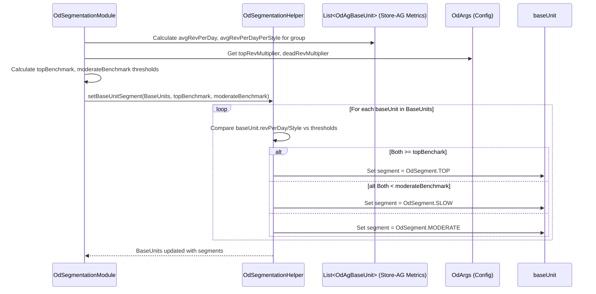

# Chapter 29: OD Segmentation

Welcome back! In the [previous chapter](28_optimum_depth__od__module__apodgroupmodule__.md), we learned about the **Optimum Depth (OD) Module**, which orchestrates the analysis needed to figure out the ideal stock levels for our products. That module sets the stage, but a crucial part of the process is actually *classifying* how well different product groups are performing.

Imagine you're a teacher grading students. You don't just give them a final number; you often put them into categories like 'Excellent', 'Good', 'Satisfactory', or 'Needs Improvement'. This helps you understand who needs more challenging work and who needs extra help. Similarly, in retail, we need to categorize our product groups based on their performance.

## What Problem Does OD Segmentation Solve?

Just knowing the raw sales numbers for a product group (like "Men's V-Neck T-shirts in Store 101") isn't always enough to make smart decisions. We need to know: Is this group a star performer? Is it average? Is it struggling? Is it a brand new item showing promise?

**OD Segmentation** solves this by classifying product groups (specifically, [Attribute Groups / AgRow](16_agrow_.md)) within each store or channel based on their sales performance during specific analysis periods. It assigns a simple label or **segment** (like TOP, MODERATE, SLOW, etc.) to each group.

Why is this important? These segments help tailor business strategies:
*   **TOP** performers might get more inventory allocated, prime shelf space, and less discounting.
*   **SLOW** performers might need price reductions, less stock, or even removal from the assortment.
*   **NEW** items showing promise might get more investment.
*   **FAILED** items need to be cleared out quickly.

This segmentation provides a clear, actionable status for each product group, driving better buying, allocation, and pricing decisions.

## Core Concepts: The Performance Segments

The heart of OD Segmentation is assigning one of these labels (defined in the [`OdSegment`](07_enumerations__enums__.md) enum) to each Store-AttributeGroup combination:

1.  **`TOP` (Top Performers):** These are the stars! They sell very well when available (high revenue per live day) compared to their peers.
    *   *Strategy:* Prioritize stocking these, potentially increase depth, avoid deep discounts.

2.  **`MODERATE` (Average Performers):** These are solid, middle-of-the-road performers. They sell reasonably well but aren't the absolute top items.
    *   *Strategy:* Maintain standard stock levels, apply normal pricing strategies.

3.  **`SLOW` (Low Performers):** These items don't sell well compared to others, even when they are available. They might have a low sales rate or contribute very little revenue.
    *   *Strategy:* Reduce stock depth, consider markdowns, potentially remove from assortment later.

4.  **`F` (Failure):** These items have extremely poor or negligible sales. They are clear candidates for removal.
    *   *Strategy:* Stop buying, clear existing stock quickly (e.g., heavy discounts).

5.  **`N1` / `N2` (New Introduction 1 / New Introduction 2):** These labels are assigned to attribute groups that *aren't currently sold* in a particular store but are performing well enough (`N1`) or exceptionally well (`N2`) in *similar* stores (e.g., same city or region). This suggests they could be good candidates to introduce into this store's assortment.
    *   *Strategy:* Consider adding these groups to the store's assortment plan.

6.  **`R` (Reintroduction):** This applies to groups that *used to be sold* in the store but were discontinued. If they are now performing well again in similar stores, they might be candidates for reintroduction.
    *   *Strategy:* Evaluate bringing this group back into the store's assortment.

7.  **`UA` (Unassigned) / `EMPTY`:** An initial or default state before segmentation occurs.

**How are Segments Determined?**
The assignment is primarily based on analyzing performance metrics calculated from historical sales data (often prepared by `OdDataPrep`) and inventory availability (from the [Cache](05_cache_.md) / [View](10_view_.md)). Key metrics usually include:
*   **Revenue per Live Day:** Total revenue generated by the group divided by the number of days its items were actually in stock.
*   **Revenue per Live Day per Style:** The average revenue per live day achieved by the individual styles within the group.

These metrics are compared against benchmarks, often calculated from peer groups (e.g., comparing a T-shirt AG against other T-shirt AGs in the same store or channel).

## How It Works (The Process)

OD Segmentation typically happens within the `OdSegmentationModule`, which is run as part of the sequence orchestrated by the [Optimum Depth (OD) Module (ApOdGroupModule)](28_optimum_depth__od__module__apodgroupmodule__.md).

**Inputs:**
*   Prepared sales and live day data (from `OdDataPrep`).
*   Attribute Group information ([AgRow](16_agrow_.md)).
*   Calculated performance metrics per Store-AG (e.g., revenue per live day, potentially stored in `OdAgBaseUnit` objects).
*   Configuration ([OdArgs](03_configuration___arguments__args_classes__.md)) specifying multipliers and thresholds for segmentation.

**Calculation Steps (Simplified):**
1.  **Calculate Benchmarks:** For relevant peer groups (e.g., all non-failed AGs within a Store-Category-Period), calculate average performance metrics like `avgRevPerLiveDay` and `avgRevPerLiveDayPerStyle`.
2.  **Determine Thresholds:** Use multipliers from `OdArgs` to set the performance thresholds needed to qualify for TOP or to be classified as SLOW based on the benchmarks (e.g., `topRevBenchmark = avgRevPerLiveDay * topRevMultiplier`).
3.  **Tag T/M/S:** Iterate through each Store-AG combination. Compare its calculated `revPerLiveDay` and `revPerLiveDayPerStyle` against the TOP and SLOW thresholds. Assign the `OdSegment.TOP`, `OdSegment.MODERATE`, or `OdSegment.SLOW` tag accordingly. This is often done using helpers like `OdSegmentationHelper.setBaseUnitSegment`.
4.  **Tag N1/N2/R (Conceptual):** Identify AGs not currently active in a store. Compare their performance in *other* relevant stores (using scaling factors if needed) against the T/M/S benchmarks calculated for the target store. Assign `N1`, `N2`, or `R` based on how well they perform relative to these benchmarks.
5.  **Tag F:** AGs with zero or negligible performance are typically flagged as `F` (Failure) earlier in the OD process (e.g., in `OdDataPrep` or `OdOverrideComputeModule`).

**Outputs:**
*   The primary output is the **`OdSegmentationRow`** ([Row Input/Output Classes](09_row_input_output_classes__.md)). It stores the final assigned `segment` (TOP, MODERATE, SLOW, N1, N2, R, F) for each Store-Period-AG combination, along with supporting metrics.

```java
// Simplified structure of OdSegmentationRow
// File: src/main/java/com/increff/irisx/row/output/od/OdSegmentationRow.java
package com.increff.irisx.row.output.od;

import com.increff.irisx.constants.ap.OdOverrideOutputLevel;
import com.increff.irisx.constants.ap.OdSegment; // Import the Enum

public class OdSegmentationRow {
    public int period;
    public int store;
    public String cat; // Category (often part of AG context)
    public int ag; // Attribute Group ID

    // --- The Key Output ---
    public OdSegment segment; // e.g., TOP, MODERATE, SLOW, F, N1, N2, R

    // --- Supporting Metrics ---
    public double finalStoreRevContri; // Final revenue contribution %
    public double revPerLiveDay; // Group's Revenue / Live Days
    public double revPerLiveDaysPerStyle; // Avg Style Rev / Live Days

    // --- Override Info ---
    public OdOverrideOutputLevel odOverrideOutputLevel; // How overrides were applied
    public int isZeroOverride;

    public OdSegmentationRow(){
        this.segment = OdSegment.EMPTY; // Default
        this.odOverrideOutputLevel = OdOverrideOutputLevel.EMPTY;
    }
}
```
This `OdSegmentationRow` becomes a vital input for later planning stages, directly influencing decisions about assortment width (how many different AGs to carry) and depth (how many units to stock for AGs based on their segment).

## Under the Hood: Applying Benchmarks

The core logic for assigning TOP, MODERATE, and SLOW often resides in helper classes like `OdSegmentationHelper`.

**1. Conceptual Walkthrough (T/M/S Tagging):**
Imagine we have calculated metrics for several Attribute Groups (AGs) within a store's T-shirt category for a specific period:

*   AG 101: Rev/LiveDay = 120, Rev/LiveDay/Style = 20
*   AG 102: Rev/LiveDay = 150, Rev/LiveDay/Style = 30
*   AG 103: Rev/LiveDay = 90, Rev/LiveDay/Style = 45
*   AG 104: Rev/LiveDay = 50, Rev/LiveDay/Style = 10

The system first calculates benchmarks for this group. Let's say:
*   Average Rev/LiveDay = 102.5
*   Average Rev/LiveDay/Style = 26.25

Now, assume configuration (`OdArgs`) specifies multipliers: `topRevMultiplier = 1.2` and `deadRevMultiplier = 0.8`.

The thresholds become:
*   TOP Threshold (Rev/LiveDay): 102.5 * 1.2 = 123
*   TOP Threshold (Rev/LiveDay/Style): 26.25 * 1.2 = 31.5
*   SLOW Threshold (Rev/LiveDay): 102.5 * 0.8 = 82
*   SLOW Threshold (Rev/LiveDay/Style): 26.25 * 0.8 = 21

Now, we apply these to each AG:
*   **AG 101 (120, 20):** Rev/LiveDay (120) < TOP (123). Rev/LiveDay/Style (20) < SLOW (21). Meets neither TOP nor SLOW criteria completely -> **MODERATE**.
*   **AG 102 (150, 30):** Rev/LiveDay (150) >= TOP (123). Rev/LiveDay/Style (30) is close but below TOP (31.5). However, it's definitely not SLOW. Let's assume the logic requires *both* to be >= TOP for TOP, and *both* to be < SLOW for SLOW. So -> **MODERATE**. (Note: Real logic might differ slightly, maybe checking if >= Moderate threshold). Let's refine based on the provided code: TOP requires BOTH >= top thresholds. SLOW requires BOTH < moderate (SLOW) thresholds. Otherwise MODERATE.
    *   AG 102: (150 >= 123) YES, (30 >= 31.5) NO. Not TOP. (150 < 82) NO, (30 < 21) NO. Not SLOW. -> **MODERATE**.
*   **AG 103 (90, 45):** Rev/LiveDay (90) >= TOP (123) NO. Rev/LiveDay/Style (45) >= TOP (31.5) YES. Not TOP. (90 < 82) NO, (45 < 21) NO. Not SLOW. -> **MODERATE**.
*   **AG 104 (50, 10):** Rev/LiveDay (50) < SLOW (82). Rev/LiveDay/Style (10) < SLOW (21). Both are below the SLOW threshold -> **SLOW**.

**(Revised based on code): Let's re-evaluate AG 102 & 103.**
The code uses `topRevBenchmark` and `moderateRevBenchmark`.
*   Top Rev/Day = 123, Top Rev/Day/Style = 31.5
*   Mod Rev/Day = 82, Mod Rev/Day/Style = 21

*   **AG 101 (120, 20):** (120 >= 123 && 20 >= 31.5) -> NO. (120 < 82 && 20 < 21) -> NO. -> **MODERATE**.
*   **AG 102 (150, 30):** (150 >= 123 && 30 >= 31.5) -> NO. (150 < 82 && 30 < 21) -> NO. -> **MODERATE**.
*   **AG 103 (90, 45):** (90 >= 123 && 45 >= 31.5) -> NO. (90 < 82 && 45 < 21) -> NO. -> **MODERATE**.
*   **AG 104 (50, 10):** (50 >= 123 && 10 >= 31.5) -> NO. (50 < 82 && 10 < 21) -> YES. -> **SLOW**.

It seems based on the strict logic in the helper, getting TOP requires exceeding *both* benchmarks, and SLOW requires falling below *both* moderate benchmarks. Otherwise, it's MODERATE.

**Sequence Diagram (T/M/S Tagging):**


**2. Code Dive (`OdSegmentationHelper.setBaseUnitSegment`):**
This static helper method encapsulates the core T/M/S logic.

```java
// From: src/main/java/com/increff/irisx/module/od/OdSegmentationHelper.java

/**
 * Assigns the segment of base unit basis conditions on revPerLiveDay & revPerLiveDaysPerStyle.
 */
public static void setBaseUnitSegment(List<OdAgBaseUnit> storeAgBaseUnits,
                                      double topRevBenchmark, double topRevPerStyleBenchmark,
                                      double moderateRevBenchmark, double moderateRevPerStyleBenchMark) {
    for (OdAgBaseUnit baseUnit : storeAgBaseUnits) {
        // Check for TOP: BOTH metrics must be >= respective TOP benchmarks
        if (Double.compare(baseUnit.revPerLiveDay, topRevBenchmark) >= 0 &&
            Double.compare(baseUnit.revPerLiveDaysPerStyle, topRevPerStyleBenchmark) >= 0) {
            baseUnit.segment = OdSegment.TOP;
        }
        // Check for SLOW: BOTH metrics must be < respective MODERATE benchmarks
        else if (Double.compare(baseUnit.revPerLiveDay, moderateRevBenchmark) < 0 &&
                 Double.compare(baseUnit.revPerLiveDaysPerStyle, moderateRevPerStyleBenchMark) < 0) {
            baseUnit.segment = OdSegment.SLOW;
        }
        // Otherwise, it's MODERATE
        else {
            baseUnit.segment = OdSegment.MODERATE;
        }
    }
}
```
**Explanation:** The code iterates through each `OdAgBaseUnit` (which holds the performance metrics for a Store-AG). It uses `Double.compare()` for safe floating-point comparisons. It first checks if *both* `revPerLiveDay` and `revPerLiveDaysPerStyle` meet or exceed the TOP benchmarks. If so, it's `TOP`. If not, it checks if *both* metrics fall below the MODERATE benchmarks (which effectively define the upper boundary of SLOW). If so, it's `SLOW`. If neither of these conditions is fully met, the segment is assigned `MODERATE`.

**3. Code Dive (`OdSegment` Enum):**
Shows the defined segment constants.

```java
// From: src/main/java/com/increff/irisx/constants/ap/OdSegment.java
package com.increff.irisx.constants.ap;
// ... imports ...

public enum OdSegment implements EnumInterface {
    TOP("TOP", "SUPERIOR"),
    MODERATE("MODERATE", "MODERADO"),
    SLOW("SLOW", "LENTA"),
    REINTRODUCTION("REINTRODUCTION", "REINTRODUCCIÓN"),
    NEW1("NEW1", "NUEVO1"),
    NEW2("NEW2", "NUEVO2"),
    F("F", "F"), // Failure
    UA("UA", "UA"), // Unassigned
    EMPTY("", "");
    // ... fields, constructors, methods (as seen before) ...

    // --- Helper Methods ---
    public static boolean isModerate(OdSegment segment) { return segment.equals(MODERATE); }
    public static boolean isSlow(OdSegment segment) { return segment.equals(SLOW); }
    public static boolean isTop(OdSegment segment) { return segment.equals(TOP); }
    // ... potentially other helpers for N1, N2, R, F ...
}
```
**Explanation:** This enum defines the fixed set of possible segment labels (TOP, MODERATE, SLOW, F, N1, N2, R, UA, EMPTY) and provides helper methods (`isTop`, `isModerate`, etc.) for easily checking a segment's type.

## Conclusion

**OD Segmentation** is a vital step within the Optimum Depth analysis, providing a performance classification for product groups (Store-AG combinations).

*   It assigns segments like **TOP, MODERATE, SLOW, F, NEW1, NEW2, REINTRODUCTION** based on historical performance metrics (especially revenue per live day) compared against benchmarks.
*   These segments provide actionable insights for tailoring **buying, allocation, and pricing strategies**.
*   The calculation is typically performed by `OdSegmentationModule` using helpers like `OdSegmentationHelper`, comparing metrics against dynamic thresholds derived from peer groups and configuration.
*   The key output is the `OdSegmentationRow`, which stores the final `OdSegment` for each Store-Period-AG, driving downstream planning decisions.

By categorizing performance, OD Segmentation helps translate complex data into clear strategic directives.

One factor that can complicate performance analysis is the presence of "long tail" items – products that sell very infrequently. How does the OD process identify and handle these? The next chapter explores the [OD Long Tail Calculation](30_od_long_tail_calculation_.md).

[Next Chapter: OD Long Tail Calculation](30_od_long_tail_calculation_.md)

---

Generated by [AI Codebase Knowledge Builder](https://github.com/The-Pocket/Tutorial-Codebase-Knowledge)