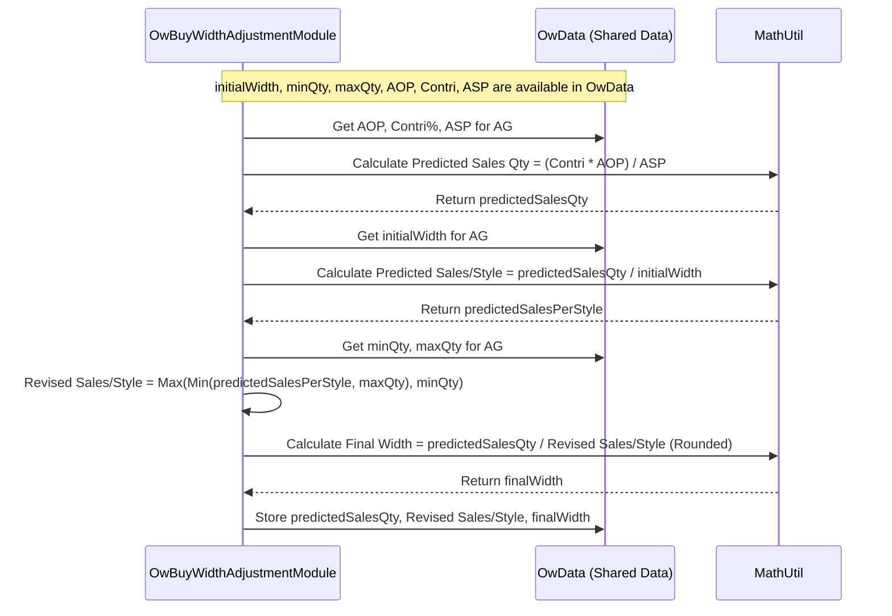

# Chapter 34: OW Buy Width Adjustment

Welcome back! In the [previous chapter](33_ow_initial_width_calculation_.md), we saw how the [OW Initial Width Calculation](33_ow_initial_width_calculation_.md) process gives us a first estimate of how many styles (the "width") we should offer, based on how concentrated or spread out past sales were. That initial width (let's call it `initialWidth`) is a great starting point.

But is it the final answer? Not quite! That initial calculation looked mostly at the *past*. Now, we need to consider the *future* and some practical limits.

## What Problem Does This Step Solve?

Imagine our initial calculation suggested offering 6 styles of premium V-neck T-shirts in Store 101 (down from 10 sold last season, because sales were concentrated). But what if our sales forecast for *next* season predicts a huge surge in demand for these premium T-shirts? If we only offer 6 styles, maybe each style would need to sell an unrealistic number of units to meet the forecast.

Or, what if there are limits? Maybe the business knows that to be profitable, each style needs to sell at least 15 units (`minQtySold`), but historically, the maximum any similar style sold was 50 units (`maxQtySold`). If our forecast divided by the initial width of 6 suggests each style needs to sell 70 units, that might be unrealistic based on past maximums. Or if it suggests only 10 units per style, that might be below our minimum profitability threshold.

The **OW Buy Width Adjustment** step solves this problem. It acts like a reality check and refinement step. It takes the `initialWidth`, considers the **predicted total sales** for the group, and applies **minimum/maximum sales constraints per style** to arrive at a final, adjusted width. This ensures the planned width aligns better with expected sales volume and practical sales limits per style.

## Core Concept: Aligning Width with Sales Volume & Constraints

This adjustment step brings together several pieces of information:

1.  **Initial Width (`initialWidth`):** The starting estimate from the previous step ([Chapter 33](33_ow_initial_width_calculation_.md)), based on historical sales distribution.
2.  **Predicted Sales Quantity (`predictedSalesMap`):** An estimate of how many total units the *entire* Attribute Group is expected to sell in the future period for a specific store. This often comes from higher-level plans (like an Annual Operating Plan - AOP) combined with the group's expected revenue contribution and its Average Selling Price (ASP from [Chapter 31](31_od_asp_calculation_.md)).
    *   *Formula:* `Predicted Sales Qty ≈ (Group Revenue Contribution % * AOP Revenue) / Group ASP`
3.  **Predicted Sales Per Style (Initial):** A simple calculation: `Predicted Sales Qty / initialWidth`. This tells us, based on the initial width, how many units each style would *need* to sell on average to meet the total prediction.
4.  **Min/Max Sales Per Style Constraints (`minQtySold`, `maxQtySold`):** Business rules or historical analysis determining the minimum profitable sales quantity per style and the realistic maximum sales quantity per style within this group/store. (These constraints are often calculated in the `OwMinMaxDepthModule`).
5.  **Revised Sales Per Style (`revisedSalesPerStyle`):** This is the crucial adjustment. The "Predicted Sales Per Style (Initial)" is checked against the min/max constraints:
    *   If it's *below* `minQtySold`, the revised value is set to `minQtySold`.
    *   If it's *above* `maxQtySold`, the revised value is set to `maxQtySold`.
    *   If it's *within* the min/max range, it stays the same.
    *   *Formula:* `Revised Sales Per Style = Max( Min(Predicted Sales Per Style (Initial), maxQtySold), minQtySold )`
6.  **Final Width (`finalWidth`):** The final adjusted width is calculated by dividing the total predicted sales by the revised (constrained) sales expected per style.
    *   *Formula:* `Final Width = Predicted Sales Qty / Revised Sales Per Style` (rounded to the nearest whole number).

Essentially, we're asking: "Given the total sales we expect and the realistic number of units each style can sell (considering min/max limits), how many styles does that imply we need?"

## How It Works (The Process within `OwBuyWidthAdjustmentModule`)

This module runs after the `OwInitWidthCalc` and `OwMinMaxDepthModule` within the sequence managed by `ApOwGroupModule`.

**Inputs:**
*   `initialWidth` map (from `OwData`).
*   `minQtySold` and `maxQtySold` constraints per Store-AG (from `OwData`, calculated by `OwMinMaxDepthModule`).
*   OD Segmentation results (for revenue contribution) and ASP results (from `OwData`).
*   AOP Revenue targets (from `OwData`).

**Calculation Steps:**
1.  **Calculate Predicted Sales:** For each Store-AG, calculate the `predictedSalesMap` using the group's revenue contribution, AOP, and ASP. Also calculate the initial `predictedSalesPerStyle` map (`predictedSalesMap / initialWidth`).
2.  **Handle New Stores:** If there are new stores without historical data, estimate their `predictedSalesPerStyle` based on similar reference stores.
3.  **Calculate Revised Sales Per Style:** Apply the Min/Max constraints to the `predictedSalesPerStyle` map to create the `revisedSalesPerStyle` map.
4.  **Calculate Final Width:** Calculate the `finalWidth` map using the formula: `finalWidth = predictedSalesMap / revisedSalesPerStyle`.
5.  **Store Results:** Store the `predictedSalesMap`, `predictedSalesPerStyle`, `revisedSalesPerStyle`, and `finalWidth` maps in the shared `OwData` object for subsequent modules (like `OwExitAgModule` and `OwOutputModule`) to use.

**Outputs:**
*   Updated `OwData` containing:
    *   `predictedSalesMap`: Total predicted units for the Store-AG.
    *   `salesPerStyle`: Predicted units per style based on initial width.
    *   `revisedSalesPerStyle`: Predicted units per style after applying min/max constraints.
    *   `finalWidth`: The adjusted width recommendation (before exit redistribution).

This `finalWidth` is a much more robust recommendation because it considers both historical distribution *and* future sales volume with practical constraints.

## Under the Hood: Applying the Formulas

The core of this module is applying the sequence of formulas described above.

**Walkthrough Example:**
*   Store 101, AG 500
*   `initialWidth` = 6 styles
*   Predicted Sales Qty (`predictedSalesMap`) = 240 units (calculated from AOP/Contri/ASP)
*   `minQtySold` = 15 units
*   `maxQtySold` = 50 units

1.  **Predicted Sales Per Style (Initial):** 240 units / 6 styles = 40 units/style.
2.  **Apply Constraints:**
    *   Is 40 < `minQtySold` (15)? No.
    *   Is 40 > `maxQtySold` (50)? No.
    *   So, the value is within the constraints.
3.  **Revised Sales Per Style:** 40 units/style (since it was within min/max).
4.  **Final Width:** 240 total units / 40 units/style = 6 styles.
    *   *Result:* In this case, the initial width was suitable, and the adjusted width remains 6.

**Walkthrough Example 2 (High Sales Per Style):**
*   Store 101, AG 501
*   `initialWidth` = 3 styles
*   Predicted Sales Qty = 240 units
*   `minQtySold` = 15 units
*   `maxQtySold` = 50 units

1.  **Predicted Sales Per Style (Initial):** 240 units / 3 styles = 80 units/style.
2.  **Apply Constraints:**
    *   Is 80 < `minQtySold` (15)? No.
    *   Is 80 > `maxQtySold` (50)? Yes.
    *   Value is capped at the maximum.
3.  **Revised Sales Per Style:** 50 units/style (capped by `maxQtySold`).
4.  **Final Width:** 240 total units / 50 units/style = 4.8 styles -> Rounded to **5 styles**.
    *   *Result:* Because the initial width implied an unrealistically high sales rate per style (80 > 50), the system adjusted the width upwards to 5 styles, implying a more achievable 48 units/style (240/5).

**Sequence Diagram (Calculating Final Width for one AG):**



**Code Dive (`OwBuyWidthAdjustmentModule.java`):**

Let's look at the key calculation methods.

*   **Calculating Predicted Sales (`calculatePredictedSales`):**

    ```java
    // Simplified from OwBuyWidthAdjustmentModule.java
    private Map<Key, Double> calculatePredictedSales() {
        Map<Key, Double> predictedSales = new HashMap<>();
        // Loop through all Store-AG combinations analyzed by OD
        for (Key key : owData.getOdSegmentationRowKeySet()) {
            int period = (int) key.part(0);
            int store = (int) key.part(1);
            int ag = (int) key.part(2);
            // Get OD results: revenue contribution and ASP
            double revContri = owData.getOdSegmentationRow(period, store, ag).finalStoreRevContri;
            double aop = owData.getAopRevenue(store, period); // Get planned AOP revenue
            Double asp = owData.getAsp(period, store, ag); // Get calculated ASP
            if (asp == null || asp == 0.0) asp = 1.0; // Avoid division by zero, use 1 as fallback

            // Calculate total predicted sales quantity
            double totalPredSales = MathUtil.divide(revContri * aop, asp * 100.0);
            predictedSales.put(key, totalPredSales);

            // Also calculate initial sales per style based on initial width
            int initialWidth = owData.getAgInitialWidth(period, store, ag);
            predictedSalesPerStyle.put(key, MathUtil.divide(totalPredSales, initialWidth));
        }
        return predictedSales;
    }
    ```
    **Explanation:** This method iterates through each Store-AG. It retrieves the group's final revenue contribution (from OD segmentation), the total planned revenue (AOP), and the calculated ASP. It uses these values in the formula `(RevContri % * AOP) / ASP` to estimate the total predicted sales quantity (`totalPredSales`) for the group. It also calculates the initial `predictedSalesPerStyle` by dividing `totalPredSales` by the `initialWidth`.

*   **Calculating Revised Sales Per Style (`getRevisedSales`):**

    ```java
    // Simplified from OwBuyWidthAdjustmentModule.java
    private Map<Key, Double> getRevisedSales() {
        Map<Key, Double> revisedSalesPerStyle = new HashMap<>();
        // Loop through the initial predicted sales per style calculated earlier
        predictedSalesPerStyle.forEach((key, salesPerStyle) -> {
            int period = (int) key.part(0);
            int store = (int) key.part(1);
            int ag = (int) key.part(2);

            // Get the min/max quantity constraints for this Store-AG
            double maxQtySold = owData.getMaxQtySold(period, store, ag);
            int minQtySold = owData.getMinQtySold(period, store, ag);

            // Apply the Min/Max logic
            // Revised = Max( Min(InitialPrediction, MaxConstraint), MinConstraint )
            double revisedSales = Math.max(Math.min(salesPerStyle, maxQtySold), minQtySold);
            revisedSalesPerStyle.put(key, revisedSales);
        });
        return revisedSalesPerStyle;
    }
    ```
    **Explanation:** This method takes the initial `predictedSalesPerStyle` for each Store-AG. It fetches the corresponding `minQtySold` and `maxQtySold` constraints (calculated previously by `OwMinMaxDepthModule`). It then applies the core logic: `Math.max(Math.min(salesPerStyle, maxQtySold), minQtySold)` to ensure the `revisedSales` value falls within the acceptable min/max range.

*   **Calculating Final Width (`getFinalWidth`):**

    ```java
    // Simplified from OwBuyWidthAdjustmentModule.java
    // (Made static in original code, accessible via OwBuyWidthAdjustmentModule.getFinalWidth)
    protected static Map<Key, Integer> getFinalWidth(Map<Key, Double> predictedSalesMap,
                                                    Map<Key, Double> revisedSalesPerStyle) {
        Map<Key, Integer> finalWidth = new HashMap<>();
        // Loop through the revised sales per style map
        revisedSalesPerStyle.forEach((key, revisedSales) -> {
            // Get the total predicted sales for the group
            double predictedSales = predictedSalesMap.get(key);
            // Calculate final width: Total Predicted Sales / Revised Sales Per Style
            // Use MathUtil.round to get a whole number (0 decimal places)
            finalWidth.put(key, (int) MathUtil.round(MathUtil.divide(predictedSales, revisedSales),
                                                    0, Optional.empty()));
        });
        return finalWidth;
    }
    ```
    **Explanation:** This function takes the total `predictedSalesMap` and the `revisedSalesPerStyle` map. For each Store-AG key, it performs the final division: `predictedSales / revisedSales` using `MathUtil.divide` (for safety) and rounds the result to the nearest integer using `MathUtil.round` to get the recommended whole number of styles (`finalWidth`).

## Conclusion

The **OW Buy Width Adjustment**, performed by `OwBuyWidthAdjustmentModule`, is a critical refinement step in determining the Optimum Width.

*   It adjusts the `initialWidth` (based on historical distribution) by considering the **future predicted sales volume** and practical **min/max sales constraints per style**.
*   It calculates the **total predicted sales** for a group (Store-AG) using AOP, revenue contribution, and ASP.
*   It determines the **revised sales quantity per style** by applying min/max constraints to an initial estimate.
*   The final adjusted width is calculated as: **`Final Width = Total Predicted Sales / Revised Sales Per Style`**.
*   This ensures the recommended width is more realistic and aligned with both expected sales volume and operational constraints.

This adjusted `finalWidth` is then passed to the final OW steps (`OwExitAgModule`, `OwOutputModule`) to handle potential exits and save the definitive width recommendation used in assortment planning.

After calculating the final width recommendations, how does the system present this information, along with other planning outputs, in a useful format? The next chapter looks at the [Assortment Plan Output (ApOutputGroupModule)](35_assortment_plan_output__apoutputgroupmodule__.md).

[Next Chapter: Assortment Plan Output (ApOutputGroupModule)](35_assortment_plan_output__apoutputgroupmodule__.md)

---

Generated by [AI Codebase Knowledge Builder](https://github.com/The-Pocket/Tutorial-Codebase-Knowledge)