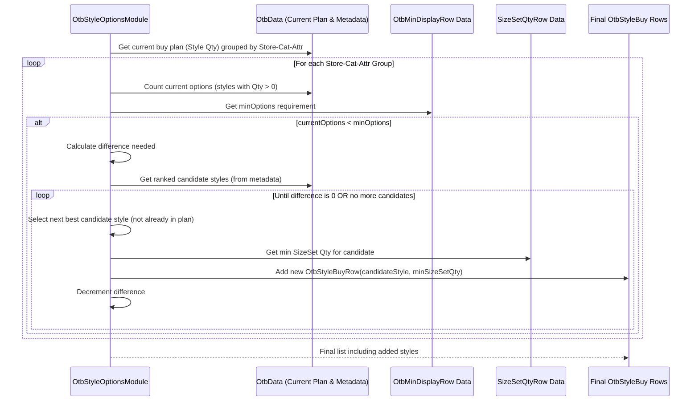
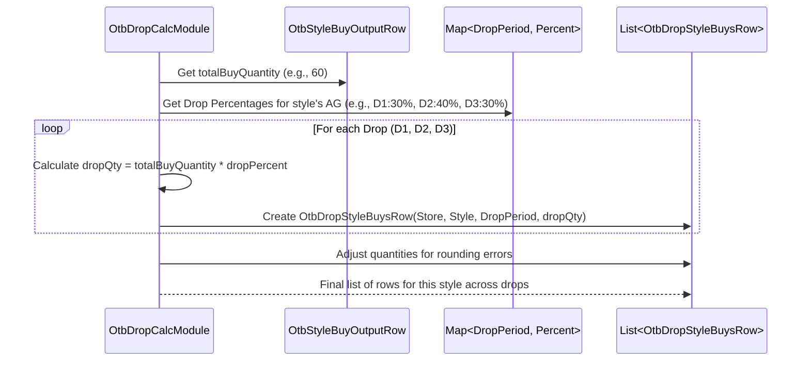
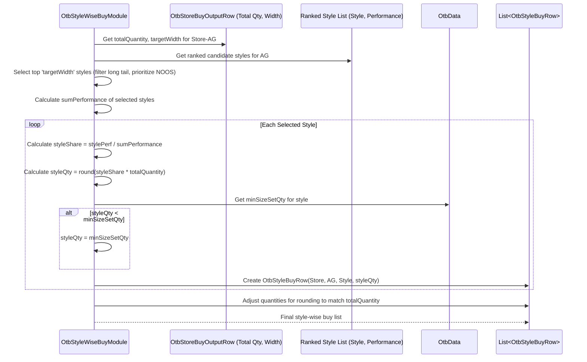

# Chapter 39: OTB Style Options Adjustment

Welcome back! In the [previous chapter](38_otb_minimum_order_quantity__moq__adjustment_.md), we learned how the **OTB Minimum Order Quantity (MOQ) Adjustment** module ensures our planned buy quantities respect supplier minimums. We now have a buy plan where the *total quantity* for certain groups meets MOQ rules.

But what about the *number of different styles* (options or width) we plan to buy within those groups? Does our current plan have enough variety to make a good display in the store? Or are we still planning to buy styles that the business wants to phase out?

## What Problem Does This Module Solve?

Imagine you're setting up a display table for cookies at a party. You followed the supplier rules (MOQ) and ended up planning to buy 100 cookies total, consisting of 50 chocolate chip and 50 oatmeal raisin (2 styles). However, the party host insists that every display table *must* show at least 3 different types of cookies to look appealing (a Minimum Display Requirement). Your plan for only 2 styles, even though it meets the total quantity and MOQ, doesn't satisfy this display rule. You need to adjust your plan to include at least one more cookie type, perhaps adding a few peanut butter cookies, even if they weren't initially planned.

Similarly, in retail, stores often have minimum requirements for how many different styles (options) should be displayed within a category or for a specific attribute (like a brand display). The buy plan calculated after STR and MOQ adjustments might fall short of these minimums.

Furthermore, the MOQ adjustments might have forced us to buy quantities of styles that the Optimum Depth or Width calculations suggested should be exited or have zero stock.

The **OTB Style Options Adjustment Module** (`OtbStyleOptionsModule`) tackles these issues. It acts like a final check and refinement step for the assortment's *width* within the buy plan. It ensures that:
1.  The number of styles planned for purchase meets the **minimum display requirements** for each relevant store/category/attribute combination.
2.  Buy quantities for styles marked for **exit** are correctly handled (usually set to zero).
3.  The final buy quantity for each style meets practical **minimums** (like covering the required size set).

If the initial plan doesn't meet display requirements, this module attempts to **add more styles** back into the buy plan (typically lower-ranked ones that were previously dropped or considered long tail) until the minimum is met, while respecting overall constraints.

## Core Concepts

1.  **Minimum Display Options (MDO):** A rule stating the minimum number of distinct styles (options) that must be presented within a certain context (e.g., Store-Category-Attribute). This information usually comes from `OtbMinDisplayRow` input.
2.  **Current Options:** The number of distinct styles included in the buy plan *after* STR and MOQ adjustments.
3.  **Adding Styles:** If `Current Options < MDO`, the module needs to find additional "candidate" styles to add. These candidates are often:
    *   Styles belonging to the same broader group (Category/Attribute) that were initially planned but dropped (e.g., due to low rank, long tail flag).
    *   Styles performing well in *similar* stores/channels, suggesting they might work here too.
    *   The selection often prioritizes styles with better historical performance (like higher revenue per day).
4.  **Minimum Buy Quantity:** When a style is added back to meet MDO, it needs a buy quantity. This is often set to a minimum practical level, frequently determined by the quantity needed to stock its essential size set (`SizeSetQtyRow`).
5.  **Quantity Redistribution:** Adding styles (and their minimum quantities) increases the total buy quantity. The module might need to slightly reduce quantities from other styles in the same group to balance this, or this adjustment might happen implicitly in later budget reconciliation steps. The provided code primarily focuses on adding styles with minimum quantities.
6.  **Exit Style Handling:** The module identifies styles that failed MOQ checks or belong to groups marked for exit and ensures their final buy quantity is zero, potentially redistributing their initially planned quantity to remaining styles.

## How It Works (The Process)

This module runs late in the `OtbGroupModule` sequence, after MOQ adjustments.

**Inputs:**
*   **MOQ-Adjusted Buy Plan:** The `OtbMoqAdjustedRow` data (quantity and initial width per Store-AG).
*   **Minimum Display Rules (`OtbMinDisplayRow`):** Defines minimum options per Store-Category-Attribute.
*   **Size Set Minimum Quantities (`SizeSetQtyRow`):** Defines the minimum practical buy quantity per style based on its size requirements.
*   **Style Performance Data:** Historical performance metrics (like revenue per day) for styles, often pre-calculated and ranked during OD or stored in `OtbData`. Needed to select candidate styles to add.
*   **Product & Store Data:** [AgRow](16_agrow_.md), [StyleRow](09_row_input_output_classes__.md), [StoreRow](09_row_input_output_classes__.md) from [Cache](05_cache_.md).
*   **Overrides:** Potentially `OdInputOverrideRow` to identify AGs forced to zero.

**Calculation Steps (Simplified):**
1.  **Initial Style Allocation (`getStyleBuys`):** Distribute the MOQ-adjusted AG quantity (`OtbMoqAdjustedRow.quantity`) across the styles initially planned within that AG (`OtbMoqAdjustedRow.width`). Styles are often chosen based on NOOS status or performance rank. Quantities are often distributed evenly or proportionally. This creates an initial `List<OtbStyleBuyOutputRow>`.
2.  **Identify and Handle Exit Styles (`getExitStyles`, `reAdjustExitQty`):**
    *   Determine which styles failed to meet minimum viability checks (like global MOQ across all stores).
    *   Zero out the buy quantity for these exit styles.
    *   Distribute the quantity from exited styles among the remaining styles in their respective Store-AG groups (often using round-robin or proportional logic).
3.  **Apply Size Set Minimums (`styleSizeSetCorrection`):** For each remaining style, ensure its calculated buy quantity (`moqAdjustedQty`) is at least the minimum required by its size set (`SizeSetQtyRow`). Increase the quantity if necessary. Store this as `sizeSetAdjustedQty`.
4.  **Minimum Display Options Adjustment (`minDisplayOptionsAdjustment`):**
    *   Group the current buy plan by the MDO level (Store-Category-Attribute).
    *   For each group, count the number of styles with `sizeSetAdjustedQty > 0`.
    *   Compare this count to the `minOptions` from `OtbMinDisplayRow`.
    *   If `count < minOptions`:
        *   Call helper functions (`increaseOptions`, `addStylesToIncreaseOptionsAtLevel`) to find candidate styles (not currently in the plan for this store, ranked by performance in similar locations).
        *   Add these candidate styles to the buy plan with their minimum `sizeSetAdjustedQty`. Repeat until `minOptions` is met or no more candidates are found.
5.  **Aggregate Final Store Buys (`computeFinalStoreBuys`):** Sum up the final style quantities and count the final number of options for each Store-AG group.
6.  **Persist Outputs (`persistOutputs`):** Save the final detailed buy plan per style (`OtbStyleBuyOutputRow`) and the aggregated summary per Store-AG (`OtbStoreBuyOutputRow`).

**Outputs:**
*   **`OtbStyleBuyOutputRow`:** The refined buy plan showing the final calculated quantity for each **Store-Style** combination, incorporating MOQ, size set, and MDO adjustments.
*   **`OtbStoreBuyOutputRow`:** The final aggregated buy plan showing the total **options** (final width) and total **quantity** for each **Store-AG**.

## Under the Hood: Finding and Adding Styles

The most complex logic often lies in deciding *which* styles to add back to meet the Minimum Display Options.

**1. Initial Style Allocation (`getStyleBuys` / `getStyles`):**
   This step translates the AG-level buy quantity into style-level quantities. It needs to select *which* styles to include up to the initial width.

   ```java
   // Simplified logic from OtbStyleOptionsModule.getStyles
   private List<String> getStyles(AgRow agRow, int options) {
       // Get available styles linked to this AG (e.g., from OW data)
       List<String> styleList = otbData.getAgStyles(agRow.id); // Style names/codes

       // Special handling for CORE/BESTSELLER (always keep?)
       if (StyleTheme.isCoreBestseller(agRow.theme)) {
           if (styleList.isEmpty()) styleList.add(OtbHelper.getNoosStyleName()); // Add placeholder if needed
           return styleList; // Return all available styles for Core/BS? (Logic varies)
       }

       // For FASHION, limit to the target 'options' count
       int additionalStyles = options - styleList.size();
       if (additionalStyles > 0) {
           // If not enough real styles, create dummy placeholders
           styleList.addAll(OtbHelper.createStyles(additionalStyles));
           return styleList;
       }
       // If too many styles, limit to the best 'options' number
       // Assumes styleList is already ranked by performance
       return styleList.stream().limit(options).collect(Collectors.toList());
   }
   ```
   **Explanation:** This helper selects the styles to receive an initial quantity allocation. For Core/Bestseller, it might keep all associated styles. For Fashion, it limits the list to the calculated `options` (width) from the previous `OtbMoqAdjustedRow`, potentially adding dummy placeholders if needed.

**2. Adding Styles for MDO (`increaseOptions` / `addStylesToIncreaseOptionsAtLevel`):**
   This is where candidates are found and added.

   ```java
   // Simplified logic from OtbStyleOptionsModule.addStylesToIncreaseOptionsAtLevel

   // Inputs: store, agsAvailable (AGs currently planned), stylesAvailable,
   //         difference (how many more styles needed), mdoMetaData (ranked candidate styles)
   //         ags (all AGs to consider at this level)

   List<OtbStyleBuyOutputRow> newlyAddedStyles = new ArrayList<>();

   // --- Phase 1: Add styles from AGs *not* currently in the store plan ---
   // Filter 'ags' to find those relevant at this level but not in 'agsAvailable'
   for (Integer ag : ags.stream().filter(o -> !agsAvailable.contains(o)).collect(Collectors.toList())) {
       if (difference <= 0) break;
       // Get ranked styles for this AG from mdoMetaData
       CatMdoMetaData.OtbMdoMetaData otbMdoMetaData = mdoMetaData.getAgData(ag);
       AgRow agRow = cache.getAgRow(ag);
       // Iterate through ranked styles within this candidate AG
       for (String style : otbMdoMetaData.otbStyleQtyMap.keySet()) {
           // If this style isn't already planned and we still need styles...
           if (!stylesAvailable.contains(style) && difference > 0) {
               // Add it with its minimum SizeSet quantity
               int minQty = otbData.getSizeSet(store, agRow.cat, agRow.subcat);
               newlyAddedStyles.add(new OtbStyleBuyOutputRow(store, ag, style).addQuantity(minQty));
               difference--;
               stylesAvailable.add(style); // Mark style as added
               // Record that this AG is now included
               // newAgsAdded.add(ag); // Logic to update agsAvailable
           }
       }
   }

   // --- Phase 2: Add styles from AGs *already* in the store plan ---
   // (If difference > 0 still)
   // Filter 'ags' to find those already in 'agsAvailable'
   for (Integer ag : ags.stream().filter(o -> agsAvailable.contains(o)).collect(Collectors.toList())) {
       // ... similar logic: iterate through ranked styles in the AG's metadata ...
       // ... if style isn't in 'stylesAvailable' and difference > 0, add it ...
   }

   return newlyAddedStyles;
   ```
   **Explanation:** This function attempts to add styles to meet the `difference` needed for MDO. It prioritizes adding styles from promising AGs that aren't currently represented in the store's plan (Phase 1). If more styles are still needed, it considers adding other promising styles from AGs that *are* already in the plan (Phase 2). Candidates are chosen based on pre-calculated rankings (`mdoMetaData`). Each added style gets assigned its minimum required quantity based on size sets.

**Sequence Diagram (Meeting MDO):**



## Conclusion

The **OTB Style Options Adjustment** (performed by `OtbStyleOptionsModule`) provides a critical final refinement to the buy plan, focusing on the *width* or number of styles.

*   It ensures the plan meets **Minimum Display Options (MDO)** requirements for stores/categories/attributes.
*   If the initial plan falls short, it strategically **adds back promising candidate styles** (often lower-ranked or long-tail items) with a minimum buy quantity based on size set needs.
*   It correctly handles styles marked for **exit**, zeroing out their buy quantities and redistributing the volume.
*   It performs a final check to ensure all styles in the plan meet **minimum size set quantities**.
*   The final output is a detailed buy plan at the **Store-Style** level (`OtbStyleBuyOutputRow`), ready for allocation across delivery drops.

This step ensures the final buy assortment is not only financially viable (considering STR and MOQ) but also meets presentation standards and strategic goals for variety and exits.

Now that we have the final quantities decided for each style, how do we schedule their delivery if the buying period has multiple "drops"?

[Next Chapter: OTB Drop Calculation](40_otb_drop_calculation_.md)
---
# Chapter 40: OTB Drop Calculation

Welcome back! In the [previous chapter](39_otb_style_options_adjustment_.md), we saw how the **OTB Style Options Adjustment** module refines the buy plan, ensuring we have the right number of styles to meet display requirements and handling exit styles. We now have a final quantity to buy for each specific style in each store (`OtbStyleBuyOutputRow`).

But sometimes, we don't receive all the inventory we buy for a season at the very beginning. Especially in fashion, new products might arrive in several batches or **"drops"** throughout the season (e.g., Drop 1 in February, Drop 2 in March, Drop 3 in April).

## What Problem Does This Module Solve?

Imagine you've calculated that you need to buy 60 units of a specific trendy jacket (Style XYZ) for Store 101 for the entire Spring season. However, the buying plan specifies that this jacket will arrive in three drops: 30% in Drop 1 (Feb), 40% in Drop 2 (Mar), and 30% in Drop 3 (Apr).

How do you translate the total buy quantity (60 units) into specific quantities for each drop? You need to calculate:
*   Drop 1 Quantity = 60 * 30% = 18 units
*   Drop 2 Quantity = 60 * 40% = 24 units
*   Drop 3 Quantity = 60 * 30% = 18 units

Doing this allocation for every single style across all stores and potentially different drop schedules can be tedious and error-prone if done manually.

The **OTB Drop Calculation Module** (`OtbDropCalcModule`) solves this. It takes the *total* final buy quantity calculated for each style and **allocates or splits** that quantity across the different defined delivery drops based on pre-set percentages or rules.

## Core Idea: Splitting the Total Buy Across Deliveries

Think of it like dividing a large pizza order among several delivery drivers arriving at different times. You know the total number of pizzas needed (total buy quantity), and you know the schedule (Drop 1, Drop 2, Drop 3) and perhaps what percentage of the total order each driver should bring. This module does the calculation to tell each driver exactly how many pizzas to deliver.

The key components are:

1.  **Total Buy Quantity:** The final quantity decided for each Store-Style combination from the previous OTB steps (`OtbStyleBuyOutputRow.minDisplayAdjustedQty`).
2.  **Drop Definitions:** Information defining the different delivery periods (e.g., Drop 1 = Feb 1 - Feb 28, Drop 2 = Mar 1 - Mar 31) and potentially the percentage of the total buy that should arrive in each drop. This often comes from configuration or specific input files like `OtbDropInputRow`.
3.  **Allocation Logic:** A simple calculation to split the total quantity based on the drop percentages.

## How It Works (The Process)

This module runs late in the `OtbGroupModule` sequence, after the final style-level quantities have been determined.

**Inputs:**
*   **Final Style Buy Quantities:** The `OtbStyleBuyOutputRow` list containing the total quantity to buy for each Store-Style.
*   **Drop Information:** Data defining the different drop periods and potentially the allocation percentages per drop (e.g., from `OtbDropInputRow` or derived from period types in [Common Data](06_common_data_.md)). The code often uses period types like `DROP1`, `DROP2`, `EOSS` to identify drops. It might also use `OtbDropPercentRow` to get specific percentages.
*   Product/Store/AG information ([Cache](05_cache_.md)).

**Calculation Steps (Simplified):**
1.  **Determine Drop Percentages:** Figure out the percentage of the total buy quantity that should be allocated to each defined drop period (Drop 1, Drop 2, etc.). This might be read directly from configuration or calculated based on the duration or planned sales of the drop periods relative to the total buy period.
2.  **Allocate Quantities:** For each `OtbStyleBuyOutputRow`:
    a.  Get the total buy quantity (`finalQty = row.minDisplayAdjustedQty`).
    b.  For each drop period (Drop 1, Drop 2,...):
        i.  Get the allocation percentage for that drop (`dropPercent`).
        ii. Calculate the quantity for that drop: `dropQty = finalQty * dropPercent`.
        iii. Store this `dropQty` associated with the Store, Style, and the specific Drop Period ID. Handle rounding carefully to ensure the sum across drops equals the total quantity.
3.  **Store Results:** Save the calculated quantities per drop.

**Outputs:**
*   **`OtbDropOutputRow`:** Aggregated results showing total options and quantity allocated to each Store-AG combination *for each specific drop period*.
*   **`OtbDropStyleBuysRow`:** The most detailed output, showing the calculated buy quantity for each specific **Store-Style-DropPeriod** combination. This is the final input for generating purchase orders.
    ```java
    // File: src/main/java/com/increff/irisx/row/output/otb/OtbDropStyleBuysRow.java
    package com.increff.irisx.row.output.otb;

    // Final buy plan at the most detailed level: Store, Style, and Drop Period
    public class OtbDropStyleBuysRow {
        public int store;
        public String styleName;
        public int ag;
        public int period; // <<< The specific Drop Period ID
        public double quantity; // <<< Quantity allocated to this drop

        // Constructor...
    }
    ```

## Under the Hood: Percentage Allocation

The core logic involves fetching the drop allocation percentages and applying them to the total style buy quantity.

**1. Determining Drop Percentages (`calculateDropPercMap`):**
   The module first needs to know what percentage goes to each drop. This might involve analyzing the duration or planned sales associated with periods tagged as Drop 1, Drop 2, etc.

   ```java
   // Simplified logic from OtbDropCalcModule.java
   private Map<Key, Double> dropPercentMap; // Key: Store-AG, Value: Map<DropPeriod, Percent>

   private void calculateDropPercMap() {
       dropPercentMap = new HashMap<>();
       // Get total planned sales (OTB Qty) across all buy periods for each Store-AG
       Map<Key, Double> totalOtbQtyMap = /* ... sum OwOutputRow.otbQty across all relevant periods ... */;

       // Get planned sales for each specific DROP period for each Store-AG
       Map<Key, Map<Integer, Double>> dropPeriodOtbQtyMap = /* ... sum OwOutputRow.otbQty grouped by Store-AG AND Drop Period ID ... */;

       // Calculate percentage for each drop
       dropPeriodOtbQtyMap.forEach((storeAgKey, periodQtyMap) -> {
           double totalQty = totalOtbQtyMap.get(storeAgKey);
           Map<Integer, Double> periodPercMap = new HashMap<>();
           periodQtyMap.forEach((periodId, periodQty) -> {
               periodPercMap.put(periodId, MathUtil.divide(periodQty * 100.0, totalQty));
           });
           dropPercentMap.put(storeAgKey, periodPercMap);
       });
       // Alternative: Read percentages directly from OtbDropPercentRow input
   }
   ```
   **Explanation:** This conceptual logic first calculates the total planned quantity for a Store-AG across all buying periods. Then, for each specific drop period, it calculates what percentage of the total quantity was planned for that drop. These percentages are stored, ready to be applied to the final buy quantity. (The actual implementation might read percentages directly from configuration instead of calculating them from planned sales).

**2. Allocating Style Quantity (`computeDropQty`):**
   This step applies the calculated percentages to the final buy quantity for each style.

   ```java
   // Simplified logic from OtbDropCalcModule.java
   private List<OtbDropStyleBuysRow> computeDropQty() {
       List<OtbDropStyleBuysRow> dropStyleBuys = new ArrayList<>();
       // Get the final style buy quantities calculated in previous step
       List<OtbStyleBuyOutputRow> finalStyleBuys = otbData.getOtbStyleBuyRows();

       for (OtbStyleBuyOutputRow styleBuy : finalStyleBuys) {
           double totalQuantity = styleBuy.minDisplayAdjustedQty; // Final qty for this style
           if (totalQuantity <= 0) continue; // Skip if nothing to buy

           // Get the drop percentage map for this style's Store-AG
           Key storeAgKey = new Key(styleBuy.store, styleBuy.ag);
           Map<Integer, Double> periodPercMap = dropPercentMap.get(storeAgKey);
           if (periodPercMap == null || periodPercMap.isEmpty()) {
               // Handle cases with no drops defined - allocate all to first period?
               // Or log error... logic depends on requirements.
               // Assume allocation to a single period if map is empty
               // OtbDropStyleBuysRow row = new OtbDropStyleBuysRow(...);
               // row.quantity = totalQuantity; dropStyleBuys.add(row);
               continue;
           }

           // Distribute quantity across drops, handling rounding
           double allocatedQtySum = 0;
           List<OtbDropStyleBuysRow> rowsForThisStyle = new ArrayList<>();
           for (Map.Entry<Integer, Double> entry : periodPercMap.entrySet()) {
               int dropPeriodId = entry.getKey();
               double dropPercent = entry.getValue();
               // Calculate quantity for this drop
               double dropQty = MathUtil.round((totalQuantity * dropPercent) / 100.0, 0, Optional.empty());
               allocatedQtySum += dropQty;
               // Create output row
               OtbDropStyleBuysRow row = new OtbDropStyleBuysRow(styleBuy.store, styleBuy.styleName, styleBuy.ag, dropPeriodId);
               row.quantity = dropQty;
               rowsForThisStyle.add(row);
           }

           // Adjust rounding differences (e.g., add/subtract difference to first/last drop)
           OtbHelper.adjustRounding(rowsForThisStyle, totalQuantity, allocatedQtySum);

           dropStyleBuys.addAll(rowsForThisStyle);
       }
       return dropStyleBuys;
   }
   ```
   **Explanation:** This method iterates through the final style buy quantities. For each style, it retrieves the drop allocation percentages (`periodPercMap`). It then loops through the drops, calculates the `dropQty` based on the percentage, creates an `OtbDropStyleBuysRow` for that style/drop, and adds it to a temporary list. A helper (`OtbHelper.adjustRounding`) ensures the sum of quantities across drops exactly matches the total quantity needed for the style, adjusting for any rounding errors.

**Sequence Diagram (Allocating One Style's Buy):**



## Conclusion

The **OTB Drop Calculation**, performed by `OtbDropCalcModule`, is the final step in translating the total buy requirement into a time-phased delivery plan.

*   It takes the **final buy quantity** determined for each Store-Style combination.
*   It **allocates** this total quantity across different **delivery drops** (periods) based on predefined percentages or rules.
*   The key output is the **`OtbDropStyleBuysRow`**, which specifies exactly how many units of each style should arrive in each drop period for each store.
*   This provides the necessary detail for creating purchase orders with specific delivery schedules.

With the drop quantities calculated, the main OTB process is complete, and we have a detailed plan ready for the buying team.

The OTB calculation determined *what* and *how much* to buy. But sometimes, we need to think about *which specific styles* to include, especially when generating the final buy list from the AG-level plan.

[Next Chapter: OTB Style Wise Buy Module](41_otb_style_wise_buy_module_.md)
---
# Chapter 41: OTB Style Wise Buy Module

Welcome back! In the [previous chapter](40_otb_drop_calculation_.md), we saw how the **OTB Drop Calculation** module splits the final total buy quantity for each style across different delivery periods or "drops". We now know exactly how many units of "Style ABC" should arrive in "Store 101" during "Drop 1", "Drop 2", etc.

However, much of our planning so far (OD, OW, STR, MOQ, MDO) has operated primarily at the **Attribute Group (AG)** level. We calculated the total quantity needed for "Men's Premium V-Neck T-shirts from BrandX" (AG 500) in Store 101, adjusted it for MOQ, maybe added some styles for MDO, and determined the total final quantity for AG 500.

But when placing an order with a supplier, you don't usually order "AG 500". You order specific *styles*: Style 123, Style 456, Style 789, all of which belong to AG 500. How do we translate the final buy quantity calculated for the *group* (AG 500) into specific buy quantities for the *individual styles* within that group?

## What Problem Does This Module Solve?

Imagine you've finalized the plan for AG 500 (Premium V-Necks) in Store 101:
*   Final Width (Options): 3 styles
*   Final Total Quantity: 150 units

Now, you need to decide which 3 specific styles from AG 500 to actually buy, and how many units of *each* of those 3 styles to order, ensuring the total adds up to 150.

Possible styles belonging to AG 500 might include:
*   Style 123 (Highest performer in past)
*   Style 456 (Good performer)
*   Style 789 (Okay performer)
*   Style 999 (Low performer / Long Tail)

How do you choose the best 3 styles and divide the 150 units among them? Should you:
*   Buy 50 units of each (123, 456, 789)?
*   Buy more of the best performer (e.g., 70 of 123, 50 of 456, 30 of 789)?
*   Ignore Style 999 because it's long tail?

The **OTB Style Wise Buy Module** (`OtbStyleWiseBuyModule`) solves this problem. It takes the final planned total quantity and width (number of options) for each Store-AG combination and **allocates that quantity across specific, selected styles** belonging to that AG. It essentially translates the group-level buy plan into a style-level buy plan.

## Core Idea: Selecting Styles and Distributing Quantity

This module acts like a portfolio manager. It knows the total investment amount (total AG buy quantity) and the number of stocks (styles/width) it's allowed to pick for a specific category (the AG). It then needs to choose the best stocks (styles) and decide how much to invest (allocate quantity) in each.

The process generally involves:

1.  **Identify Candidate Styles:** For a given Store-AG combination, identify all the potential styles that belong to it and could be purchased. This might involve looking at historical sales, performance rankings (like revenue per day calculated during OD), or NOOS status (Core/Bestseller).
2.  **Select Target Styles:** Choose the specific styles to include in the buy, up to the planned `width` (number of options) determined earlier. This selection is often based on:
    *   **Performance:** Prioritizing the highest-ranking styles (e.g., highest revenue per day).
    *   **NOOS Status:** Ensuring Core and Bestseller styles are included if possible.
    *   **Exclusions:** Ignoring styles flagged as "long tail" or those belonging to AGs marked for exit.
3.  **Allocate Quantity:** Distribute the total buy quantity for the AG across the selected styles. This distribution is often **proportional** based on the same performance metric used for selection (e.g., a style contributing 60% of the group's historical revenue per day gets 60% of the total buy quantity). Rounding is applied to get whole units.
4.  **Minimum Check:** Ensure the allocated quantity for each selected style meets minimum thresholds (like the size set quantity). Adjust if necessary (though this might have been handled partly in the Style Options module).

The result is a list specifying exactly how many units of each chosen *style* should be purchased for that store.

## How It Works (The Process)

This module typically runs after the OTB calculations are finalized at the AG level, often using the outputs from `OtbStyleOptionsModule` or `OtbStoreBuyOutputRow`.

**Inputs:**
*   **Final AG Buy Plan:** The total quantity (`quantity`) and number of styles (`width`/`options`) to buy for each Store-AG (e.g., from `OtbStoreBuyOutputRow`).
*   **Style Performance Data:** Ranked list of styles within each AG, usually based on revenue per day or similar metrics calculated during OD (`OdStyleDaysRow`, often accessed via `OtbData`).
*   **NOOS Status:** Core/Bestseller/Fashion tags ([`NoosRow`](21_noos_identification__noosgroupmodule__.md)).
*   **Long Tail Flags:** Information on which styles were identified as long tail.
*   Size Set Minimums ([`SizeSetQtyRow`](09_row_input_output_classes__.md)).
*   AG Definitions ([`AgRow`](16_agrow_.md)) and Style Info ([`StyleRow`](09_row_input_output_classes__.md)).

**Calculation Steps (Conceptual):**
1.  **Load Data:** Get the final Store-AG buy plan (total quantity, width) and the ranked list of candidate styles for each AG.
2.  **Iterate Through Store-AGs:** For each Store-AG combination in the buy plan:
    a.  Get the target `totalQuantity` and target `width`.
    b.  Get the list of candidate styles for this AG, ranked by performance.
    c.  **Select Styles:** Select the top `width` styles from the ranked list, potentially excluding long-tail styles or ensuring Core/Bestseller styles are included.
    d.  **Calculate Performance Sum:** Calculate the sum of the performance metric (e.g., total revenue per day) for only the *selected* styles.
    e.  **Allocate Quantity:** For each selected style:
        i.  Calculate its proportional share: `Style Share = Style Performance / Sum of Selected Styles' Performance`.
        ii. Calculate its quantity: `Style Quantity = round(Style Share * totalQuantity)`.
        iii. Apply minimum quantity check (e.g., ensure >= size set minimum). Adjust if needed.
    f.  **Store Results:** Add the calculated buy quantity for each selected Store-Style to an output list (`OtbStyleBuyRow`). Ensure the sum of style quantities matches the `totalQuantity`, adjusting for rounding.

**Outputs:**
*   **`OtbStyleBuyRow`:** This is the primary output, detailing the final buy quantity allocated to each specific **Store-Style** combination. *(Note: This was also an intermediate output name in Chapter 39, but here it represents the final quantity allocation to selected styles)*. This output directly informs purchase order generation.

```java
// Structure likely similar to intermediate OtbStyleBuyOutputRow,
// but representing the final allocation based on selected styles.
// Might be the same class used, just populated differently.
public class OtbStyleBuyRow { // Assuming this name for clarity
    public int store;
    public int ag;
    public int style; // The selected Style ID
    public String styleName; // Often included for readability
    public int quantity; // <<< The final allocated quantity for this style
    // Possibly other fields like performance rank, NOOS theme etc.
}
```

## Under the Hood: Ranking and Proportional Allocation

The key steps are selecting the best styles and dividing the quantity based on their relative performance.

**1. Style Selection (Conceptual):**
   Imagine for AG 500, the ranked styles are:
   1. Style 123 (Rev/Day: 100) - Core
   2. Style 456 (Rev/Day: 80) - Bestseller
   3. Style 789 (Rev/Day: 30) - Fashion
   4. Style 999 (Rev/Day: 5) - Fashion / Long Tail

   If the target `width` is 3:
   *   Select Style 123 (Rank 1)
   *   Select Style 456 (Rank 2)
   *   Select Style 789 (Rank 3)
   *   Exclude Style 999 (Rank 4, potentially flagged as long tail)

**2. Quantity Allocation (Conceptual):**
   *   Selected styles: 123, 456, 789.
   *   Total performance of selected styles = 100 + 80 + 30 = 210.
   *   Total AG buy quantity = 150 units.
   *   **Style 123:** Share = 100 / 210 ≈ 47.6%. Quantity = round(0.476 * 150) = 71 units.
   *   **Style 456:** Share = 80 / 210 ≈ 38.1%. Quantity = round(0.381 * 150) = 57 units.
   *   **Style 789:** Share = 30 / 210 ≈ 14.3%. Quantity = round(0.143 * 150) = 21 units.
   *   **Check Sum:** 71 + 57 + 21 = 149. Need to adjust rounding (e.g., add 1 unit to the highest share style) -> 72 + 57 + 21 = 150.
   *   **Check Minimums:** Ensure 72, 57, 21 are all >= minimum size set quantity.

**Sequence Diagram (Allocating AG Quantity to Styles):**


**Code Dive (`OtbStyleWiseBuyModule.java`):**

*   **Main Logic (`runInternal`, `computeStyleBuys`):**
    ```java
    // Simplified from OtbStyleWiseBuyModule.java
    @Component
    public class OtbStyleWiseBuyModule extends AbstractModule {
        @Autowired private OtbData otbData;
        @Autowired private Cache cache;
        // ... other dependencies

        @Override
        protected void runInternal(Properties properties) {
            // ... Initialize ...
            List<OtbStyleBuyRow> styleBuys = computeStyleBuys();
            persistOutputAndClear(OtbStyleBuyRow.class, styleBuys);
        }

        private List<OtbStyleBuyRow> computeStyleBuys() {
            List<OtbStyleBuyRow> otbStyleBuyRows = new ArrayList<>();
            // Loop through the final Store-AG level plan
            otbData.getStoreBuyOutputRows().forEach(storeAgBuy -> {
                int store = storeAgBuy.store;
                int ag = storeAgBuy.ag;
                int targetWidth = storeAgBuy.options; // Target number of styles
                double totalQuantity = storeAgBuy.quantity; // Total units to buy for AG

                if (targetWidth <= 0 || totalQuantity <= 0) return; // Skip if nothing to buy

                // 1. Get ranked candidate styles for this AG (e.g., from OdStyleDaysRow sorted)
                List<OdStyleDaysRow> rankedStyles = otbData.getRankedStylesForAg(ag); // Simplified getter

                // 2. Select the top 'targetWidth' styles (add filtering logic here)
                List<OdStyleDaysRow> selectedStyles = rankedStyles.stream()
                                                        // .filter(s -> !isLongTail(s.style)) // Example filter
                                                        .limit(targetWidth)
                                                        .collect(Collectors.toList());

                // 3. Calculate performance sum for selected styles
                double selectedStylesPerfSum = selectedStyles.stream()
                                                   .mapToDouble(s -> s.revPerLiveDay) // Use rev/day as perf metric
                                                   .sum();

                // 4. Allocate quantity proportionally
                List<OtbStyleBuyRow> rowsForAg = new ArrayList<>();
                selectedStyles.forEach(styleInfo -> {
                    double stylePerf = styleInfo.revPerLiveDay;
                    // Calculate proportional share
                    double styleShare = MathUtil.divide(stylePerf, selectedStylesPerfSum);
                    // Calculate raw quantity
                    double styleQtyRaw = styleShare * totalQuantity;
                    // Round to integer
                    int styleQty = (int) MathUtil.round(styleQtyRaw, 0, Optional.empty());

                    // 5. Apply Min Qty Check (simplified)
                    AgRow agRow = cache.getAgRow(ag);
                    int minQty = otbData.getSizeSet(store, agRow.cat, agRow.subcat);
                    styleQty = Math.max(styleQty, minQty);

                    OtbStyleBuyRow buyRow = new OtbStyleBuyRow(store, ag, styleInfo.style);
                    buyRow.quantity = styleQty;
                    rowsForAg.add(buyRow);
                });

                // 6. Adjust for rounding to match totalQuantity
                OtbHelper.adjustRoundingForStyles(rowsForAg, totalQuantity); // Assumes helper exists

                otbStyleBuyRows.addAll(rowsForAg);
            });
            return otbStyleBuyRows;
        }
        // ... other helpers, persistOutputAndClear, cleanUp ...
    }
    ```
    **Explanation:** The `computeStyleBuys` method iterates through the final Store-AG plan (`OtbStoreBuyOutputRow`). For each, it gets the ranked list of styles belonging to that AG. It selects the top styles up to the target `width`. It calculates the performance sum of just these selected styles. Then, it loops through the selected styles, calculates their proportional quantity based on performance share, rounds it, applies a minimum quantity check, and creates the `OtbStyleBuyRow`. Finally, rounding adjustments are made, and the list of style-wise buy rows is returned.

## Conclusion

The **OTB Style Wise Buy Module** translates the group-level (Store-AG) buy plan into an actionable, style-level plan.

*   It **selects** the specific styles to purchase within each Store-AG group, based on the planned **width** and style **performance rankings**, potentially excluding long-tail items or prioritizing NOOS styles.
*   It **allocates** the total buy quantity for the AG across these selected styles, typically **proportionally** based on their relative performance.
*   It ensures the allocated quantities meet practical **minimums**.
*   The key output is the **`OtbStyleBuyRow`**, detailing the final buy quantity for each individual **Store-Style** combination, ready for purchase order generation or further refinement (like breaking down into sizes).

This module provides the crucial link between the aggregated AG-level plan and the specific styles that need to be ordered from suppliers.

Now that we know *which styles* and *how many units* of each style to buy, the very last step is often breaking this down into the individual *sizes*.

[Next Chapter: Style Wise to Size Wise Buy Module](42_style_wise_to_size_wise_buy_module_.md)

---

Generated by [AI Codebase Knowledge Builder](https://github.com/The-Pocket/Tutorial-Codebase-Knowledge)