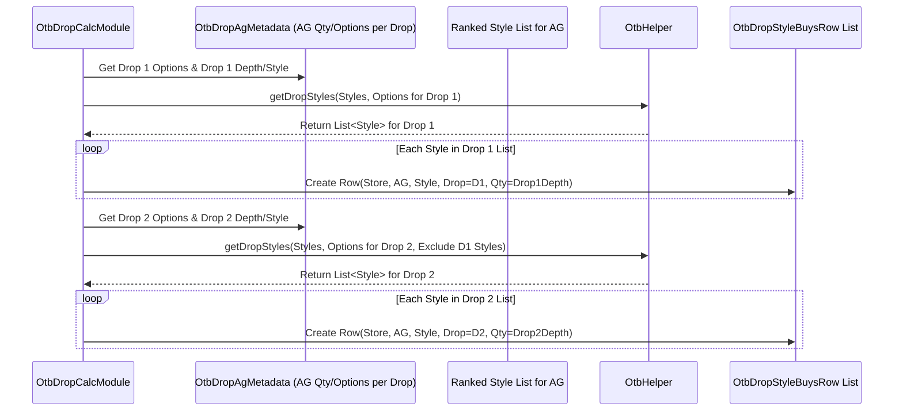

# Chapter 40: OTB Drop Calculation

Welcome back! In the [previous chapter](39_otb_style_options_adjustment_.md), we saw how the **OTB Style Options Adjustment** module refines the buy plan, ensuring we have the right number of styles to meet display requirements and handling exit styles. We now have a final quantity to buy for each specific style in each store (`OtbStyleBuyOutputRow`).

But when you place orders with suppliers, you often don't receive everything on day one of the season. Especially in fashion, new inventory often arrives in stages or batches throughout the season. These batches are commonly called **"drops"**. For example, you might have a "Drop 1" delivery in February, "Drop 2" in March, and maybe an "EOSS" (End of Season Sale) drop later.

## What Problem Does This Module Solve?

Imagine you finalized your buy plan and decided you need 100 units total of a new jacket (Style XYZ) for Store 101 for the entire Spring season. Now, the supplier tells you they will deliver this in two drops: 60% in Drop 1 (early Spring) and 40% in Drop 2 (mid-Spring).

Your total buy plan (100 units) needs to be broken down into a delivery schedule. You need to calculate:
*   Drop 1 Quantity = 100 units * 60% = 60 units
*   Drop 2 Quantity = 100 units * 40% = 40 units

This breakdown is essential for creating purchase orders with the correct delivery dates and quantities. Doing this calculation manually for every style, every store, and potentially different drop schedules for different product types would be very complex and time-consuming.

The **OTB Drop Calculation Module** (`OtbDropCalcModule`) solves this problem. It takes the *final total buy quantity* decided for each style and **allocates or splits** that quantity across the different defined delivery drops based on configured rules or percentages. It essentially creates the time-phased delivery plan for your purchases.

## Core Idea: Splitting the Total Buy Across Deliveries

Think of this module like planning a series of shipments. You know the total amount of goods you need to send to a destination (total style buy quantity). You also know the schedule of trucks leaving the warehouse (Drop 1, Drop 2, etc.) and maybe what percentage of the total goods should go on each truck. This module does the math to figure out exactly how many items go onto each truck (drop).

The key elements are:

1.  **Total Style Buy Quantity:** The final number of units decided for each Store-Style combination, coming from the previous OTB steps (specifically `OtbStyleBuyOutputRow.minDisplayAdjustedQty`).
2.  **Drop Periods & Percentages:** Information defining the different delivery periods (e.g., periods tagged as `DROP1`, `DROP2` in [Common Data](06_common_data_.md)) and, crucially, the *percentage* of the total buy that should be allocated to each drop. These percentages might come from configuration (`OtbDropPercentRow`) or be calculated based on the planned sales or duration of each drop period.
3.  **Allocation Logic:** The core calculation involves multiplying the total style buy quantity by the percentage allocated to each specific drop. Special care is needed for rounding to ensure the quantities across all drops add up exactly to the total buy quantity.
4.  **Special Handling (NOOS/Fashion):** Sometimes, the allocation isn't purely based on percentages. For example, important NOOS (Core/Bestseller) items might be prioritized to arrive earlier (more in Drop 1), while Fashion items might follow the standard percentage split more closely. Minimum display quantities (`PlanoQty`) for the *start* of the season might also influence how much needs to arrive in the first drop. The module incorporates logic to handle these nuances.

## How It Works (The Process)

This module runs as one of the final steps in the `OtbGroupModule` sequence, after the total buy quantity per style is finalized.

**Inputs:**
*   **Final Style Buy Quantities:** `OtbStyleBuyOutputRow` data from `OtbData`.
*   **Drop Allocation Percentages/Rules:** Derived from configuration (e.g., `OtbDropPercentRow`) or calculated based on period definitions and planned sales (`OwOutputRow`).
*   **NOOS Status:** ([StyleTheme](07_enumerations__enums__.md)) for handling Core/Bestseller items differently.
*   **Minimum Display/Plano Quantities:** potentially `OtbInSeasonPlanoQtyRow` to influence Drop 1 quantities.
*   **Minimum Size Set Quantities:** ([`SizeSetQtyRow`](09_row_input_output_classes__.md)) to ensure drop quantities are practical.
*   Product/Store/AG information ([Cache](05_cache_.md)).

**Calculation Steps (Simplified):**
1.  **Initialize:** Set up data structures to hold results.
2.  **Determine Drop 1 Needs (Options & Qty):**
    *   Calculate how many *options* (styles) need to arrive in Drop 1, potentially prioritizing NOOS styles and ensuring minimum display option counts are met early. (`calcDrop1Options`).
    *   Calculate the initial *quantity* needed for Drop 1 for each style, considering minimum size set needs, prioritizing NOOS, and distributing any remaining "display quantity" proportionally across Fashion items. (`calcDrop1Qty`).
3.  **Calculate Drop 2 Needs (Options & Qty):**
    *   Calculate Drop 2 options as the remaining options needed from the total buy plan (`Total Options - Drop 1 Options`).
    *   Calculate Drop 2 quantity as the remaining quantity needed (`Total Quantity - Drop 1 Quantity`), ensuring it meets minimum size set needs for the Drop 2 options. (`calcDrop2OptionsAndQty`).
4.  **Final Adjustments & Depth Calculation:**
    *   Calculate the implied "depth per style" for each drop (`Drop Qty / Drop Options`).
    *   Potentially revise the drop quantities based on this depth to ensure smoother quantities per style. (`calculateFinaBuysAndQty`).
5.  **Allocate to Specific Styles (`calculateStyleLevelBuys`):**
    *   Distribute the calculated Drop 1 and Drop 2 quantities for an AG across the specific styles selected for that AG in each drop (often based on performance ranking). This generates the final `OtbDropStyleBuysRow`.
6.  **Tag Styles (`getStyleTagging`):** Assign tags (like NOOS, INSEASON, MICROBUY) to styles based on their buy quantity and theme for reporting.
7.  **Persist Outputs (`writeOutput`):** Save the detailed `OtbDropStyleBuysRow` and aggregated `OtbDropOutputRow` results.

**Outputs:**
*   **`OtbDropStyleBuysRow`:** The most crucial output. It specifies the buy quantity for each **Store-Style-DropPeriod** combination. This is what drives purchase order creation with delivery schedules.
    ```java
    // File: src/main/java/com/increff/irisx/row/output/otb/OtbDropStyleBuysRow.java
    package com.increff.irisx.row.output.otb;

    import com.increff.irisx.constants.otb.StyleTag;
    import com.increff.irisx.constants.otb.DropLevel; // e.g., D1, D2

    // Final buy plan at the most detailed level: Store, Style, and Drop Period
    public class OtbDropStyleBuysRow {
        public int store;
        public String style; // Style Code or Name
        public int ag;
        public DropLevel drop; // <<< Identifies the Drop (e.g., D1)
        public int quantity; // <<< Quantity allocated to this drop for this style
        public StyleTag styleTag; // Classification (NOOS, INSEASON, MICROBUY)
        public String styleDepthRange; // Depth classification
        // Constructor...
    }
    ```
*   **`OtbDropOutputRow`:** An aggregated view showing total options and quantities per Store-AG per Drop, useful for summaries.

## Under the Hood: Allocating Based on Rules and Percentages

While the ideal scenario is a simple percentage split, the actual logic often involves more nuanced steps, especially for Drop 1, to ensure essential items and display minimums are covered early.

**1. Calculating Drop 1 Initial Quantities (Conceptual):**
   The module might first determine how much quantity *must* arrive in Drop 1.
   *   **NOOS Items:** Core/Bestseller styles might have a rule like "must receive at least `minSizeSetMultiplier * minDepth` quantity in Drop 1".
   *   **Minimum Display:** Check the total quantity needed for *all* styles required in Drop 1 (based on `finalDrop1Options`) just to meet their minimum size set depths. This forms a base quantity.
   *   **Fashion Distribution:** Any remaining "in-season plano quantity" (budgeted display stock for the start of the season) might be distributed proportionally across Fashion styles based on their expected contribution.
   *   The `initialPlanoQty` and `finalDrop1Qty` are calculated based on these rules.

**2. Calculating Drop 2:**
   This is often simpler:
   *   `Drop 2 Qty = Total Buy Qty - Final Drop 1 Qty`
   *   Ensure this quantity is at least `Drop 2 Options * Minimum Depth`.

**3. Allocating to Styles (`calculateStyleLevelBuys` / `getOtbDropStyleRow`):**
   Once the total quantity for *each drop* (Drop 1 Qty, Drop 2 Qty) is known for an AG, it needs to be distributed across the styles selected for that drop.

   ```java
   // Simplified logic from OtbDropCalcModule.calculateStyleLevelBuys

   // For each AG...
   agMetadataMap.forEach((agId, agMetadataList) -> {
       agMetadataList.forEach(agMetadata -> { // For each Store-AG instance
           Set<String> stylesAdded = new HashSet<>();
           AgRow agRow = cache.getAgRow(agId);

           // --- Allocate Drop 1 Quantity ---
           // Select styles for Drop 1 (up to finalDrop1Options, ranked)
           List<String> drop1Styles = OtbHelper.getDropStyles(
                                       otbData.getAgStyles(agId), stylesAdded, agRow,
                                       agMetadata.finalDrop1Options);
           // Get the calculated depth per style for Drop 1
           int drop1Depth = agMetadata.drop1DepthPerStyle;
           // Create output rows for Drop 1
           drop1Styles.forEach(style -> otbData.addToDropStyleBuysRows(
               getOtbDropStyleRow(style, DropLevel.D1, agMetadata, drop1Depth)
           ));

           // --- Allocate Drop 2 Quantity ---
           // Select styles for Drop 2 (up to drop2Options, ranked, excluding D1 styles)
           List<String> drop2Styles = OtbHelper.getDropStyles(
                                       otbData.getAgStyles(agId), stylesAdded, agRow,
                                       agMetadata.drop2Options);
           // Get the calculated depth per style for Drop 2
           int drop2Depth = agMetadata.drop2DepthPerStyle;
           // Create output rows for Drop 2
           drop2Styles.forEach(style -> otbData.addToDropStyleBuysRows(
               getOtbDropStyleRow(style, DropLevel.D2, agMetadata, drop2Depth)
           ));
       });
   });

   // Helper to create the final row
   private OtbDropStyleBuysRow getOtbDropStyleRow(String styleName, DropLevel dropLevel,
                                                 OtbDropAgMetadata agMetadata, int quantity) {
       OtbDropStyleBuysRow row = new OtbDropStyleBuysRow();
       row.store = agMetadata.store;
       row.ag = agMetadata.ag;
       row.style = styleName;
       row.drop = dropLevel;
       row.quantity = quantity; // Use the calculated depth per style for this drop
       return row;
   }
   ```
   **Explanation:** This logic iterates through each Store-AG. It uses a helper (`OtbHelper.getDropStyles`, which likely selects top-ranked styles) to determine *which* specific styles should be included in Drop 1 (up to `finalDrop1Options`). For each selected style, it creates an `OtbDropStyleBuysRow` assigning the calculated *depth per style* for Drop 1 (`agMetadata.drop1DepthPerStyle`) as the quantity. It repeats this process for Drop 2, selecting from the remaining styles and assigning the Drop 2 depth per style. This ensures the quantity is distributed across the chosen styles for each drop.

**Sequence Diagram (Allocating AG Drop Qty to Styles):**


## Conclusion

The **OTB Drop Calculation** module (`OtbDropCalcModule`) translates the final total buy quantities into a time-phased delivery schedule.

*   It **allocates** the total buy quantity for each Store-Style across defined **delivery drops** (e.g., Drop 1, Drop 2).
*   The allocation considers **configured percentages**, minimum display needs for early drops, and potentially different logic for **NOOS vs. Fashion** items.
*   It performs calculations to determine the quantity per drop, potentially adjusts based on display needs or minimum depths, and then allocates the drop quantity across the specific styles chosen for that drop.
*   The key output is the **`OtbDropStyleBuysRow`**, providing the final, detailed buy plan: quantity per style, per store, per delivery drop, ready for purchase order creation.

This step ensures that inventory arrives when needed throughout the season, supporting the sales plan and presentation standards.

We have now determined *what* styles to buy, *how many* units in total, and *when* they should arrive (drops). But this plan is still at the Style level. How do we break down the quantity for "Style XYZ" into quantities for "Size S", "Size M", "Size L", etc.?

[Next Chapter: Style Wise to Size Wise Buy Module](42_style_wise_to_size_wise_buy_module_.md)

---

Generated by [AI Codebase Knowledge Builder](https://github.com/The-Pocket/Tutorial-Codebase-Knowledge)