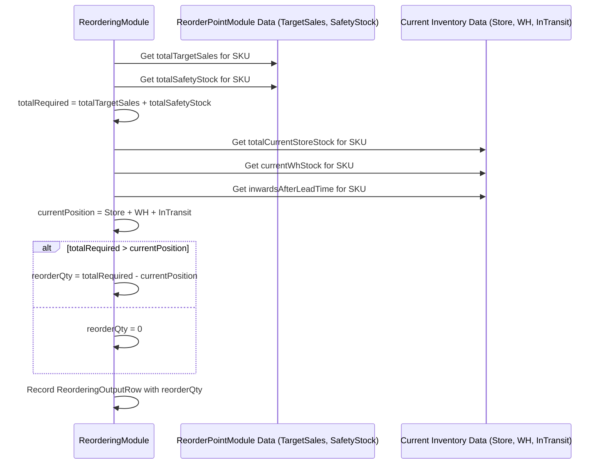

# Chapter 44: Reordering Module

Welcome back! In the [previous chapter](43_otb_depletion_module_.md), we saw how the **OTB Depletion Module** forecasts our future inventory levels, helping us see if we might run out of stock or have too much based on our buy plan and expected sales. This gives us great visibility!

But what happens when that forecast *does* show we're likely to run out of an important item soon? Especially for our essential "Core" or popular "Bestseller" products (our NOOS items), we don't want to wait until the shelves are empty. We need a system to automatically figure out *when* to place a new order and *how much* to order to replenish the stock before it runs out.

## What Problem Does This Module Solve?

Imagine you have a car you use every day (like a Core T-shirt). You want to make sure it never runs out of fuel. You could wait until the empty light comes on (stock-out!), but that's risky. A better approach is to decide on a "refuel level" (like when the gauge hits 1/4 tank). When the fuel drops to that level, you automatically go fill it up, maybe even back to a full tank.

Managing inventory for NOOS items works the same way. We want to avoid stock-outs. Manually checking the stock levels of thousands of Core and Bestseller items across hundreds of stores every day or week is impossible. We need an automated system that:

1.  Knows which items are important NOOS styles.
2.  Knows how quickly these items typically sell (Rate of Sale - ROS).
3.  Knows how long it takes to get more stock after ordering (Lead Time).
4.  Calculates a "trigger level" (Reorder Point - ROP) based on expected sales during the lead time plus a safety buffer.
5.  Constantly monitors the current inventory (in stores, warehouses, and on its way).
6.  When inventory drops below the ROP, it automatically calculates how much to reorder to get back to a desired stock level (covering future sales for a certain period).

The **Reordering Module** is this automated system. It takes the guesswork and manual effort out of replenishing important items, ensuring they stay in stock to meet customer demand.

## Core Concepts

Let's break down the key ideas used in automated reordering:

1.  **Replenishable Styles:** The system focuses on styles designated as replenishable, typically the Core and Bestseller items identified by the [NOOS Identification (NoosGroupModule)](21_noos_identification__noosgroupmodule__.md) process.
2.  **Rate of Sale (ROS):** How many units of an item sell per day or week, on average. This is a crucial input, often calculated by specialized ROS modules (like `ReorderingRosCalculationModule`).
3.  **Lead Time:** The time lag (in days) between placing a reorder and the inventory actually becoming available for sale. This includes supplier production time, shipping time, warehouse processing time, etc. (Data from `LeadTimeRow`).
4.  **Safety Stock (SS):** Extra inventory held to buffer against unexpected increases in demand or delays in lead time. It's the "just in case" stock. Its calculation can be complex but aims to prevent stock-outs during lead time.
5.  **Reorder Point (ROP):** The inventory level (considering stock you physically have + stock already on order) that triggers a new order. If your stock position drops below the ROP, it's time to reorder.
    *   *Formula (Conceptual):* `ROP = (ROS * Lead Time in Days) + Safety Stock`
    *   This means the ROP should ideally cover expected sales *during* the lead time, plus the safety buffer.
6.  **Target Cover Days:** How many days of future sales do we want our inventory (after reordering) to cover? This is a strategic decision (e.g., "We want enough stock to cover the next 30 days of sales"). Data often comes from `CoverDaysTargetSpreadRow`.
7.  **Target Stock:** The desired inventory level to reach after the reorder arrives.
    *   *Formula (Conceptual):* `Target Stock = ROP + (ROS * (Target Cover Days - Lead Time in Days))` or simply `Target Stock = (ROS * Target Cover Days) + Safety Stock`.
8.  **Current Inventory Position:** The total stock currently available or expected soon. This includes:
    *   Stock in Stores
    *   Stock in Warehouse(s) allocated to stores
    *   Stock In-Transit (already ordered but not yet received)
9.  **Reorder Quantity (ROQ):** The amount to order *now*. Calculated when the Current Inventory Position drops below the ROP.
    *   *Formula (Conceptual):* `ROQ = Target Stock - Current Inventory Position` (If result is positive, otherwise 0).
10. **Eligibility & Overrides:** Not every NOOS style might be reordered automatically. Some might be flagged for exclusion based on recent poor performance (low ROS, high discounts). Manual overrides (`ReorderOverrideRow`) can also force or prevent a reorder.

## How It Works (The Workflow)

The reordering process is usually run periodically (e.g., weekly) as part of the overall planning cycle, typically managed by the `OtbReorderingGroupModule`.

**Orchestration by `OtbReorderingGroupModule`:**
This module coordinates the necessary steps:
1.  **Load Inputs (`ReorderingInputModule`):** Gathers current stock data (using depletion outputs), sales history, lead times, target cover days, overrides, etc.
2.  **Identify Paramount Sizes (`ParamountSizesModule` - specific context here):** Determines important sizes for reordering focus.
3.  **Identify Eligible Styles (`ReorderStylesModule`):** Filters NOOS styles based on recent performance criteria (e.g., minimum sales, acceptable discount levels) to see which ones actually *qualify* for potential reordering now.
4.  **Prepare Size Data (`ReorderingSizeWiseModule`):** Calculates size-level contribution or metrics needed for breaking down reorders.
5.  **Calculate ROS (`ReorderingRosCalculationModule`):** Calculates the current Rate of Sale for the eligible styles.
6.  **Calculate ROP & Target Stock (`ReorderPointModule`):** Determines the Reorder Point and the target inventory level for each eligible SKU/StoreGroup based on ROS, lead time, safety stock rules, and cover days.
7.  **Calculate Reorder Quantity (`ReorderingModule`):** This is the core decision engine. It compares the current inventory position against the ROP. If below ROP, it calculates the required `Reorder Quantity = Target Stock - Current Inventory Position`. Applies overrides.
8.  **Generate Outputs:** Saves the reorder recommendations.

**Inputs:**
*   Current Inventory (Store, Warehouse, In-Transit - often derived from OTB Depletion outputs).
*   Calculated Rate of Sale (ROS) per SKU/StoreGroup.
*   Lead Time per Style/Channel (`LeadTimeRow`).
*   Target Cover Days per Style/StoreGroup (`CoverDaysTargetSpreadRow`).
*   Safety Stock rules or values.
*   Eligibility flags (from `ReorderStylesModule`).
*   Manual Overrides (`ReorderOverrideRow`).
*   Product/Store Master Data ([Cache](05_cache_.md)).

**Outputs:**
*   **`ReorderingOutputRow`:** The primary output at the SKU level, containing:
    *   `sku`, `style`
    *   `closingStock`, `closingWhStock`: Projected stock before reorder.
    *   `safetyStock`, `targetSales`: Calculated components.
    *   `reorderQty`: The final recommended quantity to order for this SKU across relevant stores/groups.
    *   `coverEndDate`: The date until which the inventory (including reorder) is expected to last.
*   **`ReorderingStoreOutputRow`**, **`ReorderingStoreGroupOutputRow`:** Aggregated views at Store-SKU and StoreGroup-SKU levels.
*   Denormalized reports (`DenormalizedReorderingOutputRow`, etc.).

## Under the Hood: The ROP Check and ROQ Calculation

The heart of the process lies in the `ReorderingModule` and `ReorderPointModule` (note: the code structure might blend these slightly).

**1. Calculating ROP and Target Stock (`ReorderPointModule` / Shared Logic):**
   This involves combining ROS, Lead Time, Cover Days, and Safety Stock calculations.

   ```java
   // Simplified logic within computeTargetSalesAndSafetyStock()
   for (/* each StoreGroup-SKU combination */) {
       // ... get relevant StoreGroupStyleInfoRow (cover days) ...
       // ... get relevant LeadTimeRow ...
       // ... get calculated ROS for StoreGroup-SKU ...

       // Safety Stock Calculation (can be complex, simplified here)
       // Often related to variability of ROS and Lead Time
       safetyStock = calculateSafetyStock(ros, leadTime, variabilityFactor);

       // Target Sales during Cover Period (beyond lead time)
       coverPeriodDays = infoRow.coverDays + reorderFreq; // Look ahead
       targetSales = ros * coverPeriodDays;

       // Store these for the Reordering step
       storeGroupOutputRow.safetyStock = safetyStock;
       storeGroupOutputRow.targetSales = targetSales;
   }
   // Note: ROP isn't explicitly stored but is implicitly safetyStock + demand during lead time
   ```
   **Explanation:** This part calculates the key components needed. It determines the `safetyStock` based on variability and risk tolerance. It calculates the `targetSales` needed to cover the desired future period (`coverDays + reorderFreq`). These values, along with lead time and ROS, allow the next step to determine if a reorder is needed and how much.

**2. The Reorder Decision (`ReorderingModule.computeReorderQty`):**
   This module makes the final comparison and calculates the quantity.

   ```java
   // Simplified logic from ReorderingModule.computeReorderQty()

   // Loop through SKU results aggregated from StoreGroups
   new Data<>(cycleReorderingStoreGroupOutputRows).groupBy(k -> new Key(k.sku)).getMap()
       .forEach((skuKey, storeGroupRowsForSku) -> {
           // ... setup ReorderingOutputRow ...
           int sku = (int) skuKey.part(0);
           // Get current WH stock + In-transit (simplified)
           int currentWhStock = getClosingWhStock(sku); // Includes prev reorders, less depletion
           int inwardsAfterLeadTime = getInwardsAfterLeadTime(sku); // Already ordered, arriving later
           int totalStoreStock = getTotalClosingStoreStock(sku, storeGroupRowsForSku); // Sum across store groups

           // Sum targets across store groups
           int totalTargetSales = storeGroupRowsForSku.stream().mapToInt(r -> r.targetSales).sum();
           int totalSafetyStock = storeGroupRowsForSku.stream().mapToInt(r -> r.safetyStock).sum();

           // Calculate total required stock (Target)
           int totalRequired = totalTargetSales + totalSafetyStock;

           // Calculate current available position
           int currentPosition = totalStoreStock + currentWhStock + inwardsAfterLeadTime;

           // *** The Core Reorder Logic ***
           // Reorder needed = Max(0, Total Required - Current Position)
           int reorderQty = (int) Math.max(0, totalRequired - currentPosition);

           // Store results
           reorderingOutputRow.closingStock = totalStoreStock;
           reorderingOutputRow.closingWhStock = currentWhStock; // Projected WH stock
           reorderingOutputRow.inwardsAfterLeadTime = inwardsAfterLeadTime;
           reorderingOutputRow.targetSales = totalTargetSales;
           reorderingOutputRow.safetyStock = totalSafetyStock;
           reorderingOutputRow.reorderQty = reorderQty; // <<< The final recommendation

           reorderingOutputRows.add(reorderingOutputRow);
       });
   ```
   **Explanation:** For each SKU, this logic sums up the `targetSales` and `safetyStock` calculated previously to get the `totalRequired` inventory level. It calculates the `currentPosition` by summing projected store stock, warehouse stock, and stock already on order but arriving after the lead time. The core decision is `reorderQty = Math.max(0, totalRequired - currentPosition)`. If the requirement is greater than the current position, the difference is the quantity to reorder.

**Sequence Diagram (Simplified Reorder Check for one SKU):**


## Conclusion

The **Reordering Module** automates the crucial process of replenishing important **NOOS (Core/Bestseller)** items to prevent stock-outs.

*   It considers the **Rate of Sale (ROS)**, supplier **Lead Time**, desired **Target Cover Days**, and **Safety Stock** requirements.
*   It calculates a **Reorder Point (ROP)** for each item.
*   It monitors the **Current Inventory Position** (Store + Warehouse + In-Transit).
*   When the position drops below the ROP, it calculates the required **Reorder Quantity (ROQ)** to bring inventory back up to the target level.
*   It filters styles based on eligibility and allows for **manual overrides**.
*   The final output (`ReorderingOutputRow`) provides specific quantities to order, streamlining the replenishment process.

This module is essential for maintaining healthy stock levels for key products, maximizing sales, and minimizing manual effort.

After deciding *whether* to reorder and *how much* in total (reorder quantity), we often need to fine-tune the *depth* or stock level we are aiming for, especially considering how many options (width) we have.

[Next Chapter: Depth Suggestion Module](45_depth_suggestion_module_.md)

---
**Relevant Code Snippets for Context:**

```java
// File: src/main/java/com/increff/irisx/module/OtbReorderingGroupModule.java
package com.increff.irisx.module;

import com.increff.irisx.module.reordering.*;
import org.springframework.beans.factory.annotation.Autowired;
import org.springframework.stereotype.Component;

import javax.annotation.PostConstruct;

@Component
public class OtbReorderingGroupModule extends AbstractUtilModuleGroup {

    // Note: Order reflects dependencies for calculating ROP and ROQ
    @Autowired private ReorderingInputModule reorderingInputModule;
    @Autowired private ParamountSizesModule paramountSizesModule; // Needed for size focus
    @Autowired private ReorderStylesModule reorderStylesModule; // Identify eligible styles
    @Autowired private ReorderingSizeWiseModule reorderingSizeWiseModule; // Size contributions
    @Autowired private ReorderingRosCalculationModule rosCalculationModule; // Calculate ROS
    @Autowired private ReorderingModule reorderingModule; // Calculate final ROQ
    @Autowired private ReorderPointModule reorderPointModule; // Calculate ROP, Target Stock components

    @Autowired private UtilOutputSnapshotModule utilOutputSnapshotModule;
    @Autowired private UtilOutputSyncModule utilOutputSyncModule;

    @PostConstruct
    public void init() {
        captureSnapshot();
        add(reorderingInputModule);       // 1. Load Inputs
        add(paramountSizesModule);      // 2. Identify Key Sizes
        add(reorderStylesModule);       // 3. Identify Eligible Styles
        add(reorderingSizeWiseModule);  // 4. Prep Size Contributions
        add(rosCalculationModule);      // 5. Calculate Rate of Sale
        // Note: ReorderingModule and ReorderPointModule work together
        add(reorderingModule);          // 6. Calculate Final Reorder Quantity (uses ROP)
        add(reorderPointModule);        // 7. Calculates ROP components / Runs if needed
        uploadOutput();
    }
    // ... standard capture/upload methods ...
}
```

```java
// File: src/main/java/com/increff/irisx/row/output/reordering/ReorderingOutputRow.java
package com.increff.irisx.row.output.reordering;

import java.time.LocalDate;

// Primary output for Reordering Module (SKU Level)
public class ReorderingOutputRow extends AbstractReorderingOutputRow {
    public int safetyStock;         // Calculated Safety Stock needed
    public int targetSales;         // Sales needed to cover target period
    public int closingStock;        // Projected closing stock (Store) before reorder
    public int closingWhStock;      // Projected closing WH stock before reorder
    public int reorderQty;          // <<< Final Recommended Reorder Quantity
    public int inwardsAfterLeadTime;// Units already on order, arriving after lead time
    public int onlineReservationInLeadTime; // Units reserved for online
    public int suggestedInwards; // Previous cycle's reorder qty (used for WH stock projection)

    // Constructor...
    public ReorderingOutputRow(int sku, int style, LocalDate closingDate, LocalDate coverEndDate) { /*...*/ }
}
```

```java
// File: src/main/java/com/increff/irisx/row/input/reordering/ReorderOverrideRow.java
package com.increff.irisx.row.input.reordering;

import com.increff.irisx.constants.ap.ReorderTheme;

public class ReorderOverrideRow {
    public int storeGroup; // Store group the override applies to
    public int style;      // Style ID the override applies to
    public ReorderTheme theme; // REORDER or DONT_REORDER
}
```

```java
// File: src/main/java/com/increff/irisx/row/input/otb/LeadTimeRow.java
package com.increff.irisx.row.input.otb;

public class LeadTimeRow {
    public String channel;
    public int style;
    public String season;
    public int leadTime; // Lead time in days
}
```

```java
// File: src/main/java/com/increff/irisx/row/input/reordering/CoverDaysTargetSpreadRow.java
package com.increff.irisx.row.input.reordering;

public class CoverDaysTargetSpreadRow {
    public int storeGroup;
    public int style;
    public int coverDays; // Target cover days
    public int targetSpread; // Target spread % (not directly used in ROP calc)
    public int targetStores; // Specific target store count (used in safety stock aggregation)
}
```

---

Generated by [AI Codebase Knowledge Builder](https://github.com/The-Pocket/Tutorial-Codebase-Knowledge)