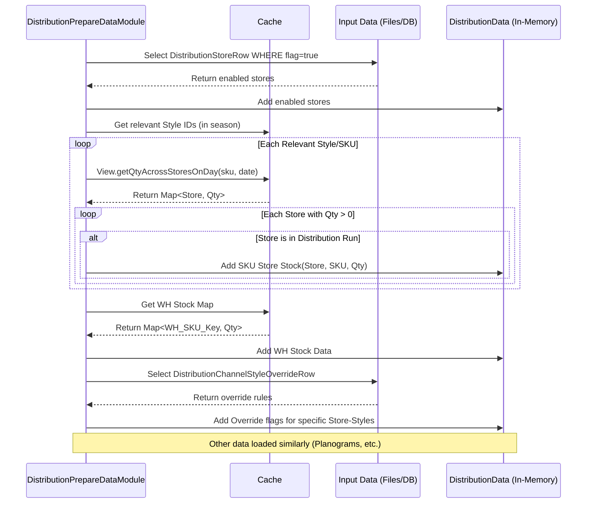

# Chapter 47: Distribution Data Preparation

Welcome! In the [previous chapter](46_distribution_module_.md), we got a high-level overview of the **Distribution Module**, which acts like a logistics coordinator, figuring out how to send inventory from warehouses to stores or even between stores. We saw that it involves many steps, managed by the `DistributionGroupModule`.

But before any complex allocation decisions can be made, we need to get all our ducks in a row. The distribution logic needs a *lot* of information to work correctly. Where is our stock right now? Which stores are even participating in distribution? What are the display rules for each store?

## What Problem Does This Step Solve?

Imagine you're about to cook a big, complex holiday dinner (like running the distribution allocation). You have the main recipe (the allocation logic), but you can't just start cooking! First, you need to do the **prep work**:
*   Go shopping for all ingredients (load data).
*   Make sure you have the right pots and pans (check configurations).
*   Wash and chop the vegetables (filter and format data).
*   Measure out the flour, sugar, etc. (prepare data structures).
*   Lay everything out on the counter so it's ready when you need it (store data in memory).

If you tried to find, wash, and chop each ingredient *while* you were actively cooking, the process would be chaotic, slow, and prone to mistakes.

**Distribution Data Preparation** solves this exact problem for the Distribution Module. Before the core logic of deciding *where* stock should go can begin, this initial phase **gathers, filters, cleans, and organizes all the necessary information**. It sets the stage by preparing all the required data ingredients and putting them in an easily accessible place (usually in memory).

## Core Idea: Gathering the Ingredients

The main goal of this preparation phase is to load and structure all the data points needed by the subsequent distribution calculation steps. Think of it as stocking the pantry and prepping the ingredients before the main cooking starts.

This involves fetching and organizing information like:

*   **Which stores are participating?** Identifying stores enabled for distribution (`DistributionStoreRow`).
*   **Which styles are relevant?** Filtering products based on the current season or other criteria.
*   **Where is the stock NOW?** Loading current inventory levels from:
    *   Warehouses (`WhStockRow`)
    *   Stores (`StoreStockRow` / Depletion Output)
    *   In Transit between locations (GIT - `GoodsInTransitRow`, `IstInTransitRow`)
    *   On order from suppliers (`OpenOrdersRow`)
*   **How are warehouses linked to stores?** Loading warehouse mapping rules (`WhStoreMapRow`).
*   **What are the store display rules?** Loading planogram data (shelf space/capacity - `PlanogramRow`).
*   **What are the size requirements?** Loading size set information (minimum quantities - `SizeSetQtyRow`) and size contribution data ([`PivotalRow`](27_pivotal_tag___pivotalrow_.md)).
*   **Are there special depth rules?** Loading SKU depth limits or overrides (`DistMaxSkuDepthRow`, `StoreSkuDepthOverrideRow`).
*   **Are there any manual adjustments?** Loading override rules for specific styles or channels (`DistributionChannelStyleOverrideRow`).
*   **What are the supplier/shipping rules?** Loading pack sizes (`StylePackSizeOverrideRow`).

This data is loaded, potentially filtered (e.g., removing out-of-season styles), and stored in well-structured maps and lists within a shared data object (like `DistributionData`), ready for the ranking, segmentation, and allocation modules to use efficiently.

## How It Works (The Process)

This preparation phase is typically handled by the first few modules run by the `DistributionGroupModule`:

1.  **`DistributionPrepareDataModule`:** This is often the main workhorse for loading common data. It inherits from `AbstractPrepareDataModule` which provides base functionality.
2.  **`DistributionPrepareWhInventoryModule`:** Might specifically focus on loading and preparing warehouse stock details.
3.  **`DistributionPrepareSalesModule`:** Focuses on loading and preparing the sales data needed for calculating performance metrics used in ranking/segmentation later.

These modules are executed sequentially at the beginning of the distribution run.

**Inputs:**
*   Various raw input files/tables containing the data points listed above (StoreStock, WhStock, Planogram, Overrides, GIT, OpenOrders, Mappings, Size Sets, etc.).
*   Configuration ([`DistributionArgs`](03_configuration___arguments__args_classes__.md)) specifying relevant seasons, flags for which data to load (e.g., `storeStockFlag`, `whStockFlag`).
*   Product/Store Master Data from the [Cache](05_cache_.md).

**Processing:**
*   **Identify Target Stores:** Filters the list of all stores to get only those enabled for distribution based on `DistributionStoreRow`.
*   **Filter Styles:** Identifies styles relevant for the current season(s) defined in the arguments.
*   **Load Stock:** Reads various stock input rows, potentially applies parent SKU/Style mapping using [SkuStyleConversionUtil](18_skustyleconversionutil_.md), and aggregates the quantities into maps keyed by SKU and location (Store ID or WH ID).
*   **Load Configs & Rules:** Reads planograms, overrides, size sets, warehouse mappings, etc., and stores them in appropriate lookup maps.
*   **Store in Shared Data:** All loaded and prepared data is stored in the shared `DistributionData` object (or similar) using methods like `distributionData.addSkuStoreStock()`, `distributionData.addDistributionStore()`, `distributionData.setOverridenStoreStyleSizeDepthMap()`, etc.

**Outputs:**
*   A fully populated **`DistributionData` object** containing all the necessary inputs in easily accessible maps and lists, ready for the next stages of the distribution calculation. No major report files are generated *from* this step; its output is the prepared data state in memory.

## Under the Hood: Loading and Mapping

The modules involved primarily read data from input sources (via the `db()` service which often represents loaded TSV files or temporary tables) and use helpers like [ObjectMaps](11_objectmaps_.md) and the [Cache](05_cache_.md) to structure it.

**1. Identifying Distribution Stores (`addDistributionStores`):**

   ```java
   // Simplified from AbstractPrepareDataModule.java
   protected void addDistributionStores() {
       // Select rows where the 'flag' indicates the store is enabled
       List<DistributionStoreRow> distStoreList = db().select(DistributionStoreRow.class)
           .stream()
           .filter(k -> k.flag) // Keep only flagged stores
           .collect(Collectors.toList());

       for (DistributionStoreRow row : distStoreList) {
           int storeId = row.store;
           // Double-check store exists in cache
           if (cache.getStoreRow(storeId) == null) {
               logger.warn("Store " + storeId + " is null in cache");
               continue;
           }
           // Add the store to the list used by distribution logic
           distributionData.addDistributionStore(row);
       }
       logger.info("Distribution stores: " + distributionData.getDistributionStoreList().size());
   }
   ```
   **Explanation:** This method reads the `DistributionStoreRow` input, filters it to keep only rows where the `flag` is true, checks if the store exists in the master data ([Cache](05_cache_.md)), and adds the valid store IDs to the `distributionData` object.

**2. Loading Store Stock (`addSkuStoreStock`):**

   ```java
   // Simplified from AbstractPrepareDataModule.java
   protected void addSkuStoreStock() {
       // Consider only styles relevant for the current run (in-season)
       Set<Integer> relevantStyles = distributionData.getInseasonStyles();

       // Loop through relevant styles
       for (int style : relevantStyles) {
           // Get all SKUs (sizes) for this style
           for (int sku : cache.getAllSkusInStyle(style)) {
               // Get the stock quantity for this SKU across all stores for the end date
               // View helper accesses pre-calculated inventory state
               view.getQtyAcrossStoresOnDay(sku, commonArgs.endDate)
                   .forEach((store, qty) -> {
                       // Check if this store is part of the distribution run
                       if (baseHelper.getValidStoresForStyle(style).contains(store)) {
                           // Add the stock quantity to the data object
                           distributionData.addSkuStoreStock(store, sku, qty);
                       }
                   });
           }
       }
   }
   ```
   **Explanation:** This method iterates through relevant styles and their SKUs. For each SKU, it uses the [View](10_view_.md) helper to get the inventory quantity (`qty`) in each store as of the planning date (`commonArgs.endDate`). If the store is participating in the distribution run, it adds this stock information (`store`, `sku`, `qty`) to the `distributionData` object.

**3. Loading Warehouse Stock (`addWhStock`):**

   ```java
   // Simplified from AbstractPrepareDataModule.java
   protected void addWhStock() {
       // Directly access the WH stock map from the Cache
       // Cache would have loaded this from WhStockRow or similar input
       for (Map.Entry<Key, Integer> entry : cache.getSkuWhStockMap().entrySet()) {
           Key key = entry.getKey(); // Key contains SKU ID and WH ID
           Integer qty = entry.getValue(); // Stock quantity
           int sku = (Integer) key.part(0);
           int whId = (Integer) key.part(1);
           // Add the warehouse stock information to the data object
           distributionData.addSkuWhStock(sku, whId, qty);
       }
   }
   ```
   **Explanation:** This straightforward method retrieves the pre-loaded warehouse stock map from the [Cache](05_cache_.md) and copies the information (SKU ID, Warehouse ID, Quantity) into the `distributionData` object for the distribution modules to use.

**4. Loading Store Overrides (`createOverriddenChannelStyles`):**

   ```java
   // Simplified from AbstractPrepareDataModule.java
   protected void createOverriddenChannelStyles() {
       // Load override rows, filtering for parent styles
       List<DistributionChannelStyleOverrideRow> overrideRows = SkuStyleConversionUtil
           .getFilteredChannelStyleOverrideRows(
               db().select(DistributionChannelStyleOverrideRow.class),
               cache.getStyleParentMap(), cache.getAllStyles());

       // Create a map of Channel -> List<Store ID>
       Map<String, List<Integer>> channelStoreListMap = /* ... build map ... */;
       channelStoreListMap.put("", distributionData.getDistributionStoreList()); // Key for "all channels"

       for (DistributionChannelStyleOverrideRow r : overrideRows) {
           // Apply only if the override season matches a relevant season
           if (!seasonList.contains(r.season)) continue;
           // Get stores belonging to the specified channel (or all stores if "")
           List<Integer> channelStores = channelStoreListMap.getOrDefault(r.channel, new ArrayList<>());
           for (int store : channelStores) {
               int style = r.style;
               // Add the override flag for this style in this store
               distributionData.addOverridenStyle(style, store);
           }
       }
   }
   ```
   **Explanation:** This function reads the override rules. For each rule, it determines which stores it applies to (based on the channel specified in the rule). It then iterates through those stores and flags the specified style as "overridden" for that store within the `distributionData` object.

**Sequence Diagram (Simplified Prep Flow):**



## Conclusion

**Distribution Data Preparation** is the essential first phase of the distribution process, handled by modules like `DistributionPrepareDataModule`.

*   It acts like the **"mise en place"** in cooking, gathering and organizing all necessary ingredients before the main allocation logic begins.
*   It loads and filters critical data points: **participating stores, relevant styles, current inventory levels (Store, WH, GIT, Open Orders), planograms, overrides, size contributions, warehouse mappings, and constraints.**
*   This prepared data is stored in a central in-memory object (like `DistributionData`) for efficient access by subsequent ranking, segmentation, and allocation modules.
*   This step ensures that the distribution calculations have a complete and accurate picture of the current state and the rules they need to follow.

With all the data gathered and prepared, the next step is often to analyze it to understand performance and prioritize which stores or products should get inventory first.

[Next Chapter: Distribution Segmentation & Ranking](48_distribution_segmentation___ranking_.md)
```

---

Generated by [AI Codebase Knowledge Builder](https://github.com/The-Pocket/Tutorial-Codebase-Knowledge)