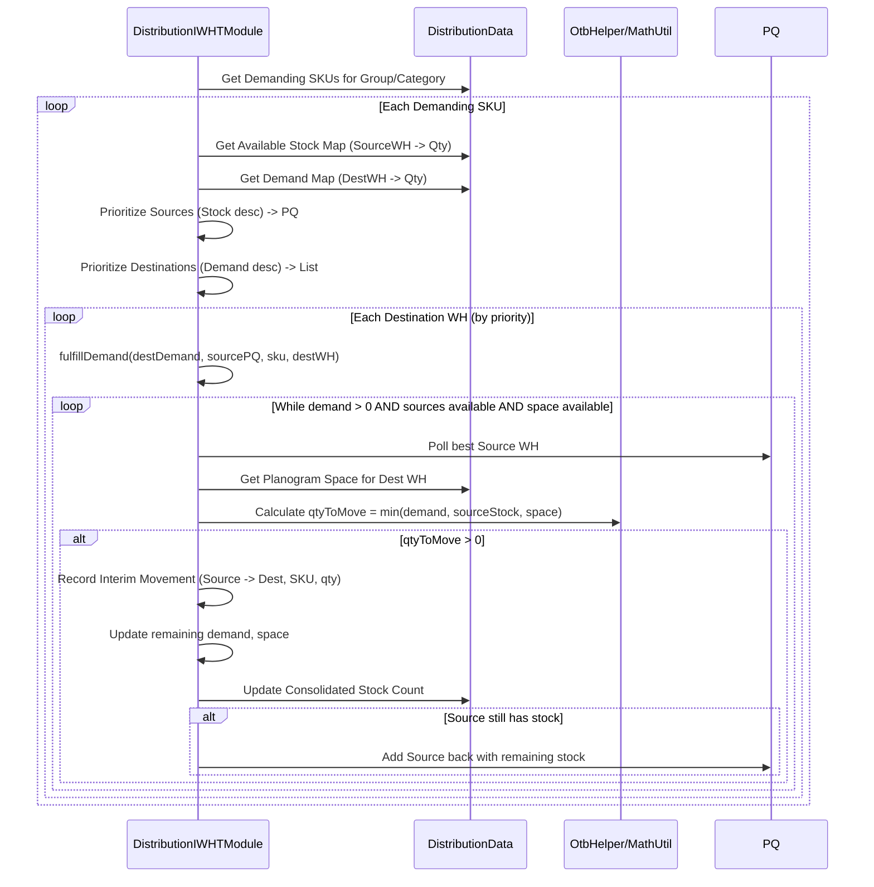

# Chapter 50: Inter-Warehouse Transfer (IWHT) Module

Welcome back! In the [previous chapter](49_distribution_allocation_logic_.md), we saw how the **Distribution Allocation Logic** decides how much inventory should ideally go from warehouses to stores based on a prioritized list. That's a huge step!

But what if the inventory isn't in the *best* warehouse to serve a particular store? Or what if one warehouse (say, a large central hub) has way too much stock of an item, while another regional warehouse, closer to high-demand stores, is running low? Just allocating from whatever warehouse *currently* has stock might not be the most efficient strategy.

## What Problem Does This Module Solve?

Imagine again our pizza chain dispatcher. They figured out Outlet 1 needs 50 pepperoni pizzas based on demand. The closest kitchen (Regional Warehouse A) only has 20 pepperoni pizzas left. However, the main central kitchen (Central Warehouse Hub) has 200 extra pepperoni pizzas!

Should Outlet 1 just get 20 pizzas and run out? Or should the dispatcher arrange for the Central Hub to send a bulk shipment of pepperoni pizzas to Regional Warehouse A *before* the final delivery to Outlet 1? This second option makes more sense – moving stock *between warehouses* first can better position inventory to meet store needs efficiently.

This movement of goods between different warehouses in the network is called **Inter-Warehouse Transfer (IWHT)**.

The **Inter-Warehouse Transfer (IWHT) Module** (`DistributionInterWarehouseTransferModule`) solves the problem of deciding these strategic movements *between* warehouses. It looks at:
*   Where the overall demand (unfulfilled store needs) is located.
*   Where the excess inventory currently sits within the warehouse network.
*   The defined relationships and feasible movement paths between warehouses (e.g., can WH A ship directly to WH C, or must it go via WH B?).
*   Capacity limits at the receiving warehouses.

Based on this, it calculates how much of each SKU should be transferred from one warehouse (usually one with excess) to another (usually one facing higher demand or serving high-need stores) to optimize the overall inventory position *before* final store allocations or replenishments happen.

## Core Concepts

1.  **Warehouse Network & Hierarchy:** Warehouses often aren't just a random collection. They might be organized:
    *   **Hierarchically:** A central hub feeding regional distribution centers (DCs), which then feed stores.
    *   **By Groups:** Warehouses might be grouped by region or function (e.g., an e-commerce fulfillment center vs. a retail distribution center).
    *   **Feasible Paths:** There might be defined routes showing which warehouses can realistically ship to others (`RUFeasibleMovementsRow`).

2.  **Demand Aggregation:** The module needs to understand the *total unfulfilled demand* that each warehouse is responsible for serving (either directly to stores or by supplying other warehouses). This often involves "rolling up" demand from stores and child warehouses to parent warehouses.

3.  **Stock Availability & Excess:** It identifies which warehouses have available stock *beyond their own immediate needs* (including reservations for already allocated quantities) and which warehouses have a *deficit*.

4.  **Transfer Calculation:** The core logic involves matching warehouses with excess stock ("source" or "outward" warehouses) to warehouses with deficits ("destination" or "inward" warehouses) that they are allowed to ship to. It calculates the quantity to transfer, considering the demand at the destination, the available excess at the source, and any capacity limits at the destination.

5.  **Optimization/Pullbacks:** The process might involve multiple steps:
    *   Initial "push" based on rolled-up demand.
    *   "Optimization" to potentially use more direct routes if allowed.
    *   "Pullbacks" where inventory pushed down to a child warehouse, but not ultimately needed, might be pulled back up to a parent warehouse if capacity allows.

## How It Works (The Process)

The `DistributionInterWarehouseTransferModule` runs as part of the `DistributionGroupModule` sequence, typically *after* the initial Store-Style ranking and segmentation, and potentially after an initial allocation pass (to determine remaining demand), but *before* final Inter-Store Transfers.

**Inputs:**
*   **Prepared Distribution Data (`DistributionData`):** Contains current WH stock (potentially adjusted for initial reservations), aggregated store demand per warehouse (`storeSkuDemandMap`), warehouse relationships (groups, parent-child maps derived from store-WH mapping), planogram capacities for warehouses.
*   **Feasible Movement Paths (`RUFeasibleMovementsRow`):** Input defining allowed WH-to-WH transfers.
*   **Configuration (`DistributionArgs`):** General settings.

**Calculation Steps (Simplified):**
1.  **Calculate WH Demand:** Determine the total unfulfilled demand associated with each warehouse (`createWhDemandMap`).
2.  **Warehouse Replenishment/Reservation (Initial):** Attempt to fulfill demand at a warehouse first from its own stock (reservation) and then by pulling from its immediate parent(s) if defined (`warehouseReservationsAndReplenishment`). This generates initial potential movements.
3.  **Consolidate Stock & Roll Up Demand:** Figure out the consolidated available stock and total rolled-up demand within defined IWHT groups/categories (`inventoryConsolidationAndDemandRollUp`).
4.  **Run IWHT within Groups (`runIWHT`):** For each defined group of related warehouses:
    *   Identify source warehouses with excess stock and destination warehouses with rolled-up demand within the group.
    *   Match sources to destinations based on feasibility.
    *   Calculate transfer quantities to fulfill demand (`fulfillDemand`).
5.  **Optimize Movements (`optimiseMovements`):** Analyze the initially calculated movements. If a direct transfer from the original source to the final destination warehouse is feasible and more efficient (e.g., skipping an intermediate hop), adjust the transfer plan.
6.  **Perform Pullbacks (`performDemandingPullbacks`, `performOtherPullbacks`):** Check if warehouses that received stock still have excess relative to their planogram capacity or remaining demand. If parent warehouses have capacity and demand, pull back excess stock from children.
7.  **Update Stock & Record Movements:** Internally update the warehouse stock levels in `DistributionData` to reflect the planned transfers (`baseDistributionData.addWhStockMovement`). Store the detailed transfer recommendations.

**Outputs:**
*   **Updated `DistributionData`:** Warehouse stock levels are adjusted based on the planned transfers.
*   **`DistIWHTMovementsRow` / `IWHTInterimMovementsRow` (Persisted):** Detailed records of planned transfers (Source WH, Dest WH, SKU, Quantity, Type). These are used by WMS systems.

## Under the Hood: Rolling Up, Matching, Moving

The module uses several complex helper methods to manage the demand rollup, stock consolidation, and transfer calculations.

**1. Demand Rollup (`demandRollUp`):**
   This function aggregates demand upwards through the defined warehouse branches or hierarchy.

   ```java
   // Simplified logic from DistributionInterWarehouseTransferModule.demandRollUp
   protected void demandRollUp(Integer parentWh, Set<Integer> demandingSkus) {
       // Get defined branches originating from children of parentWh
       Set<String> branches = branchMap.getOrDefault(parentWh, new TreeSet<>());
       if (branches.isEmpty()) return;

       // Get map to store rolled-up demand for the parent
       Map<String, Map<Integer, Double>> parentBranchRolledUpDemand = rolledUpDemandMap.computeIfAbsent(parentWh, k -> new HashMap<>());

       branches.forEach(branch -> {
           // Find the immediate child warehouse in this branch path
           int childWh = /* ... parse first WH ID from branch string ... */;
           String subBranch = /* ... get remaining branch path ... */;

           // Get the child's own direct demand map
           Map<Integer, Double> childDirectDemandMap = whDemandMap.getOrDefault(childWh, new HashMap<>());
           // Get the child's already rolled-up demand map
           Map<Integer, Double> childRolledUpDemandMap = getChildRolledUpMap(childWh, subBranch); // Finds correct sub-branch map

           // Get/create the map to store demand rolled up TO the parent FOR this branch
           Map<Integer, Double> parentDemandForBranch = parentBranchRolledUpDemand.computeIfAbsent(branch, k -> new HashMap<>());

           // Add child's direct demand to parent's rolled-up map for this branch
           childDirectDemandMap.forEach((sku, qty) -> {
               parentDemandForBranch.put(sku, parentDemandForBranch.getOrDefault(sku, 0.0) + qty);
               childDirectDemandMap.put(sku, 0.0); // Zero out child's direct demand as it's rolled up
               demandingSkus.add(sku); // Mark SKU as demanding in the group
           });

           // Add child's rolled-up demand to parent's rolled-up map for this branch
           childRolledUpDemandMap.forEach((sku, qty) -> {
               parentDemandForBranch.put(sku, parentDemandForBranch.getOrDefault(sku, 0.0) + qty);
               childRolledUpDemandMap.put(sku, 0.0); // Zero out child's rolled-up demand
               demandingSkus.add(sku);
           });
           // ... (update child's maps) ...
       });
       // ... (update parent's map) ...
   }
   ```
   **Explanation:** This recursive-style logic traverses the defined warehouse branches. For a given parent warehouse and a specific branch path originating below it, it finds the immediate child warehouse. It takes the child's direct demand (`whDemandMap`) and any demand already rolled up to the child (`rolledUpDemandMap` for the sub-branch) and adds these quantities to the parent's `rolledUpDemandMap` under the key representing that specific branch. It then zeros out the demand at the child level to avoid double counting.

**2. Inventory Consolidation & Outward Map (`inventoryConsolidationAndDemandRollUp`):**
   After demand is rolled up, this identifies available stock.

   ```java
   // Simplified logic from DistributionInterWarehouseTransferModule
   protected void inventoryConsolidationAndDemandRollUp(String iwhtGroup, String category) {
       outwardsMap = new HashMap<>(); // Map<SKU, Map<SourceWH, AvailableQty>>
       consolidatedSkuStockMap = new HashMap<>(); // Map<SKU, TotalAvailableQtyInGroup>

       // Get list of warehouses in the current IWHT group
       List<Integer> warehousesInGroup = whGroupWhMap.getOrDefault(iwhtGroup, new ArrayList<>());

       // Iterate through demanding SKUs for this category in this group
       Set<Integer> demandingSkus = whGroupDemandingSkusMap.getOrDefault(iwhtGroup, new HashMap<>())
                                               .getOrDefault(category, new HashSet<>());
       demandingSkus.forEach(sku -> {
           warehousesInGroup.forEach(wh -> {
               // Check if this warehouse is allowed to ship outwards
               if (cache.getWarehouseRow(wh).outwards) {
                   // Calculate available stock (Current + GIT - Reserved)
                   int whStock = baseDistributionData.getSkuWhStock(sku, wh);
                   int gitWhStock = baseDistributionData.getGitWarehouseStock(wh, sku);
                   int reservedQty = getReserveQty(sku, wh); // Qty already reserved/moved in initial steps
                   Integer outwardQty = whStock + gitWhStock - reservedQty;

                   if (outwardQty > 0) {
                       // Add to outwardsMap: SKU -> WH -> Qty
                       Map<Integer, Integer> skuOutwardMap = outwardsMap.computeIfAbsent(sku, k -> new HashMap<>());
                       skuOutwardMap.put(wh, outwardQty);
                       // Add to consolidated total for the SKU within the group
                       consolidatedSkuStockMap.put(sku, consolidatedSkuStockMap.getOrDefault(sku, 0) + outwardQty);
                   }
               }
           });
       });
       // Also performs demandRollUp in the full version
   }
   ```
   **Explanation:** This function iterates through the demanding SKUs and the warehouses within the current processing group (`iwhtGroup`). For warehouses marked as "outwards" (allowed to ship), it calculates the currently available stock (`outwardQty`), considering physical stock, incoming stock (GIT), and quantities already reserved or moved in previous steps (`reservedQty`). It stores this available quantity in the `outwardsMap` (keyed by SKU and Source WH) and also aggregates the total available quantity for the SKU across the entire group in `consolidatedSkuStockMap`.

**3. Matching Supply and Demand (`runIWHT` / `fulfillDemand`):**
   This uses the consolidated stock and rolled-up demand to calculate transfers.

   ```java
   // Simplified logic from DistributionInterWarehouseTransferModule.runIWHT()
   protected void runIWHT(String iwhtGroup, String category) {
       // ... (Call inventoryConsolidationAndDemandRollUp) ...

       // Loop through demanding SKUs for this category in this group
       Set<Integer> groupCatDemandingSkus = /* ... get demanding SKUs ... */;
       for (Integer sku : groupCatDemandingSkus) {
           // Get available stock sources for this SKU (WH -> Qty)
           Map<Integer, Integer> whOutwardMap = outwardsMap.getOrDefault(sku, new HashMap<>());
           // Get demand map for this SKU (Destination WH -> Demand Qty)
           Map<Integer, Double> skuWhDemandMap = /* ... build map of WH -> Total Demand (Direct + RolledUp) ... */;

           // Prioritize destinations by demand (descending)
           skuWhDemandMap = skuWhDemandMap.entrySet().stream()
               .sorted(Map.Entry.<Integer, Double>comparingByValue().reversed())
               .collect(LinkedHashMap::new, (map, entry) -> map.put(entry.getKey(), entry.getValue()), Map::putAll);

           // Prioritize sources by available stock (descending using PriorityQueue)
           PriorityQueue<Map.Entry<Integer, Integer>> whOutwardsQueue =
               new PriorityQueue<>(Collections.reverseOrder(Map.Entry.comparingByValue()));
           whOutwardsQueue.addAll(whOutwardMap.entrySet());

           // Match demand with supply
           for (Map.Entry<Integer, Double> demandEntry : skuWhDemandMap.entrySet()) {
               int destWh = demandEntry.getKey();
               double demand = demandEntry.getValue();
               if (demand <= 0) continue;
               if (whOutwardsQueue.isEmpty()) break; // No more supply

               // Call helper to fulfill demand for destWh using whOutwardsQueue
               fulfillDemand(demand, whOutwardsQueue, sku, destWh, 1.0, skuWhDemandMap);
               // Update the original demand map with remaining demand
               demandEntry.setValue(skuWhDemandMap.get(destWh));
           }
           // ... (Handle leftover demand/supply if necessary) ...
       }
   }

   // Simplified logic from DistributionInterWarehouseTransferModule.fulfillDemand()
   protected void fulfillDemand(double demand, PriorityQueue<Map.Entry<Integer, Integer>> whOutwardsQueue,
                                 Integer sku, Integer destWh, double multiplyingFactor, /*...*/) {
       // Get destination WH planogram space (simplified)
       int planogramSpace = baseDistributionData.getWarehousePlanogramSpace(destWh, /* cat */);

       while (demand > 0 && !whOutwardsQueue.isEmpty() && planogramSpace > 0) {
           Map.Entry<Integer, Integer> sourceEntry = whOutwardsQueue.poll(); // Get best source
           int sourceWh = sourceEntry.getKey();
           int availableStock = sourceEntry.getValue();

           // Calculate quantity to move
           int effective_demand = (int) Math.ceil(demand * multiplyingFactor); // Apply factor if needed
           int qtyMoved = MathUtil.min(availableStock, effective_demand, planogramSpace);

           if (qtyMoved <= 0) {
               whOutwardsQueue.add(sourceEntry); // Put back if not used
               break;
           }

           // If source still has stock left, put it back in the queue
           if (qtyMoved < availableStock) {
               sourceEntry.setValue(availableStock - qtyMoved);
               whOutwardsQueue.add(sourceEntry);
           }

           // Record the interim movement
           addInterimMovement(sourceWh, destWh, sku, qtyMoved, /* category */);
           // Update remaining demand and space
           demand -= qtyMoved;
           planogramSpace -= qtyMoved;
           // Update consolidated stock map (used for factors in future iterations)
           consolidatedSkuStockMap.put(sku, consolidatedSkuStockMap.getOrDefault(sku, 0) - qtyMoved);
       }
       // Update the demand map passed in with remaining demand for destWh
       skuWhDemandMap.put(destWh, demand);
   }
   ```
   **Explanation:** `runIWHT` identifies the demanding SKUs within the group. For each SKU, it gets the map of available stock (`whOutwardMap`) and the map of demand (`skuWhDemandMap`). It prioritizes destinations by demand and sources by availability. It then iterates through the destinations, calling `fulfillDemand`. `fulfillDemand` takes the demand for one destination warehouse and tries to fulfill it using the best available source from the priority queue (`whOutwardsQueue`), respecting the destination's planogram space and the source's available stock. It records the transfer quantity using `addInterimMovement`.

**Sequence Diagram (Simplified IWHT for one SKU within a group):**


## Conclusion

The **Inter-Warehouse Transfer (IWHT) Module** plays a crucial role in optimizing the inventory position *within* the warehouse network before final store distribution.

*   It identifies **demand imbalances** (warehouses needing stock vs. warehouses having excess) by analyzing unfulfilled store needs and current warehouse inventory.
*   It calculates **strategic transfers** between warehouses, considering network structure (hierarchy, groups), feasible paths, and destination capacity.
*   The process often involves **rolling up demand**, **consolidating available stock**, matching supply to demand within groups, and potentially **optimizing** transfers or **pulling back** excess.
*   The output specifies planned WH-to-WH movements (`DistIWHTMovementsRow`), and the internal warehouse stock levels are updated to reflect these planned transfers, setting the stage for subsequent steps like Inter-Store Transfers.

By intelligently repositioning stock between warehouses, the IWHT module helps ensure inventory is available in the right parts of the network to more effectively meet regional store demand.

After optimizing stock within warehouses, what if imbalances exist *between stores*? The next chapter explores Inter-Store Transfers.

[Next Chapter: Inter-Store Transfer (IST) Module](51_inter_store_transfer__ist__module_.md)
---

---

Generated by [AI Codebase Knowledge Builder](https://github.com/The-Pocket/Tutorial-Codebase-Knowledge)