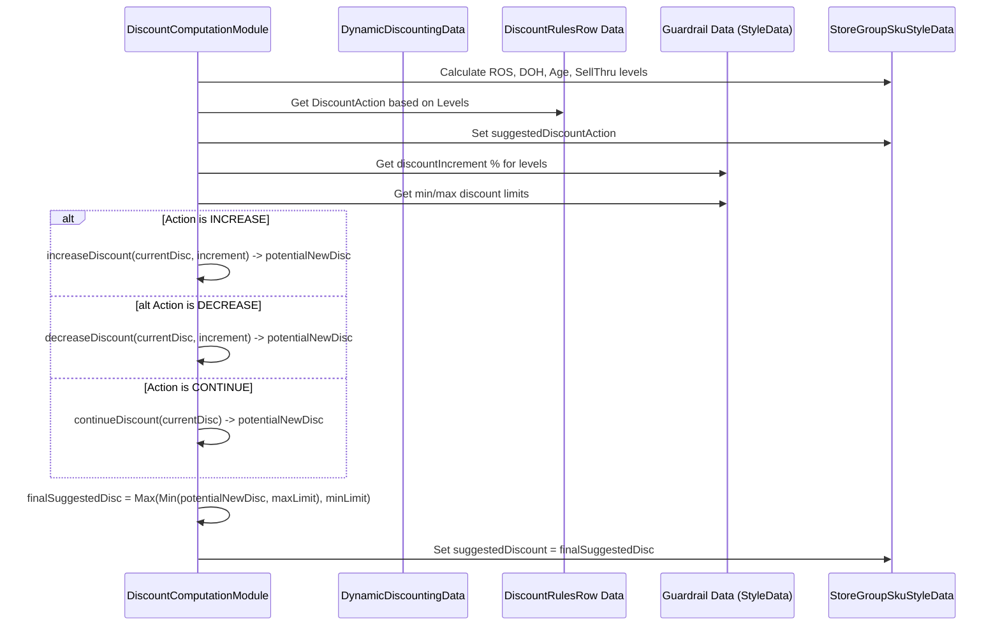

# Chapter 54: Dynamic Discounting Module

Welcome back! In the [previous chapter](53_story_based_distribution_modules_.md), we looked at how **Story-Based Distribution Modules** help allocate inventory for specific marketing collections or stories. Now that we have products planned, bought, and distributed (through various methods!), we need to manage their pricing effectively throughout their lifecycle in the store.

What happens if a product isn't selling as well as expected? Or if we have way too much stock piling up? Just leaving the price unchanged might mean ending the season with lots of unsold goods, which costs money. Conversely, if something is flying off the shelves, maybe we don't need to discount it at all!

## What Problem Does This Module Solve?

Imagine you run a fruit stand. At the start of the day, your fresh, popular strawberries are full price. But as the day goes on, or if you notice the less popular kiwis aren't moving, you might decide to lower the price to encourage sales and avoid having unsold fruit at the end. How much you discount might depend on:
*   How fresh is the fruit (stock age)?
*   How much do you have left (inventory level / Days of Hand)?
*   How quickly is it selling (Rate of Sale)?
*   How did it sell yesterday when you discounted it slightly (previous discount action)?

Manually tracking all these factors and deciding the optimal discount for every single product (SKU or style) across hundreds of stores every day or week is an overwhelming task. Pricing decisions often lag behind actual performance.

The **Dynamic Discounting Module** solves this problem. It acts like an automated pricing analyst or that savvy fruit stand owner. It continuously monitors the performance of products (styles or SKUs) based on factors like sales rate (ROS), inventory levels (Days of Hand - DOH), stock age, and sell-through rate. It compares this performance against predefined rules and benchmarks (like target sell-through or discount limits). Based on this analysis, it recommends whether to **increase**, **decrease**, or **continue** the current discount level for each item to optimize sales, clear inventory efficiently, and maximize overall profitability.

## Core Concepts

1.  **Dynamic Adjustment:** Unlike fixed seasonal sales, the discount can change *during* the season based on real-time (or near real-time) performance.
2.  **Performance Metrics:** The decision relies heavily on analyzing key data points:
    *   **Rate of Sale (ROS):** How fast is it selling now?
    *   **Days of Hand (DOH):** How many days will the current stock last at the current ROS? `DOH = Current Stock / ROS`. A very high DOH suggests slow sales or excess stock.
    *   **Sell-Through Rate:** What percentage of the stock received has sold so far?
    *   **Stock Age:** How long has this inventory been sitting? Older stock often needs deeper discounts.
    *   **Health Status (PSA):** Is the stock displayed correctly according to the planogram? Poor display might affect sales.
3.  **Rules and Benchmarks:** The module doesn't guess. It uses predefined rules and targets:
    *   **Discount Rules (`DiscountRulesRow`):** Define actions (Increase/Decrease/Continue) based on combinations of performance levels (e.g., "IF ROS is LOW and DOH is HIGH and Health is HEALTHY, THEN action is INCREASE").
    *   **Sell-through Benchmarks (`SellthroughBenchmarkRow`):** Define target sell-through rates for different points in the product lifecycle.
    *   **Discount Guardrails:** Maximum allowable discount percentages (e.g., from `DiscountIncrementRow` or style properties) and potentially minimum discounts.
    *   **Discount Increments:** How much to increase/decrease the discount by (e.g., step increments of 5%).
4.  **Discount Levels:** Can operate at the Style level (same discount for all sizes) or SKU level (different discounts for different sizes). Configuration (`DynamicDiscountingArgs`) determines this.
5.  **Suggested Action & Discount:** The module outputs a *recommendation*, usually an action (Increase/Decrease/Continue) and the resulting suggested discount percentage.

## How It Works (The Workflow)

The dynamic discounting process is orchestrated by the `DynamicDiscountingGroupModule`.

**Orchestration by `DynamicDiscountingGroupModule`:**
1.  **Prepare Data (`DDDataPrepModule`):** Loads current inventory, recent sales data, historical discount levels, product age information (potentially from GRN - Goods Received Note data), health status, sell-through benchmarks, discount rules, and guardrails. It prepares data structures within `DynamicDiscountingData`.
2.  **Compute Discounts (Style or SKU Level):**
    *   `DiscountComputationModule` (for Style level) OR `DiscountSkuComputationModule` (for SKU level) runs.
    *   Calculates performance metrics (ROS, DOH, Sell-through, Age) for each relevant item (Style/SKU in specific Store Groups).
    *   Classifies items based on these metrics (e.g., ROS Level = HIGH/MEDIUM/LOW, Ageing Level = LAGGING/ON_COURSE/LEADING).
    *   Looks up the appropriate action (Increase/Decrease/Continue) from the discount rules based on the classification.
    *   Calculates the *suggested* new discount percentage based on the action, the current discount, and configured increments/decrements.
    *   Applies guardrails (min/max discount limits).
3.  **Generate Outputs:** Saves the recommendations.

**Inputs:**
*   Current Inventory Data (Store stock, WH stock).
*   Recent Sales Data ([ProductSalesRow](13_productsalesrow_.md)).
*   Historical Discount Data (e.g., previous run's `DDDiscountingOutputRow`).
*   Product Age/GRN Data (`GrnRow`).
*   Health Status / PSA Data.
*   Sell-through Benchmarks (`SellthroughBenchmarkRow`).
*   Discount Rules (`DiscountRulesRow`).
*   Discount Guardrails & Increments (`DiscountIncrementRow`, Style/Args properties).
*   Configuration ([`DynamicDiscountingArgs`](03_configuration___arguments__args_classes__.md)) specifying analysis periods, discount level (Style/SKU), benchmarks, etc.
*   Product/Store Master Data ([Cache](05_cache_.md)).

**Outputs:**
*   **`DDDiscountingOutputRow`:** The main detailed output per Store-Style or Store-SKU, containing:
    *   `suggestedDiscountAction`: INCREASE, DECREASE, or CONTINUE.
    *   `discountRecommendation`: The recommended final discount percentage.
    *   `currentDiscount`: The discount level before this recommendation.
    *   Calculated performance metrics used (DOH, Age, ROS Level, Health Status, Sell-Through Level).
    *   Remarks explaining the decision.
*   **`ExportDiscountingOutputRow` / `DenormDiscountingOutputRow`:** User-friendly, denormalized versions of the output.
*   **`TargetDiscountOutputRow`:** Potentially forecasts future discount levels based on trends.

These recommendations are used by pricing teams or automated systems to update product prices in stores or online.

## Under the Hood: Rules, Metrics, and Decisions

The core logic resides in the computation modules (`DiscountComputationModule`, `DiscountSkuComputationModule`, often inheriting from `AbstractDiscountComputationModule`).

**1. Data Preparation (`DDDataPrepModule`):**
   Loads all inputs, filters sales, identifies participating stores/styles, calculates stock positions (including GIT/Open Orders), and populates the `DynamicDiscountingData` object.

**2. Calculating Metrics (within Computation Module):**
   *   **ROS:** Calculated using recent "unbroken" sales (filtering days with poor availability/PSA) over a defined period (e.g., `discountCycleDays`).
   *   **DOH:** `Current Stock / ROS`. Capped at a high value if ROS is zero.
   *   **Age:** Calculated based on GRN dates or estimated from first live days.
   *   **Sell-Through:** `Total Sales / (Total Sales + Current Stock)`.

**3. Classifying Performance & Getting Rules:**
   The module classifies each metric into levels (e.g., HIGH/MEDIUM/LOW for ROS, LAGGING/ON_COURSE/LEADING for Age/DOH).

   ```java
   // Simplified logic to classify ROS (within classifyRos method)
   // 1. Group items by StoreGroup-StyleGroup
   // 2. For each group, create a map of ROS -> List<Style/SKU ID>
   Map<Double, List<Integer>> rosItemMap = createRosItemMap(itemsInGroup);
   // 3. Sort the distinct ROS values descending
   List<Double> sortedRosList = DDUtil.sortListInDescOrder(new ArrayList<>(rosItemMap.keySet()));
   // 4. Find items in top X%, next Y%, remaining Z% based on Args benchmarks
   List<Double> highRosValues = DDUtil.getValuesInRange(sortedList, 0.0, args.rosHighPercBenchmark);
   List<Double> mediumRosValues = DDUtil.getValuesInRange(sortedList, args.rosHighPercBenchmark, mediumRosMark);
   List<Double> lowRosValues = DDUtil.getValuesInRange(sortedList, mediumRosMark, 100.0);
   // 5. Tag items based on which ROS list they fall into
   tagStyleSku(storeGroup, highRosValues, RosLevel.HIGH, rosItemMap);
   tagStyleSku(storeGroup, mediumRosValues, RosLevel.MEDIUM, rosItemMap);
   tagStyleSku(storeGroup, lowRosValues, RosLevel.LOW, rosItemMap);

   // Simplified logic to get discount action rule
   DiscountAction discountAction = data.getDiscountAction(
       storeGroupItemData.getRosLevel(),
       storeGroupItemData.getAgeingLevel(),
       storeGroupItemData.getHealthStatus(),
       storeGroupItemData.getSellThroughLevel()
   );
   storeGroupItemData.setSuggestedDiscountAction(discountAction);
   ```
   **Explanation:** The code ranks items within peer groups based on their ROS. It uses percentage benchmarks from `DynamicDiscountingArgs` to assign a `RosLevel` (HIGH, MEDIUM, LOW). Similar logic classifies Ageing (DOH) and Sell-Through levels. These level classifications (along with Health Status) are then used as a key to look up the predefined `DiscountAction` (Increase/Decrease/Continue) from the `discountRuleMap` stored in `DynamicDiscountingData` (loaded from `DiscountRulesRow`).

**4. Calculating Suggested Discount (`computeSuggestedDiscount`, `increaseDiscount`, etc.):**
   Based on the suggested action, the current discount, and configured increments, the new discount is calculated.

   ```java
   // Simplified logic from AbstractDiscountComputationModule.computeSuggestedDiscount
   protected void computeSuggestedDiscount(StoreGroupSkuStyleData itemData) {
       StyleData styleData = data.getStyleData(itemData.getStoreGroup(), itemData.getStyle());
       // Skip if override is set to continue discount
       if (shouldDiscountBeContinued(styleData, itemData)) {
           itemData.setSuggestedDiscountAction(DiscountAction.CONTINUE);
           itemData.setSuggestedDiscount(Math.max(0.00, itemData.getExistingDiscount()));
           return;
       }
       // Get the % increment/decrement value for this item's rules
       double discountIncrement = getDiscountIncrement(styleData, itemData);
       // Get the suggested action based on performance classification
       DiscountAction discountAction = itemData.getSuggestedDiscountAction();

       double suggestedDiscount = 0.0;
       switch (discountAction) {
           case INCREASE:
               suggestedDiscount = increaseDiscount(itemData, styleData, discountIncrement);
               break;
           case CONTINUE:
               suggestedDiscount = continueDiscount(itemData, styleData, discountIncrement);
               break;
           case DECREASE:
               suggestedDiscount = decreaseDiscount(itemData, styleData, discountIncrement);
       }
       // Apply Min/Max guardrails
       itemData.setSuggestedDiscount(setMinMaxDiscount(itemData, styleData, suggestedDiscount));
   }

   // Helper for INCREASING discount
   protected double increaseDiscount(StoreGroupSkuStyleData itemData, StyleData styleData, double discountIncrement) {
       // Check previous action/ROS - maybe hold/rollback? (Adds remarks)
       switch (itemData.getPrevDiscountAction()) { /* ... complex logic ... */ }
       // Prevent exceeding 100%
       if (Objects.equals(itemData.getExistingDiscount(), hundredPercentDiscount)) { /* ... return 100 ... */ }
       // Calculate the new discount
       return discountIncrement(itemData, styleData, discountIncrement); // Adds increment or startDiscount
   }
   // Similar helpers for decreaseDiscount and continueDiscount with checks against previous ROS/Action
   ```
   **Explanation:** This method first checks for overrides. If none, it retrieves the suggested `DiscountAction` based on performance levels. Based on the action, it calls specific helpers (`increaseDiscount`, `decreaseDiscount`, `continueDiscount`). These helpers calculate the potential new discount by adding/subtracting the configured `discountIncrement`. They also contain complex logic to potentially *hold* or *reverse* the suggested action based on how the ROS reacted to the *previous* discount change (e.g., if a discount increase didn't improve ROS, maybe don't increase further). Finally, `setMinMaxDiscount` ensures the result stays within allowed boundaries.

**Sequence Diagram (Simplified Discount Calculation for one Item):**



## Conclusion

The **Dynamic Discounting Module**, orchestrated by `DynamicDiscountingGroupModule`, automates the process of adjusting discounts based on product performance and inventory health.

*   It analyzes key metrics like **Rate of Sale (ROS), Days of Hand (DOH), Age, and Sell-Through Rate**.
*   It classifies performance against **benchmarks** and applies predefined **business rules** (`DiscountRulesRow`) to determine a suggested action: **INCREASE, DECREASE, or CONTINUE** discount.
*   It calculates the recommended **discount percentage**, considering configured increments/decrements and applying **min/max guardrails**.
*   It can operate at either the **Style or SKU level**, based on configuration.
*   The output (`DDDiscountingOutputRow`) provides actionable recommendations for pricing teams to optimize sales and inventory turnover.

This module allows businesses to react more quickly to changing sales trends and inventory situations, leading to potentially higher sell-through and reduced end-of-season excess.

To make these dynamic decisions effectively, the module relies heavily on the configured rules and benchmarks. Let's explore those next.

[Next Chapter: Discounting Rules & Levels](55_discounting_rules___levels_.md)
```

---

Generated by [AI Codebase Knowledge Builder](https://github.com/The-Pocket/Tutorial-Codebase-Knowledge)