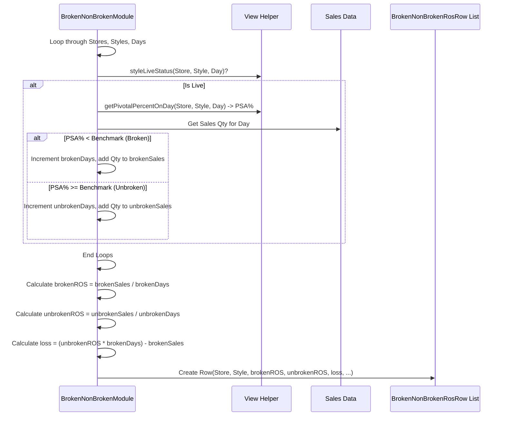

# Chapter 56: Gap Analysis Module

Welcome! In the [previous chapter](55_discounting_rules___levels_.md), we saw how **Discounting Rules & Levels** provide the configurable "brain" for making automated pricing decisions. We've now planned our assortment, figured out how much to buy, how to distribute it, and even how to potentially discount it.

But how do we know if our plans are actually working? Did the products we thought were essential ("NOOS") actually stay in stock? Did we have the right sizes available when customers wanted them? Did running out of popular sizes hurt our overall sales for a style? We need a way to compare our *plan* or *ideal scenario* against the *reality* of what happened in the stores.

## What Problem Does This Module Solve?

Imagine you meticulously planned a beautiful garden layout in the spring (your assortment plan). You decided which flowers (styles) were essential, where each should go, and how many of each type you needed. Now, at the end of summer, you look at the garden. Some parts are perfect, but others... not so much.
*   The prize-winning roses (NOOS items) you wanted to always have blooming had periods where they weren't available. Why? (NOOS Availability Gap)
*   You planned for lots of red tulips (Pivotal sizes), medium yellow tulips (Non-Pivotal), and just a few purple ones (Exit sizes). But looking back, the purple ones sold out instantly while the red ones are still sitting there. Did your size plan match reality? (Size Set Performance Gap)
*   You notice the flower beds where the popular red tulips ran out look sparse and didn't perform as well overall compared to beds where all colors were available. How much "beauty" (sales) did you lose because key colors were missing? (Broken Size Set Impact)

This process of comparing the plan to reality and identifying these differences is **Gap Analysis**.

The **Gap Analysis Module** in `irisx-algo`, orchestrated by `GapAnalysisGroupModule`, solves this problem for retail assortments. It systematically compares planned ideals or benchmarks against actual performance data to pinpoint discrepancies ("gaps"). It helps answer questions like:
*   "How often were our key NOOS items actually available in stores?"
*   "Did the sales performance of different sizes match our Ideal Size Set (ISS) plan?"
*   "Did having poor availability of important sizes (a 'broken' size set) negatively impact the sales rate of a style, and by how much?"

Identifying these gaps provides crucial feedback to improve future planning cycles.

## Core Concepts

The module performs several types of analysis, often executed by specific sub-modules:

1.  **NOOS Availability Gap (`NoosGapAnalysisModule`):**
    *   **Goal:** Check if styles identified as Core or Bestseller ([Chapter 21](21_noos_identification__noosgroupmodule__.md)) were consistently available in stores.
    *   **How:** Compares the list of NOOS styles against daily inventory availability data ([View](10_view_.md)) for each store. It counts how many NOOS styles met a minimum availability threshold (e.g., key sizes were present) on each day or over a period.
    *   **Output:** Reports showing the percentage or count of NOOS styles available over time per store.

2.  **Size Set Performance Gap (`SizeSetComparisonModule`):**
    *   **Goal:** Compare the planned or available quantity of each size against its actual sales performance, considering its ISS tag (P/NP/E from [Chapter 27](27_pivotal_tag___pivotalrow_.md)).
    *   **How (based on code):** Compares the total quantity potentially bought or available (`buyQty`, calculated from sales + final inventory) against the quantity sold during periods considered "unbroken" (`unbrSalesQty`). This highlights sizes where availability didn't translate into proportional sales, or vice-versa.
    *   **Output:** Data (`GapSizeSetRow`) showing `buyQty` vs. `unbrSalesQty` per Store-AG-Size.

3.  **Broken Size Set Impact (`BrokenNonBrokenModule`):**
    *   **Goal:** Quantify the potential lost sales caused by poor availability of key sizes.
    *   **How:**
        *   Defines a "healthy" or "unbroken" state for a style in a store on a given day (e.g., when the percentage of Pivotal sizes available (PSA %) is above a benchmark - `issBenchMark` in `GapAnalysisArgs`). Days below the benchmark are "broken".
        *   Calculates the Rate of Sale (ROS) separately for "unbroken" days and "broken" days.
        *   Compares the two ROS values. If `unbrokenROS > brokenROS`, it suggests sales suffer when key sizes are missing.
        *   Estimates lost sales: `Lost Qty ≈ (Unbroken ROS - Broken ROS) * Number of Broken Days`.
    *   **Output:** Data (`BrokenNonBrokenRosRow`) comparing broken vs. unbroken ROS and estimating lost quantity.

## How It Works (The Workflow)

The `GapAnalysisGroupModule` orchestrates these different analyses. It's typically run after a sales period when historical sales and inventory data are available, along with the planning results (like NOOS lists and ISS tags) for that period.

**Orchestration by `GapAnalysisGroupModule`:**
1.  Run `NoosGapAnalysisModule`: Checks NOOS availability.
2.  Run `SizeSetComparisonModule`: Compares buy/available quantity vs. sales by size.
3.  Run `BrokenNonBrokenModule`: Compares ROS in broken vs. unbroken states and estimates lost sales.

**Inputs:**
*   **Historical Sales Data:** ([ProductSalesRow](13_productsalesrow_.md)).
*   **Historical Inventory/Availability Data:** Access via the [View](10_view_.md) helper (using data from [Inventory Creation Module](20_inventory_creation_module_.md)) or specific snapshots like `InvKeyFrameRow`.
*   **NOOS Identification Results:** ([NoosRow](21_noos_identification__noosgroupmodule__.md)).
*   **Ideal Size Set (ISS) Results:** ([PivotalRow](27_pivotal_tag___pivotalrow_.md)).
*   **Configuration (`GapAnalysisArgs`):** Defines date ranges for analysis, benchmarks (like `issBenchMark` for brokenness), minimum live days for NOOS checks, etc.
*   Product/Store Master Data ([Cache](05_cache_.md)).

**Outputs:**
Each sub-module produces specific output rows detailing its findings:
*   `NoosStoreAvailablityRow`: Daily count of available NOOS styles per store.
*   `StoreNoosCountRow`: Count of NOOS styles meeting minimum live days per store.
*   `GapSizeSetRow`: Comparison of available/buy quantity vs. sales quantity per Store-AG-Size.
*   `BrokenNonBrokenRosRow`: Comparison of ROS in broken vs. unbroken states and estimated lost sales per Store-Style.
*   Denormalized export versions of these outputs (e.g., `ExportGapSizeSetRow`, `ExportGapBrokenNonBrokenRosRow`) for reporting.

## Under the Hood: Digging into the Sub-Modules

Let's briefly look at the core logic of each sub-module.

**1. `NoosGapAnalysisModule`:**
   *   Identifies the list of NOOS styles (Core/Bestseller).
   *   Loops through stores and days within the analysis period.
   *   For each day/store, uses the [View](10_view_.md) helper (`view.getPivotalPercentOnDay`) to check the availability of pivotal sizes for each NOOS style.
   *   If the availability (PSA %) meets a benchmark (`gapArgs.issBenchMark`), it increments a counter for that store/day.
   *   Outputs the daily counts (`NoosStoreAvailablityRow`) and aggregates counts for stores meeting minimum criteria (`StoreNoosCountRow`).

```java
// Simplified logic from NoosGapAnalysisModule.computeNoosAvailableAtStore()
while (day.isBefore(end)) {
    for (int store : stores) {
        for (int style : noosStyles) { // Loop through NOOS styles
            // Get Pivotal Size Availability % for this day/store/style
            double psa = view.getPivotalPercentOnDay(style, store, day);
            // If PSA meets the benchmark...
            if (Double.compare(psa, gapArgs.issBenchMark) > 0) {
                // Increment count of available NOOS styles for this store/day
                int count = noosAvailablityMap.getOrDefault(new Key(store, day), 0);
                noosAvailablityMap.put(new Key(store, day), count + 1);
                // Also track total live days for the style/store
                int noOfDays = noosLiveDaysMap.getOrDefault(new Key(style, store), 0);
                noosLiveDaysMap.put(new Key(style, store), noOfDays + 1);
            }
        }
    }
    day = day.plusDays(1);
}
// Convert noosAvailablityMap to NoosStoreAvailablityRow
// Convert noosLiveDaysMap + minLiveDays check to StoreNoosCountRow
```
**Explanation:** It checks daily availability of NOOS styles using `view.getPivotalPercentOnDay` and counts how many meet the benchmark per store.

**2. `SizeSetComparisonModule`:**
   *   Loads ISS results (`PivotalRow`) into `pivotalOutputMap`.
   *   Loads ending inventory (`InvKeyFrameRow`) for the period into `inventoryMap`.
   *   Loads sales data (`ProductSalesRow`) grouped by Store-AG into `agSalesMap`.
   *   Iterates through `agSalesMap`:
        *   Calculates total quantity sold per size (`sizeSetData.addToSizeBuyMap`).
        *   Looks up the 'adjusted contribution %' (`pivRow.adjContri`) for each size from the ISS results.
        *   Calculates an 'unbroken quantity' target (`unBrQty`) per size, likely by distributing the total Store-AG sales proportionally based on the ISS `adjContri`. (`sizeSetData.addToUnBrQty`).
   *   Adds ending inventory to the `sizeSetData.sizeBuyMap`.
   *   Outputs `GapSizeSetRow` comparing `sizeBuyMap` (Sales + Inventory) against `unBrQty` (ISS-driven sales expectation) for each size.

```java
// Simplified logic from SizeSetComparisonModule.computeSizeSalesQty() & addInventoryQuantity()

// Compute Sales Qty per Size
agSalesMap.forEach((storeAgKey, sales) -> {
    SizeSetData sizeSetData = /* Get/Create SizeSetData for storeAgKey */;
    // Group sales by size and sum quantity sold
    Map<Key, List<ProductSalesRow>> sizeSalesMap = /* Group sales by size */;
    sizeSalesMap.forEach((sizeKey, sizeSales) -> {
        sizeSetData.addToSizeBuyMap(sizeKey.part(0), ProductSalesUtil.getTotalQtySold(sizeSales));
    });

    // Compute 'Unbroken' (ISS expected) Qty per Size
    int storeSales = ProductSalesUtil.getTotalQtySold(sales);
    Map<String, PivotalRow> sizePivRowMap = pivotalOutputMap.getOrDefault(storeAgKey, Collections.emptyMap());
    sizePivRowMap.forEach((size, pivRow) -> {
        // UnBrQty = TotalSales * ISS Adjusted Contribution %
        sizeSetData.addToUnBrQty(size, MathUtil.divide(storeSales * pivRow.adjContri, 100.0));
    });
});

// Add Inventory Qty per Size
inventoryMap.forEach((storeSkuKey, qty) -> {
    // ... find store, ag, size from storeSkuKey ...
    SizeSetData sizeSetData = sizeSetDataMap.get(new Key(store, ag));
    if (sizeSetData != null) {
        sizeSetData.addToSizeBuyMap(size, qty); // Add inventory to sales qty
    }
});

// Write Output: For each SizeSetData, create GapSizeSetRow(store, ag, size, sizeBuyMap.get(size), unBrQtyMap.get(size))
```
**Explanation:** This module calculates total sales per size and adds ending inventory to get a `buyQty`. It also calculates an expected sales quantity (`unBrQty`) based on the Ideal Size Set contribution percentages. The output compares these two quantities for each size.

**3. `BrokenNonBrokenModule`:**
   *   Loops through stores, styles, and days in the analysis period.
   *   For each day, checks `view.styleLiveStatus` to see if the style was available.
   *   If live, checks `view.getPivotalPercentOnDay` (PSA) against the `gapArgs.issBenchMark`.
   *   Increments `brokenDayCount` and sums sales (`brSalesQty`) if PSA < benchmark.
   *   Increments `unBrokenDayCount` and sums sales (`unBrSalesQty`) if PSA >= benchmark.
   *   After looping through all days, calculates `brokenDayRos = brSalesQty / brokenDayCount` and `unBrokenDayRos = unBrSalesQty / unBrokenDayCount`.
   *   Calculates estimated `loss = (unBrokenDayRos * brokenDayCount) - brSalesQty`.
   *   Outputs `BrokenNonBrokenRosRow` with these metrics.

```java
// Simplified logic from BrokenNonBrokenModule.createBrokenMetadata() & calculateRos()
while (day.compareTo(end) <= 0) {
    for (int style : /* styles */)
        for (int store : /* stores */) {
            // Check if style was live on this day in this store
            if (!view.styleLiveStatus(style, day, Optional.of(store))) continue;

            // Get sales qty for this day/store/style
            int totalQty = /* get sales qty from salesMap */;
            // Get Pivotal Size Availability %
            double psa = view.getPivotalPercentOnDay(style, store, day);

            // Get/Create metadata object for this store-style
            BrokennessMetadata metadata = brokennessMetadataMap.computeIfAbsent(/*...*/);

            // Increment counters based on PSA vs benchmark
            if (Double.compare(psa, gapArgs.issBenchMark) < 0) { // Broken
                metadata.incrementBrokenDays().addToBrSalesQty(totalQty);
            } else { // Unbroken (Healthy)
                metadata.incrementUnBrokenDays().addToUnBrSalesQty(totalQty);
            }
        }
    day = day.plusDays(1);
}

// After looping through all days...
brokennessMetadataMap.forEach((storeStyleKey, metadata) -> {
    // Calculate ROS for broken and unbroken periods
    metadata.setBrokenDayRos(MathUtil.divide(metadata.getBrSalesQty(), metadata.getBrokenDayCount()));
    metadata.setUnBrokenDayRos(MathUtil.divide(metadata.getUnBrSalesQty(), metadata.getUnBrokenDayCount()));
    // Calculate estimated loss
    metadata.setLoss(metadata.getUnBrokenDayRos() * metadata.getBrokenDayCount() - metadata.getBrSalesQty());
});
// Convert metadata map to BrokenNonBrokenRosRow output
```
**Explanation:** The code iterates through days, checks PSA, and aggregates sales and day counts into "broken" and "unbroken" buckets. Finally, it calculates the ROS for each state and estimates the potential sales lost during the "broken" periods.

**Sequence Diagram (Conceptual Broken/Unbroken ROS):**


## Conclusion

The **Gap Analysis Module**, orchestrated by `GapAnalysisGroupModule`, provides critical feedback on assortment and inventory performance by comparing plans and benchmarks against actual results.

*   It identifies **gaps** in **NOOS item availability**, highlighting where essential products weren't accessible to customers.
*   It analyzes **size-level performance**, comparing available/bought quantities against expected sales based on the Ideal Size Set (ISS).
*   It quantifies the impact of **"broken" size sets** (poor availability of key sizes) by comparing sales rates (ROS) in healthy vs. broken periods and estimating potential lost sales.
*   The insights generated help planners understand *why* performance deviated from the plan and inform adjustments for future **assortment planning, size curve definition, and inventory management**.

By systematically identifying these discrepancies, the Gap Analysis module closes the loop between planning and execution, driving continuous improvement in assortment strategy.

Now that we've analyzed gaps, how can we visualize the *intended* assortment in a store? This leads us to the concept of planograms.

[Next Chapter: Planogram Creation Module](57_planogram_creation_module_.md)
```

---

Generated by [AI Codebase Knowledge Builder](https://github.com/The-Pocket/Tutorial-Codebase-Knowledge)