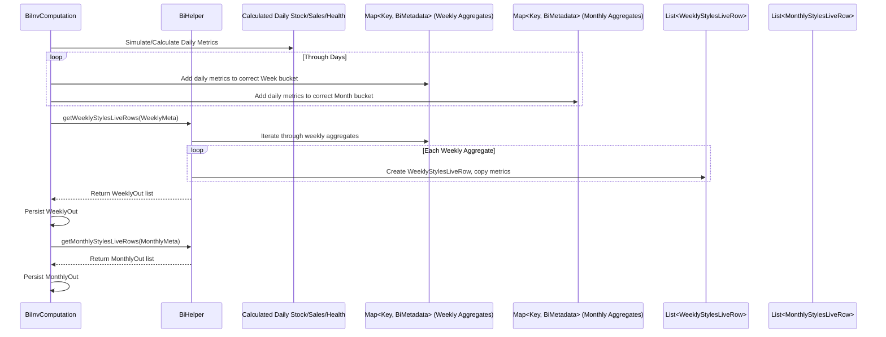

# Chapter 59: BI Data Preparation Module

Welcome back! In the [previous chapter](58_denormalization_helpers_.md), we learned about **Denormalization Helpers**. These handy tools take the ID-heavy outputs from our planning modules and make them readable by adding descriptive information like store names, categories, and brands. This is great for creating detailed operational reports.

But what if we want to see the bigger picture? How did sales trend week over week? Which categories performed best last month? How did inventory levels change across different regions? Answering these questions often requires looking at data summarized over time and sliced in different ways, which is the domain of **Business Intelligence (BI)** tools (like Tableau, Power BI, Qlik, etc.).

## What Problem Does This Module Solve?

The detailed, denormalized outputs we just discussed might contain hundreds of thousands or even millions of rows, sometimes representing daily activity or specific transactions. Loading this massive amount of granular data directly into a BI tool can be very slow and inefficient. BI tools work best when they have data that's already **summarized** and **structured** for analysis, often in a "star schema" or similar format.

Imagine you have a very detailed diary logging every single thing you did every minute of every day for a year (like our raw algorithm outputs). If someone asks "How many hours did you sleep on average each week last month?", you wouldn't hand them the entire diary! You'd first go through it, calculate the weekly sleep totals, and then give them a simple summary table.

The **BI Data Preparation Module** does exactly this for our retail data. It solves the problem of transforming the detailed, operational outputs from various `irisx-algo` modules into a format specifically optimized for BI tools. It aggregates data into **weekly and monthly summaries** and structures it so that business users can easily create dashboards and reports to analyze trends, compare performance, and gain insights without needing to process the raw, granular data themselves.

## Core Idea: Aggregating and Structuring for Analysis

Think of this module as a specialized report preparer whose only job is to get data ready for BI dashboards. It takes information from many different places and cooks it down into easily digestible summaries.

Key actions include:

1.  **Time Aggregation:** Takes daily data (like sales, stock levels, days an item was available and "healthy") and aggregates it into **weekly** and **monthly** totals or averages. This significantly reduces the number of rows.
2.  **Data Combination:** Pulls together various metrics for each summary period. For a specific Style in a specific Store for a specific Week, it might calculate:
    *   Total Sales Quantity (Online/Offline)
    *   Total Sales Revenue (Online/Offline)
    *   Average Discount % (Online/Offline)
    *   Net Revenue & Cost of Goods Sold (COGS)
    *   Number of Days Live / Healthy Days Live
    *   Closing Stock Quantity
    *   Health Status at end of period
3.  **Denormalization (Built-in):** Like the denormalization helpers, it includes relevant descriptive attributes (Store Name, Channel, Region, Category, Brand, Style Code, MRP etc.) directly in the summary rows.
4.  **Structured Output:** Creates specific output tables (like `WeeklyStylesLiveRow`, `MonthlyStylesLiveRow`) with a consistent structure designed to be easily loaded and understood by BI platforms. The aggregation level is typically **Style-Store-Week** or **Style-Store-Month**.

The goal is to create comprehensive, pre-summarized rows that contain everything needed for common BI analyses, reducing the load on the BI tool and making reporting faster and easier.

## How It Works (The Workflow)

This preparation process is usually managed by the `BiOutputGroupModule`. It typically runs after the main planning calculations and potentially after inventory depletion simulations, as it needs access to historical or projected stock and sales data.

**Orchestration by `BiOutputGroupModule`:**
1.  **Load Inputs (`BiLoadModule`):** Gathers all necessary source data, including sales, returns, net sales figures, inventory snapshots (`InvKeyFrameRow`), planograms (`BiPlanogramRow`), health benchmarks (`BiSizeSetRow`), retail calendar (`RetailWeekRow`), and master data.
2.  **Compute Inventory & Live Days (`BiInvComputation`):** This crucial step often re-calculates or simulates daily inventory levels and determines "live" and "healthy" days specifically for the time range and granularity needed for BI reporting (e.g., over the past year, potentially using logic similar to [InventoryComputationUtil](19_inventorycomputationutil_.md)). It determines the closing stock for each period and identifies which days contribute to "healthy" vs. "raw" sales metrics.
3.  **Aggregate & Format (`BiHelper`):** Takes the daily computed data (stock, sales, health status) and aggregates it into weekly and monthly buckets. It combines this with master data and formats it into the final BI output rows (`WeeklyStylesLiveRow`, `MonthlyStylesLiveRow`, etc.).
4.  **Snapshot & Sync (`UtilOutputSnapshotModule`, `UtilOutputSyncModule`):** Standard steps to manage input data consistency and upload the final output files.

**Inputs:**
*   Various transaction data (e.g., `BiSalesRow`, `BiReturnsRow`, `NetSalesRow`).
*   Inventory Snapshots (`InvKeyFrameRow`).
*   BI Planograms (`BiPlanogramRow`).
*   BI Health Benchmarks (`BiSizeSetRow`).
*   Retail Calendar (`RetailWeekRow`).
*   Product & Store Master Data ([Cache](05_cache_.md)).
*   Configuration (`BiArgs`) defining analysis duration, end dates, etc.

**Outputs:**
The module produces several structured tables ready for BI consumption:
*   **`WeeklyStylesLiveRow`:** Contains weekly aggregated metrics (Sales Qty/Rev, Live Days, Healthy Days, Closing Stock, Discounts, COGS, Net Revenue) per Style-Store.
*   **`MonthlyStylesLiveRow`:** Contains monthly aggregated metrics per Style-Store.
*   **`TopsellerStylesRow`:** Aggregated monthly performance per Style-Channel, potentially used to rank top sellers.
*   **`BiEndDateHealthRow`:** Indicates if a Style-Store was considered "healthy" based on availability on the final day of the analysis period.
*   **(Potentially) `BiRefreshHistoryRow`:** A highly denormalized, possibly daily or transactional feed combining many attributes for detailed drill-down in BI tools (structure not fully shown in provided snippets).

These tables are designed to be loaded directly into a data warehouse or BI tool.

## Under the Hood: Computation and Formatting

The process relies on computing the necessary daily states and then using a helper to aggregate and format the final rows.

**1. Orchestration (`BiOutputGroupModule.java`):**
   This module defines the sequence.

   ```java
   // File: src/main/java/com/increff/irisx/module/BiOutputGroupModule.java
   package com.increff.irisx.module;

   import com.increff.irisx.module.bi.*;
   import org.springframework.beans.factory.annotation.Autowired;
   import org.springframework.stereotype.Component;
   import javax.annotation.PostConstruct;

   @Component
   public class BiOutputGroupModule extends AbstractUtilModuleGroup {

       @Autowired private BiLoadModule biLoadModule; // Loads specific BI inputs
       @Autowired private BiInvComputation biInvComputation; // Computes daily state for BI
       @Autowired private UtilOutputSnapshotModule utilOutputSnapshotModule;
       @Autowired private UtilOutputSyncModule utilOutputSyncModule;

       @PostConstruct
       public void init() {
           // Sequence: Load BI Inputs -> Snapshot -> Compute -> Sync Output
           add(biLoadModule);
           captureSnapshot();
           add(biInvComputation); // <<< Core computation happens here
           uploadOutput();
       }
       // ... standard capture/upload methods ...
   }
   ```
   **Explanation:** It ensures BI-specific inputs are loaded first, then runs the `BiInvComputation` module to calculate the necessary metrics, and finally syncs the generated output files.

**2. Core Computation (`BiInvComputation.java`):**
   This module performs the heavy lifting of calculating daily stock, live days, and potentially health status, similar to other inventory computation modules. It also aggregates sales/returns data daily.

   ```java
   // Simplified steps within BiInvComputation.runInternal()

   // 1. init(properties): Load master data, BI inputs (Planograms, SizeSets), sales, returns etc.
   init(properties);

   // 2. initSaleMetadataMap(): Aggregate raw sales/returns per Style-Store-Day
   initSaleMetadataMap(); // Creates saleMetadataMap, returnMetadataMap

   // 3. computeInv(): Run inventory simulation (like InventoryComputationUtil)
   //    - Uses InvKeyFrameRow as starting points.
   //    - Simulates daily stock using aggregated sales/returns.
   //    - Populates 'liveDayMap' (Sku -> Day -> Set<Store> live)
   //    - Calculates closing stock for each day ('closingStockMap')
   computeInv(quantumStartDate, biArgs.biStoredProcEndDate);

   // 4. Aggregate into Time Buckets (Weekly/Monthly) & Determine Health
   //    (This logic is often embedded within or called after computeInv,
   //     populating weeklyMetadataMap and monthlyMetadataMap)
   //    - Loop through days, get stock, sales, returns for Style-Store
   //    - Check health status based on BiSizeSetRow benchmarks & availability
   //    - Accumulate metrics into weekly/monthly BiMetadata objects
   aggregateMetricsIntoTimeBuckets(); // Conceptual step

   // 5. Call Helper to Format Output Rows & Persist
   //    - Uses biHelper to convert weeklyMetadataMap -> WeeklyStylesLiveRow List
   //    - Uses biHelper to convert monthlyMetadataMap -> MonthlyStylesLiveRow List
   //    - Uses biHelper to convert health status -> BiEndDateHealthRow List
   //    - Uses biHelper to aggregate for TopsellerStylesRow List
   ArrayList<WeeklyStylesLiveRow> weeklyOutput = biHelper.getWeeklyStylesLiveRows(weeklyMetadataMap);
   biHelper.persistOutputAndClear(WeeklyStylesLiveRow.class, weeklyOutput);
   // ... persist other output types similarly ...
   ```
   **Explanation:** `BiInvComputation` first loads all necessary data. It aggregates sales/returns daily. It then runs a core inventory simulation to determine daily stock and live days over the required BI period. As it simulates or in a subsequent step, it checks health benchmarks and aggregates all metrics (stock, sales, returns, live days, healthy days, discounts, COGS) into weekly and monthly `BiMetadata` objects stored in maps. Finally, it calls the `BiHelper` to format these metadata objects into the final output row types and saves them.

**3. Formatting Output (`BiHelper.java`):**
   This helper class contains methods to translate the aggregated data held in `BiMetadata` objects into the specific structures of the output rows.

   ```java
   // Simplified from BiHelper.java
   @Component
   public class BiHelper {
       @Autowired private ImDbService imDbService; // To persist outputs

       // Converts weekly aggregated metadata into output rows
       public ArrayList<WeeklyStylesLiveRow> getWeeklyStylesLiveRows(Map<Key, BiMetadata> weeklyMetadataMap) {
           ArrayList<WeeklyStylesLiveRow> weeklyStylesLiveRows = new ArrayList<>();
           // Loop through the map containing weekly aggregations
           weeklyMetadataMap.forEach((key, metadata) -> { // Key(Style, Store, WeekEndDate)
               // Create the output row object
               WeeklyStylesLiveRow row = new WeeklyStylesLiveRow(
                       (int) key.part(1), // store
                       (int) key.part(0), // style
                       (LocalDate) key.part(2)); // weekEndDate

               // --- Copy aggregated values from BiMetadata to the row ---
               row.daysLive = metadata.getDaysLive().size();
               row.healthyDaysLive = metadata.getHealthyDaysLive().size();
               row.closingQty = metadata.getClosingStock();
               row.isClosingStockHealthy = metadata.isClosingStockHealthy();
               row.offlineRawQty = metadata.getOfflineRawQty();
               row.onlineRawQty = metadata.getOnlineRawQty();
               row.offlineRawRevenue = metadata.getOfflineRawRevenue();
               row.onlineRawRevenue = metadata.getOnlineRawRevenue();
               row.offlineHealthyRevenue = metadata.getOfflineHealthyRevenue();
               row.onlineHealthyRevenue = metadata.getOnlineHealthyRevenue();
               row.offlineHealthyQty = metadata.getOfflineHealthyQty();
               row.onlineHealthyQty = metadata.getOnlineHealthyQty();
               row.offlineDisc = metadata.getOfflineDiscount();
               row.onlineDisc = metadata.getOnlineDiscount();
               row.offlineCogs = metadata.getOfflineCogs();
               row.offlineNetRevenue = metadata.getOfflineNetRevenue();
               row.onlineCogs = metadata.getOnlineCogs();
               row.onlineNetRevenue = metadata.getOnlineNetRevenue();

               weeklyStylesLiveRows.add(row); // Add formatted row to the list
           });
           return weeklyStylesLiveRows;
       }

       // Similar method getMonthlyStylesLiveRows for monthly data...
       // Method getTopsellerStylesRows aggregates monthly data further by Channel...
       // Method getBiEndDateHealthRows extracts health status...

       // Helper to persist the final list
       public <T> void persistOutputAndClear(Class<T> clazz, ArrayList<T> list) {
           imDbService.truncateInsert(clazz, list); // Efficiently save
           imDbService.persistTable(clazz);
           imDbService.clearTable(clazz); // Clear from memory
       }
   }
   ```
   **Explanation:** The `getWeeklyStylesLiveRows` method takes the `weeklyMetadataMap` (where `BiMetadata` holds the summed-up weekly stats for each Store-Style). It iterates through this map, creates a `WeeklyStylesLiveRow` for each entry, and copies all the aggregated metrics from the `BiMetadata` object into the corresponding fields of the `WeeklyStylesLiveRow`. It returns the final list, which is then persisted by the calling module using `persistOutputAndClear`. Similar logic applies to creating the monthly rows.

**Sequence Diagram (Conceptual Aggregation and Formatting):**



## Conclusion

The **BI Data Preparation Module**, coordinated by `BiOutputGroupModule`, is responsible for transforming detailed operational and planning data into formats optimized for Business Intelligence tools.

*   It **aggregates** granular data (like daily sales, stock, availability, health status) into **weekly and monthly summaries** at the **Style-Store** level.
*   It combines performance metrics with descriptive master data attributes in structured output rows (like **`WeeklyStylesLiveRow`**, **`MonthlyStylesLiveRow`**).
*   The core work often involves running an inventory simulation (`BiInvComputation`) to get accurate daily states before aggregation, followed by formatting helpers (`BiHelper`).
*   This process provides **pre-summarized, BI-ready data**, enabling faster analysis, easier dashboard creation, and better business insights into trends and performance over time.

By preparing data specifically for analysis, this module makes it much easier for business users to leverage the rich information generated by `irisx-algo`.

Besides structured data outputs for BI tools, sometimes we need specific, formatted reports, like identifying top-selling products.

[Next Chapter: Top Seller PDF Report Generation](60_top_seller_pdf_report_generation_.md)
```

---

Generated by [AI Codebase Knowledge Builder](https://github.com/The-Pocket/Tutorial-Codebase-Knowledge)