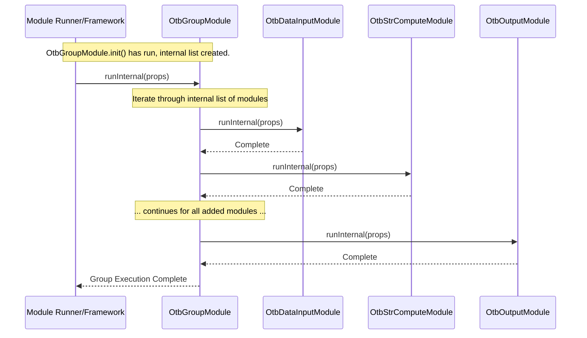

# Chapter 61: Abstract Module Group

Welcome back! In the [previous chapter](60_top_seller_pdf_report_generation_.md), we saw how to create polished PDF reports summarizing key performance data. We've now explored many different modules in `irisx-algo`, each performing a specific task like calculating inventory, identifying NOOS items, figuring out width/depth, generating reports, and much more.

But often, a complete business process involves running *several* of these individual modules in a specific order. Take the "Open To Buy" calculation ([Chapter 36: OTB Calculation (OtbGroupModule)](36_otb_calculation__otbgroupmodule__.md)) as an example. It's not just one calculation; it involves multiple steps:
1.  Calculate based on Sell-Through Rate (STR).
2.  Adjust for Minimum Order Quantities (MOQ).
3.  Adjust for Style Options/Display Minimums.
4.  Split quantities across delivery Drops.
5.  Generate the final output.

How do we ensure these steps always run together, in the correct sequence, every time we want to perform the OTB calculation? Telling the system to run each module individually would be cumbersome and error-prone.

## What Problem Does Abstract Module Group Solve?

Imagine you have a complicated recipe, like baking a layered cake. The recipe has distinct steps: bake the layers, make the frosting, make the filling, assemble the cake, decorate. You wouldn't think of these as completely separate tasks; they are all part of the single goal of "making the cake". The recipe itself *groups* these steps together in the right order.

Similarly, many workflows in `irisx-algo` consist of multiple related modules that need to be executed as a single unit. The **Abstract Module Group** concept solves the problem of managing these multi-step workflows. It provides a way to **define a logical group of modules that represent a larger process** (like OTB Calculation or Distribution).

It acts like the master recipe card, listing the necessary steps (sub-modules) in the correct order and providing a way to run the entire sequence with a single command.

## Core Idea: Orchestrating a Sequence of Modules

The `AbstractModuleGroup` (and its common descendant in `irisx-algo`, `AbstractUtilModuleGroup`) provides a base blueprint for creating these "master recipe" modules. A specific group module (like `OtbGroupModule`, `NoosGroupModule`, or `DistributionGroupModule`) **extends** this base class.

The core responsibilities of a concrete module group are:

1.  **Define the Sequence:** Specify the exact order in which its sub-modules should run.
2.  **Provide Common Hooks (Optional):** Often includes standard steps that should happen before (`captureSnapshot`) and after (`uploadOutput`) the main sequence runs, ensuring data consistency.
3.  **Act as a Single Entry Point:** Allows external systems (like the [Module Runner](04_module_runner_.md) or job schedulers) to trigger the entire complex workflow by simply calling the single group module.

Think of `AbstractModuleGroup` as a template for creating playlists. Concrete group modules like `OtbGroupModule` are specific playlists (like "Workout Mix") that list the individual songs (sub-modules like `OtbStrComputeModule`, `OtbMoqAdjustmentModule`) in the desired playback order.

## How It Works: Defining a Group Module

Let's look at how `OtbGroupModule` uses this pattern (referencing the code from its chapter context).

**1. Inheritance:** The concrete group module inherits from the base group class.

```java
// File: src/main/java/com/increff/irisx/module/OtbGroupModule.java
package com.increff.irisx.module;

import com.increff.iris.commons.module.AbstractModuleGroup; // Base class from iris-commons
// Or potentially: import com.increff.irisx.module.AbstractUtilModuleGroup; // Local base class

// OtbGroupModule IS-A type of AbstractUtilModuleGroup
public class OtbGroupModule extends AbstractUtilModuleGroup {
    // ... content ...
}
```
**Explanation:** `OtbGroupModule` extends `AbstractUtilModuleGroup`, inheriting the basic structure and functionality needed to manage a sequence of modules. (`AbstractUtilModuleGroup` itself likely extends `AbstractModuleGroup` from the `iris-commons` library).

**2. Injecting Sub-Modules:** The group needs access to the individual modules it will orchestrate. This is done using `@Autowired`.

```java
// File: src/main/java/com/increff/irisx/module/OtbGroupModule.java

// Imports for all the OTB sub-modules
import com.increff.irisx.module.otb.*;
import org.springframework.beans.factory.annotation.Autowired;
import org.springframework.stereotype.Component;

@Component // Make this group module a manageable Spring bean
public class OtbGroupModule extends AbstractUtilModuleGroup {

    // Ask Spring to provide instances of each required sub-module
    @Autowired private OtbDataInputModule otbDataInputModule;
    @Autowired private OtbStrComputeModule otbStrComputeModule;
    @Autowired private OtbMoqAdjustmentModule otbMoqAdjustmentModule;
    @Autowired private OtbStyleOptionsModule otbStyleOptionsModule;
    @Autowired private OtbDropCalcModule otbDropCalcModule;
    @Autowired private OtbOutputModule otbOutputModule;
    // Also inject standard snapshot/sync modules
    @Autowired private UtilOutputSnapshotModule utilOutputSnapshotModule;
    @Autowired private UtilOutputSyncModule utilOutputSyncModule;

    // ... rest of the class ...
}
```
**Explanation:** Spring's dependency injection automatically finds the beans for `OtbDataInputModule`, `OtbStrComputeModule`, etc., and makes them available within the `OtbGroupModule`.

**3. Defining the Sequence (`init` method with `@PostConstruct`):** This is where the order is specified using the `add()` method (provided by the base class).

```java
// File: src/main/java/com/increff/irisx/module/OtbGroupModule.java

import javax.annotation.PostConstruct; // Annotation to run after creation

// ... inside OtbGroupModule class ...
@PostConstruct // Tells Spring to run this method automatically after injection
public void init() {
    // Optional: Add standard snapshot step first
    add(utilOutputSnapshotModule); // OR captureSnapshot();

    // Add the core OTB modules in the desired order
    add(otbDataInputModule);      // 1. Load Inputs
    add(otbStrComputeModule);     // 2. Calculate STR-based needs
    add(otbMoqAdjustmentModule);  // 3. Adjust for MOQ
    add(otbStyleOptionsModule);   // 4. Adjust for Display/Exit & Styles
    add(otbDropCalcModule);       // 5. Allocate quantities to Drops
    add(otbOutputModule);         // 6. Consolidate & Save Final Outputs

    // Optional: Add standard output sync step last
    add(utilOutputSyncModule);    // OR uploadOutput();
}
```
**Explanation:** The `init()` method, marked with `@PostConstruct`, runs once when the `OtbGroupModule` is created. Inside `init()`, the `add()` method is called repeatedly to build an internal list of modules in the exact order they should be executed: Input -> STR -> MOQ -> StyleOptions -> DropCalc -> Output.

**4. Defining Standard Hooks (`captureSnapshot`, `uploadOutput`):** `AbstractUtilModuleGroup` likely defines these abstract methods, requiring concrete groups to implement them, usually by adding standard utility modules.

```java
// File: src/main/java/com/increff/irisx/module/OtbGroupModule.java

// ... inside OtbGroupModule class ...
@Override
public void captureSnapshot() {
    // Define what happens when captureSnapshot is called
    add(utilOutputSnapshotModule);
}

@Override
public void uploadOutput() {
    // Define what happens when uploadOutput is called
    add(utilOutputSyncModule);
}

// The init() method could also call these:
// @PostConstruct
// public void init() {
//     captureSnapshot(); // Calls the method above
//     add(otbDataInputModule);
//     // ... other core modules ...
//     add(otbOutputModule);
//     uploadOutput(); // Calls the method above
// }
```
**Explanation:** Implementing `captureSnapshot` and `uploadOutput` allows the base framework to potentially call these standard setup/teardown steps around the core module sequence defined in `init()`.

## Using the Group Module

As a user or developer calling the system, you typically don't interact with `AbstractModuleGroup`. You interact with the concrete implementation. When you tell the system to run `OtbGroupModule` (e.g., via the [Module Runner](04_module_runner_.md) test or a job scheduler calling the [Worker API](02_worker_api_.md)), the underlying framework executes the entire sequence defined within `OtbGroupModule`'s `init()` method.

**Triggering the Workflow:**

```bash
# Conceptual command line execution via WorkerApi
java -cp irisx-algo.jar com.increff.irisx.WorkerApi config.properties RUN_ALGO otb_calculation
```
*This conceptually runs `OtbGroupModule`.*

**Expected Outcome:**
The system runs the following modules sequentially:
1. `UtilOutputSnapshotModule`
2. `OtbDataInputModule`
3. `OtbStrComputeModule`
4. `OtbMoqAdjustmentModule`
5. `OtbStyleOptionsModule`
6. `OtbDropCalcModule`
7. `OtbOutputModule`
8. `UtilOutputSyncModule`

The final OTB results are generated and saved.

## Under the Hood: The Execution Engine

How does running the group actually execute the sequence?

1.  **Instantiation:** Spring creates an instance of `OtbGroupModule`.
2.  **Injection:** Spring injects instances of all `@Autowired` sub-modules.
3.  **Initialization:** The `@PostConstruct` `init()` method runs, calling `add()` for each sub-module.
4.  **`add()` Method:** The `add()` method (in the base `AbstractModuleGroup` or `AbstractUtilModuleGroup`) likely adds the provided module instance to an internal `List<AbstractModule>`.
5.  **`runInternal()` Execution:** When `OtbGroupModule` is executed (its own `runInternal` method is called, likely inherited from `AbstractModule`), it iterates through the internal list of added sub-modules.
6.  **Sequential Calls:** For each sub-module in the list, it calls that sub-module's `runInternal()` method, passing necessary context (like `Properties`).
7.  **Completion:** Execution proceeds sequentially through the list until all added sub-modules have completed their `runInternal` method.

**Sequence Diagram (Simplified Group Execution):**



**Code Dive (Conceptual Base Class):**

```java
// Conceptual structure of AbstractModuleGroup from iris-commons

import com.increff.iris.commons.context.ApplicationContext; // For context/properties
import com.increff.iris.commons.module.AbstractModule; // Base for ALL modules
import java.util.ArrayList;
import java.util.List;
import java.util.Properties;

public abstract class AbstractModuleGroup extends AbstractModule { // Also a Module

    // Internal list to hold the sequence
    private final List<AbstractModule> moduleSequence = new ArrayList<>();

    /** Adds a module to the execution sequence */
    protected void add(AbstractModule module) {
        if (module != null) {
            this.moduleSequence.add(module);
            // Optionally set parent context if needed
            // module.setContext(this.getContext());
        }
    }

    /** Executes the defined sequence */
    @Override
    protected void runInternal(Properties properties) throws Exception {
        // Loop through the added modules
        for (AbstractModule module : this.moduleSequence) {
            // Execute each sub-module's runInternal
            logger.info("Running sub-module: " + module.getClass().getSimpleName());
            module.runInternal(properties);
            // Optional: Add checks or cleanup between steps
            // clearDbIfNecessary();
        }
    }

    // cleanUp method might also iterate and call cleanUp on sub-modules
    @Override
    protected void cleanUp() {
        for (AbstractModule module : this.moduleSequence) {
             module.cleanUp();
        }
    }
}
```
**Explanation:** The base `AbstractModuleGroup` holds a `List` (`moduleSequence`). The `add()` method appends modules to this list. The core `runInternal()` method simply iterates through this list and calls `runInternal()` on each sub-module in the order they were added.

## Conclusion

The **Abstract Module Group** pattern provides a clean and standardized way to define and manage multi-step workflows in `irisx-algo`.

*   It allows complex processes (like OTB Calculation, Distribution, NOOS Identification) to be broken down into smaller, focused **sub-modules**.
*   Concrete group modules (e.g., `OtbGroupModule`, `DistributionGroupModule`) **extend** the abstract base class (`AbstractUtilModuleGroup` or `AbstractModuleGroup`).
*   They use dependency injection (`@Autowired`) to get references to sub-modules and the `init()` method (with `@PostConstruct`) to **define the execution sequence** using `add()`.
*   Running the group module automatically **executes the entire sequence** of sub-modules in the defined order.
*   This promotes **modularity, reusability, and easier management** of complex business logic flows.

Understanding how these groups orchestrate sequences is key to seeing how larger processes are constructed from smaller building blocks. But how does the system ensure these modules are run in the *correct overall order* relative to *each other*? How does it know that OTB calculation needs Assortment Plan Output first?

[Next Chapter: Module Dependencies & Validation Mapping](62_module_dependencies___validation_mapping_.md)
```

---

Generated by [AI Codebase Knowledge Builder](https://github.com/The-Pocket/Tutorial-Codebase-Knowledge)