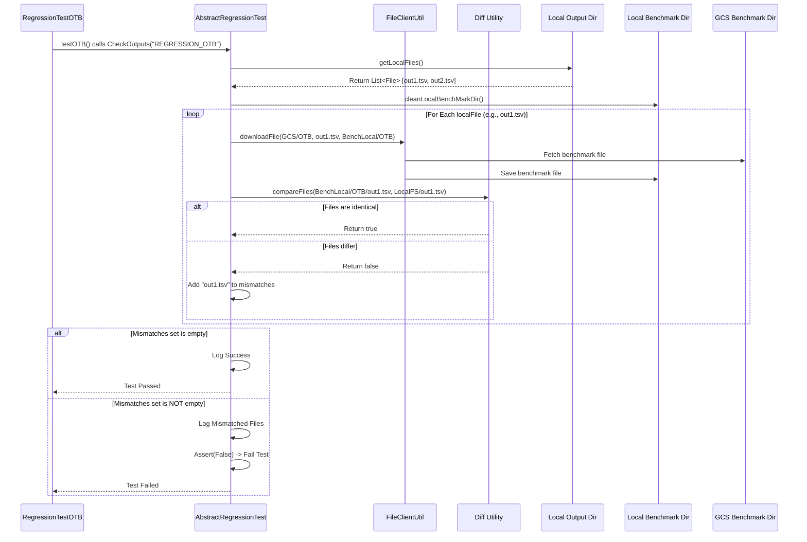

# Chapter 67: Regression Testing Framework

Welcome back! In the [previous chapter](66_file_client_utility_.md), we explored the **File Client Utility**, which helps `irisx-algo` reliably read and write files, especially when dealing with cloud storage like GCS. We've seen how the system is configured, how data flows, and how various complex calculations are performed.

But with so many interconnected modules, how do we make sure everything *keeps* working correctly, especially when developers fix bugs or add new features? Making a change in one part of the code could accidentally cause unexpected problems somewhere else.

## What Problem Does the Framework Solve?

Imagine you've built an incredibly complex, precise watch with hundreds of tiny, interconnected gears (our algorithm modules). It tells perfect time today (produces correct results). Now, a watchmaker needs to replace one small gear, perhaps to make the second hand sweep more smoothly (fixing a bug or adding a feature). After replacing the gear, how can the watchmaker be absolutely sure the watch still tells the *exact same, perfect time*? They can't just wind it up and assume it's okay. They need to compare its new behavior rigorously against its previous, known-good behavior.

Manually testing every single function of `irisx-algo` after every single code change is impossible. It would take days or weeks, and subtle errors in the output files (which can have millions of rows) would be easily missed.

The **Regression Testing Framework** solves this problem. It acts like an **automated watch comparison tool** for `irisx-algo`. Its purpose is to automatically run parts of the algorithm with standard inputs and compare the generated outputs against a set of "golden standard" or "benchmark" results that were previously verified as correct. If the new output exactly matches the benchmark, we have confidence the recent code change didn't break anything. If they don't match, the framework flags the difference, alerting the developer to a potential problem (a "regression").

## Core Idea: Comparing Current Output to a Benchmark

The foundation of regression testing is **comparison against a known good state**.

1.  **Benchmark Creation:** At some point (like after a major release), the system is run with a specific, controlled set of input data. The output files generated are carefully checked and verified. Once confirmed correct, these output files are saved in a secure, central location (like a dedicated folder in Google Cloud Storage - GCS) as the **benchmark** or **golden standard**.
2.  **Test Execution:** When a developer makes code changes, they (or an automated testing system) trigger the regression tests relevant to the areas they modified.
3.  **Setup & Run:** The test framework prepares the environment. It often involves:
    *   Cleaning up any old files from previous test runs.
    *   Downloading the standard **input files** for the test from GCS (using the [File Client Utility](66_file_client_utility_.md)) to a local working directory.
    *   Running the specific `irisx-algo` module or sequence of modules under test (using the [AppApi](01_application_api__appapi__.md)). This run generates new output files in the local working directory.
4.  **Download Benchmark Outputs:** The framework downloads the corresponding **benchmark output files** (the golden standard) from GCS into a separate local directory.
5.  **Compare Files:** Using a specialized file comparison tool (a "diff" utility), the framework meticulously compares each *newly generated output file* against its corresponding *downloaded benchmark file*.
6.  **Report Pass/Fail:**
    *   If *all* output files exactly match their benchmarks, the test **passes**. This indicates the code changes likely did not introduce any regressions.
    *   If *any* difference is found, the test **fails**. The framework typically reports which files differ, helping the developer pinpoint the regression caused by their changes.

## How It Works (The Workflow)

Regression tests in `irisx-algo` are built using standard Java testing tools (JUnit) and a helpful base class provided within the project, `AbstractRegressionTest`.

**1. The Test Class (`RegressionTestOTB.java` Example):**
   A developer creates a specific test class for a major module or workflow.

   ```java
   // Simplified from RegressionTestOTB.java
   package com.increff.irisx.it;

   import com.increff.irisx.constants.ModuleName; // To refer to module names
   import com.increff.irisx.util.AbstractRegressionTest; // Base class!
   import com.increff.irisx.util.ModuleDependents; // To get prerequisites
   import com.increff.irisx.util.ModuleValidations; // To get validations
   import org.junit.Before;
   import org.junit.Ignore; // Often ignored in standard builds, run specifically
   import org.junit.Test;
   import org.springframework.test.context.ActiveProfiles; // Use specific config

   @ActiveProfiles("regression") // <<< Use the regression Spring profile & properties
   @Ignore // <<< Usually run explicitly, not with all unit tests
   public class RegressionTestOTB extends AbstractRegressionTest { // <<< Extends base

       private static final String MODULE_NAME = "REGRESSION_OTB"; // Folder for benchmarks

       @Before // Run before the test method
       public void setup() {
           // Download specific input files needed (like period definitions)
           setInputPeriods(MODULE_NAME);
       }

       @Test // The actual test method
       public void testOTB() throws IOException {
           cleanLocalDir(); // <<< 1. Clean up local output directory

           // --- 2. Run the full OTB workflow ---
           // Get all dependencies and validations needed for OTB
           List<String> moduleNames = new ArrayList<>();
           moduleNames.addAll(ModuleValidations.getValidations(ModuleDependents.getDependentsList(ModuleName.OTB)));
           moduleNames.addAll(ModuleDependents.getDependentsList(ModuleName.OTB));
           // Execute the sequence (DataLoad, Inventory, Validations, NOOS, AG, ISS, OD, OW, OTB)
           run(moduleNames); // Inherited method that calls AppApi

           // --- 3. Compare outputs against benchmark ---
           CheckOutputs(MODULE_NAME); // Inherited method for comparison

           // --- Optional: Run again to check for state issues/memory leaks ---
           // RunAlgoOTB();
           // CheckOutputs(MODULE_NAME);
       }
   }
   ```
   **Explanation:**
   *   `@ActiveProfiles("regression")`: Ensures Spring loads `RegressionSpringConfig` ([Chapter 65](65_spring_configuration_.md)), which likely points to specific GCS buckets and settings in `regression.properties`.
   *   `extends AbstractRegressionTest`: The test class inherits helpful methods (`cleanLocalDir`, `setInputPeriods`, `run`, `CheckOutputs`) from the base class.
   *   `@Before setup()`: Downloads common input files needed before the main run.
   *   `@Test testOTB()`:
        *   Calls `cleanLocalDir()` to start fresh.
        *   Determines the full sequence of modules needed to run OTB, including prerequisites and validations (using utilities from [Chapter 62](62_module_dependencies___validation_mapping__.md)).
        *   Calls the inherited `run(moduleNames)` method. This helper likely ensures standard setup modules (`DATA_LOAD`, `INVENTORY_COMPUTATION`) run first, followed by the provided list, executing each via `AppApi`. This generates the output files locally.
        *   Calls the inherited `CheckOutputs(MODULE_NAME)` method. This triggers the download of benchmarks for "REGRESSION_OTB" from GCS and compares them against the local outputs.

**2. Key Base Class Method (`CheckOutputs`):**
   This method, inherited from `AbstractRegressionTest`, performs the critical comparison.

   ```java
   // Inside AbstractRegressionTest.java (Simplified)
   public void CheckOutputs(String moduleName) throws IOException {
       logger.info("Testing that output is correct for " + moduleName + "...");
       // 1. Find all relevant output files generated locally (e.g., output_*.tsv)
       File[] localFiles = getLocalFiles();

       // 2. Download benchmarks and compare
       Set<String> mismatchedFiles = downloadFilesFromGcpAndMatch(localFiles, moduleName);

       // 3. Report and Assert
       if (!mismatchedFiles.isEmpty()) {
           logger.warn("Number of mismatched files: " + mismatchedFiles.size());
           mismatchedFiles.forEach(file -> logger.error(file + " Is different"));
           // Fail the JUnit test if any files differ
           assertTrue("Mismatch found between local output and benchmark files for " + moduleName, mismatchedFiles.isEmpty());
       } else {
           logger.info("Output is correct for " + moduleName);
       }
   }
   ```
   **Explanation:** `CheckOutputs` orchestrates the comparison: it gets the list of generated files, calls `downloadFilesFromGcpAndMatch` to perform the download and comparison for each file, and then uses `assertTrue` to fail the test if any mismatches were found.

**3. Downloading and Comparing (`downloadFilesFromGcpAndMatch`):**
   This helper method handles the file transfer and the call to the diff utility.

   ```java
   // Inside AbstractRegressionTest.java (Simplified)
   protected Set<String> downloadFilesFromGcpAndMatch(File[] localFiles, String moduleName) throws IOException {
       // Construct paths based on configuration (localDir, benchmarkLocalDir, benchmarkRemoteDir)
       String remoteBenchmarkPath = benchmarkRemoteDir + "/" + moduleName;
       String localBenchmarkPath = benchmarkLocalDir + "/" + moduleName;
       // Ensure the local benchmark directory is clean
       cleanLocalBenchMarkDir(localBenchmarkPath);

       Set<String> mismatchedFiles = new HashSet<>();
       // Loop through each file generated by the algorithm run
       for (File localOutputFile : localFiles) {
           String fileName = localOutputFile.getName();
           // Download the corresponding benchmark file from GCS
           fileClientUtil.downloadFile(remoteBenchmarkPath, fileName, localBenchmarkPath);
           File benchmarkFile = new File(localBenchmarkPath + "/" + fileName);

           // Compare the downloaded benchmark file with the local output file
           boolean filesMatch = Diff.compareFiles(benchmarkFile, localOutputFile);

           // If they don't match, record the filename
           if (!filesMatch) {
               mismatchedFiles.add(fileName);
           }
       }
       return mismatchedFiles; // Return the set of files that failed comparison
   }
   ```
   **Explanation:** For every output file generated locally, this method constructs the paths, cleans the local benchmark destination, downloads the corresponding benchmark file from GCS using `FileClientUtil`, and then calls `Diff.compareFiles`. If `compareFiles` returns `false`, the filename is added to the `mismatchedFiles` set.

## Under the Hood: Base Class, File Client, Diff Utility

The framework relies on three pillars:

1.  **`AbstractRegressionTest`:** Provides the structure and reusable logic for:
    *   Setting up the Spring context (`@ContextConfiguration`).
    *   Accessing core components (`AppApi`, `FileClientUtil`).
    *   Reading configured paths (`@Value`).
    *   Cleaning directories (`cleanLocalDir`).
    *   Running module sequences (`run`).
    *   Orchestrating the output comparison (`CheckOutputs`, `downloadFilesFromGcpAndMatch`).

2.  **`FileClientUtil`:** The utility (from [Chapter 66](66_file_client_utility_.md)) used by `AbstractRegressionTest` to handle the download of benchmark files (and potentially input files) from the configured GCS location (`benchmarkRemoteDir`, `inputRemoteDir`).

3.  **`Diff` Utility (Conceptual):** A specialized utility (likely from a separate library like `common-diff`) responsible for comparing two files. Crucially, it needs to be smart enough to:
    *   Handle large files efficiently.
    *   Potentially ignore irrelevant differences (like timestamps in headers or tiny floating-point rounding variations).
    *   Compare TSV/CSV files field by field, possibly after normalizing number formats.
    *   Report clearly *if* differences are found (though the framework here just cares about the true/false result).

**Sequence Diagram (Simplified `CheckOutputs` Flow):**



## Conclusion

The **Regression Testing Framework** provides an automated and reliable way to verify that changes to the `irisx-algo` codebase do not introduce unintended side effects ("regressions").

*   It uses a base class (`AbstractRegressionTest`) to provide common infrastructure for running tests.
*   Tests typically involve running a specific module workflow with standard inputs fetched from GCS.
*   The framework automatically downloads pre-verified **benchmark output files** from GCS.
*   It uses a **diff utility** to compare the newly generated outputs against the benchmarks.
*   Tests **pass** if outputs match the benchmarks and **fail** if any differences are detected.
*   This automated comparison is crucial for maintaining the **stability, correctness, and quality** of the complex `irisx-algo` system over time.

This framework allows developers to make changes with greater confidence, knowing that a safety net is in place to catch unexpected regressions. This concludes our exploration of the core concepts within the `irisx-algo` project structure!
```

---

Generated by [AI Codebase Knowledge Builder](https://github.com/The-Pocket/Tutorial-Codebase-Knowledge)