# Tutorial: irisx-algo

This project, *irisx-algo*, provides a suite of algorithms for **retail merchandising**. It helps businesses plan their product assortments (*what* to sell), determine inventory levels (*how much* to buy and stock), manage distribution across stores and warehouses, and optimize pricing and discounts. Key functions include calculating historical inventory, identifying core products (NOOS), planning optimal assortment width and depth, managing Open-To-Buy budgets, allocating stock, and suggesting dynamic markdowns based on performance.

**Source Repository:** [None](None)

```mermaid
flowchart TD
    A0["Cache
"]
    A1["View
"]
    A2["ObjectMaps
"]
    A3["MathUtil
"]
    A4["SkuStyleConversionUtil
"]
    A5["InventoryComputationUtil
"]
    A6["Inventory Creation Module
"]
    A7["ProductSalesRow
"]
    A8["ProductSalesUtil
"]
    A9["Attribute Grouping (AgGroupModule & AgComputeModule)
"]
    A10["AgRow
"]
    A11["NOOS Identification (NoosGroupModule)
"]
    A12["NoosParamountSizesModule
"]
    A13["NoosCoreComputeModule
"]
    A14["NoosBestsellerComputeModule
"]
    A15["NoosBsOverrideModule
"]
    A16["Ideal Size Set (ISS) Module (ApIssGroupModule)
"]
    A17["Pivotal Tag / PivotalRow
"]
    A18["Optimum Depth (OD) Module (ApOdGroupModule)
"]
    A19["OD Segmentation
"]
    A20["OD Long Tail Calculation
"]
    A21["OD ASP Calculation
"]
    A22["Optimum Width (OW) Module (ApOwGroupModule)
"]
    A23["OW Initial Width Calculation
"]
    A24["OW Buy Width Adjustment
"]
    A25["Assortment Plan Output (ApOutputGroupModule)
"]
    A26["OTB Calculation (OtbGroupModule)
"]
    A27["OTB Sell-Through Rate (STR) Computation
"]
    A28["OTB Minimum Order Quantity (MOQ) Adjustment
"]
    A29["OTB Style Options Adjustment
"]
    A30["OTB Drop Calculation
"]
    A31["OTB Style Wise Buy Module
"]
    A32["Style Wise to Size Wise Buy Module
"]
    A33["OTB Depletion Module
"]
    A34["Reordering Module
"]
    A35["Distribution Module
"]
    A36["Distribution Data Preparation
"]
    A37["Distribution Segmentation & Ranking
"]
    A38["Distribution Allocation Logic
"]
    A39["Inter-Warehouse Transfer (IWHT) Module
"]
    A40["Inter-Store Transfer (IST) Module
"]
    A41["EOSS Distribution Module
"]
    A42["Story-Based Distribution Modules
"]
    A43["Dynamic Discounting Module
"]
    A44["Discounting Rules & Levels
"]
    A45["Gap Analysis Module
"]
    A46["BI Data Preparation Module
"]
    A47["Planogram Creation Module
"]
    A48["Price Bucket Creation Module
"]
    A49["Validation Framework
"]
    A50["Application API (AppApi)
"]
    A51["Worker API
"]
    A52["Common Data
"]
    A53["Module Dependencies & Validation Mapping
"]
    A54["Top Seller PDF Report Generation
"]
    A55["Data Normalization
"]
    A56["Configuration & Arguments (Args Classes)
"]
    A57["Denormalization Helpers
"]
    A58["File Client Utility
"]
    A59["Spring Configuration
"]
    A60["Abstract Module Group
"]
    A61["Regression Testing Framework
"]
    A62["Module Runner
"]
    A63["Row Input/Output Classes
"]
    A64["Abstract Constants & Language Util
"]
    A65["Enumerations (Enums)
"]
    A66["Depth Suggestion Module
"]
    A50 -- "Can use" --> A62
    A50 -- "Uses" --> A53
    A51 -- "Invokes modules via" --> A50
    A56 -- "Provides parameters to" --> A51
    A6 -- "Provides data for" --> A5
    A5 -- "Stores results in" --> A0
    A1 -- "Reads inventory status from" --> A0
    A8 -- "Operates on" --> A7
    A7 -- "Contains" --> A10
    A7 -- "Provides data for" --> A48
    A9 -- "Generates" --> A10
    A9 -- "Uses master data from" --> A0
    A11 -- "Includes" --> A13
    A11 -- "Includes" --> A14
    A11 -- "Includes" --> A15
    A11 -- "Includes" --> A12
    A13 -- "Uses" --> A8
    A14 -- "Uses" --> A8
    A14 -- "Uses live days from" --> A1
    A15 -- "Applies overrides to" --> A11
    A16 -- "Generates" --> A17
    A16 -- "Uses data from" --> A9
    A16 -- "Uses sales data via" --> A8
    A18 -- "Uses" --> A19
    A18 -- "Uses" --> A20
    A18 -- "Uses" --> A21
    A18 -- "Uses size info from" --> A16
    A19 -- "Uses sales data via" --> A8
    A20 -- "Uses sales data via" --> A8
    A21 -- "Uses sales data via" --> A8
    A22 -- "Uses" --> A23
    A22 -- "Uses" --> A24
    A22 -- "Uses performance data from" --> A18
    A23 -- "Uses OD output rows from" --> A18
    A24 -- "Uses OD output rows from" --> A18
    A25 -- "Consolidates" --> A18
    A25 -- "Consolidates" --> A22
    A26 -- "Uses" --> A27
    A26 -- "Includes" --> A28
    A26 -- "Includes" --> A29
    A26 -- "Includes" --> A30
    A26 -- "Uses data from" --> A25
    A27 -- "Uses" --> A3
    A28 -- "Adjusts buys for" --> A26
    A29 -- "Adjusts options for" --> A26
    A30 -- "Splits buy quantities for" --> A26
    A31 -- "Calculates style buy for" --> A26
    A32 -- "Uses size contributions from" --> A16
    A32 -- "Converts output of" --> A31
    A33 -- "Uses OTB results from" --> A26
    A33 -- "Uses ROS calculated from" --> A8
    A34 -- "Uses ROS from" --> A33
    A34 -- "Identifies items based on" --> A11
    A35 -- "Starts with" --> A36
    A35 -- "Uses rankings from" --> A37
    A35 -- "Executes" --> A38
    A36 -- "Reads master data from" --> A0
    A37 -- "Uses ROS calculation from" --> A8
    A38 -- "Uses width/depth from" --> A25
    A38 -- "May trigger" --> A39
    A38 -- "May trigger" --> A40
    A39 -- "Uses warehouse stock from" --> A0
    A40 -- "Uses store stock from" --> A0
    A41 -- "Is a specialized version of" --> A35
    A42 -- "Is a specialized version of" --> A35
    A43 -- "Uses rules defined in" --> A44
    A43 -- "Uses DOH from" --> A33
    A44 -- "Uses levels from" --> A65
    A45 -- "Analyzes availability using" --> A11
    A45 -- "Compares actual vs ideal using" --> A16
    A46 -- "Uses" --> A57
    A46 -- "Reads data from" --> A0
    A47 -- "Uses width from" --> A22
    A48 -- "Reads MRP from" --> A0
    A49 -- "Uses mappings from" --> A53
    A49 -- "Uses" --> A55
    A54 -- "Formats data using" --> A57
    A54 -- "Uses for labels" --> A64
    A55 -- "Normalizes string constants..." --> A64
    A57 -- "Reads master data from" --> A0
    A58 -- "Used by" --> A61
    A59 -- "Configures" --> A50
    A60 -- "Is base for" --> A26
    A60 -- "Is base for" --> A35
    A61 -- "Runs modules using" --> A50
    A62 -- "Uses" --> A56
    A63 -- "Defines data for" --> A60
    A66 -- "Uses ROS from" --> A33
    A66 -- "Uses" --> A3
    A4 -- "Used by" --> A6
    A2 -- "Creates maps for" --> A0
    A52 -- "Provides period info to" --> A18
    A17 -- "Is defined by" --> A65
```

## Chapters

1. [Application API (AppApi)
](01_application_api__appapi__.md)
2. [Worker API
](02_worker_api_.md)
3. [Configuration & Arguments (Args Classes)
](03_configuration___arguments__args_classes__.md)
4. [Module Runner
](04_module_runner_.md)
5. [Cache
](05_cache_.md)
6. [Common Data
](06_common_data_.md)
7. [Enumerations (Enums)
](07_enumerations__enums__.md)
8. [Abstract Constants & Language Util
](08_abstract_constants___language_util_.md)
9. [Row Input/Output Classes
](09_row_input_output_classes_.md)
10. [View
](10_view_.md)
11. [ObjectMaps
](11_objectmaps_.md)
12. [MathUtil
](12_mathutil_.md)
13. [ProductSalesRow
](13_productsalesrow_.md)
14. [ProductSalesUtil
](14_productsalesutil_.md)
15. [Price Bucket Creation Module
](15_price_bucket_creation_module_.md)
16. [AgRow
](16_agrow_.md)
17. [Attribute Grouping (AgGroupModule & AgComputeModule)
](17_attribute_grouping__aggroupmodule___agcomputemodule__.md)
18. [SkuStyleConversionUtil
](18_skustyleconversionutil_.md)
19. [InventoryComputationUtil
](19_inventorycomputationutil_.md)
20. [Inventory Creation Module
](20_inventory_creation_module_.md)
21. [NOOS Identification (NoosGroupModule)
](21_noos_identification__noosgroupmodule__.md)
22. [NoosCoreComputeModule
](22_nooscorecomputemodule_.md)
23. [NoosBestsellerComputeModule
](23_noosbestsellercomputemodule_.md)
24. [NoosParamountSizesModule
](24_noosparamountsizesmodule_.md)
25. [NoosBsOverrideModule
](25_noosbsoverridemodule_.md)
26. [Ideal Size Set (ISS) Module (ApIssGroupModule)
](26_ideal_size_set__iss__module__apissgroupmodule__.md)
27. [Pivotal Tag / PivotalRow
](27_pivotal_tag___pivotalrow_.md)
28. [Optimum Depth (OD) Module (ApOdGroupModule)
](28_optimum_depth__od__module__apodgroupmodule__.md)
29. [OD Segmentation
](29_od_segmentation_.md)
30. [OD Long Tail Calculation
](30_od_long_tail_calculation_.md)
31. [OD ASP Calculation
](31_od_asp_calculation_.md)
32. [Optimum Width (OW) Module (ApOwGroupModule)
](32_optimum_width__ow__module__apowgroupmodule__.md)
33. [OW Initial Width Calculation
](33_ow_initial_width_calculation_.md)
34. [OW Buy Width Adjustment
](34_ow_buy_width_adjustment_.md)
35. [Assortment Plan Output (ApOutputGroupModule)
](35_assortment_plan_output__apoutputgroupmodule__.md)
36. [OTB Calculation (OtbGroupModule)
](36_otb_calculation__otbgroupmodule__.md)
37. [OTB Sell-Through Rate (STR) Computation
](37_otb_sell_through_rate__str__computation_.md)
38. [OTB Minimum Order Quantity (MOQ) Adjustment
](38_otb_minimum_order_quantity__moq__adjustment_.md)
39. [OTB Style Options Adjustment
](39_otb_style_options_adjustment_.md)
40. [OTB Drop Calculation
](40_otb_drop_calculation_.md)
41. [OTB Style Wise Buy Module
](41_otb_style_wise_buy_module_.md)
42. [Style Wise to Size Wise Buy Module
](42_style_wise_to_size_wise_buy_module_.md)
43. [OTB Depletion Module
](43_otb_depletion_module_.md)
44. [Reordering Module
](44_reordering_module_.md)
45. [Depth Suggestion Module
](45_depth_suggestion_module_.md)
46. [Distribution Module
](46_distribution_module_.md)
47. [Distribution Data Preparation
](47_distribution_data_preparation_.md)
48. [Distribution Segmentation & Ranking
](48_distribution_segmentation___ranking_.md)
49. [Distribution Allocation Logic
](49_distribution_allocation_logic_.md)
50. [Inter-Warehouse Transfer (IWHT) Module
](50_inter_warehouse_transfer__iwht__module_.md)
51. [Inter-Store Transfer (IST) Module
](51_inter_store_transfer__ist__module_.md)
52. [EOSS Distribution Module
](52_eoss_distribution_module_.md)
53. [Story-Based Distribution Modules
](53_story_based_distribution_modules_.md)
54. [Dynamic Discounting Module
](54_dynamic_discounting_module_.md)
55. [Discounting Rules & Levels
](55_discounting_rules___levels_.md)
56. [Gap Analysis Module
](56_gap_analysis_module_.md)
57. [Planogram Creation Module
](57_planogram_creation_module_.md)
58. [Denormalization Helpers
](58_denormalization_helpers_.md)
59. [BI Data Preparation Module
](59_bi_data_preparation_module_.md)
60. [Top Seller PDF Report Generation
](60_top_seller_pdf_report_generation_.md)
61. [Abstract Module Group
](61_abstract_module_group_.md)
62. [Module Dependencies & Validation Mapping
](62_module_dependencies___validation_mapping_.md)
63. [Validation Framework
](63_validation_framework_.md)
64. [Data Normalization
](64_data_normalization_.md)
65. [Spring Configuration
](65_spring_configuration_.md)
66. [File Client Utility
](66_file_client_utility_.md)
67. [Regression Testing Framework
](67_regression_testing_framework_.md)

---

Generated by [AI Codebase Knowledge Builder](https://github.com/The-Pocket/Tutorial-Codebase-Knowledge)