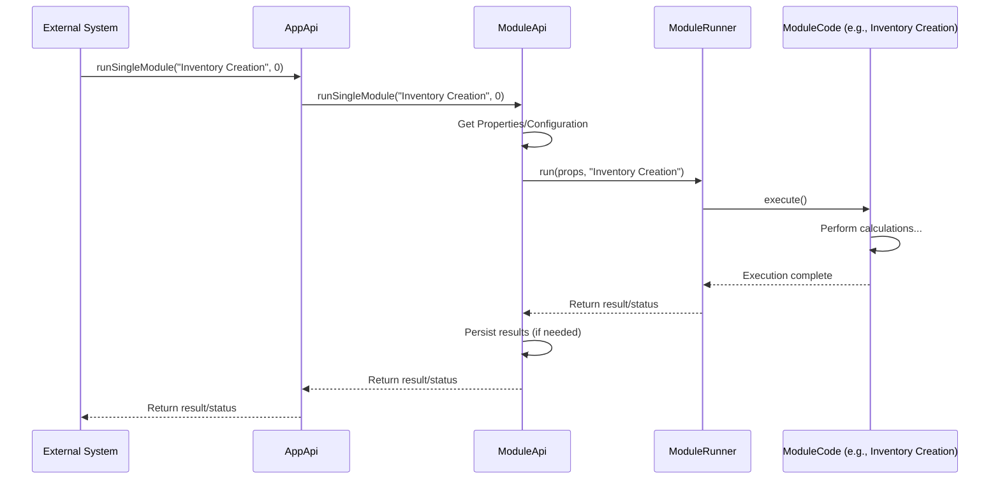

# Chapter 1: Application API (AppApi)

Welcome to the `irisx-algo` tutorial! We're excited to guide you through the core concepts of this powerful merchandising algorithm suite. Let's start with the very beginning – the main entry point for running things.

Imagine you have a complex machine, like a futuristic factory that produces perfectly planned merchandise for stores. This factory has many different sections, each doing a specific job (like calculating sales forecasts, figuring out ideal stock levels, or deciding discounts). How do you control this factory? How do you tell it *which* job to do, when to start, and make sure everything runs smoothly?

That's where the **Application API (AppApi)** comes in.

## What Problem Does AppApi Solve?

In `irisx-algo`, we have many different algorithms, which we call "modules". Each module performs a specific task in the overall merchandising process. For example:

*   One module might calculate how much inventory you have (`Inventory Creation`).
*   Another might group products based on their attributes (`Attribute Grouping`).
*   Yet another might figure out the best prices (`Price Bucket Creation`).

Running these modules involves several steps:

1.  **Getting Ready:** Setting up the environment, making sure the system knows *which* client or task we're working on.
2.  **Fetching Data:** Ensuring the latest necessary information (like sales data, product details) is available.
3.  **Running the Right Job:** Executing the specific module(s) needed for a particular task. Sometimes, you might need to run a sequence of modules.
4.  **Checking Input:** Maybe running some quick checks (validations) before starting the main job to ensure the input data makes sense.
5.  **Keeping Track:** Recording what happened (logging) so we can understand the process or debug issues later.

Doing all this manually for every task would be repetitive and error-prone. `AppApi` solves this by acting as the **central controller** or **orchestrator**.

Think of `AppApi` as the **conductor of an orchestra**. The musicians are the different algorithm modules. The conductor (`AppApi`) doesn't play every instrument but tells each section (module) when to play, ensures they have the right sheet music (data), and coordinates them to create a complete performance (a merchandising task).

## Core Responsibilities of AppApi

*   **Entry Point:** It's the primary place where instructions to run algorithms are sent.
*   **Initialization:** Helps set up the context for a specific run (like identifying the client or task).
*   **Data Synchronization:** Can trigger processes to fetch or update the data needed by the algorithms (using `SyncApi`).
*   **Module Execution:** Tells the system which specific module or sequence of modules to run. This often involves passing the instruction to other specialized components like the `ModuleApi` which then uses the [Module Runner](04_module_runner_.md).
*   **Validation:** Can run preliminary checks (validation modules) before executing the main algorithm.
*   **Logging Management:** Configures how progress and errors are logged for a specific task.

## How to Use AppApi (Conceptual Example)

You usually won't write Java code to *directly* call `AppApi` methods yourself. Instead, `AppApi` is typically used by higher-level systems or command-line tools that trigger `irisx-algo` jobs. However, understanding its methods helps grasp how the system works.

Let's imagine we want to run the `Inventory Creation` module. A controlling system might interact with `AppApi` like this:

**Goal:** Calculate the current inventory levels.

1.  **Identify the Task:** Let's say this is for client "SuperRetail" and task ID "task-123".
2.  **Configure Logging:** Tell `AppApi` to tag all log messages for this run with the client and task ID.
3.  **Run the Module:** Tell `AppApi` to execute the module named `Inventory Creation`.

Conceptually, the calls might look something like this (simplified):

```java
// In some controlling part of the system...
AppApi appApi = // ... get the AppApi instance ...

String client = "SuperRetail";
String taskId = "task-123";
String moduleToRun = "Inventory Creation"; // Defined in ModuleName constants

// 1. Update logging for this specific task
appApi.updateLogFile(client, taskId);
System.out.println("Log file configured for " + client + "/" + taskId);

// 2. Run the specific module
// The '0' might indicate specific parameters, like not running inventory calculations
// if data hasn't changed (implementation detail)
appApi.runSingleModule(moduleToRun, 0);
System.out.println("Module " + moduleToRun + " executed successfully!");
```

**Explanation:**

*   `appApi.updateLogFile(...)`: This configures the logging system. Now, any logs generated during this run will include "client:SuperRetail task:task-123", making it easy to track.
*   `appApi.runSingleModule(...)`: This is the main instruction. `AppApi` takes the module name (`Inventory Creation`) and tells the underlying system (specifically, `ModuleApi`) to execute it.

**Expected Outcome:**

*   The logging configuration is updated.
*   The `Inventory Creation` module runs, performs its calculations, and likely saves the results (e.g., in a database or memory).
*   Logs related to the execution of `Inventory Creation` are written, tagged with the client and task ID.

## Under the Hood: How AppApi Works

Let's trace what happens when `runSingleModule` is called.

**High-Level Steps:**

1.  An external system or process calls `appApi.runSingleModule("ModuleName", runInv)`.
2.  `AppApi` receives the request.
3.  `AppApi` delegates the actual execution to `ModuleApi` by calling `moduleApi.runSingleModule("ModuleName", runInv)`.
4.  `ModuleApi` prepares necessary configurations ([Configuration & Arguments (Args Classes)](03_configuration___arguments__args_classes__.md)) and uses the [Module Runner](04_module_runner_.md) to find and execute the specific code for `"ModuleName"`.
5.  The module runs, possibly reading data from [Cache](05_cache_.md) or databases, performing calculations, and saving results.
6.  Control returns back through `ModuleApi` to `AppApi`.

**Sequence Diagram:**



**Code Dive:**

Let's look at some key parts of `AppApi.java`.

*   **Running a Single Module:**

    ```java
    // File: src/main/java/com/increff/irisx/api/AppApi.java

    @Autowired // Tells the system to provide an instance of ModuleApi
    private ModuleApi moduleApi;

    public void runSingleModule(String moduleName, int runInv) {
        // Simply delegates the work to ModuleApi
        moduleApi.runSingleModule(moduleName, runInv);
    }
    ```

    **Explanation:** This method is straightforward. It takes the module name and an integer flag (`runInv`) and immediately passes them to the `moduleApi.runSingleModule` method. `AppApi` acts as a clean entry point but relies on `ModuleApi` for the heavy lifting of module execution.

*   **Updating the Log File:**

    ```java
    // File: src/main/java/com/increff/irisx/api/AppApi.java
    import org.apache.log4j.FileAppender;
    import org.apache.log4j.Logger;
    // ... other imports

    public void updateLogFile(String client, String taskId) {
        // Get the current file logging configuration
        FileAppender fa = (FileAppender) Logger.getRootLogger().getAppender("file");

        // Create a new log message format including client and task ID
        fa.setLayout(new PatternLayout(" %d %-5p [%c{1}:%L] client:" + client + " task:" + taskId + " %m%n"));
        // ... other configuration settings ...
        fa.activateOptions(); // Apply the changes

        // Re-attach the configured appender (details omitted for simplicity)
        Logger.getRootLogger().removeAppender("file");
        Logger.getRootLogger().addAppender(fa);
    }
    ```

    **Explanation:** This method dynamically changes the log format for the file output. It adds the `client` and `taskId` to each log message pattern. This makes it much easier to filter and analyze logs when multiple tasks are running concurrently.

*   **Running Validations:**

    ```java
    // File: src/main/java/com/increff/irisx/api/AppApi.java
    import java.util.Set;
    import com.increff.iris.commons.ValidationException;

    public void runValidations(Set<String> validations) {
        try {
            // Loop through each validation module name provided
            for (String validation : validations) {
                // Run each validation module like any other single module
                runSingleModule(validation, 0);
            }
        } catch (ValidationException e) {
            logger.info(e); // Log the validation error
            throw e; // Stop execution if a validation fails
        }
    }
    ```

    **Explanation:** This shows how `AppApi` can orchestrate a sequence. It takes a set of module names (which are expected to be validation modules) and runs them one by one using the same `runSingleModule` method. If any validation throws a `ValidationException`, the process stops.

*   **Data Synchronization:**

    ```java
    // File: src/main/java/com/increff/irisx/api/AppApi.java

    @Autowired
    private SyncApi syncApi; // Handles data synchronization tasks

    public void sync() {
        // Delegates the sync task to SyncApi
        syncApi.run();
    }
    ```

    **Explanation:** Similar to module running, `AppApi` provides a simple `sync()` method that delegates the complex task of synchronizing data to a dedicated component, `SyncApi`.

## Conclusion

You've now learned about the **Application API (AppApi)**, the main entry point and orchestrator for `irisx-algo`. It acts like a conductor, initiating tasks, managing logging, running validations, and triggering specific algorithm modules or data synchronization processes by delegating work to specialized components like `ModuleApi` and `SyncApi`.

While `AppApi` provides the high-level control, the actual execution logic for tasks is often handled by other components. In the next chapter, we'll look at the [Worker API](02_worker_api_.md), which represents the individual "workers" or processes that typically use `AppApi` to perform specific, long-running merchandising jobs.

[Next Chapter: Worker API](02_worker_api_.md)

---

Generated by [AI Codebase Knowledge Builder](https://github.com/The-Pocket/Tutorial-Codebase-Knowledge)