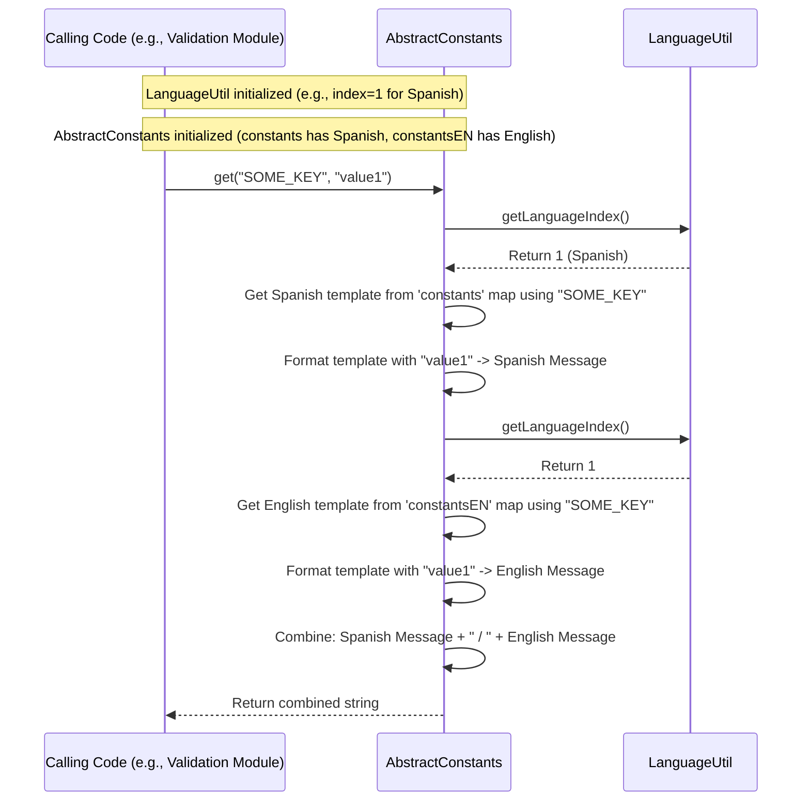

# Chapter 8: Abstract Constants & Language Util

Welcome back! In the [previous chapter](07_enumerations__enums__.md), we explored how [Enumerations (Enums)](07_enumerations__enums__.md) help us represent fixed sets of constants like `StyleTheme.CORE` or `PivotalTag.P`. We saw that these enums often have associated string values (e.g., `"CORE"`, `"P"`), and sometimes even different string values for different languages (like English and Spanish).

This leads to a broader question: How does `irisx-algo` manage all the text messages, labels, and other constant strings that might need to be shown to users, especially if those users speak different languages?

## What Problem Do Abstract Constants & Language Util Solve?

Imagine `irisx-algo` finds an issue while checking your input data. It needs to report an error like: "Style Attributes not provided for : StyleXYZ". This message is helpful for an English-speaking user. But what if the user prefers Spanish? They should ideally see something like: "No se proporcionaron atributos de estilo para: StyleXYZ".

Hardcoding these messages directly into the code is problematic:
1.  **Scattered Text:** Messages would be spread across many different files, making them hard to find and manage.
2.  **Difficult Translation:** Translating the application would mean finding every single message in the code and adding `if/else` logic for different languages – a maintenance nightmare!
3.  **Inconsistency:** Different parts of the code might use slightly different wording for the same concept.

We need a central, organized way to:
*   Define all user-facing text constants.
*   Provide translations for these constants.
*   Easily retrieve the correct language version based on the user's preference.

This is exactly what the **`AbstractConstants`** framework and the **`LanguageUtil`** utility solve. They provide a system for managing **internationalized constants** (constants ready for multiple languages, often abbreviated as **i18n**).

Think of it like having a master dictionary for your application:
*   **`AbstractConstants`:** The structure of the dictionary, defining how entries (constants) are stored. Specific constant classes (like `ValidationConstants`) are the sections of the dictionary.
*   **`LanguageUtil`:** Knows which language the user wants to read the dictionary in (e.g., English or Spanish).
*   **`get()` methods:** Look up a word (constant key) in the dictionary and return its definition (the text) in the chosen language.

## Core Idea: Centralized, Language-Aware Constants

1.  **Define Keys:** Assign a unique key (like a code) to each constant string (e.g., `CHECK_STYLE_ATTRIBUTE`).
2.  **Create Constant Classes:** Group related keys into specific classes that extend `AbstractConstants` (e.g., `MastersInputValidationConstants` for validation messages).
3.  **Provide Translations:** Inside these classes, provide the English text (`constantsEN`) and potentially text for other languages (like Spanish in `initSpanish()`, which populates the main `constants` map).
4.  **Set Active Language:** Use `LanguageUtil` to tell the system which language is currently active (e.g., based on a configuration setting).
5.  **Retrieve Text:** Use the `get(key)` method from `AbstractConstants` (or the specific subclass) to retrieve the text associated with a key. This method automatically returns the string in the active language determined by `LanguageUtil`.

## How to Use Abstract Constants & Language Util

Let's use our validation message example: "Style Attributes not provided for : StyleXYZ".

**1. Define the Constant Key and Class:**

A class `MastersInputValidationConstants` is created to hold validation-related messages. It extends `AbstractConstants`.

```java
// File: src/main/java/com/increff/irisx/constants/validation/MastersInputValidationConstants.java
package com.increff.irisx.constants.validation;

import com.increff.irisx.constants.AbstractConstants; // Base class
import org.springframework.stereotype.Component;

@Component // Make it a Spring-managed bean
public class MastersInputValidationConstants extends AbstractConstants {

    // Define a unique key for the message
    public static final String CHECK_STYLE_ATTRIBUTE = "MASTER_CHECK_STYLE_ATTRIBUTE";
    // ... other validation keys ...

    // Define English messages
    @Override
    protected void initEnglish() {
        // Map the key to its English text
        constantsEN.put(CHECK_STYLE_ATTRIBUTE, "Style Attributes not provided for : %s");
        // ... map other keys ...
    }

    // Define Spanish messages
    @Override
    protected void initSpanish() {
        // Map the key to its Spanish text (populates the main 'constants' map)
        constants.put(CHECK_STYLE_ATTRIBUTE, "No se proporcionaron atributos de estilo para: %s");
        // ... map other keys ...
    }
}
```

**Explanation:**

*   It extends `AbstractConstants`.
*   `CHECK_STYLE_ATTRIBUTE` is the unique key for our message.
*   `initEnglish()` populates the `constantsEN` map (inherited from `AbstractConstants`) with English versions. The `%s` is a placeholder for dynamic values (like the style name).
*   `initSpanish()` populates the `constants` map (also inherited) with Spanish versions. This method is only called if `LanguageUtil` indicates Spanish is the active language.

**2. Set the Active Language (via `LanguageUtil`):**

Somewhere early in the application startup, `LanguageUtil` is initialized based on configuration. Let's imagine a configuration setting `language=es-mx`.

```java
// Simplified initialization (often done via Spring's @Value)
String configuredLanguage = "es-mx"; // Example value
LanguageUtil.init(configuredLanguage);
```

**Explanation:**
*   `LanguageUtil.init()` sets an internal flag (`languageIndex`) based on the input. For "es-mx", it might set `languageIndex` to `1`. For "en" (or default), it's `0`.

**3. Retrieve the Message in Code:**

Now, the code that performs the validation can retrieve the message using the key.

```java
// Inside some validation logic module...
import com.increff.irisx.constants.validation.MastersInputValidationConstants;

String styleName = "StyleXYZ";
boolean attributesMissing = true; // Assume validation failed

if (attributesMissing) {
    // Get the message using the key and pass the dynamic value
    String errorMessage = MastersInputValidationConstants.get(
                              MastersInputValidationConstants.CHECK_STYLE_ATTRIBUTE,
                              styleName
                          );

    System.out.println("Error: " + errorMessage);
    // Log or report the error message...
}
```

**Explanation:**

*   We call the static `get()` method inherited from `AbstractConstants`.
*   We pass the key (`CHECK_STYLE_ATTRIBUTE`) and any values needed to fill placeholders (`styleName`).
*   The `get()` method internally checks the active language set by `LanguageUtil` and retrieves the appropriate formatted string.

**Expected Output:**

*   **If `LanguageUtil` was initialized with `"en"` (or default):**
    ```
    Error: Style Attributes not provided for : StyleXYZ /  
    ```
    (Note: The `get` method appends the English version too if the primary language isn't English, hence the `/` and space when it *is* English).

*   **If `LanguageUtil` was initialized with `"es-mx"`:**
    ```
    Error: No se proporcionaron atributos de estilo para: StyleXYZ / Style Attributes not provided for : StyleXYZ 
    ```
    (The Spanish version comes first, then the separator ` / `, then the English version for reference).

The key takeaway is that the validation code *doesn't need to know* which language is active. It just uses the constant key, and the `AbstractConstants` framework handles retrieving the correct translation.

## Under the Hood: Initialization and Retrieval

How does this coordination between `LanguageUtil` and `AbstractConstants` happen?

**1. LanguageUtil Initialization:**

*   `LanguageUtil` has a static `init(String value)` method.
*   This method takes a language code (like "en", "es-mx").
*   Based on the code, it sets a static `languageIndex` (e.g., `0` for English, `1` for Spanish). This index is used later by constants and enums.

```java
// Simplified Snippet from LanguageUtil.java
public class LanguageUtil {
    private static String language = "en";
    private static Integer languageIndex = 0; // Default to English

    public static void init(String value) {
        // Basic logic to set language and index
        if (value != null && !value.isEmpty()) {
             LanguageUtil.language = value;
             switch (LanguageUtil.language) {
                 case ("es-mx"):
                     LanguageUtil.languageIndex = 1; // Spanish index
                     break;
                 // Add other languages here...
                 default:
                     LanguageUtil.languageIndex = 0; // Default English index
             }
        }
    }

    public static Integer getLanguageIndex() {
        return languageIndex; // Returns 0 or 1 (or others)
    }
}
```

**2. AbstractConstants Initialization:**

*   `AbstractConstants` classes (like `MastersInputValidationConstants`) are usually Spring components (`@Component`).
*   `AbstractConstants` has an `init()` method annotated with `@PostConstruct`. This means Spring automatically runs this `init()` method *after* the component is created and dependencies are injected.
*   The `AbstractConstants.init()` method does the following:
    *   Calls `initEnglish()` (which must be implemented by subclasses like `MastersInputValidationConstants` to populate `constantsEN`).
    *   Checks `LanguageUtil.getLanguageIndex()`.
    *   If the index indicates a non-English language (e.g., 1 for Spanish), it calls the corresponding language init method (e.g., `initSpanish()`), which populates the main `constants` map.
    *   If the index indicates English (0), it simply copies all entries from `constantsEN` into the main `constants` map.

```java
// Simplified Snippet from AbstractConstants.java
@Component // Marks this as a base for Spring components
public abstract class AbstractConstants {

    // Holds the active language strings
    public static HashMap<String, String> constants = new HashMap<>();
    // Always holds the English strings
    public static HashMap<String, String> constantsEN = new HashMap<>();

    // --- Methods defined by subclasses ---
    protected abstract void initEnglish();
    protected void initSpanish() { /* Default empty implementation */ }
    // Add methods for other languages if needed...

    // --- Runs automatically after creation ---
    @PostConstruct
    public void init() {
        initEnglish(); // Always load English into constantsEN

        // Check the active language index
        int langIndex = LanguageUtil.getLanguageIndex();

        if (langIndex == 1) { // Example: Spanish
            initSpanish(); // Load Spanish into 'constants' map
        }
        // Add else if for other language indices...
        else {
            // Default: English - Copy EN strings to the active map
            constants.putAll(constantsEN);
        }
    }
    // ... getter methods follow ...
}
```

**3. The `get()` Method Logic:**

*   The static `get(String key)` or `get(String key, String... values)` methods in `AbstractConstants` are used for retrieval.
*   They look up the `key` in the main `constants` map (which holds the strings for the active language).
*   If parameters (`values`) are provided, `String.format()` is used to insert them into the placeholders (`%s`).
*   **Crucially:** It also checks `LanguageUtil.getLanguageIndex()`. If the active language is *not* English (index != 0), it also retrieves the English version using `getEN(key)` and appends it after a separator (` / `). This provides the English text as a fallback or reference, which can be useful in logs or for developers.

```java
// Simplified Snippet from AbstractConstants.java
public abstract class AbstractConstants {
    // ... maps and init methods ...

    // Separator defined elsewhere (e.g., " / ")
    public static final String VALIDATION_SEPERATOR = " / ";

    // Simple get method
    public static String get(String key) {
        String activeLangValue = constants.get(key);
        // Append English if current language is not English
        String englishFallback = (LanguageUtil.getLanguageIndex() != 0)
                                 ? getEN(key)
                                 : " "; // Append just a space if English is active

        return activeLangValue + VALIDATION_SEPERATOR + englishFallback;
    }

    // Get method with formatting
    public static String get(String key, String... values) {
        String activeLangValue = String.format(constants.get(key), values);
        // Append formatted English if current language is not English
        String englishFallback = (LanguageUtil.getLanguageIndex() != 0)
                                 ? getEN(key, values) // Use formatted English
                                 : " ";

        return activeLangValue + VALIDATION_SEPERATOR + englishFallback;
    }

    // Helper to get specifically the English version
    public static String getEN(String key) {
        return constantsEN.get(key);
    }

    // Helper to get formatted English version
    public static String getEN(String key, String... values) {
        return String.format(constantsEN.get(key), values);
    }
}
```

**Sequence Diagram (Retrieving a Constant):**



## Connection Back to Enums

Remember the Enums from [Chapter 7](07_enumerations__enums__.md), like `DistributionConstants` or `DiscountConstants`? They use this same `LanguageUtil` mechanism to provide language-specific string values.

```java
// Snippet from DiscountConstants enum
public enum DiscountConstants implements EnumInterface {
    NO_STOCK("No Stock", "Sin existencias"), // English, Spanish
    // ... other constants ...
    ; // End of constants

    private final String value;    // Will hold the active language string
    private final String valueEN;  // English string
    private final String valueESMX;// Spanish string

    // Constructor called for each constant (e.g., NO_STOCK)
    DiscountConstants(String... values) {
        this.valueEN = values[0];
        this.valueESMX = values[1];
        // *** Use LanguageUtil to pick the correct index! ***
        this.value = values[LanguageUtil.getLanguageIndex()];
    }

    // Returns the string in the active language
    public String getValue() { return this.value; }
    public String getValueEN() { return this.valueEN; }
    public String getValueESMX() { return this.valueESMX; }
    // ...
}
```
When an instance of `DiscountConstants` like `NO_STOCK` is created, its constructor uses `LanguageUtil.getLanguageIndex()` to pick the correct string (`"No Stock"` or `"Sin existencias"`) from the provided `values` array and store it in the `value` field. The `getValue()` method then simply returns this pre-selected string.

## Conclusion

The combination of **`AbstractConstants`** and **`LanguageUtil`** provides a robust framework for managing constant strings in `irisx-algo`, particularly those needing **internationalization (i18n)**.

*   **`AbstractConstants`** provides the structure: define keys, group them in subclasses, provide `initEnglish()` and `initSpanish()` (etc.) methods.
*   **`LanguageUtil`** determines the active language (`languageIndex`) based on configuration.
*   The `@PostConstruct` `init()` method in `AbstractConstants` loads the correct language strings into the active `constants` map based on the `languageIndex`.
*   The static **`get()` methods** retrieve the appropriate string from the `constants` map, automatically handling language selection and providing an English fallback if needed.
*   **Enums** also leverage `LanguageUtil` in their constructors to support language-specific string representations via their `getValue()` methods.

This keeps user-facing text centralized, makes translation manageable, and ensures consistency across the application.

Now that we've covered fundamental structures like Enums and Constants, let's look at how `irisx-algo` represents the core data it reads from input files and writes to output files. The next chapter introduces [Row Input/Output Classes](09_row_input_output_classes_.md).

[Next Chapter: Row Input/Output Classes](09_row_input_output_classes_.md)

---

Generated by [AI Codebase Knowledge Builder](https://github.com/The-Pocket/Tutorial-Codebase-Knowledge)