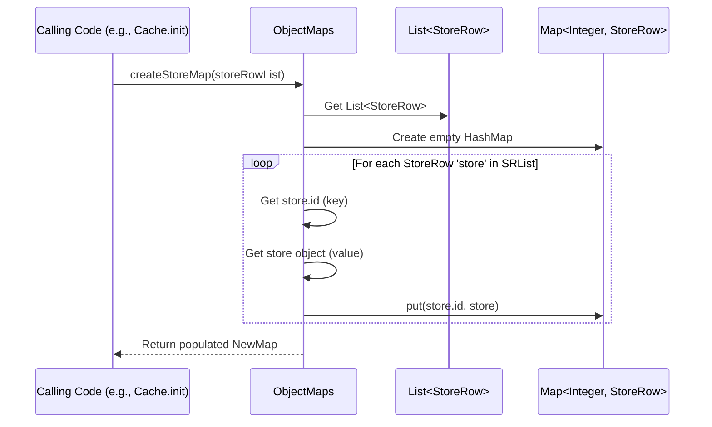

# Chapter 11: ObjectMaps

Welcome back! In the [previous chapter](10_view_.md), we explored the [View](10_view_.md) helper, which allows us to easily ask questions about the status of inventory (like "was this product live?") using data likely stored in the [Cache](05_cache_.md).

But how does that data get into the [Cache](05_cache_.md) in the first place, especially in a way that makes lookups super fast? Often, our initial data comes as long lists – maybe a list of all stores read from a file, or a list of all product SKUs.

Imagine you have a huge pile of hundreds of business cards (our list of data rows). If you need to find the phone number for "John Smith", you'd have to sift through the entire pile, card by card, until you find his. This is slow, especially if you need to find many different people's numbers!

What if, instead, you took those cards and organized them into a phone book or a rolodex, indexed by name? Finding "John Smith" would then be incredibly fast – you just flip to the "S" section and find his entry.

## What Problem Do ObjectMaps Solve?

When `irisx-algo` starts, it often reads data like product lists (`SkuRow`), style lists (`StyleRow`), or store lists (`StoreRow`) from files or databases. These arrive as simple lists (like that pile of business cards).

Modules, especially helpers like the [Cache](05_cache_.md) or [View](10_view_.md), frequently need to find a specific item based on its unique identifier (like a `storeId` or `skuId`). Searching through a long list every time is inefficient.

**`ObjectMaps`** solves this by acting as our efficient organizer. It's a utility class filled with helper methods specifically designed to **transform these lists of data rows into efficient `Map` data structures**.

**What's a Map?** A Map (like `HashMap` in Java) is a data structure that stores key-value pairs. Think of it like a dictionary or our phone book analogy:
*   **Key:** The unique identifier you use for lookup (like a person's name, a store's ID, or a word in the dictionary).
*   **Value:** The actual data associated with that key (like the person's contact details, the `StoreRow` object, or the word's definition).

Maps allow extremely fast lookups. If you know the key (e.g., `storeId = 101`), you can get the corresponding value (the `StoreRow` for store 101) almost instantly, without searching the whole list.

`ObjectMaps` centralizes the common patterns for creating these maps from various lists of Row objects found throughout `irisx-algo`.

## Core Idea: The List-to-Map Converter

`ObjectMaps` provides static methods that take a `List` of some [Row Input/Output Class](09_row_input_output_classes_.md) object (like `List<StoreRow>`) and return a `Map` (like `Map<Integer, StoreRow>`).

**Common Patterns:**

*   Create a map from a list of stores, keyed by `store.id`.
*   Create a map from a list of SKUs, keyed by `sku.id`.
*   Create a map grouping SKUs by their style ID (`Map<Integer, List<Integer>>`).
*   Create a map from planogram data, keyed by store and category (`Map<Key, PlanogramData>`).

By having these standard conversion methods in one place (`ObjectMaps`), we ensure:
*   **Consistency:** Everyone creates maps in the same way.
*   **Efficiency:** The methods are designed to create the maps efficiently.
*   **Reusability:** We don't rewrite the same list-to-map conversion logic in multiple places.

## How to Use ObjectMaps

`ObjectMaps` methods are typically used during the initialization phase, often when populating the [Cache](05_cache_.md).

**Use Case:** The `Cache.init()` method needs to load all `StoreRow` objects from the database (or files) and store them in a way that allows quick lookup by `storeId`.

```java
// Simplified example inside Cache.init() method

import com.increff.irisx.row.input.master.StoreRow;
import com.increff.irisx.helper.ObjectMaps; // Import the utility
import java.util.List;
import java.util.Map;

// ... inside Cache class ...
private Map<Integer, StoreRow> storeMap; // Map to hold StoreRows by ID

// Assume 'allStoresList' is a List<StoreRow> loaded from DB/file
public void initializeStores(List<StoreRow> allStoresList) {

    System.out.println("Received a list of " + allStoresList.size() + " stores.");

    // Use ObjectMaps to convert the list into a Map keyed by store ID
    this.storeMap = ObjectMaps.createStoreMap(allStoresList);

    System.out.println("Created a store map with " + this.storeMap.size() + " entries.");

    // Now, the Cache can use 'storeMap' for fast lookups later
    // Example of using the map:
    int storeIdToFind = 101;
    StoreRow foundStore = this.storeMap.get(storeIdToFind);
    if (foundStore != null) {
        System.out.println("Found store " + storeIdToFind + ": Name=" + foundStore.name);
    } else {
        System.out.println("Store " + storeIdToFind + " not found in the map.");
    }
}
```

**Explanation:**

1.  We get a `List<StoreRow>` (our pile of business cards).
2.  We call `ObjectMaps.createStoreMap(allStoresList)`. This static method takes the list and returns a `Map<Integer, StoreRow>`, where the `Integer` key is the `store.id` and the `StoreRow` is the value.
3.  The resulting `storeMap` is stored in the Cache.
4.  Later, when someone needs the details for store `101`, the Cache can simply do `storeMap.get(101)`, which is extremely fast.

**Expected Output (assuming store 101 exists in the list):**

```
Received a list of 500 stores.
Created a store map with 500 entries.
Found store 101: Name=Downtown Branch
```

## Under the Hood: How `createStoreMap` Works

The logic inside `ObjectMaps` methods is usually quite simple. Let's trace `createStoreMap`:

**High-Level Steps:**

1.  **Input:** Receives the `List<StoreRow>` (e.g., `list`).
2.  **Create Empty Map:** Creates a new, empty `HashMap` designed to hold `Integer` keys and `StoreRow` values (`Map<Integer, StoreRow> map = new HashMap<>();`).
3.  **Iterate:** Loops through each `StoreRow` object (`store`) in the input `list`.
4.  **Extract Key & Value:** For the current `store`:
    *   The **key** is `store.id`.
    *   The **value** is the `store` object itself.
5.  **Put into Map:** Adds the key-value pair to the `map` (`map.put(store.id, store);`).
6.  **Return Map:** After iterating through all the stores in the list, returns the populated `map`.

**Sequence Diagram:**



**Code Dive (`ObjectMaps.java`):**

Let's look at a simplified version of the `createStoreMap` method.

```java
// File: src/main/java/com/increff/irisx/helper/ObjectMaps.java
package com.increff.irisx.helper;

import com.increff.irisx.row.input.master.StoreRow;
// ... other imports for different Row types ...
import java.util.List;
import java.util.Map;
import java.util.HashMap;
import java.util.concurrent.ConcurrentHashMap; // Sometimes used for thread-safety

public class ObjectMaps {

    /**
     * Creates a Map from a List of StoreRow objects, keyed by Store ID.
     *
     * @param list A List of StoreRow objects.
     * @return A Map where the key is the store ID (Integer) and the value is the StoreRow object.
     */
    public static Map<Integer, StoreRow> createStoreMap(List<StoreRow> list) {
        // Create a map sized roughly to the list size for efficiency
        // Sometimes ConcurrentHashMap is used if multiple threads might access it
        Map<Integer, StoreRow> map = new ConcurrentHashMap<>(list.size());

        // Loop through each StoreRow in the input list
        list.forEach(store -> {
            // Put the store's ID as the key and the store object itself as the value
            map.put(store.id, store);
        });

        // Return the newly created and populated map
        return map;
    }

    /**
     * Creates a Map grouping SKU IDs by their Style ID.
     *
     * @param list A List of SkuRow objects.
     * @return A Map where the key is the style ID (Integer) and the value is a List of SKU IDs (List<Integer>) belonging to that style.
     */
    public static Map<Integer, List<Integer>> createStyleSkuMap(List<SkuRow> list) {
        Map<Integer, List<Integer>> map = new HashMap<>(list.size() / 4); // Estimate size

        list.forEach(sku -> {
            // Get the style ID for the current SKU
            int styleId = sku.style;
            // Find the list for this style ID in the map.
            // If it doesn't exist yet, create a new ArrayList.
            List<Integer> skuIdsForStyle = map.computeIfAbsent(styleId, k -> new ArrayList<>());
            // Add the current SKU's ID to the list for its style
            skuIdsForStyle.add(sku.id);
        });
        return map;
    }

    // ... MANY other methods for creating different types of maps ...
    // createStyleMap, createSkuMap, createStylePriceBucketMap, createStyleAgMap, etc.
}
```

**Explanation:**

*   The `createStoreMap` method takes the `List<StoreRow>` as input.
*   It initializes a `Map` (often a `ConcurrentHashMap` or `HashMap`).
*   It uses `list.forEach(...)` to iterate through each `store` object in the list.
*   Inside the loop, `map.put(store.id, store)` adds an entry to the map using the store's ID as the key.
*   Finally, the populated map is returned.
*   The `createStyleSkuMap` example shows a slightly more complex pattern where the value in the map is itself a `List` (grouping SKU IDs under their parent style ID). It uses `map.computeIfAbsent` as a concise way to get or create the list for a given style key.

## Benefits of Using ObjectMaps

*   **Speed:** Maps provide very fast O(1) average-case lookup time, which is much faster than searching O(n) through a list. This significantly speeds up modules that need to repeatedly find specific data items.
*   **Centralization:** The logic for converting common lists to maps is in one place, making the codebase cleaner and easier to maintain.
*   **Consistency:** Ensures that maps are created using standard, efficient techniques across the application.
*   **Readability:** Code that uses the resulting maps (like `cache.getStoreRow(id)`) is often clearer than code that would need to manually search a list.

## Conclusion

**ObjectMaps** is a vital utility class in `irisx-algo` that acts as a central **organizer** for data.

*   It solves the problem of needing **fast access** to specific data rows (like Stores, SKUs) that are initially loaded as lists.
*   It provides methods to **convert `List<SomeRow>` into `Map<Key, SomeRow>`** (or other Map structures).
*   These maps allow **nearly instant lookups** based on a key (like an ID).
*   This is heavily used during initialization (e.g., by the [Cache](05_cache_.md)) to prepare data for efficient use by algorithm modules.
*   It promotes **code reuse, consistency, and performance**.

By efficiently organizing lists into maps, `ObjectMaps` lays the foundation for quick data retrieval throughout the `irisx-algo` system.

Now that we've covered many core utilities and data structures, let's look at a utility focused on mathematical operations that are frequently needed in merchandising calculations: [MathUtil](12_mathutil_.md).

[Next Chapter: MathUtil](12_mathutil_.md)

---

Generated by [AI Codebase Knowledge Builder](https://github.com/The-Pocket/Tutorial-Codebase-Knowledge)