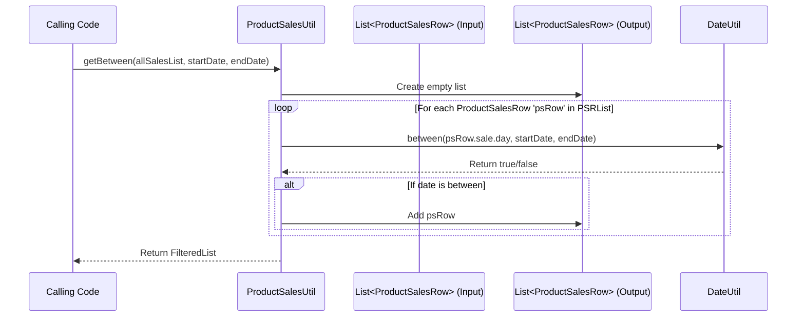

# Chapter 14: ProductSalesUtil

Welcome back! In the [previous chapter](13_productsalesrow_.md), we met the [ProductSalesRow](13_productsalesrow_.md), our super-detailed sales receipt that combines basic sales info with product and store details. This is fantastic for looking at individual sales events.

But what if we want to analyze a whole *group* of sales? For example, we might have a list containing thousands of `ProductSalesRow` objects representing all sales from last month. How can we easily:

*   Filter this list to see only the sales that happened during the first week?
*   Calculate the total revenue generated by *all* sales in the list?
*   Find out the average discount percentage given across these sales?
*   Count how many unique T-shirt styles were sold?
*   Figure out the Rate of Sale (ROS) – how consistently things sold day by day?

Writing code to do these common tasks over and over again in different modules would be repetitive and prone to errors. We need a dedicated toolbox for working with lists of `ProductSalesRow` objects.

## What Problem Does ProductSalesUtil Solve?

Imagine you have a big spreadsheet full of detailed sales data (like our list of `ProductSalesRow` objects). You frequently need to use spreadsheet functions like `SUM`, `AVERAGE`, `COUNT UNIQUE`, or filter rows based on dates.

**`ProductSalesUtil`** acts like that set of built-in spreadsheet functions, but specifically designed for lists of `ProductSalesRow` objects in `irisx-algo`. It provides a collection of ready-made tools (static methods) to perform common analysis tasks on sales data collections.

It helps answer questions like:
*   "What was the total quantity sold from this list?"
*   "Which sales in this list fall between January 1st and January 15th?"
*   "What was the overall discount percentage for these sales?"
*   "How many unique SKUs are present in this sales list?"
*   "What was the day-by-day quantity sold (Rate of Sale)?"

By providing these common functions in one place, `ProductSalesUtil` makes sales analysis code cleaner, more consistent, and easier to write.

## Core Idea: A Toolbox for Sales Lists

`ProductSalesUtil` is a utility class containing **static methods**. You don't need to create an instance of it; you just call the methods directly using the class name, like `ProductSalesUtil.getTotalRevenue(...)`.

These methods typically take a `List<ProductSalesRow>` as input (and sometimes other parameters like dates or grouping keys) and return a result, which could be:
*   A filtered sub-list (e.g., sales within a date range).
*   A calculated number (e.g., total revenue, total quantity, average discount).
*   A set of unique items (e.g., unique style IDs).
*   A map summarizing results (e.g., revenue grouped by style).

It's a specialized toolkit for analyzing aggregated sales data represented by `ProductSalesRow` objects.

## How to Use ProductSalesUtil

Let's work through a use case: We have a list of `ProductSalesRow` objects representing sales from the first few months of 2018. We want to find the sales that occurred specifically in February and then calculate the total revenue and total quantity sold for *only* those February sales.

**1. Prepare Input Data (Conceptual):**

Assume we have a `List<ProductSalesRow>` called `allSalesList` populated with `ProductSalesRow` objects, each containing linked `SalesRow`, `StoreRow`, `StyleRow`, etc. Some sales are in January, some in February, some in March.

*(We can use the `getProductSaleslist()` helper from the `ProductionSalesUtilTest.java` file mentioned in the previous chapter's context to imagine this list)*

```java
// Assume 'allSalesList' is populated, similar to ProductionSalesUtilTest.getProductSaleslist()
// It contains sales from Jan 1st, Feb 1st, Mar 1st, Apr 1st (based on the test data)
List<ProductSalesRow> allSalesList = ProductionSalesUtilTest.getProductSaleslist(); // Using test helper for example
System.out.println("Total sales records: " + allSalesList.size());
```

**2. Filter Sales by Date:**

We use `ProductSalesUtil.getBetween()` to get only the sales from February.

```java
import com.increff.irisx.helper.ProductSalesUtil;
import com.increff.irisx.provider.LocalDateProvider; // Helper for dates
import java.time.LocalDate;
import java.util.List;

// Define the date range for February 2018
LocalDate startDate = LocalDateProvider.getLocalDate("2018-02-01");
LocalDate endDate = LocalDateProvider.getLocalDate("2018-02-28");

// Filter the list using ProductSalesUtil
List<ProductSalesRow> februarySales = ProductSalesUtil.getBetween(allSalesList, startDate, endDate);

System.out.println("Number of sales records in February: " + februarySales.size());
```

**Explanation:**
*   We define the start and end dates for February.
*   `ProductSalesUtil.getBetween(allSalesList, startDate, endDate)` takes the full list and the date range. It returns a *new* list containing only the `ProductSalesRow` objects whose `sale.day` falls within that range (inclusive).

**Expected Output:**
```
Total sales records: 4
Number of sales records in February: 1 // Based on the test data pattern
```

**3. Calculate Aggregates on the Filtered List:**

Now we use the `februarySales` list to calculate total revenue and quantity.

```java
// Calculate total revenue for February sales
double totalFebRevenue = ProductSalesUtil.getTotalRevenue(februarySales);
System.out.println("Total Revenue in February: " + totalFebRevenue);

// Calculate total quantity sold for February sales
int totalFebQuantity = ProductSalesUtil.getTotalQtySold(februarySales);
System.out.println("Total Quantity Sold in February: " + totalFebQuantity);
```

**Explanation:**
*   `ProductSalesUtil.getTotalRevenue(februarySales)` iterates through the `februarySales` list and sums up the `sale.revenue` from each `ProductSalesRow`.
*   `ProductSalesUtil.getTotalQtySold(februarySales)` iterates through the `februarySales` list and sums up the `sale.qty` from each `ProductSalesRow`.

**Expected Output (based on test data for i=2):**
```
Total Revenue in February: 400.0 // sale.revenue = 200 * i = 200 * 2
Total Quantity Sold in February: 2   // sale.qty = i = 2
```

We successfully used `ProductSalesUtil` to filter our sales data and then calculate aggregate values on the result.

## Under the Hood: Iterating and Calculating

The methods in `ProductSalesUtil` typically work by iterating through the input `List<ProductSalesRow>` and applying some logic to each element.

**Walkthrough: `getBetween(list, start, end)`**

1.  **Input:** Receives the list `list`, `startDate`, and `endDate`.
2.  **Create Result List:** Creates a new empty list to hold the filtered results.
3.  **Iterate:** Loops through each `ProductSalesRow` (`psRow`) in the input `list`.
4.  **Check Date:** For each `psRow`, it accesses the sale date (`psRow.sale.day`).
5.  **Filter Condition:** It checks if `psRow.sale.day` is between `startDate` and `endDate` (inclusive). Often uses a date utility like `DateUtil.between()`.
6.  **Add if Match:** If the date is within the range, the current `psRow` is added to the result list.
7.  **Return Result:** After checking all rows in the input list, it returns the result list containing only the matching rows.

**Sequence Diagram (`getBetween`):**



**Walkthrough: `getTotalRevenue(list)`**

1.  **Input:** Receives the list `list`.
2.  **Initialize Sum:** Sets a variable `totalRevenue` to 0.0.
3.  **Iterate:** Loops through each `ProductSalesRow` (`psRow`) in the input `list`.
4.  **Accumulate:** For each `psRow`, it accesses the revenue (`psRow.sale.revenue`) and adds it to the `totalRevenue`.
5.  **Round (Optional):** After the loop, it might round the final `totalRevenue` using `MathUtil.round()` for consistency.
6.  **Return Result:** Returns the final `totalRevenue`.

**Code Dive (`ProductSalesUtil.java`):**

Here are simplified versions of some methods:

```java
// Simplified from: src/main/java/com/increff/irisx/helper/ProductSalesUtil.java
package com.increff.irisx.helper;

import com.increff.irisx.row.input.transactional.ProductSalesRow;
import com.increff.irisx.util.MathUtil; // Uses MathUtil for rounding, etc.
import com.nextscm.commons.lang.DateUtil; // For date comparisons
import java.time.LocalDate;
import java.util.*;
import java.util.stream.Collectors; // Often uses Streams API

public class ProductSalesUtil {

    /** Filters a list of sales to include only those between startDate and endDate. */
    public static List<ProductSalesRow> getBetween(List<ProductSalesRow> salesList, LocalDate startDate, LocalDate endDate) {
        // Using Java Streams API for concise filtering
        return salesList.stream() // Create a stream from the list
                .filter( // Keep only elements that match the condition
                        saleData -> DateUtil.between(saleData.sale.day, startDate, endDate) // Check if sale date is in range
                )
                .collect(Collectors.toList()); // Collect the filtered elements into a new list
    }

    /** Calculates the total revenue from a list of sales. */
    public static double getTotalRevenue(List<ProductSalesRow> list) {
        // Use stream to map each row to its revenue and sum them up
        double total = list.stream()
                           .mapToDouble(o -> o.sale.revenue) // Get revenue from each sale
                           .sum(); // Calculate the sum
        // Round the result for consistency
        return MathUtil.round(total, GenericConstants.ROUNDING_SCALE, Optional.empty());
    }

    /** Calculates the total quantity sold from a list of sales. */
    public static int getTotalQtySold(List<ProductSalesRow> salesList) {
        // Use stream to map each row to its quantity and sum them up
        return salesList.stream()
                        .mapToInt(o -> o.sale.qty) // Get quantity from each sale
                        .sum(); // Calculate the sum
    }

    /** Calculates the overall discount percentage for a list of sales. */
    public static double getDiscountPercent(List<ProductSalesRow> salesList) {
        // First, calculate total discount value and total revenue
        double totalDiscountValue = getTotalDiscountValue(salesList);
        double totalRevenue = getTotalRevenue(salesList);

        // Calculate the effective MRP (Revenue + Discount)
        double effectiveMrp = totalRevenue + totalDiscountValue;

        // Handle cases where discount is zero/negative or MRP is zero/negative
        if (totalDiscountValue <= 0 || effectiveMrp <= 0) {
            return 0.0;
        }
        // Calculate percentage using MathUtil
        return MathUtil.getPercent(totalDiscountValue, effectiveMrp, GenericConstants.ROUNDING_SCALE);
    }

    /** Calculates the total discount value from a list of sales. */
    public static double getTotalDiscountValue(List<ProductSalesRow> salesList) {
        double total = salesList.stream()
                                .mapToDouble(o -> o.sale.discValue) // Get discount value
                                .sum();
        return MathUtil.round(total, GenericConstants.ROUNDING_SCALE, Optional.empty());
    }

    /** Gets a list representing Rate of Sale (daily total quantity). */
    public static List<Integer> getRosList(List<ProductSalesRow> list) {
        // Group sales by day and sum quantities for each day
        Map<LocalDate, Integer> map = new HashMap<>();
        for (ProductSalesRow row : list) {
            LocalDate day = row.sale.day;
            map.put(day, map.getOrDefault(day, 0) + row.sale.qty);
        }
        // Return the list of daily quantities (values of the map)
        return new ArrayList<>(map.values());
    }

    /** Gets the set of unique Style IDs from a list of sales. */
    public static Set<Integer> getUniqueStyles(List<ProductSalesRow> list) {
        // Use stream to map each row to its style ID and collect into a Set
        return list.stream()
                   .map(psr -> psr.style.id) // Get style ID
                   .collect(Collectors.toSet()); // Set automatically handles uniqueness
    }

    // ... many other methods exist for various calculations and groupings ...
}
```

**Explanation:**

*   The code often uses Java Streams (`.stream()`, `.filter()`, `.mapToDouble()`, `.sum()`, `.collect()`) for concise iteration and aggregation.
*   `getBetween` uses a filter based on `DateUtil.between()`.
*   `getTotalRevenue` and `getTotalQtySold` map rows to the relevant numeric value and sum them.
*   `getDiscountPercent` calculates the total discount and the effective total MRP (revenue + discount), then uses `MathUtil.getPercent` for the final calculation, handling edge cases.
*   `getRosList` demonstrates grouping by date (`sale.day`) and summing quantities before returning the list of daily totals.
*   `getUniqueStyles` shows how easy it is to get unique values using streams and collecting to a `Set`.

## Key Operations Provided

`ProductSalesUtil` offers a range of functions, including:

*   **Filtering:** `getBetween` (by date range), `liquidationCleanupFilter` (by discount %)
*   **Aggregation:** `getTotalRevenue`, `getTotalQtySold`, `getTotalDiscountValue`
*   **Calculation:** `getDiscountPercent`, `getRosList` (Rate of Sale)
*   **Uniqueness:** `getUniqueStyles`, `getUniqueSkus`, `getUniqueDays`, `getUniqueStores` (and corresponding `...Count` methods)
*   **Grouping/Mapping:** `getDaySalesMap` (Date -> Qty), `getRevenueByGroup` (Group Key -> Revenue), `getStyleRevMap` (Style ID -> Revenue)
*   **Ranking:** `getTopKPercent` (Find groups contributing to top K% of revenue)

## Conclusion

**`ProductSalesUtil`** is an essential utility in `irisx-algo`, providing a toolbox of **static methods** for working with lists of **`ProductSalesRow`** objects.

*   It simplifies common sales analysis tasks like **filtering by date, aggregating totals (revenue, quantity), calculating percentages (discount), finding unique items, and determining Rate of Sale**.
*   It promotes **code reuse** and **consistency** by centralizing these common operations.
*   Using its methods makes the analysis logic within individual modules much **cleaner and easier to understand**.

Now that we understand how to represent detailed sales data (`ProductSalesRow`) and how to analyze lists of it (`ProductSalesUtil`), we can move on to specific algorithms that use this foundation. The next chapter explores the [Price Bucket Creation Module](15_price_bucket_creation_module_.md), which helps categorize products based on their price points.

[Next Chapter: Price Bucket Creation Module](15_price_bucket_creation_module_.md)

---

Generated by [AI Codebase Knowledge Builder](https://github.com/The-Pocket/Tutorial-Codebase-Knowledge)