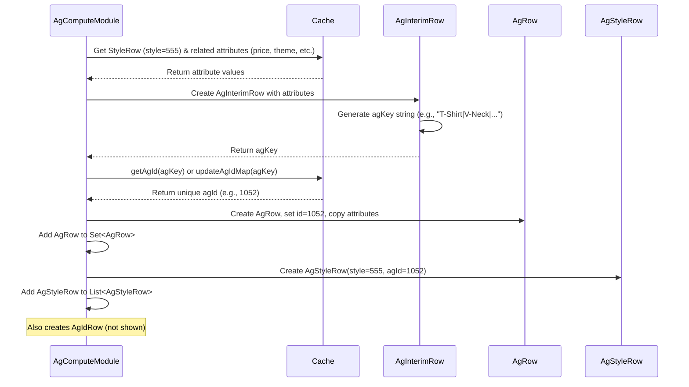

# Chapter 17: Attribute Grouping (AgGroupModule & AgComputeModule)

Welcome back! In the [previous chapter](16_agrow_.md), we learned about the [AgRow](16_agrow_.md) object, which acts like a unique tag or catalog number for a specific combination of product attributes (like category, brand, price, color, etc.). It holds both the unique ID and all the attribute values for that group.

But how does the system *find* all the unique combinations present in our products and *create* these `AgRow` tags with their unique IDs in the first place? That's the job of the Attribute Grouping modules.

## What Problem Do These Modules Solve?

Imagine you're given a huge box containing thousands of different Lego bricks. You need to sort them into smaller bins based on their exact characteristics: color, shape, size, and number of studs. Once sorted, you want to put a unique label (like "Bin #1052") on each bin that contains a distinct combination (e.g., "Red, 2x4, Standard Height, 8 studs").

Doing this manually for thousands of bricks is slow and error-prone. You need an automated system to:
1.  Examine each brick (product/style).
2.  Identify its specific combination of attributes.
3.  Check if you've already seen this exact combination.
4.  If it's a new combination, create a new unique label (an `AgRow` ID) and a new bin (`AgRow` object).
5.  Keep track of which bricks go into which labeled bin.

The **Attribute Grouping** process, handled mainly by `AgComputeModule` and orchestrated by `AgGroupModule`, does exactly this for our products. It systematically analyzes products, identifies unique combinations of attributes (like category, brand, price bucket, gender, theme, and custom attributes), assigns a unique ID to each combination, and creates the corresponding `AgRow` objects and mappings.

## Core Idea: Finding and Labeling Unique Attribute Combos

The main goal is to process all relevant products (Styles) and produce a definitive list of unique attribute combinations (`AgRow` objects) and mappings that link styles to their corresponding attribute group ID.

Here's the simplified flow:

1.  **Start:** The process begins, usually kicked off by `AgGroupModule`.
2.  **Compute:** `AgComputeModule` takes charge of the main logic.
3.  **Iterate Products:** It loops through each product Style that needs grouping.
4.  **Gather Attributes:** For the current Style, it collects all the important attribute values from the [Cache](05_cache_.md) (e.g., `StyleRow` for category/brand, `PriceBucketData` for price bucket, theme from NOOS calculation, custom attributes from `InputAgRow` definitions).
5.  **Create Temporary Combo:** It bundles these attributes into a temporary object (`AgInterimRow`).
6.  **Generate Unique Key:** It creates a unique text string (the `agKey`) representing this specific combination (e.g., "T-Shirt|V-Neck|BrandX|Premium|Men's|CORE|Cotton|Blue...").
7.  **Assign/Get ID:** It checks if this exact `agKey` has already been seen.
    *   If yes, it retrieves the existing unique integer ID assigned to it.
    *   If no, it assigns a *new* unique integer ID to this `agKey` and stores the mapping (often in the [Cache](05_cache_.md)).
8.  **Create Final `AgRow`:** It creates the final `AgRow` object, storing the unique ID and all the attribute values.
9.  **Create Mappings:** It records which Style belongs to which `AgRow` ID (creating `AgStyleRow` objects) and also stores the mapping between the text `agKey` and the integer `AgRow` ID (creating `AgIdRow` objects).
10. **Save Outputs:** The module saves the generated `AgRow` objects, `AgStyleRow` mappings, and `AgIdRow` mappings, usually to the database or intermediate storage for other modules to use.

## The Modules Involved

*   **`AgComputeModule`:** This is the main workhorse. It contains the logic to iterate through styles, gather attributes, generate keys, manage IDs, and create the final `AgRow`, `AgStyleRow`, and `AgIdRow` objects.
*   **`AgGroupModule`:** This module acts as a simple organizer or wrapper ([Abstract Module Group](61_abstract_module_group_.md)). Its primary job is often just to ensure `AgComputeModule` runs and potentially manage related tasks like capturing input snapshots or syncing the output data. You usually don't interact directly with its internal logic.

## How It's Used (Downstream Impact)

You typically don't call these modules directly from other business logic modules. They are run as part of the initial data processing pipeline.

The crucial outputs are:
*   The set of unique `AgRow` objects (often loaded into the [Cache](05_cache_.md)).
*   The `AgStyleRow` mapping (linking each Style ID to its corresponding `AgRow` ID).
*   The `AgIdRow` mapping (linking the text `agKey` to the `AgRow` ID).

Downstream modules then use this information:
*   **Enrichment:** When processing a Style, they can easily find its assigned `AgRow` ID using the `AgStyleRow` mapping.
*   **Lookup:** They can use the `AgRow` ID to look up the full `AgRow` object from the Cache to get specific attribute details (like the brand or category).
*   **Aggregation:** They can use the `AgRow` ID as a key to group and summarize data (like sales or inventory) for all products belonging to that specific attribute combination.

## Under the Hood: Inside `AgComputeModule`

Let's trace the journey of a single Style through `AgComputeModule`.

**Conceptual Walkthrough (Style ID: 555):**

1.  **Get Style Data:** `AgComputeModule` gets the `StyleRow` for Style 555 from the [Cache](05_cache_.md). Let's say it's a "Blue, Cotton, Men's, V-Neck T-Shirt" from "BrandX".
2.  **Get Other Attributes:** It looks up other relevant info from the Cache:
    *   Price Bucket: Let's say it falls into the "Premium" bucket (`PriceBucketData`).
    *   Theme: Let's say it's identified as "CORE" (`StyleTheme`).
    *   Custom Attributes: Looks up configured attributes like Fabric="Cotton", Color="Blue" based on `InputAgRow` definitions for the "T-Shirt" category.
3.  **Create `AgInterimRow`:** It creates an `AgInterimRow` object and populates it with all these values: "T-Shirt", "V-Neck", "BrandX", "Premium", "Men's", "CORE", "Cotton", "Blue", etc.
4.  **Generate `agKey`:** The `agInterimRow.agKey()` method concatenates these values into a single string, separated by pipes: `"T-Shirt|V-Neck||BrandX|Men's|Premium|CORE|Cotton|Blue||||||||"`. (Empty strings for unused attributes or segments).
5.  **Get/Assign `agId`:** The module calls `getAgId(agKey)`.
    *   `getAgId` checks the Cache (e.g., `cache.getAgId(agKey)`).
    *   Assume this is the *first time* seeing this exact combination. The Cache doesn't have an ID for this key.
    *   `getAgId` tells the Cache to assign a new ID (`cache.updateAgIdMap(agKey)`). The Cache returns the newly assigned unique ID, say `1052`.
6.  **Create `AgRow`:** The module creates a new `AgRow` object. It sets `agRow.id = 1052` and copies all the attribute values (category, brand, priceBucket, a1="Cotton", a2="Blue", etc.) from the `AgInterimRow`. This `AgRow` object is added to a set (`agRows`) to ensure uniqueness based on ID.
7.  **Create `AgStyleRow`:** The module creates an `AgStyleRow` object linking Style 555 to AgRow ID 1052 (`new AgStyleRow(555, 1052, isPruned)`). This is added to the `agStyleRows` list.
8.  **Create `AgIdRow`:** The module creates an `AgIdRow` mapping the key to the ID (`new AgIdRow(agKey, 1052)`). This is added to the `agIdRows` list.
9.  **(Repeat):** This process repeats for all styles.
10. **Write Outputs:** Finally, the module writes the collected `agRows`, `agStyleRows`, and `agIdRows` to the database/storage.

**Sequence Diagram (Processing One Style):**



**Code Dive:**

Let's look at simplified snippets from `AgComputeModule.java`.

*   **Main Loop (`createAgRows`):**

    ```java
    // Simplified from AgComputeModule.java
    private Map<Integer, List<Integer>> agStylesMap; // Maps AgId -> List<StyleId>
    private Set<AgRow> agRows; // Holds the unique AgRow objects

    private void createAgRows() {
        // Loop through styles that have attributes defined
        for (int styleId : cache.getAllStylesFromAttributes()) {
            StyleRow styleRow = cache.getStyleRow(styleId);
            if (styleRow == null) continue; // Skip if style data missing

            // 1. Create the interim combination object
            AgInterimRow agInterim = createAg(styleRow);

            // 2. Create the final AgRow (this handles getting/assigning ID)
            AgRow agRow = createAgRow(agInterim);

            // 3. Map the final AgRow ID to the style ID
            agStylesMap.computeIfAbsent(agRow.id, k -> new ArrayList<>())
                       .add(styleRow.id);

            // 4. Add the unique AgRow to our set
            agRows.add(agRow);
        }
    }
    ```
    **Explanation:** This method iterates through styles, calls helper methods `createAg` and `createAgRow` to build the attribute group representation, maps the resulting `agRow.id` to the `styleId`, and collects the unique `AgRow` objects.

*   **Gathering Attributes (`createAg`):**

    ```java
    // Simplified from AgComputeModule.java
    private AgInterimRow createAg(StyleRow styleRow) {
        AgInterimRow agInterimRow = new AgInterimRow();

        // Get basic attributes from StyleRow
        agInterimRow.category = styleRow.cat;
        agInterimRow.subCategory = styleRow.subcat;
        agInterimRow.brand = styleRow.brand;
        agInterimRow.brandSegment = styleRow.brandSegment;
        agInterimRow.gender = styleRow.gender;

        // Get theme and price bucket from Cache
        agInterimRow.theme = cache.getStyleTheme(styleRow.id);
        PriceBucketData priceBucket = cache.getPriceBucket(styleRow.id);
        agInterimRow.priceBucket = (priceBucket == null) ? "" : priceBucket.computedName;

        // Ensure theme is not null (default to FASHION if needed)
        if (agInterimRow.theme == null) agInterimRow.theme = StyleTheme.FASHION;

        // Get custom attributes (a1-a10) based on category config
        agInterimRow.setAgAttributeMap(getAttributeList(styleRow.cat, styleRow, agInterimRow.theme));

        return agInterimRow;
    }
    ```
    **Explanation:** This helper function populates an `AgInterimRow` by fetching standard attributes directly from the `StyleRow` and looking up others like theme, price bucket, and custom attributes (`a1`-`a10`) from the [Cache](05_cache_.md) using helper methods like `getAttributeList`.

*   **Creating Final `AgRow` and Getting ID (`createAgRow`):**

    ```java
    // Simplified from AgComputeModule.java
    private AgRow createAgRow(AgInterimRow agInterim) {
        AgRow agRow = new AgRow();

        // Generate the unique string key from the interim object
        agRow.ag = agInterim.agKey();

        // Get existing ID or assign a new one for this key
        agRow.id = getAgId(agRow.ag);

        // Copy all attribute values from AgInterimRow to AgRow
        agRow.brand = agInterim.brand;
        agRow.brandSegment = agInterim.brandSegment;
        agRow.cat = agInterim.category;
        agRow.priceBucket = agInterim.priceBucket;
        // ... copy subcat, theme, gender ...

        // Copy custom attributes (a1-a10) from the interim map
        agRow.a1 = agInterim.agAttributeMap.getOrDefault(AgLevel.ATTRIBUTE1, "");
        agRow.a2 = agInterim.agAttributeMap.getOrDefault(AgLevel.ATTRIBUTE2, "");
        // ... copy a3 through a10 ...

        return agRow;
    }
    ```
    **Explanation:** This function takes the populated `AgInterimRow`, generates the unique `agKey` string, uses `getAgId` to find/assign the integer ID, and then copies all the attribute values into the final `AgRow` object.

*   **Getting/Assigning the ID (`getAgId`):**

    ```java
    // Simplified from AgComputeModule.java
    public int getAgId(String agkey) {
        // Try to get the ID from the cache first
        Integer id = cache.getAgId(agkey);
        if (id == null) {
            // If not found, ask the cache to create a new ID for this key
            id = cache.updateAgIdMap(agkey);
        }
        return id;
    }
    ```
    **Explanation:** This crucial method interacts with the [Cache](05_cache_.md). It first tries to look up the ID for the given `agkey`. If the key is new (ID is `null`), it calls `cache.updateAgIdMap`, which assigns the next available unique ID and stores the mapping between the `agkey` and the new `id`.

*   **Creating the Style-to-AG Mapping (`createAgStyleRows`):**

    ```java
    // Simplified from AgComputeModule.java
    private ArrayList<AgStyleRow> agStyleRows;

    private void createAgStyleRows() {
        agStyleRows = new ArrayList<>();
        // Iterate through the map created in createAgRows (AgId -> List<StyleId>)
        agStylesMap.forEach((agId, styleIds) -> {
            // For each style associated with this agId...
            styleIds.forEach(styleId -> {
                // Create an AgStyleRow linking the style to the agId
                // Also include prune status check
                agStyleRows.add(new AgStyleRow(styleId, agId, !cache.getAllStyles().contains(styleId)));
            });
        });
    }
    ```
    **Explanation:** This method takes the `agStylesMap` (which groups styles by their assigned `agId`) and creates a simple `AgStyleRow` object for each style, explicitly linking the `styleId` to the `agId`.

## Conclusion

Attribute Grouping, primarily performed by **`AgComputeModule`** and orchestrated by **`AgGroupModule`**, is a fundamental process in `irisx-algo`.

*   It systematically analyzes product styles and their attributes (category, brand, price bucket, gender, theme, custom attributes a1-a10).
*   It identifies every **unique combination** of these attributes present in the data.
*   For each unique combination, it generates a unique text key (`agKey`) and assigns a unique integer **ID**.
*   It creates the final **`AgRow`** objects, storing the ID and all attribute values.
*   It produces essential mapping tables: **`AgStyleRow`** (Style ID -> AgRow ID) and **`AgIdRow`** (agKey -> AgRow ID).

This process provides a powerful way to simplify complex product data by assigning a single ID to groups of products that share the same core characteristics, enabling easier aggregation, analysis, and planning in downstream modules.

Having grouped our products, we often need utilities to help manage and convert product identifiers (like SKUs and Styles) and their associated data. The next chapter introduces [SkuStyleConversionUtil](18_skustyleconversionutil_.md), a utility focused on these tasks.

[Next Chapter: SkuStyleConversionUtil](18_skustyleconversionutil_.md)

---

Generated by [AI Codebase Knowledge Builder](https://github.com/The-Pocket/Tutorial-Codebase-Knowledge)