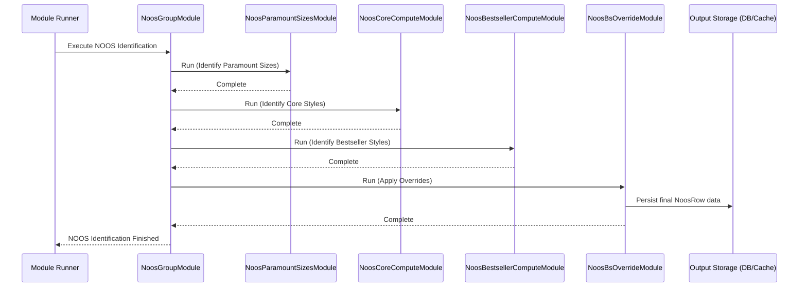

# Chapter 21: NOOS Identification (NoosGroupModule)

Welcome back! In the [previous chapter](20_inventory_creation_module_.md), we saw how the [Inventory Creation Module](20_inventory_creation_module_.md) reconstructs the historical stock levels for our products. Knowing our inventory is crucial, but now we need to think strategically about *which* products are most important to keep in stock.

Imagine your wardrobe. You probably have:
*   **Everyday Essentials:** Basic t-shirts, jeans, socks – things you wear constantly and always want to have clean and ready. You replace them when they wear out.
*   **Popular Favorites:** That really comfortable sweater or those specific shoes you wear often and get compliments on. You'd be sad if they weren't available.
*   **Seasonal Trends:** Maybe a specific style of jacket that's popular this year, or a holiday-themed item. These are fun but not essential year-round.

Retail businesses think about their products in a similar way! Some items are so fundamental or sell so consistently well that the business wants to ensure they are **N**ever **O**ut **O**f **S**tock (NOOS).

## What Problem Does NOOS Identification Solve?

How does a business decide which items are the "everyday essentials" (Core) or the "popular favorites" (Bestsellers) that should ideally always be available? Manually deciding this for thousands of products is difficult and subjective.

The **NOOS Identification** process solves this by using data (like sales history, product attributes, and inventory availability) to automatically classify styles into different strategic categories:

1.  **Core:** These are the essential, foundational items for the brand or category. They are expected to have consistent demand and should always be available. Think of basic white T-shirts or classic blue jeans.
2.  **Bestseller:** These items might not be essential basics, but they sell exceptionally well or contribute significantly to revenue. Keeping them in stock is highly desirable to maximize sales. Maybe it's a specific graphic tee that's very popular.
3.  **Fashion:** Items that don't fall into Core or Bestseller are typically classified as Fashion. These might be seasonal items, trend-driven products, or items with less consistent sales history. Running out of stock might be acceptable for these.

This classification is crucial because it impacts decisions downstream:
*   **Reordering:** Core and Bestseller items might be reordered more aggressively.
*   **Distribution:** They might be prioritized for allocation to stores.
*   **Inventory Strategy:** Higher safety stock levels might be maintained for NOOS items.

The **`NoosGroupModule`** is the orchestrator in `irisx-algo` responsible for running the sequence of calculations that perform this NOOS identification.

## Core Idea: Orchestrating the Classification

`NoosGroupModule` doesn't perform the Core or Bestseller calculations itself. Think of it as the manager coordinating a team of specialists. It ensures that the necessary steps are run in the correct order to arrive at the final NOOS classification for each style.

The main steps it coordinates are:

1.  **Identify Important Sizes:** Figure out which sizes are most important for NOOS items (`NoosParamountSizesModule`).
2.  **Calculate Core Score:** Analyze products based on specific criteria (like longevity, consistent sales, low variability) to determine if they qualify as Core (`NoosCoreComputeModule`).
3.  **Calculate Bestseller Score:** Analyze products based on sales performance (like high revenue contribution or units sold) to determine if they qualify as Bestseller (`NoosBestsellerComputeModule`).
4.  **Handle Overrides:** Allow for manual adjustments or overrides to the calculated Core/Bestseller status (`NoosBsOverrideModule`).

The final output of this whole process, orchestrated by `NoosGroupModule`, is typically a list associating each style with its determined theme (CORE, BESTSELLER, or FASHION).

## How It's Used (Execution Context)

You don't typically interact with `NoosGroupModule` directly from other business logic modules to *get* the NOOS status. Instead, you **run** `NoosGroupModule` as part of the overall data processing pipeline, usually after inventory and sales data are prepared.

**Inputs:**
*   **Historical Sales & Inventory Data:** Accessed via the [Cache](05_cache_.md), including live day information generated by the [Inventory Creation Module](20_inventory_creation_module_.md).
*   **Product Master Data:** Style and SKU details from the [Cache](05_cache_.md).
*   **Configuration:** Settings provided via `NoosArgs` ([Configuration & Arguments (Args Classes)](03_configuration___arguments__args_classes__.md)) defining thresholds for bestseller calculation, duration to consider, etc.
*   **Manual Overrides (Optional):** Input data specifying forced NOOS classifications.

**Output:**
*   The primary output is saved data, often represented by the `NoosRow` object ([Row Input/Output Classes](09_row_input_output_classes_.md)). Each `NoosRow` links a `style` ID to its calculated `theme` ([`StyleTheme`](07_enumerations__enums__.md) enum: CORE, BESTSELLER, FASHION) and indicates if an `override` was applied.

```java
// Simplified structure of NoosRow
// File: src/main/java/com/increff/irisx/row/output/noos/NoosRow.java
package com.increff.irisx.row.output.noos;

import com.increff.irisx.constants.ap.StyleTheme;

public class NoosRow {

    public int style;       // The Style ID
    public StyleTheme theme; // The calculated theme (CORE, BESTSELLER, FASHION)
    public boolean override; // Was the theme manually overridden?

    public NoosRow() {
        this.theme = StyleTheme.EMPTY; // Default
    }
}
```

This `NoosRow` data is then usually loaded into the [Cache](05_cache_.md) or used by downstream modules (like Planning, Reordering, Distribution) to tailor their logic based on whether a style is Core, Bestseller, or Fashion.

## Under the Hood: Orchestrating the Sub-Modules

`NoosGroupModule` itself is quite simple. It extends `AbstractUtilModuleGroup` ([Abstract Module Group](61_abstract_module_group_.md)), which means its main job is to define the sequence of other modules to run.

**Execution Flow:**

1.  `NoosGroupModule` is invoked (e.g., via the [Module Runner](04_module_runner_.md)).
2.  Its `init()` method (which runs automatically due to `@PostConstruct`) defines the sequence:
    *   First, run `NoosParamountSizesModule` to determine key sizes.
    *   Then, run `NoosCoreComputeModule` to identify Core styles.
    *   Then, run `NoosBestsellerComputeModule` to identify Bestseller styles.
    *   Finally, run `NoosBsOverrideModule` to apply any manual overrides.
3.  It also includes standard steps for snapshotting input data before starting and syncing output data after finishing.

**Sequence Diagram:**



This diagram shows `NoosGroupModule` acting as the conductor, calling each specialized module in the correct order. The actual calculation logic resides within those specialized modules (covered in the next few chapters).

**Code Dive (`NoosGroupModule.java`):**

The code for `NoosGroupModule` mainly shows this orchestration sequence.

```java
// Simplified from: src/main/java/com/increff/irisx/module/NoosGroupModule.java
package com.increff.irisx.module;

// Imports for the sub-modules it orchestrates
import com.increff.irisx.module.noos.*;
import org.springframework.beans.factory.annotation.Autowired;
import org.springframework.stereotype.Component;
import javax.annotation.PostConstruct; // For automatic initialization

@Component // Marks this as a Spring-managed component
public class NoosGroupModule extends AbstractUtilModuleGroup { // Base class for module groups

    // --- Inject the specific modules needed ---
    @Autowired private NoosParamountSizesModule noosParamountSizesModule;
    @Autowired private NoosCoreComputeModule noosCoreComputeModule;
    @Autowired private NoosBestsellerComputeModule noosBestsellerComputeModule;
    @Autowired private NoosBsOverrideModule noosBsOverrideModule;
    // Standard snapshot/sync modules
    @Autowired private UtilOutputSnapshotModule utilOutputSnapshotModule;
    @Autowired private UtilOutputSyncModule utilOutputSyncModule;

    // --- Define the execution sequence ---
    @PostConstruct // Run this method after the module is created
    public void init() {
        captureSnapshot(); // Add the snapshot module first
        // Add the NOOS calculation modules in order
        add(noosParamountSizesModule);
        add(noosCoreComputeModule);
        add(noosBestsellerComputeModule);
        add(noosBsOverrideModule);
        uploadOutput(); // Add the output sync module last
    }

    // --- Standard methods for module groups ---
    @Override public void captureSnapshot() { add(utilOutputSnapshotModule); }
    @Override public void uploadOutput() { add(utilOutputSyncModule); }
}
```

**Explanation:**

*   The `@Autowired` annotations tell Spring to provide instances of the necessary sub-modules (`NoosCoreComputeModule`, etc.).
*   The `@PostConstruct` `init()` method is the key part. It uses the `add()` method (inherited from the base class) to define the exact sequence in which the modules will be executed when `NoosGroupModule` is run.
*   `captureSnapshot()` and `uploadOutput()` add standard utility modules for managing input/output data consistency.

## Conclusion

The **NOOS Identification** process, orchestrated by **`NoosGroupModule`**, is essential for classifying products into strategic categories: **Core**, **Bestseller**, and **Fashion**.

*   It helps businesses focus inventory and planning efforts on the most important items.
*   `NoosGroupModule` acts as a **coordinator**, running a sequence of specialized compute modules (`NoosCoreComputeModule`, `NoosBestsellerComputeModule`, etc.) in the correct order.
*   The process uses sales, inventory, and product data to make these classifications.
*   The final output is typically the **`NoosRow`** data, which assigns a `StyleTheme` (CORE, BESTSELLER, FASHION) to each style, impacting downstream decisions.

Understanding the role of `NoosGroupModule` sets the stage for exploring the specific calculation logic within its sub-modules.

Now that we know how the NOOS identification process is structured, let's dive into the first major calculation step in the next chapter: identifying the Core products with the [NoosCoreComputeModule](22_nooscorecomputemodule_.md).

[Next Chapter: NoosCoreComputeModule](22_nooscorecomputemodule_.md)

---

Generated by [AI Codebase Knowledge Builder](https://github.com/The-Pocket/Tutorial-Codebase-Knowledge)