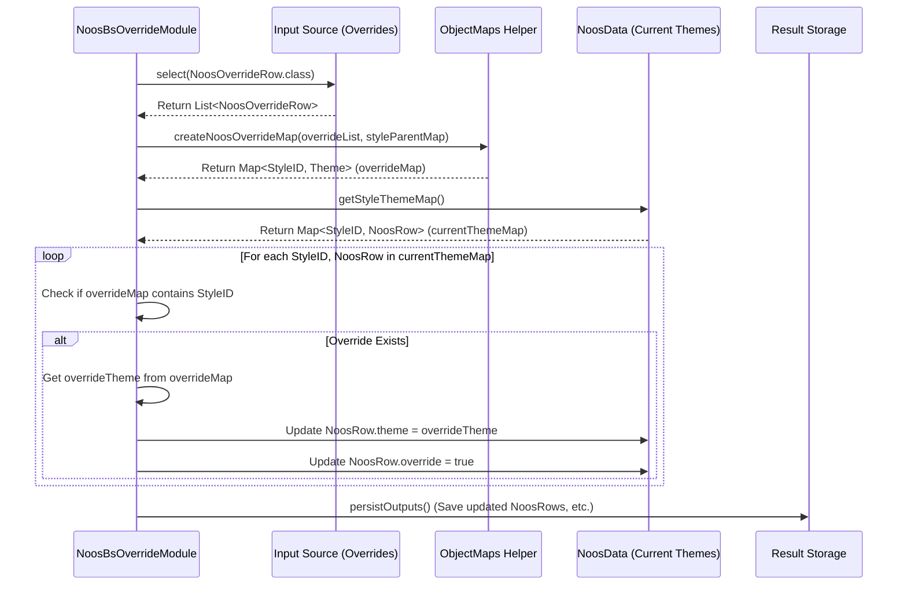

# Chapter 25: NoosBsOverrideModule

Welcome back! In the [previous chapter](24_noosparamountsizesmodule_.md), we explored the [NoosParamountSizesModule](24_noosparamountsizesmodule_.md), which helps us identify the most important sizes for our key products. By now, the system has automatically analyzed sales consistency to find "Core" items ([NoosCoreComputeModule](22_nooscorecomputemodule_.md)) and sales performance to find "Bestseller" items ([NoosBestsellerComputeModule](23_noosbestsellercomputemodule_.md)).

But what if the computer's analysis doesn't quite match the business's strategy or intuition?

## What Problem Does This Module Solve?

Imagine the system analyzed a newly launched jacket style. Because it's new, it doesn't have a long sales history, so the automated modules classified it as "Fashion". However, the merchandising team *knows* this jacket is designed to be a long-term "Core" item for the brand. They want to *force* the system to treat it as Core right from the start, regardless of the limited historical data.

Conversely, maybe an old "Core" item is being phased out. The system might still see consistent (but declining) sales, but the business wants to stop treating it as Core and exclude it from automatic reordering.

How can users manually correct or adjust the system's automated NOOS (Core/Bestseller/Fashion) classifications?

The **`NoosBsOverrideModule`** solves this exact problem. It acts like a **manual adjustment layer** or the **manager's final say** on top of the automated NOOS calculations. It allows users to provide specific instructions to:
*   Force a style into a specific category (Core, Bestseller, or Fashion/Empty).
*   Effectively exclude a style from NOOS consideration (by marking it as Fashion/Empty).

This ensures the final NOOS classification aligns perfectly with business strategy, even if the raw data hasn't caught up yet or if specific exceptions are needed.

## Core Idea: Applying Manual Rules

Think of the automated NOOS modules as diligent analysts presenting their findings. The `NoosBsOverrideModule` is like the experienced manager reviewing the report and making final adjustments based on broader knowledge.

The process is simple:
1.  **Automated Classification:** The `NoosCoreComputeModule` and `NoosBestsellerComputeModule` run first, assigning an initial `StyleTheme` (CORE, BESTSELLER, or FASHION) to each style.
2.  **Read Override Rules:** The `NoosBsOverrideModule` reads a list of specific instructions provided by the user (in the `NoosOverrideRow` format).
3.  **Apply Overrides:** For each style mentioned in the override rules, this module updates its `StyleTheme` to match the instruction, overwriting the automatically calculated theme. It also flags that an override was applied.

## How It Works (The Process)

This module runs as the final step in the NOOS identification sequence managed by [NOOS Identification (NoosGroupModule)](21_noos_identification__noosgroupmodule__.md).

**Inputs:**
*   **Override Rules (`NoosOverrideRow`):** This is the crucial input, usually loaded from a file or table. Each row specifies a `style` ID and the desired `theme` (e.g., CORE, BESTSELLER, FASHION, or EMPTY).
    ```java
    // File: src/main/java/com/increff/irisx/row/input/ap/NoosOverrideRow.java
    package com.increff.irisx.row.input.ap;

    import com.increff.irisx.constants.ap.StyleTheme;

    // Blueprint for manual override instructions
    public class NoosOverrideRow {
        public int style;       // The Style ID to override
        public StyleTheme theme; // The desired final theme
    }
    ```
    *Example Input:*
    | style | theme      |
    | :---- | :--------- |
    | 123   | CORE       |  *(Force style 123 to be Core)*
    | 456   | FASHION    |  *(Force style 456 to be Fashion)*
    | 789   | BESTSELLER |  *(Force style 789 to be Bestseller)*

*   **Current NOOS Classifications:** The results from the previous Core and Bestseller modules (usually stored in the shared `NoosData.styleThemeMap`).
*   **Parent Style Map (Optional):** `styleParentMap` from the [Cache](05_cache_.md) might be used to ensure overrides applied to parent styles also affect their children.

**Calculation Steps:**
1.  **Load Overrides:** Read all `NoosOverrideRow` entries from the input source.
2.  **Create Override Map:** Convert the list of override rows into a `Map<Integer, StyleTheme>` where the key is the `style` ID and the value is the target `theme`. This map allows for quick checking if an override exists for a given style. (This often uses `ObjectMaps.createNoosOverrideMap`).
3.  **Apply to Existing Themes:** Iterate through the current NOOS classification map (`NoosData.styleThemeMap`). For each style in the map:
    a.  Check if an override exists for this style ID in the override map created in step 2.
    b.  If an override *is* found:
        i.  Update the style's `theme` in the `NoosData.styleThemeMap` to the theme specified in the override map.
        ii. Set the `override` flag in the corresponding `NoosRow` object to `true`.
4.  **Persist Final Results:** Save the updated `NoosRow` data (which now reflects the overrides) to the final output location. Other denormalized outputs might also be generated here.

**Outputs:**
*   The final, definitive list of **`NoosRow`** objects, where the `theme` reflects any applied overrides and the `override` flag indicates which ones were manually set. This is the primary output used by downstream modules.
*   Potentially other related output rows like `ExportNoosOutputRow`, `DenormalizedNoosOutputRow` etc., created using helpers like `DenormalizedNoosOutputsHelper`.

## Under the Hood: Looking Up and Updating

The core logic involves creating a lookup map from the override rules and then updating the main theme map based on those rules.

**Walkthrough:**

1.  The module starts (`runInternal`).
2.  It loads the `List<NoosOverrideRow>` from the database/input source (`db().select(NoosOverrideRow.class)`).
3.  It calls a helper (like `ObjectMaps.createNoosOverrideMap`) to efficiently convert this list into `Map<Integer, StyleTheme> noosOverrideMap`. This helper might also handle applying parent overrides to children using the `styleParentMap`.
4.  It gets the current theme map (`Map<Integer, NoosRow> styleThemeMap = noosData.getStyleThemeMap();`).
5.  It loops through each entry (`style`, `noosRow`) in the `styleThemeMap`.
6.  Inside the loop, it checks `if (noosOverrideMap.containsKey(style))`.
7.  If true, it retrieves the override theme (`StyleTheme overrideTheme = noosOverrideMap.get(style);`).
8.  It updates the current `NoosRow`: `noosRow.theme = overrideTheme;` and `noosRow.override = true;`.
9.  After the loop finishes, it calls `persistOutputs()` to save the modified `styleThemeMap` (as `NoosRow` objects) and other related outputs.

**Sequence Diagram:**



**Code Dive:**

Let's look at the relevant `applyOverrides` and `persistOutputs` methods from `NoosBsOverrideModule.java`.

*   **Applying the Overrides (`applyOverrides`):**

    ```java
    // Simplified from NoosBsOverrideModule.java
    private void applyOverrides() {
        logger.info("Overriding NOOS output");
        // 1. Load Override rules
        List<NoosOverrideRow> noosOverrideList = db().select(NoosOverrideRow.class);

        // If no overrides provided, nothing to do
        if (noosOverrideList.isEmpty()) {
            logger.info("No override rules found.");
            return;
        }

        // 2. Create the lookup map using ObjectMaps helper
        // This helper handles parent-child mapping if needed
        Map<Integer, StyleTheme> noosOverrideMap = ObjectMaps.createNoosOverrideMap(
                                                        noosOverrideList,
                                                        cache.getStyleParentMap());

        // 3. Get the current theme map (which holds NoosRow objects)
        Map<Integer, NoosRow> styleThemeMap = noosData.getStyleThemeMap();

        // 4. Iterate and apply overrides
        styleThemeMap.forEach((style, noosRow) -> {
            // Check if an override exists for this style
            if (noosOverrideMap.containsKey(style)) {
                // Apply the override
                noosRow.theme = noosOverrideMap.get(style);
                noosRow.override = true; // Mark that it was overridden
                logger.debug("Applied override for style " + style + ": Theme=" + noosRow.theme);
            }
        });
        logger.info("Overrides applied.");
    }
    ```
    **Explanation:** This method loads the `NoosOverrideRow` list, uses `ObjectMaps` to create an efficient lookup map (`noosOverrideMap`), gets the current classifications from `NoosData`, and then iterates through them. If an override exists for a style, it updates the `theme` and `override` flag in the `NoosRow` object stored within the `NoosData` map.

*   **Saving Final Results (`persistOutputs`):**

    ```java
    // Simplified from NoosBsOverrideModule.java
    @Autowired private DenormalizedNoosOutputsHelper denormalizedNoosOutputsHelper;
    // Other maps like coreRowMap, bsOutputMap are potentially loaded before this

    private void persistOutputs() {
        // 1. Save the final NoosRow data (reflecting overrides)
        persistOutput(NoosRow.class, new ArrayList<>(noosData.getStyleThemeMap().values()));

        // 2. Generate and save other useful output formats using helpers
        // Example: Export format
        ArrayList<ExportNoosOutputRow> exportRows = denormalizedNoosOutputsHelper
            .getExportNoosOutputRows(noosData.getStyleThemeMap().values(), coreRowMap, bsOutputMap);
        persistOutput(ExportNoosOutputRow.class, exportRows);

        // Example: Denormalized format
        ArrayList<DenormalizedNoosOutputRow> denormRows = denormalizedNoosOutputsHelper
            .getDenormNoosOutputRows(noosData.getStyleThemeMap().values(), coreRowMap, bsOutputMap, /*...*/);
        persistOutput(DenormalizedNoosOutputRow.class, denormRows);

        // ... Persist other summary or denormalized rows ...
    }

    // Helper method to persist a list of objects to the database/output
    public <T> void persistOutput(Class<T> clazz, ArrayList<T> list) {
        db().truncateInsert(clazz, list); // Efficiently replace existing data
        db().persistTable(clazz);         // Ensure data is written
        logger.info("Persisted output for: " + clazz.getSimpleName());
    }
    ```
    **Explanation:** After overrides are applied, this method takes the final collection of `NoosRow` objects from `noosData.getStyleThemeMap().values()` and saves them using the `persistOutput` helper. It also uses the `DenormalizedNoosOutputsHelper` to create and save other convenient output formats that combine NOOS results with other details.

## Conclusion

The **`NoosBsOverrideModule`** serves as the crucial **manual control point** for the NOOS classification process.

*   It allows users to **override** the automatically calculated Core/Bestseller/Fashion status for any style based on business rules or strategy.
*   It reads override instructions from **`NoosOverrideRow`** input.
*   It applies these overrides to the results generated by the Core and Bestseller compute modules, updating the final **`NoosRow`** data.
*   It ensures the final NOOS classifications used by downstream modules accurately reflect both data analysis and business intent.

This module provides essential flexibility, allowing the automated system to be fine-tuned based on human expertise and strategic goals.

With the NOOS classification finalized, the focus often shifts to planning the assortment. A key aspect of this is determining the ideal range of sizes to offer for products. The next chapter introduces the [Ideal Size Set (ISS) Module (ApIssGroupModule)](26_ideal_size_set__iss__module__apissgroupmodule__.md).

[Next Chapter: Ideal Size Set (ISS) Module (ApIssGroupModule)](26_ideal_size_set__iss__module__apissgroupmodule__.md)

---

Generated by [AI Codebase Knowledge Builder](https://github.com/The-Pocket/Tutorial-Codebase-Knowledge)