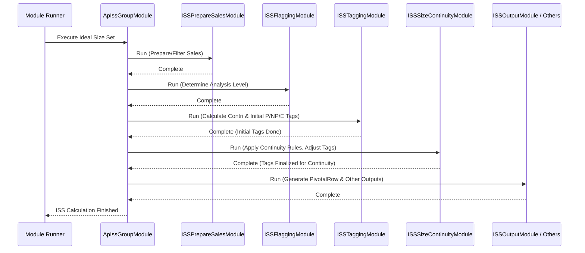

# Chapter 26: Ideal Size Set (ISS) Module (ApIssGroupModule)

Welcome back! In the [previous chapter](25_noosbsoverridemodule_.md), we learned how the [NoosBsOverrideModule](25_noosbsoverridemodule_.md) allows manual adjustments to the automated Core/Bestseller classifications, giving the final say on which styles are considered NOOS (Never Out Of Stock).

Now that we know *which styles* are important (Core and Bestseller), we need to figure out *which sizes* of those styles are most important to keep in stock for a specific store or sales channel (like online vs. offline).

## What Problem Does This Module Solve?

Imagine you're managing the T-shirt section in a specific clothing store, say "Store 101". You carry a popular V-Neck T-shirt style (identified as Core). This T-shirt comes in sizes S, M, L, XL, and XXL.

Do you need to stock *all five* sizes in Store 101? Maybe this store's customers primarily buy sizes M, L, and XL. Stocking lots of S and XXL might lead to unsold inventory sitting on the shelves, costing money and space. But *not* stocking M, L, or XL would mean losing sales from customers who want those sizes.

How do you decide the **"ideal" range of sizes** to offer for this T-shirt style *in this specific store*? You want enough sizes to capture most of the potential sales, but not so many that you have lots of slow-moving stock. Making this decision manually for every style in every store is incredibly complex.

The **Ideal Size Set (ISS) Module**, orchestrated by `ApIssGroupModule`, solves this problem. It acts like a smart sizing advisor. It analyzes sales data for specific product groups (like "Men's V-Neck T-shirts" - often defined by an [AgRow](16_agrow_.md)) within a particular store or channel. Its goal is to recommend the optimal set of sizes to stock, balancing sales potential against inventory costs.

## Core Concepts

The ISS module uses several key ideas to determine the ideal size set:

1.  **Size Contribution:** It looks at how much each individual size (S, M, L, XL, XXL) contributes to the total sales (often quantity sold) of the product group within that specific store or channel.
    *   *Example:* For V-Necks in Store 101, maybe M contributes 35%, L contributes 30%, XL contributes 20%, S contributes 10%, and XXL contributes 5%.

2.  **Pivotal, Non-Pivotal, and Exit Sizes:** Based on their contribution, sizes are tagged:
    *   **Pivotal (P):** The high-selling sizes that make up the bulk of the sales (e.g., the sizes contributing to the top 70-80% of quantity). These are the must-have sizes. In our example, M, L, and XL might be Pivotal.
    *   **Exit (E):** The lowest-selling sizes with very small contribution (e.g., contributing less than 5%). These are candidates for not being stocked. In our example, XXL might be an Exit size.
    *   **Non-Pivotal (NP):** Sizes that fall in between Pivotal and Exit. They sell reasonably well but aren't top performers. They might be stocked, but perhaps with less depth than Pivotal sizes. In our example, S might be Non-Pivotal.
    *   *(Benchmarks for these tags often come from configuration like `SizeSetPropertiesRow`)*.

3.  **Size Continuity:** This is a crucial check! Imagine the analysis suggests S (NP), L (P), and XL (P) should be stocked, but M (which falls between S and L) is initially tagged as Exit due to slightly lower sales. Stocking S, L, XL without M creates a gap that looks strange to customers and might lose sales from people who need M. The ISS module often applies rules to ensure size runs are continuous, especially around Pivotal sizes. It might "upgrade" the M from Exit to Non-Pivotal to fill the gap between S and L.

4.  **Store/Channel Specificity:** The ideal size set isn't the same everywhere. A downtown store might sell more S and M, while a suburban store sells more L and XL. The online channel might need a wider range than physical stores. The ISS analysis is done specifically for relevant store/channel groupings.

## How It Works (The Workflow)

Similar to the [NOOS Identification (NoosGroupModule)](21_noos_identification__noosgroupmodule__.md), the `ApIssGroupModule` acts as an orchestrator, running a sequence of specialized sub-modules to perform the ISS analysis.

1.  **Prepare Sales (`ISSPrepareSalesModule`):** Gathers and filters the necessary sales data ([ProductSalesRow](13_productsalesrow_.md)) for the analysis period and relevant product groups. It might apply filters based on sales quality or historical availability (using the [View](10_view_.md) helper).
2.  **Flagging (`ISSFlaggingModule`):** Performs initial analysis or applies rules to group or flag store/attribute group combinations based on sales patterns or data availability. This helps decide *how* the tagging should be done (e.g., using local store data vs. rolling up to a higher level like channel or region if store data is sparse).
3.  **Tagging (`ISSTaggingModule`):** This is where the core P/NP/E tagging happens. For each relevant store/attribute group combination, it calculates the sales contribution of each size and compares it against benchmarks (often from `SizeSetPropertiesRow`) to assign the initial Pivotal, Non-Pivotal, or Exit tag.
4.  **Continuity Check (`ISSSizeContinuityModule`):** Examines the tagged sizes for each group. It checks for gaps (like an E or NP between two P sizes) and applies rules to upgrade tags (e.g., E -> NP, or NP -> P) to ensure a logical, continuous run of sizes, especially around the Pivotal ones.
5.  **Final Output (`ISSOutputModule`, `ISSChannelAgSizeContri`):** Consolidates the results, generating the final output that specifies the recommended tag (P, NP, E) for each size within each store/attribute group combination. It might also calculate overall size contributions at the channel/attribute group level.

**Inputs:**
*   Sales Data ([ProductSalesRow](13_productsalesrow_.md)), often prepared/filtered by `ISSPrepareSalesModule`.
*   Attribute Group definitions ([AgRow](16_agrow_.md)) from the [Cache](05_cache_.md).
*   Store Master Data ([StoreRow](09_row_input_output_classes_.md)).
*   SKU Master Data ([SkuRow](09_row_input_output_classes_.md)) for size information.
*   Size Set Properties ([`SizeSetPropertiesRow`](09_row_input_output_classes_.md)) providing benchmarks for P/NP/E tagging (e.g., `qtyPiv`, `qtyExit` percentages).
*   Category Size Sequences ([`CatSizeSeqRow`](09_row_input_output_classes_.md)) defining the natural order of sizes for continuity checks.
*   Configuration ([`IssArgs`](03_configuration___arguments__args_classes__.md)) for analysis duration, continuity flags, etc.

**Output:**
*   The primary output is the **`PivotalRow`** data. Each `PivotalRow` specifies for a given `store`, attribute group (`ag`), and `size`:
    *   `sizeGroup`: The final tag ([`PivotalTag`](07_enumerations__enums__.md) enum: P, NP, E).
    *   `contri` / `adjContri`: Calculated quantity contribution percentages.
    *   `flag`: Indicates how the tagging was derived (e.g., from store-level data, channel-level data, etc., based on `ISSFlaggingModule`).
    *   `sizeSeq`: An ID representing the size sequence this size belongs to (used for continuity).

```java
// Simplified structure of PivotalRow
// File: src/main/java/com/increff/irisx/row/output/iss/PivotalRow.java
package com.increff.irisx.row.output.iss;

import com.increff.irisx.constants.ap.PivotalTag;

// Output row defining the tag for a size in a store/AG
public class PivotalRow {

    public int store;       // Store ID
    public int ag;          // Attribute Group ID
    public String size;     // The specific size (e.g., "M")

    public int sizeSeq;     // ID of the size sequence (for continuity)
    public PivotalTag sizeGroup; // The final tag (P, NP, E)

    public int flag;        // How this result was derived (e.g., store/channel level)

    public double qty;       // Sales quantity for this size in this group/store
    public double contri;    // % contribution (before adjustments)
    public double adjContri; // % contribution (after adjustments/normalization)
    public double qtyPiv;    // The % threshold used to determine Pivotal status

    public double rawQty;      // Raw sales qty (broader scope?)
    public double unbrokenQty; // Sales qty from "unbroken" periods

    public PivotalRow(){
        this.sizeGroup = PivotalTag.EMPTY; // Default
    }
}
```
*   Other related outputs like `ExportIssOutputRow` and `ExportChannelAgSizeFinalContributionRow` might also be generated for reporting and analysis.

This `PivotalRow` data tells downstream modules (like Assortment Planning or Replenishment) exactly which sizes are considered essential (P), optional (NP), or potentially excludable (E) for each product group in each location.

## Under the Hood: Orchestration and Key Logic

**1. Orchestration (`ApIssGroupModule.java`):**
This module simply defines the sequence of execution for the sub-modules.

```java
// Simplified from ApIssGroupModule.java
@Component
public class ApIssGroupModule extends AbstractUtilModuleGroup {

    // Autowire all the sub-modules
    @Autowired private ISSPrepareSalesModule issPrepareSales;
    @Autowired private ISSFlaggingModule issFlagging;
    @Autowired private ISSTaggingModule issTagging;
    @Autowired private ISSSizeContinuityModule issSizeContinuityModule;
    @Autowired private ISSOutputModule issOutput;
    @Autowired private ISSNewStoreModule issNewStoreModule; // Handles new stores
    @Autowired private ISSChannelAgSizeContri issChannelAgSizeContri; // Calculates final contribution
    // ... Standard snapshot/sync modules ...

    @PostConstruct // Run after creation
    public void init() {
        captureSnapshot(); // Standard step
        // Define the execution order
        add(issPrepareSales);
        add(issFlagging);
        add(issTagging);
        add(issSizeContinuityModule);
        add(issOutput);
        add(issNewStoreModule);
        add(issChannelAgSizeContri);
        uploadOutput(); // Standard step
    }
    // ... captureSnapshot() and uploadOutput() methods ...
}
```
**Explanation:** Similar to `NoosGroupModule`, the `init()` method uses `add()` to list the sub-modules (`issPrepareSales`, `issFlagging`, etc.) in the precise order they need to run to perform the complete ISS calculation.

**Sequence Diagram (High-Level Flow):**


**2. Key Logic Example: Tagging (`ISSTaggingModule`):**
This module calculates contributions and applies benchmarks.

```java
// Conceptual logic within ISSTaggingModule.computeIssMetricsRevenue

// For each store-AG combination (key)...
issModuleData.getIssDataMap().forEach((key, issMetrics) -> {
    // Get benchmarks for this store/category from SizeSetPropertiesRow
    SizeSetPropertiesRow sizeSetProperty = sizeSetPropertiesMap.get(/*...*/);
    if (sizeSetProperty == null) return; // Skip if no benchmarks

    // Calculate quantity contribution % for each size in issMetrics.sizeDataList
    // (Uses ISSUtil.computeQtyContri)
    ISSUtil.computeQtyContri(issMetrics.sizeDataList);

    // Calculate the contribution threshold for Pivotal sizes
    // (Uses ISSUtil.computeQtyPiv based on sorted sizes and config % )
    issMetrics.quantityPivotalPerc = ISSUtil.computeQtyPiv(
                                          issMetrics.sizeDataList,
                                          sizeSetProperty.qtyPiv, // e.g., 70%
                                          sizeSetProperty.qtyPivTtl // e.g., 80%
                                      );

    // Tag each size based on its contribution vs pivotal and exit thresholds
    // (Uses ISSUtil.tagSizes)
    ISSUtil.tagSizes(sizeSetProperty,          // Contains qtyExit threshold
                     issMetrics.sizeDataList,
                     issMetrics.quantityPivotalPerc); // Pivotal threshold

    // Calculate adjusted contribution (normalized for non-Exit sizes)
    // (Uses ISSUtil.computeAdjQtyContri)
    ISSUtil.computeAdjQtyContri(issMetrics.sizeDataList);
});
```
**Explanation:** The tagging module gets pre-calculated sales data per size (`issMetrics.sizeDataList`). It fetches the specific benchmarks (like `qtyPiv` = 70%, `qtyExit` = 5%) for this group from `SizeSetPropertiesRow`. Helper methods in `ISSUtil` then calculate the actual contribution percentage for each size, determine the exact threshold for being Pivotal, and finally assign the P, NP, or E tag to each size based on these thresholds.

**3. Key Logic Example: Continuity (`ISSSizeContinuityModule`):**
This module adjusts tags to prevent gaps.

```java
// Simplified logic within ISSSizeContinuityModule.maintainPivotalContinuity

// Assume sizeDataList is sorted according to the natural size order (e.g., S, M, L, XL)
List<SizeData> sizeDataList = new ArrayList<>(sizeDataSet);

// Find the index of the first ('lowest') Pivotal size
int lowPivIndex = getLowerPivotalIndex(sizeDataList); // Finds first 'P'
// Find the index of the last ('highest') Pivotal size
int highPivIndex = getHigherPivotalIndex(sizeDataList); // Finds last 'P'

if (lowPivIndex == Integer.MIN_VALUE || highPivIndex == Integer.MIN_VALUE) {
    return new HashSet<>(sizeDataList); // No Pivotal sizes or only one
}

// Loop through sizes *between* the first and last Pivotal sizes
for (int i = lowPivIndex + 1; i < highPivIndex; i++) {
    // Force any size in this range (originally NP or E) to become Pivotal
    sizeDataList.get(i).sizeGroup = PivotalTag.P;
}

return new HashSet<>(sizeDataList); // Return the adjusted set
```
**Explanation:** This logic first finds the range spanned by the Pivotal sizes (from the smallest P size to the largest P size). Then, it iterates through all sizes that fall *within* that range. Any size found within this range that wasn't already Pivotal (i.e., it was NP or E) gets "upgraded" to Pivotal (P) to ensure there are no gaps in the Pivotal run.

## Conclusion

The **Ideal Size Set (ISS) Module**, managed by **`ApIssGroupModule`**, is responsible for determining the optimal set of sizes to stock for product groups in specific stores or channels.

*   It analyzes **sales contribution** by size to identify **Pivotal (P)**, **Non-Pivotal (NP)**, and **Exit (E)** sizes based on configurable benchmarks.
*   It crucially applies **size continuity** rules to prevent gaps in the recommended size range, especially around Pivotal sizes.
*   The process involves multiple steps orchestrated by `ApIssGroupModule`, including data preparation, flagging, tagging, continuity checks, and output generation.
*   The primary output is **`PivotalRow`** data, which provides the final P/NP/E tag for each size, guiding assortment and inventory decisions.

By providing a data-driven recommendation for the ideal size range, the ISS module helps businesses optimize their assortments, maximize sales potential, and minimize holding costs for slow-moving sizes.

The concept of tagging sizes as Pivotal, Non-Pivotal, or Exit is central to this module. The next chapter dives deeper into the meaning and usage of the [Pivotal Tag / PivotalRow](27_pivotal_tag___pivotalrow_.md).

[Next Chapter: Pivotal Tag / PivotalRow](27_pivotal_tag___pivotalrow_.md)

---

Generated by [AI Codebase Knowledge Builder](https://github.com/The-Pocket/Tutorial-Codebase-Knowledge)