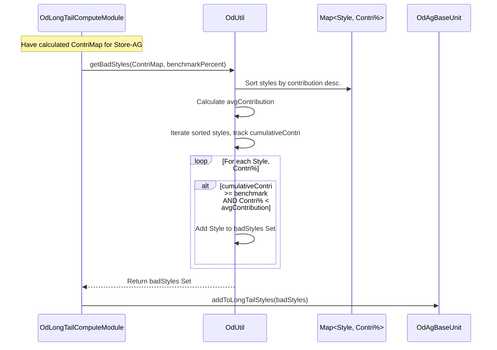

# Chapter 30: OD Long Tail Calculation

Welcome back! In the [previous chapter](29_od_segmentation_.md), we saw how **OD Segmentation** helps us classify product groups (like "Men's V-Neck T-shirts in Store 101") into performance categories like TOP, MODERATE, or SLOW. This gives us a great high-level view.

But even within a group classified as, say, MODERATE, not all individual styles might perform equally. Some styles might sell reasonably well, while others barely sell at all. Should we treat all styles within that MODERATE group the same when planning our assortment? Probably not!

## What Problem Does Long Tail Calculation Solve?

Imagine a streaming service like Netflix. They have:
*   **Head:** A few extremely popular blockbuster movies and hit TV shows that almost everyone watches.
*   **Torso:** Many well-known and moderately popular titles that lots of people enjoy.
*   **Long Tail:** A vast library of older, niche, or less-known movies and shows that individual users might watch occasionally, but each title gets very few views compared to the hits.

Retail assortments often look similar. Within a product group (like T-shirts), you'll have your popular "head" styles, your solid "torso" styles, and then a "long tail" of styles that sell very infrequently.

While these "long tail" styles might not sell much individually, having too many of them can cause problems:
*   **Inefficiency:** Managing inventory, shelf space, and data for items that barely sell costs time and money.
*   **Complexity:** A huge number of low-selling items makes analysis and planning more difficult.
*   **Lost Focus:** Resources might be diverted to managing the long tail instead of focusing on the more impactful "head" and "torso" styles.

The **OD Long Tail Calculation** process aims to solve this by identifying these low-performing, infrequent sellers within each product group (Store-AttributeGroup combination). The goal is to flag these "long tail" styles so that later planning steps (like deciding assortment width) can potentially filter them out or handle them differently. This helps streamline the assortment and focus efforts on the items that make a bigger impact.

## Core Idea: Identifying the Least Contributors

The core idea is to rank the individual styles *within* a specific group (e.g., MODERATE-segmented Men's V-Neck T-shirts in Store 101) based on their contribution to the group's overall performance (usually revenue or sales volume). We then identify the styles that fall into the bottom percentage of contributors – these form the "long tail".

Here's the typical approach:

1.  **Define the Group:** Look at a specific Store-AttributeGroup combination (e.g., Store 101, AG 500) for a particular period.
2.  **Measure Style Performance:** For each individual style belonging to that AG in that store, calculate a key performance metric. A common one is **revenue per live day** (Total Revenue for the Style / Number of Days it was Live).
3.  **Calculate Total Performance:** Sum up the performance metric across all styles in the group (e.g., total revenue per live day for AG 500).
4.  **Calculate Contribution %:** For each style, determine what percentage of the group's total performance it represents.
    *   `Style Contribution % = (Style Performance / Group Total Performance) * 100`
5.  **Rank Styles:** Sort the styles within the group from highest contribution % to lowest.
6.  **Identify the Tail:** Start accumulating the contribution percentages from the *bottom* of the sorted list. The styles that fall within a predefined bottom threshold (e.g., the bottom 10% or 15% of contribution, defined by `longTailRevContriBenchmark` in `OdArgs`) are flagged as the "long tail".

Think of it like lining up all the styles by how much revenue they bring in per day. The ones at the very end of the line, contributing very little, are the long tail.

## How It Works (The Process)

The long tail calculation is usually performed by the `OdLongTailComputeModule`, running as part of the sequence orchestrated by the [Optimum Depth (OD) Module (ApOdGroupModule)](28_optimum_depth__od__module__apodgroupmodule__.md). It typically runs *before* the main segmentation happens, as the identification of long tail items might influence subsequent steps.

**Inputs:**
*   Prepared sales and live day data (often stored in `OdAgBaseUnit` objects within `OdData`, which holds metrics per Store-AG-Style).
*   Configuration ([OdArgs](03_configuration___arguments__args_classes__.md)) specifying the `longTailRevContriBenchmark` percentage (e.g., 15.0 for bottom 15%).

**Calculation Steps:**
1.  **Calculate Revenue Per Day:** The module first ensures that the revenue per live day is calculated for each individual style within each Store-AG combination. (This might be done earlier or within this module).
2.  **Group by Store-AG:** Process data group by group (Store-AG).
3.  **Calculate Contributions:** For each Store-AG group:
    a.  Get the map of `Style ID -> Revenue Per Live Day` for all styles in this group.
    b.  Calculate the total revenue per live day for the entire group by summing the values in the map.
    c.  Create a new map of `Style ID -> Contribution %`.
4.  **Filter Long Tail:** Pass the `Style ID -> Contribution %` map to a helper function (like `OdUtil.getBadStyles`) along with the `longTailRevContriBenchmark`. This function:
    a.  Sorts the styles based on contribution (descending).
    b.  Identifies the styles falling into the bottom benchmark percentage.
5.  **Store Flags:** Store the set of identified "long tail" style IDs associated with the Store-AG group (e.g., adding them to a `longTailStyles` set within the `OdAgBaseUnit` object in `OdData`).

**Outputs:**
*   The main output is the updated internal data structure (`OdData`, specifically within `OdAgBaseUnit` objects) where the identified long tail styles for each Store-AG group are flagged or stored in a set.
*   The module might also persist intermediate results like `OdStyleDaysRow` for analysis.

**How the Flags are Used:**
Later modules, particularly those determining assortment width or final depth, can check these flags. If a style is flagged as "long tail" for a specific Store-AG, the planning logic might decide *not* to include that style in the assortment for that store, even if the overall AG segment was MODERATE or TOP. This helps prune the assortment width effectively.

## Under the Hood: Ranking and Filtering

Let's focus on the core logic of identifying the tail once contributions are calculated. This often involves a helper function like `OdUtil.getBadStyles`.

**Conceptual Walkthrough (Example: Bottom 15%):**

Assume for Store 101 / AG 500, we have these styles and their contribution % to the group's total revenue per day:

| Style ID | Contribution % |
| :------- | :------------- |
| Style A  | 40%            |
| Style B  | 30%            |
| Style C  | 15%            |
| Style D  | 8%             |
| Style E  | 5%             |
| Style F  | 2%             |

**Goal:** Identify styles in the bottom 15%.

1.  **Sort:** The list is already sorted descending by contribution.
2.  **Average Contribution:** Calculate average contribution (optional but used in `OdUtil.getBadStyles` logic): 100% / 6 styles = ~16.7%.
3.  **Identify Tail:** Iterate from the top, keeping track of cumulative contribution. The `OdUtil.getBadStyles` logic has a specific condition: flag a style if the cumulative contribution *before* it is >= the benchmark (85% for a 15% tail) AND its *own* contribution is less than the average contribution.
    *   Style A (40%): Cumulative=0%. 0 < 85. Not tail.
    *   Style B (30%): Cumulative=40%. 40 < 85. Not tail.
    *   Style C (15%): Cumulative=70%. 70 < 85. Not tail.
    *   Style D (8%): Cumulative=85%. 85 >= 85. Check own contribution: 8% < Avg (16.7%). -> **Flag Style D as Tail**.
    *   Style E (5%): Cumulative=93%. 93 >= 85. Check own contribution: 5% < Avg (16.7%). -> **Flag Style E as Tail**.
    *   Style F (2%): Cumulative=98%. 98 >= 85. Check own contribution: 2% < Avg (16.7%). -> **Flag Style F as Tail**.

**Result:** Long Tail Styles = {Style D, Style E, Style F}.

**Sequence Diagram (Identifying Tail for One Group):**



**Code Dive:**

Let's examine the simplified code for this logic.

*   **Calling the Filter (`OdLongTailComputeModule.longTailFilter`):**

    ```java
    // Simplified from OdLongTailComputeModule.java
    private void longTailFilter() {
        // Loop through all calculated Store-AG base units
        odData.getAllCatBaseUnits().forEach(catBaseUnit -> {
            catBaseUnit.getAllAgBaseUnits().forEach(agBaseUnit -> {
                // 1. Get the map of Style -> Revenue Per Day for this AG
                Map<Integer, Double> styleRevPerDayMap = agBaseUnit.getStyleRevPerDayMap();

                // 2. Calculate the contribution % map
                Map<Integer, Double> styleRevPerDayContriMap = getRevContriMap(styleRevPerDayMap);

                // 3. Sort the contribution map (descending)
                Map<Integer, Double> sortedMap = styleRevPerDayContriMap.entrySet().stream()
                    .sorted(Collections.reverseOrder(Map.Entry.comparingByValue()))
                    .collect(Collectors.toMap(Map.Entry::getKey, Map.Entry::getValue, (e1, e2) -> e2, LinkedHashMap::new));

                // 4. Call OdUtil to get the set of "bad" (long tail) styles
                Set<Integer> longTailStyles = OdUtil.getBadStyles(
                                                  sortedMap,
                                                  odArgs.longTailRevContriBenchmark // e.g., 85.0
                                              );

                // 5. Store the identified long tail styles in the base unit object
                agBaseUnit.addToLongTailStyles(longTailStyles);
            });
        });
    }

    // Helper to calculate contribution %
    private static Map<Integer, Double> getRevContriMap(Map<Integer, Double> revenueMap) {
        double totalAgRevPerDay = revenueMap.values().stream().mapToDouble(d->d).sum();
        Map<Integer, Double> revContriMap = new HashMap<>(revenueMap.size());
        revenueMap.forEach((key, value) ->
                revContriMap.put(key, MathUtil.divide(value * 100.0, totalAgRevPerDay)));
        return revContriMap;
    }
    ```
    **Explanation:** This code iterates through each Store-AG group (`agBaseUnit`). It gets the performance map (`styleRevPerDayMap`), calculates the contribution percentage for each style (`getRevContriMap`), sorts the styles by contribution, and then calls `OdUtil.getBadStyles` with the sorted map and the benchmark percentage (e.g., 85%, meaning we want to identify the bottom 15%) to get the set of long tail styles. This set is then stored within the `agBaseUnit`.

*   **Identifying the Tail (`OdUtil.getBadStyles`):**

    ```java
    // Simplified from OdUtil.java
    /**
     * Applies long tail filter and returns the bad styles (those below benchmark).
     * Benchmark is specified from the TOP (e.g., 85 means filter out bottom 15).
     */
    public static Set<Integer> getBadStyles(Map<Integer, Double> sortedStyleRevContriMap,
                                            double benchmarkContri) {
        Set<Integer> badStyles = new HashSet<>();

        // Filter out styles with zero or negative contribution first
        sortedStyleRevContriMap.forEach((style, revenue) -> {
            if (Double.compare(revenue, GenericConstants.DOUBLE_ZERO) <= 0)
                badStyles.add(style);
        });

        int noOfGoodStyles = sortedStyleRevContriMap.size() - badStyles.size();
        if (noOfGoodStyles <= 0) return badStyles; // No "good" styles left

        // Calculate average contribution among the "good" styles
        double avgStyleContri = MathUtil.divide(100.0, noOfGoodStyles);

        double cumulativeContri = 0.0D;
        // Iterate through the styles (already sorted descending by contribution)
        for (int style : sortedStyleRevContriMap.keySet()) {
            // Skip styles already marked as bad (zero contribution)
            if(badStyles.contains(style)) continue;

            double revContri = sortedStyleRevContriMap.get(style);

            // Check the long tail condition:
            // Have we already covered the 'head/torso' (cumulative >= benchmark)?
            // AND Is this style's contribution below average?
            if (Double.compare(cumulativeContri, benchmarkContri) >= 0 &&
                Double.compare(revContri, avgStyleContri) < 0) {
                badStyles.add(style); // If yes, it's part of the long tail
            }
            // Add the current style's contribution to the cumulative total
            cumulativeContri += revContri;
        }
        return badStyles; // Return the set of identified long tail style IDs
    }
    ```
    **Explanation:** This function takes the map of styles sorted by contribution percentage (highest first) and the benchmark (e.g., 85.0). It calculates the average contribution among styles that actually contributed. It then iterates through the sorted styles, accumulating the `cumulativeContri`. Once the `cumulativeContri` reaches the benchmark, any *subsequent* style whose individual contribution is *also* below the average is added to the `badStyles` (long tail) set.

## Conclusion

The **OD Long Tail Calculation**, typically performed within the `OdLongTailComputeModule`, is an important step in refining the Optimum Depth analysis.

*   It identifies **"long tail" styles** – those individual styles within a Store-AttributeGroup that contribute very little to the group's overall performance (e.g., bottom 15% of revenue per day).
*   It works by calculating **contribution percentages**, **ranking styles**, and filtering out those below a defined **benchmark**.
*   Flagging these low-volume styles allows downstream modules (like Assortment Width calculation) to **potentially exclude them**, leading to a more focused and efficient assortment.

By identifying and separating the least significant contributors, this calculation helps optimize the assortment width and focus resources on the styles that truly drive the business.

After segmenting performance and handling the long tail, another important metric for planning is the Average Selling Price (ASP). The next chapter explores how ASP is calculated within the OD process.

[Next Chapter: OD ASP Calculation](31_od_asp_calculation_.md)

---

Generated by [AI Codebase Knowledge Builder](https://github.com/The-Pocket/Tutorial-Codebase-Knowledge)