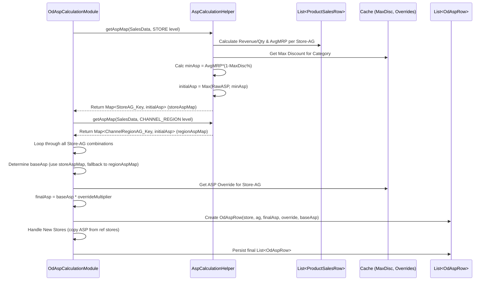

# Chapter 31: OD ASP Calculation

Welcome back! In the [previous chapter](30_od_long_tail_calculation_.md), we explored how the **OD Long Tail Calculation** helps identify the least significant styles within product groups, allowing us to potentially streamline our assortment. Having segmented our products (Chapter 29) and identified the long tail, we now need to understand the *actual price* at which these products tend to sell.

Imagine you're planning your budget ("Open To Buy" or OTB). You know the Maximum Retail Price (MRP) of a T-shirt is $25. But does it *always* sell for $25? Often, due to discounts, promotions, or sales, the actual average price customers pay is lower. If you plan your budget assuming everything sells at full MRP, your financial forecasts might be inaccurate. How can we figure out a more realistic selling price for planning purposes?

## What Problem Does OD ASP Calculation Solve?

Knowing the MRP (the label price) is easy, but it doesn't reflect reality. Discounts and promotions mean the actual money received per item sold – the **Average Selling Price (ASP)** – is usually lower.

Calculating this ASP is essential for:
*   **Financial Planning:** Creating realistic revenue forecasts and budgets (OTB).
*   **Performance Analysis:** Understanding the true profitability of products after discounts.
*   **Pricing Strategy:** Evaluating the effectiveness of promotions.

The **OD ASP Calculation** process, primarily handled by the `OdAspCalculationModule`, solves this problem. It analyzes historical sales data (total revenue and quantity sold) for product groups to determine the *actual* average price items sold at. It also considers business rules, like the maximum allowable discount for a category, to arrive at a final, reliable ASP figure used for planning.

## Core Concepts

1.  **ASP vs. MRP:**
    *   **MRP (Maximum Retail Price):** The "sticker price" or the highest price an item is intended to sell for.
    *   **ASP (Average Selling Price):** The *actual* average price achieved over a period. Calculated as: `Total Revenue / Total Quantity Sold`. ASP is almost always less than or equal to MRP due to discounts.

2.  **Calculation Levels:** ASP can be calculated at different granularities to understand pricing dynamics:
    *   **Store-AG Level:** ASP for a specific Attribute Group ([AgRow](16_agrow_.md)) in a specific store. This is very detailed.
    *   **Channel-Region-AG Level:** ASP for an Attribute Group within a broader region (e.g., "North") and channel (e.g., "Offline Stores"). This provides a more aggregated view, useful if store-level data is sparse or noisy.

3.  **Benchmarks & Overrides:** Simply calculating historical ASP might not be enough.
    *   **Maximum Discount Benchmark:** What if a product historically sold with huge discounts that we don't want to repeat? The system often considers the maximum allowed discount for the product's category (e.g., "T-shirts can have max 30% discount"). It calculates a minimum acceptable ASP based on the average MRP and this maximum discount (`Min ASP = Avg MRP * (1 - Max Discount %)`). The calculated ASP might be adjusted upwards if it falls below this minimum threshold.
    *   **Manual Overrides:** The business might want to set a specific ASP target for planning, overriding the calculated value. The system reads these overrides (`OdAspOverrideRow`) and applies them.

## How It Works (The Process)

The `OdAspCalculationModule` runs as part of the sequence managed by the [Optimum Depth (OD) Module (ApOdGroupModule)](28_optimum_depth__od__module__apodgroupmodule__.md), typically after segmentation.

**Inputs:**
*   Relevant Sales Data ([ProductSalesRow](13_productsalesrow_.md)) for the analysis period (from `OdData`). Includes revenue, quantity, SKU (for MRP), AG, Store (for channel/region).
*   Category Maximum Discount information (from the [Cache](05_cache_.md)).
*   ASP Override rules ([`OdAspOverrideRow`](#relevant-code-snippets) loaded from input).
*   Attribute Group definitions ([AgRow](16_agrow_.md)).
*   Store definitions ([StoreRow](09_row_input_output_classes_.md)).

**Calculation Steps (Simplified):**
1.  **Calculate Raw ASP:** Use a helper (`AspCalculationHelper`) to calculate the raw ASP (Revenue/Quantity) for each product group at both the Store-AG level and the Channel-Region-AG level.
2.  **Calculate Average MRP:** The helper also calculates the average MRP for the items sold within each group at both levels (Total (MRP * Qty) / Total Qty).
3.  **Apply Max Discount Logic:** For each group, the helper determines the minimum acceptable ASP based on the average MRP and the category's maximum discount. It sets an `initialAsp` which is the higher of the raw ASP and this minimum threshold.
4.  **Determine Final Store-Level ASP:** For each Store-AG:
    *   Use the `initialAsp` calculated at the store level if available.
    *   If store-level ASP isn't available (e.g., low sales), fall back to the `initialAsp` calculated at the Channel-Region level.
    *   If neither is available, default to zero.
5.  **Apply Manual Overrides:** Check if an `OdAspOverrideRow` exists for the Store-AG. If yes, apply the specified override multiplier to the ASP calculated in the previous step.
6.  **Handle New Stores:** For stores identified as "new" (often copying assortment from a reference store), copy the calculated ASP values from the reference store.
7.  **Store Output:** Save the results in `OdAspRow` objects.

**Outputs:**
*   **`OdAspRow`** ([Row Input/Output Classes](09_row_input_output_classes_.md)): Stores the final calculated `asp` used for planning, along with the `initialAsp` (before overrides) and the `aspOverride` multiplier that was applied.

```java
// Simplified structure of OdAspRow
// File: src/main/java/com/increff/irisx/row/output/od/OdAspRow.java
package com.increff.irisx.row.output.od;

public class OdAspRow {
    public int period;
    public int store;
    public int ag;          // Attribute Group ID
    public double asp;         // Final ASP (after overrides)
    public double aspOverride; // Override multiplier applied (e.g., 1.0 = no override)
    public double initialAsp;  // ASP calculated before overrides (but after max discount logic)

    // Constructors...
}
```
This `OdAspRow` data provides the realistic selling price expectation needed for accurate financial planning (OTB) and performance assessment.

## Under the Hood: Helper and Module Logic

The calculation involves the main module orchestrating calls to a dedicated helper.

**1. High-Level Steps & Sequence:**



**2. Code Dive: Module Orchestration (`OdAspCalculationModule.java`):**

```java
// Simplified from OdAspCalculationModule.java
@Component
public class OdAspCalculationModule extends AbstractModule {
    // ... Autowired dependencies: odData, commonData, cache, aspCalculationHelper ...
    private Map<Key, Double> storeAgAspMap; // Holds Store-AG initial ASP
    private Map<Key, Double> regionChannelAgAspMap; // Holds Region-Channel-AG initial ASP
    private ArrayList<OdAspRow> odAspRows; // Holds final output

    @Override
    protected void runInternal(Properties properties) {
        init(); // Initialize maps and lists
        Map<Integer, List<ProductSalesRow>> relSalesMap = odData.getRelSalesMap(); // Get relevant sales

        // --- Calculate initial ASP at both levels using the helper ---
        logger.debug("Computing Asp at Region Channel level");
        computeRegionChannelAsp(relSalesMap);
        logger.debug("Computing Asp at store level");
        computeStoreAsp(relSalesMap);

        // --- Determine final ASP and apply overrides ---
        logger.info("Compute Store Ag Asp Output");
        computeAspOutput(); // Calculates final ASP per Store-AG using maps and overrides

        // --- Handle new stores ---
        logger.info("Add Asp output for new stores");
        updateNewStoreAsp(); // Copies ASP from reference stores

        // --- Save results ---
        logger.info("Writing Output");
        persistOutputAndClear(OdAspRow.class, odAspRows);
    }

    // Helper to call AspCalculationHelper for Region/Channel level
    private void computeRegionChannelAsp(Map<Integer, List<ProductSalesRow>> relSalesMap) {
        commonData.getAllPeriods().forEach(period -> {
            // Get initial ASP map from helper for CHANNEL_REGION level
            Map<Key, Double> aspMap = aspCalculationHelper.getAspMap(
                                        relSalesMap.get(period),
                                        AspCalculationLevel.CHANNEL_REGION);
            // Store results in the module's map with period key
            aspMap.forEach((key, asp) -> regionChannelAgAspMap.put(
                new Key(period, key.part(1), key.part(2), key.part(0)), asp)); // period, region, channel, ag
        });
    }

    // Helper to call AspCalculationHelper for Store level (similar structure)
    private void computeStoreAsp(Map<Integer, List<ProductSalesRow>> relSalesMap) {
        // ... calls aspCalculationHelper.getAspMap(..., AspCalculationLevel.STORE) ...
        // ... stores results in storeAgAspMap (Key: period, store, ag) ...
    }

    // Helper to compute final output, apply overrides
    private void computeAspOutput() {
        // Iterate through all base units (Store-AG combinations from OdData)
        odData.getAllCatBaseUnits().forEach(odCatBaseUnit -> {
            odCatBaseUnit.getAllOutputBaseUnits().forEach(odAgBaseUnit -> {
                StoreRow store = cache.getStoreRow(odCatBaseUnit.store);
                // 1. Get initial ASP (Store level, fallback to Region/Channel)
                Double storeAsp = storeAgAspMap.get(new Key(odCatBaseUnit.period, store.id, odAgBaseUnit.ag));
                Double regionChannelAsp = regionChannelAgAspMap.get(new Key(odCatBaseUnit.period, store.region, store.channel, odAgBaseUnit.ag));
                double initialAsp = storeAsp == null ? (regionChannelAsp == null ? 0.0 : regionChannelAsp) : storeAsp;

                // 2. Get override multiplier (e.g., from OdData which read OdAspOverrideRow)
                double aspOverrideMultiplier = odData.getOdAspOverride(store.id, cache.getAgRow(odAgBaseUnit.ag)); // Returns 1.0 if no override

                // 3. Calculate final ASP
                double finalAsp = initialAsp * aspOverrideMultiplier;

                // 4. Create and add output row
                odAspRows.add(new OdAspRow(odCatBaseUnit.period, odCatBaseUnit.store, odAgBaseUnit.ag, finalAsp, aspOverrideMultiplier, initialAsp));
            });
        });
    }
    // ... updateNewStoreAsp, persistOutputAndClear, init, cleanUp methods ...
}
```
**Explanation:** The module first calls the `AspCalculationHelper` twice to get the `initialAsp` values calculated at both the Store-AG and Channel-Region-AG levels. The `computeAspOutput` method then iterates through all the Store-AG combinations being analyzed. For each one, it determines the `initialAsp` (using the store value first, then falling back to the region value), fetches any applicable override multiplier, calculates the `finalAsp`, and creates the `OdAspRow` object.

**3. Code Dive: Helper Logic (`AspCalculationHelper.java`):**

```java
// Simplified from AspCalculationHelper.java
@Component
public class AspCalculationHelper {
    @Autowired private Cache cache;

    // Main entry point called by the module
    public Map<Key, Double> getAspMap(List<ProductSalesRow> sales, AspCalculationLevel level) {
        // Calculate raw ASP based on revenue / qty
        Map<Key, Double> avgAspMap = getAsp(sales, level);
        // Calculate average MRP based on (MRP*Qty) / Qty
        Map<Key, Double> avgMrpMap = getAvgMrp(sales, level);
        // Apply max discount logic to get initial ASP
        return getFinalAsp(avgAspMap, avgMrpMap);
    }

    // Calculates Raw ASP (Revenue / Qty)
    private Map<Key, Double> getAsp(List<ProductSalesRow> sales, AspCalculationLevel level) {
        // ... (Groups sales by key based on 'level', sums revenue and qty) ...
        // ... (Calls getAvgPrice(revMap, qtyMap) to calculate Raw ASP) ...
        return calculatedRawAspMap;
    }

    // Calculates Average MRP ((MRP*Qty) / Qty)
    private Map<Key, Double> getAvgMrp(List<ProductSalesRow> sales, AspCalculationLevel level) {
        // ... (Groups sales by key, sums qty and mrp*qty) ...
        // ... (Calls getAvgPrice(mrpMap, qtyMap) to calculate Avg MRP) ...
        return calculatedAvgMrpMap;
    }

    // Calculates Avg Price from total price and total qty maps
    private Map<Key, Double> getAvgPrice(Map<Key, Double> priceMap, Map<Key, Double> qtyMap) {
        Map<Key, Double> avgPriceMap = new HashMap<>(qtyMap.size());
        qtyMap.forEach((key, qty) -> {
            double totalPrice = priceMap.get(key);
            avgPriceMap.put(key, MathUtil.divide(totalPrice, qty)); // Use safe divide
        });
        return avgPriceMap;
    }

    // Applies Max Discount logic: Initial ASP = Max(Raw ASP, Avg MRP * (1 - MaxDisc%))
    private Map<Key, Double> getFinalAsp(Map<Key, Double> avgAspMap, Map<Key, Double> avgMrpMap) {
        Map<Key, Double> finalAspMap = new HashMap<>();
        avgMrpMap.forEach((key, avgMrp) -> {
            AgRow agRow = cache.getAgRow((int) key.part(0)); // Get AG from key
            // Get max discount % for the AG's category
            Integer catMaxDisc = cache.getCatMaxDiscount(agRow.cat);
            // Calculate minimum allowed ASP based on discount
            double aspThreshold = getAspThreshold(catMaxDisc, avgMrp);
            // Get the raw calculated ASP
            double rawAsp = avgAspMap.getOrDefault(key, 0.0);
            // Initial ASP is the higher of the two
            double initialAsp = Double.max(aspThreshold, rawAsp);
            finalAspMap.put(key, initialAsp);
        });
        return finalAspMap;
    }

    // Calculates the minimum ASP threshold based on max discount
    public double getAspThreshold(Integer catMaxDisc, double avgMrp) {
        if (catMaxDisc == null) return 0.0;
        // Min ASP = Avg MRP * (100 - Max Discount %) / 100
        return MathUtil.divide(avgMrp * (100 - catMaxDisc), 100.0);
    }

    // Helper to create the correct key based on calculation level
    private Key getKey(ProductSalesRow row, AspCalculationLevel level) {
        int ag = cache.getAgFromStyle(row.style.id);
        // Key for STORE level: (AG_ID, Store_ID)
        // Key for CHANNEL_REGION level: (AG_ID, Region_ID, Channel_ID)
        return level.equals(AspCalculationLevel.STORE) ? new Key(ag, row.store.id) :
                new Key(ag, row.store.region, row.store.channel);
    }
}
```
**Explanation:** The `AspCalculationHelper` first computes the raw ASP and average MRP at the requested level (Store or Channel-Region). The `getFinalAsp` method is key: it retrieves the maximum category discount, calculates the `aspThreshold` (minimum allowed ASP), and then determines the `initialAsp` by taking the maximum of the `rawAsp` and the `aspThreshold`. This `initialAsp` map is what's returned to the main module.

## Conclusion

The **OD ASP Calculation**, performed by `OdAspCalculationModule` with help from `AspCalculationHelper`, determines a realistic **Average Selling Price (ASP)** for product groups at different levels (Store-AG, Channel-Region-AG).

*   It analyzes historical sales data (revenue and quantity) to find the actual average price.
*   It incorporates business rules by comparing the raw ASP against a minimum threshold derived from the **average MRP** and the **maximum allowed category discount**.
*   It allows for **manual overrides** to fine-tune the final ASP used for planning.
*   The resulting `OdAspRow` data provides essential input for accurate **financial planning (OTB)** and performance analysis.

Understanding the ASP gives us a clearer picture of the *value* component of our sales performance. Next, we shift focus to the *variety* component: how many different choices (styles or items) should we offer within a product group? This leads us to the concept of "width".

[Next Chapter: Optimum Width (OW) Module (ApOwGroupModule)](32_optimum_width__ow__module__apowgroupmodule__.md)

---

Generated by [AI Codebase Knowledge Builder](https://github.com/The-Pocket/Tutorial-Codebase-Knowledge)