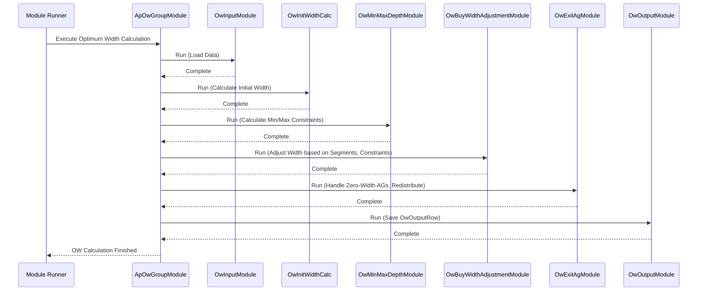

# Chapter 32: Optimum Width (OW) Module (ApOwGroupModule)

Welcome back! In the [previous chapter](31_od_asp_calculation_.md), we figured out the **Average Selling Price (ASP)** for our product groups, giving us a realistic idea of the price customers actually pay. Now that we understand the performance ([OD Segmentation](29_od_segmentation_.md)) and pricing (ASP) of our product groups ([Attribute Groups / AgRow](16_agrow_.md)), we need to tackle another critical question for planning: **How many different choices should we offer?**

Imagine you're planning the T-shirt section for "Store 101". You know that "Men's V-Neck T-shirts from BrandX in the Premium Price Bucket" (let's call this Attribute Group AG 500) performs reasonably well (maybe MODERATE segment). But *how many different styles* of these premium V-necks should you plan to carry in that store next season? Should you offer 3 different styles? 5 styles? 10 styles? This number of distinct styles or options within a group is called the **"Width"**.

## What Problem Does This Module Solve?

Deciding the right "Width" is a balancing act:

*   **Too Narrow (Few Styles):** Customers might not find enough variety or the specific style they want, leading to lost sales. The shelf might look empty.
*   **Too Wide (Many Styles):** Requires managing more inventory, increases complexity, potentially ties up money in slower-moving styles, and might confuse customers with too many choices.

Finding the **Optimum Width (OW)** means finding that sweet spot: offering enough variety to keep customers happy and capture sales, but not so much that inventory becomes inefficient and costly. Doing this manually for every product group in every store, considering past performance, sales concentration, and business rules, is extremely difficult.

The **Optimum Width (OW) Module**, orchestrated by `ApOwGroupModule`, solves this problem. It acts like an expert assortment planner, analyzing historical data and applying business logic to recommend the ideal number of distinct styles (width) to carry for each product group (Attribute Group) in each store/channel for future periods.

## Core Concepts

1.  **Width:** The number of distinct options (usually styles) within a defined product group (Attribute Group) for a specific location (Store/Channel) and time period.
2.  **Performance Analysis:** The module heavily relies on past sales data:
    *   **Revenue per Day:** How much money did styles in this group generate on average when they were available?
    *   **Sales Distribution (Deciles):** Are sales concentrated in a few top styles, or spread out more evenly? Deciles help measure this. Imagine ranking styles by sales and dividing them into 10 equal groups (deciles). If the top decile (top 10% of styles) makes up 70% of the revenue, sales are concentrated. If the top decile only makes up 20%, sales are more spread out.
3.  **Min/Max Constraints:** The business might set minimum or maximum quantities that need to be sold per style to justify carrying it (related to [Optimum Depth (OD) Module (ApOdGroupModule)](28_optimum_depth__od__module__apodgroupmodule_.md) concepts).
4.  **Business Rules (Performance Segments):** The calculation isn't purely based on historical spread. It's adjusted based on the performance segment assigned by the OD process ([OD Segmentation](29_od_segmentation_.md)). For example:
    *   **Severe/Failure/Slow:** Groups performing poorly might have their calculated width *reduced* (e.g., multiplied by 0.5 or even set to 0).
    *   **Moderate/Top:** Groups performing well might keep their calculated width or have it adjusted based on other factors.
    *   *(The specific multipliers/actions often come from configuration like `OwDecileActionRow`)*.
5.  **Balancing Variety and Efficiency:** The ultimate goal is to recommend a width that maximizes sales potential for the group while minimizing the risk and cost of carrying too many slow-moving styles.

## The Orchestrator (`ApOwGroupModule`)

Calculating the Optimum Width involves several steps, from initial analysis to applying adjustments. `ApOwGroupModule` doesn't perform these steps itself. Like the other `...GroupModule` coordinators we've seen (NOOS, ISS, OD), it acts as the **manager** or **conductor**, ensuring a sequence of specialized sub-modules runs in the correct order to arrive at the final recommended width.

The main sub-modules orchestrated by `ApOwGroupModule` are:

*   `OwInputModule`: Loads the necessary input data (OD results, sales data, configuration).
*   `OwInitWidthCalc`: Performs the **initial width calculation** based on historical sales performance and distribution (deciles). (Covered in detail in [Chapter 33](33_ow_initial_width_calculation_.md)).
*   `OwMinMaxDepthModule`: Calculates minimum and maximum quantities sold per style within groups, which are used as constraints later.
*   `OwBuyWidthAdjustmentModule`: Takes the initial width and **adjusts** it based on predicted sales, minimum/maximum quantity constraints, performance segments (TOP/MODERATE/SLOW), and potentially budget (OTB) considerations. (Covered in detail in [Chapter 34](34_ow_buy_width_adjustment_.md)).
*   `OwExitAgModule`: Identifies attribute groups that should likely be exited (width set to 0) based on very poor performance or the adjusted width calculation. It can redistribute the "freed up" width/budget to other groups.
*   `OwOutputModule`: Consolidates and saves the final recommended `finalWidth` along with supporting metrics.

## How It Works (The Workflow)

You typically run `ApOwGroupModule` as part of the assortment planning process, usually after the OD analysis is complete.

**Inputs:**
*   **OD Results:** Key outputs from the OD modules, especially `OdSegmentationRow` (containing the T/M/S segment) and `OdAspRow` (ASP).
*   **Historical Sales & Inventory:** Cleaned sales data ([ProductSalesRow](13_productsalesrow_.md)), often filtered/prepared (`OdRawSalesRow`, `OdOwWidthRow`).
*   **Configuration:** `OwArgs`, `OwDecileActionRow` (defining multipliers based on performance), `SizeSetQtyRow` (min/max depth constraints).
*   **Attribute Group Data:** ([AgRow](16_agrow_.md)).
*   **AOP Data:** Potentially the Annual Operating Plan (`AopRow`) revenue targets.

**Outputs:**
*   **`OwOutputRow`** ([Row Input/Output Classes](09_row_input_output_classes_.md)): This is the main output. Each row represents a specific Store-Period-AG combination and contains:
    *   `finalWidth`: The final recommended number of distinct styles to carry.
    *   `initialBuyWidth`: The width calculated before final adjustments.
    *   `otbQty`: Predicted sales quantity for the group.
    *   `revOtbQty`: Revised sales quantity after redistribution.
    *   `minQtyPerStyle`, `crctdMaxQtyPerStyle`: Min/Max constraints used.
    *   `exitFlag`: Indicates if this AG was marked for exit (width=0).
    *   `asp`: The average selling price used.

```java
// Simplified structure of OwOutputRow
// File: src/main/java/com/increff/irisx/row/output/ow/OwOutputRow.java
package com.increff.irisx.row.output.ow;

// Holds the final Optimum Width recommendation and related metrics
public class OwOutputRow {
    public int store;
    public int ag;
    public int period;
    public int prevSeasonWidth; // Width from previous comparable season
    public int initialBuyWidth; // Calculated before adjustments
    public double asp;         // Average Selling Price used
    public double otbQty;      // Predicted sales quantity
    public double revOtbQty;   // Revised sales quantity after redistribution
    public String redistLevel; // How exit qty was redistributed
    public double calcQtyPerStyle; // Calculated sales per style
    public int actualMaxQtyPerStyle; // Actual max qty sold per style
    public double crctdMaxQtyPerStyle; // Corrected max qty sold per style
    public int minQtyPerStyle; // Minimum qty needed per style
    public double revQtyPerStyle; // Revised sales per style
    public int finalWidth;    // <<< The final recommended width
    public int exitFlag;      // 1 if AG marked for exit, 0 otherwise
}
```
This `finalWidth` is a direct input into assortment planning, telling planners how many different style slots they have available for each product group in each store.

## Under the Hood

**1. Orchestration (`ApOwGroupModule.java`):**
This module defines the sequence using `@PostConstruct`.

```java
// File: src/main/java/com/increff/irisx/module/ApOwGroupModule.java
package com.increff.irisx.module;

import com.increff.irisx.module.ow.*; // Import OW sub-modules
import org.springframework.beans.factory.annotation.Autowired;
import org.springframework.stereotype.Component;
import javax.annotation.PostConstruct;

@Component
public class ApOwGroupModule extends AbstractUtilModuleGroup {

    // Autowire all the OW sub-modules
    @Autowired private OwInputModule owInputModule;
    @Autowired private OwInitWidthCalc owInitWidthCalc;
    @Autowired private OwMinMaxDepthModule owMinMaxDepthModule;
    @Autowired private OwBuyWidthAdjustmentModule owBuyWidthAdjustmentModule;
    @Autowired private OwExitAgModule owExitAgModule;
    @Autowired private OwOutputModule owOutputModule;
    // ... Standard snapshot/sync modules ...

    @PostConstruct // Run after creation
    public void init() {
        captureSnapshot(); // Standard step
        // --- Define the execution order ---
        add(owInputModule);             // 1. Load Inputs
        add(owInitWidthCalc);           // 2. Calculate Initial Width
        add(owMinMaxDepthModule);       // 3. Calculate Min/Max Qtys
        add(owBuyWidthAdjustmentModule);// 4. Adjust Width
        add(owExitAgModule);            // 5. Handle Exits & Redistribute
        add(owOutputModule);            // 6. Save Final Output
        uploadOutput(); // Standard step
    }

    // ... captureSnapshot() and uploadOutput() methods ...
}
```
**Explanation:** The `init()` method clearly defines the 6-step process by adding each specialized OW module in the correct sequence. `ApOwGroupModule` ensures this flow is followed when the OW calculation is triggered.

**Sequence Diagram (High-Level Flow):**


**2. Key Logic Sneak Peek:**
*   **`OwInitWidthCalc`:** Analyzes the distribution of sales (using deciles - groups of 10%) across styles within an AG. If sales are concentrated in a few styles (top deciles have high contribution), it suggests a lower initial width. If sales are spread out, it suggests a higher initial width.
*   **`OwBuyWidthAdjustmentModule`:** Takes the `initialWidth`. Calculates predicted sales (`otbQty`). Checks if `otbQty / initialWidth` (predicted sales per style) meets the min/max quantity constraints calculated by `OwMinMaxDepthModule`. It also applies multipliers based on the `OdSegment` (e.g., reducing width for SLOW/F segments). It adjusts the width upwards or downwards based on these checks to get the `finalWidth` (before exit redistribution).
*   **`OwExitAgModule`:** Looks for AGs where the adjusted `finalWidth` became zero. It flags these as "exit" AGs and redistributes their predicted sales (`otbQty`) to other non-exit AGs within the same category or store, ensuring the overall sales plan is maintained.

## Conclusion

The **Optimum Width (OW) Module**, managed by **`ApOwGroupModule`**, is a crucial part of assortment planning that recommends the **ideal number of distinct styles (width)** to carry for each product group (Attribute Group) in each location.

*   It balances offering customer **variety** with maintaining **inventory efficiency**.
*   `ApOwGroupModule` orchestrates a sequence of modules that:
    *   Calculate an **initial width** based on historical sales concentration (deciles).
    *   **Adjust** this width based on performance segments (TOP/MODERATE/SLOW), sales predictions, and min/max quantity constraints.
    *   Handle **exit** attribute groups and redistribute their potential sales.
*   The key output is the **`OwOutputRow`**, containing the `finalWidth` recommendation used to guide how many different styles should be planned for.

By providing a data-driven recommendation for assortment width, this module helps businesses create more effective and profitable assortments.

The first major calculation within this process is determining the initial width based on sales distribution. Let's dive into that in the next chapter.

[Next Chapter: OW Initial Width Calculation](33_ow_initial_width_calculation_.md)

---

Generated by [AI Codebase Knowledge Builder](https://github.com/The-Pocket/Tutorial-Codebase-Knowledge)