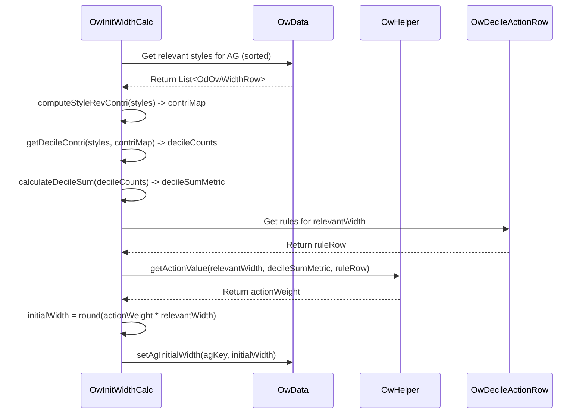

# Chapter 33: OW Initial Width Calculation

Welcome back! In the [previous chapter](32_optimum_width__ow__module__apowgroupmodule__.md), we learned that the **Optimum Width (OW) Module** aims to find the ideal number of different styles (the "width") to offer for each product group in each store. We saw that this involves several steps, orchestrated by `ApOwGroupModule`.

Now, let's dive into the very *first* step in that process: calculating an **initial guess** for the width. Think of it like making a preliminary estimate before refining it later. This first step is handled by the `OwInitWidthCalc` module.

## What Problem Does This Step Solve?

Before we consider future sales targets or budget constraints, how can we get a starting point for the width based purely on *past performance*? Specifically, how did sales spread across the styles we *were* selling?

**Use Case:** Consider our "Men's V-Neck T-shirts from BrandX in the Premium Price Bucket" (AG 500) in Store 101 last season. Let's say we offered 10 different styles.
*   **Scenario A:** Did 2 of those styles generate 80% of the revenue, while the other 8 styles barely sold? This suggests sales are highly **concentrated**, and maybe we didn't need all 10 styles.
*   **Scenario B:** Did the sales spread out more evenly, with maybe 6 or 7 styles contributing significantly to the revenue? This suggests sales are more **distributed**, and offering a wider variety was beneficial.

The **OW Initial Width Calculation** solves the problem of analyzing this historical sales distribution to make an initial, data-driven estimate of how many styles *should have been* offered. It asks: "Based on how concentrated or spread out the sales were, what's a reasonable starting number for the width?"

## Core Concepts

1.  **Sales Distribution:** The key idea is to understand how revenue (or sometimes sales quantity) was distributed across the different styles within an Attribute Group ([AgRow](16_agrow_.md)) in a specific store during a past period.

2.  **Deciles (10% Buckets):** To measure this distribution, the module uses deciles. Imagine:
    *   You rank all the styles in the group from best-selling (highest revenue per day) to worst-selling.
    *   You divide this ranked list into 10 equal groups based on their cumulative revenue contribution. The first decile represents the top 10% of revenue, the second decile represents the next 10% (11%-20% cumulative), and so on.
    *   You then count how many *styles* fall into each 10% revenue bucket.
        *   *Concentrated Sales:* If the top 10% of revenue (1st decile) comes from just 1 style, while the next 10% (2nd decile) also comes from just 1 style, sales are very concentrated.
        *   *Distributed Sales:* If the top 10% of revenue requires 3 styles, and the next 10% requires another 3 styles, sales are much more spread out.

3.  **Action Weight:** Based on this decile distribution (how many styles land in each 10% bucket), the system calculates an "Action Weight". This weight is typically between 0 and 1 (or slightly higher).
    *   **Concentrated sales** (few styles in early deciles) result in a **lower** Action Weight (e.g., 0.6). This suggests we might need fewer styles than we actually sold.
    *   **Distributed sales** (many styles needed for early deciles) result in a **higher** Action Weight (e.g., 0.9 or 1.0). This suggests the number of styles we sold was more appropriate.
    *   *(The exact weight is often determined by looking up rules defined in `OwDecileActionRow` input, based on the number of styles sold and the decile distribution profile)*.

4.  **Relevant Width:** This is simply the number of distinct styles within the group that actually had sales during the analysis period.

5.  **Initial Width Formula:** The initial estimate is calculated simply as:
    `Initial Width = Action Weight * Relevant Width` (rounded to the nearest whole number).

    *   *Example (Concentrated):* Action Weight = 0.6, Relevant Width = 10 styles sold. Initial Width = 0.6 * 10 = 6 styles.
    *   *Example (Distributed):* Action Weight = 0.9, Relevant Width = 10 styles sold. Initial Width = 0.9 * 10 = 9 styles.

This initial width provides a starting point, grounded in historical sales patterns, for the subsequent adjustment steps.

## How It Works (The Process within `OwInitWidthCalc`)

The `OwInitWidthCalc` module is called by the main `ApOwGroupModule`.

**Inputs:**
*   Prepared sales/performance data per style (`OwData.getAgInputMap()`, containing `OdOwWidthRow` objects which hold `styleRevPerDay`).
*   Configuration rules ([`OwDecileActionRow`](#under-the-hood)) mapping decile distributions to action weights.
*   Configuration arguments ([`OwArgs`](03_configuration___arguments__args_classes__.md)).

**Calculation Steps:**
1.  **Sort Styles:** For each Store-AG group, sort the styles within it based on their performance (e.g., `styleRevPerDay` descending).
2.  **Calculate Contribution %:** Calculate the revenue contribution percentage of each style relative to the total for its Store-AG group.
3.  **Determine Decile Distribution:** For each Store-AG group, figure out how many styles fall into each 10% revenue decile (using the `getDecileContri` method). This results in an array of 10 numbers representing the cumulative style count for each decile.
4.  **Calculate Decile Sum:** Calculate a summary metric from the decile distribution array (`calculateDecileSum`).
5.  **Determine Action Weight:** Look up the appropriate "Action Weight" based on the decile sum metric, the number of styles sold (`relevantWidth`), and the rules defined in `OwDecileActionRow` (using `OwHelper.getActionValue`).
6.  **Calculate Initial Width:** Apply the formula: `Initial Width = Action Weight * Relevant Width`.
7.  **Handle New Stores:** For stores marked as "new", calculate their initial width by averaging the initial widths of similar "reference" stores.
8.  **Store Results:** Store the calculated `initialWidth` for each Store-AG combination in the shared `OwData` object (`owData.setAgInitialWidth`) and persist related metrics (like decile sum, action weight, initial width) in `OwLongTailRow` for analysis.

**Outputs:**
*   Updated `OwData` containing the `agInitialWidth` map (`Map<Key(Period,Store,AG), Integer>`).
*   Persisted `OwLongTailRow` data containing intermediate calculation results.

This `initialWidth` value is then passed along to the next module in the sequence, `OwBuyWidthAdjustmentModule`, for further refinement.

## Under the Hood: Deciles and Weights

Let's look closer at how the decile distribution and action weights work.

**1. Calculating Style Contribution % (`computeStyleRevContri`):**
This is straightforward: find the total revenue per day for the group, then for each style, calculate `(styleRevPerDay / groupTotalRevPerDay) * 100`.

```java
// Simplified from OwInitWidthCalc.java
public Map<Key, Double> computeStyleRevContri(Map<Key, List<OdOwWidthRow>> agInputMap) {
    Map<Key, Double> styleRevContriMap = new HashMap<>();
    agInputMap.forEach((key, relevantStyles) -> {
        // Calculate total revenue per day for the AG group
        double agRevPerDay = relevantStyles.stream()
                                        .mapToDouble(o -> o.styleRevPerDay)
                                        .sum();
        // Calculate contribution for each style in the group
        relevantStyles.forEach(relevantStyle ->
            styleRevContriMap.put(
                // Key: Period, Store, Style
                new Key(relevantStyle.period, relevantStyle.store, relevantStyle.style),
                // Value: Contribution %
                MathUtil.divide(relevantStyle.styleRevPerDay, agRevPerDay) * 100.0
            )
        );
    });
    return styleRevContriMap;
}
```
**Explanation:** This iterates through each group (`agInputMap`). It first calculates the total `agRevPerDay`. Then, for each style within that group, it calculates its contribution percentage using `MathUtil.divide` and stores it in `styleRevContriMap`, keyed by Period, Store, and Style ID.

**2. Determining Decile Distribution (`getDecileContri`):**
This method takes the list of styles (sorted by performance descending) and their contribution percentages. It figures out how many styles are needed to reach the 10% mark, then the 20% mark, and so on.

```java
// Simplified from OwInitWidthCalc.java
// relevantStyles: List sorted by rev/day desc
// styleRevContriMap: Map<Key(Period, Store, Style), Double(Contri%)>
public int[] getDecileContri(List<OdOwWidthRow> relevantStyles, Map<Key, Double> styleRevContriMap) {
    int[] decileCounts = new int[10]; // Stores cumulative style count for each decile
    double cumulativeSum = 0.0;
    int styleCount = 0; // How many styles we've looked at
    int decileIndex = 0; // Which decile bucket we are filling (0-9)

    // Loop through styles from best to worst
    for (OdOwWidthRow style : relevantStyles) {
        // Get this style's contribution %
        double contribution = styleRevContriMap.get(
            new Key(style.period, style.store, style.style));

        // Add to cumulative sum
        cumulativeSum += contribution;
        styleCount++;

        // Check if we have filled the current decile bucket
        while (decileIndex < 10 && cumulativeSum > (decileIndex + 1) * 10.0) {
            // Record how many styles it took to fill this decile
            decileCounts[decileIndex] = styleCount;
            decileIndex++; // Move to the next decile
        }
        // Ensure last decile has final count if loop ends early
        if (decileIndex < 10) decileCounts[decileIndex] = styleCount;

        if (decileIndex >= 10) break; // Stop if all deciles are filled
    }
    // Fill remaining deciles if not all styles were needed
    while (decileIndex < 10) {
        decileCounts[decileIndex] = styleCount;
        decileIndex++;
    }
    return decileCounts;
}
```
**Explanation:** The code iterates through the sorted styles, adding their contribution percentage to `cumulativeSum`. It uses a `while` loop to check if the `cumulativeSum` has crossed the threshold for the current `decileIndex` (10%, 20%, etc.). When a threshold is crossed, it records the total number of `styleCount` seen so far into the `decileCounts` array for that decile and moves to the next decile. The resulting array shows the cumulative number of styles needed to achieve each 10% revenue jump.

**3. Calculating Action Weight (`calculateActionWeightMap` / `OwHelper.getActionValue`):**
This step takes the decile distribution profile (summarized by `agDecileSum`) and the number of styles sold (`relevantWidth`) and uses the configuration rules (`OwDecileActionRow`) to find the appropriate weight.

```java
// Simplified logic conceptualizing OwHelper.getActionValue
public double getActionValue(int relevantWidth, double decileSumMetric,
                              List<OwDecileActionRow> decileActionRules) {

    // Find the rule row matching the relevantWidth
    OwDecileActionRow rule = decileActionRules.stream()
                                .filter(r -> r.width == relevantWidth)
                                .findFirst()
                                .orElse(null); // Or find closest rule

    if (rule == null) return 1.0; // Default weight if no specific rule

    // Determine which decile 'zone' the decileSumMetric falls into
    // (e.g., based on thresholds A, B, C, D in the rule row)
    // This reflects how concentrated/distributed the sales are.
    if (decileSumMetric <= rule.decileA) {
        return 0.6; // Example: Very concentrated -> low weight
    } else if (decileSumMetric <= rule.decileB) {
        return 0.8; // Example: Moderately concentrated -> medium weight
    } else if (decileSumMetric <= rule.decileC) {
        return 0.9; // Example: Moderately distributed -> high weight
    } else { // decileSumMetric > rule.decileD
        return 1.0; // Example: Very distributed -> full weight
    }
    // Note: Actual weights might come directly from OwDecileActionRow fields.
}
```
**Explanation:** This logic (often inside `OwHelper`) finds the specific rule row in `OwDecileActionRow` that matches the number of styles sold (`relevantWidth`). It then compares the calculated `decileSumMetric` (which summarizes the distribution) against thresholds defined in that rule row (`decileA`, `decileB`, etc.) to determine the final action weight. More concentrated distributions (lower `decileSumMetric`) get lower weights; more distributed ones get higher weights.

**Sequence Diagram (Calculating Initial Width for one AG):**


## Conclusion

The **OW Initial Width Calculation**, performed by the `OwInitWidthCalc` module, provides the crucial first estimate for the Optimum Width.

*   It analyzes the **historical sales distribution** across styles within each Store-AttributeGroup.
*   It uses **deciles** to quantify whether sales were concentrated in a few top styles or more spread out.
*   Based on this distribution and configurable rules (`OwDecileActionRow`), it assigns an **Action Weight**.
*   The final calculation is **`Initial Width = Action Weight * Relevant Width`**.
*   This initial width serves as a data-driven starting point, reflecting past performance before further adjustments are made based on future plans and constraints.

Now that we have this initial estimate, how is it refined? The next chapter explores the crucial step of adjusting this width based on predicted sales, minimum/maximum constraints, and performance segments.

[Next Chapter: OW Buy Width Adjustment](34_ow_buy_width_adjustment_.md)

---

Generated by [AI Codebase Knowledge Builder](https://github.com/The-Pocket/Tutorial-Codebase-Knowledge)