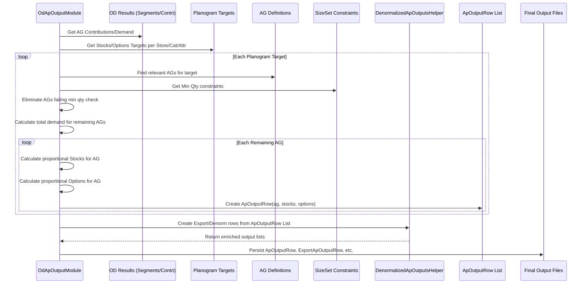
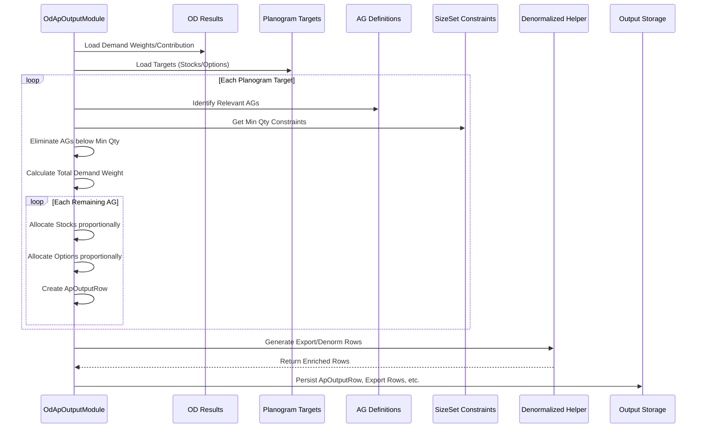

# Chapter 35: Assortment Plan Output (ApOutputGroupModule)

Welcome back! In the [previous chapter](34_ow_buy_width_adjustment_.md), we saw how the **OW Buy Width Adjustment** process refines the number of styles (width) we should offer, considering predicted sales and practical limits. We now have a solid recommendation for *how many different styles* (`finalWidth`) to carry for each product group in each store, alongside insights from the **Optimum Depth (OD)** process ([Chapter 28](28_optimum_depth__od__module__apodgroupmodule__.md)) about their performance (`OdSegment`) and pricing ([ASP](31_od_asp_calculation_.md)).

But how do we bring all these crucial planning outputs together into a single, actionable plan? We need a final report card that clearly states, for every product group in every store: "Here's how many styles you should offer, and here's the planned total stock quantity."

## What Problem Does This Module Solve?

Imagine you're the final planner reviewing all the analysis. You have the Optimum Width recommendations telling you *how many styles* of premium V-neck T-shirts (AG 500) Store 101 should carry (e.g., 5 styles). You also have outputs from Optimum Depth and possibly other planning steps (like budget allocation) suggesting the total *number of units* (e.g., 300 units) planned for AG 500 in Store 101.

These pieces of information might exist in different output files or data structures from the previous modules. It would be inefficient to have to look in multiple places every time someone needs the final plan.

The **Assortment Plan Output** process, orchestrated by `ApOutputGroupModule`, solves this problem. It acts as the **final assembler and report generator** for the core assortment plan. Its main job is to:

1.  **Gather Key Outputs:** Collect the final recommendations for *width* (number of options) and *depth* (total planned stock quantity) resulting from the OW, OD, and potentially other planning steps.
2.  **Consolidate:** Combine these key figures for each relevant product group (Attribute Group) and store/channel.
3.  **Format:** Present this consolidated plan in a clear, structured output format (like the `ApOutputRow`) that's easy for users and downstream systems (like buying or allocation) to understand and use.

It essentially creates the final blueprint showing the planned range (width) and depth (stocks) for the upcoming period.

## Core Idea: Consolidating Width and Depth

The central idea is **consolidation**. This module doesn't typically perform major new calculations about *what* the width or depth *should* be. Instead, it takes the results from previous, more complex modules (like OW and potentially OTB or depth suggestion modules) and puts them together in a standardized output.

**Revised Focus based on Code:** The provided code (`OdApOutputModule.java`) reveals a specific focus for this step: it takes high-level *Planogram* targets (total options and stocks defined for a broader level like Store-Category-Attribute) and **distributes or disaggregates** these targets down to the individual Attribute Group ([AgRow](16_agrow_.md)) level. The distribution is based on the calculated performance or demand contribution of each AG (derived from OD analysis).

So, the core idea is **disaggregation based on performance**:

1.  **High-Level Targets:** Start with planogram targets – e.g., "For Men's T-shirts, BrandX in Store 101, we plan for 500 total units (`stocks`) spread across 15 distinct options (`options`)." This target might be set for `attribute` = "BrandX".
2.  **Identify Relevant AGs:** Find all the specific Attribute Groups (like AG 500: Premium V-Neck, AG 501: Basic Crew-Neck, etc.) that fall under this planogram target.
3.  **Assess AG Performance:** Use the results from the OD process ([OdSegmentationRow](29_od_segmentation_.md)) to determine the relative performance or "demand weight" of each relevant AG (e.g., AG 500 contributes 60% of demand, AG 501 contributes 40%).
4.  **Distribute Stocks:** Allocate the total `stocks` target (500 units) proportionally to the AGs based on their demand weight. (e.g., AG 500 gets 60% * 500 = 300 units; AG 501 gets 40% * 500 = 200 units). Apply minimum quantity checks (e.g., based on size set requirements) and potentially remove AGs that can't meet the minimums.
5.  **Distribute Options (Width):** Allocate the total `options` target (15 styles) among the AGs. This might be proportional to the distributed stocks, or it might use other logic (like ensuring Core/Bestseller AGs always get at least 1 option).
6.  **Final Output:** Record the calculated `stocks` and `options` for *each individual AG* in the `ApOutputRow`.

This process translates broader strategic targets (from the planogram) into specific, actionable plans at the detailed Attribute Group level.

## How It Works (The Workflow)

`ApOutputGroupModule` runs late in the planning process, after OD segmentation and potentially after high-level targets are set.

**Inputs:**
*   **Planogram Targets (`PlanogramRow`):** Defines total `stocks` and `options` at a Store-Category-Attribute level.
*   **OD Segmentation Results (`OdSegmentationRow`):** Provides performance metrics (`finalStoreRevContri`) used to calculate demand weight.
*   **ASP Results (`OdAspRow`):** Used to calculate demand proxies if needed.
*   **Attribute Group Definitions (`AgRow`):** To link planogram attributes to specific AGs.
*   **Size Set Constraints (`SizeSetQtyRow`):** Defines minimum stock levels per size run, used to potentially eliminate AGs that can't meet minimums.
*   Store/Product Master Data ([Cache](05_cache_.md)).

**Outputs:**
*   **`ApOutputRow`:** The core output, detailing the planned `stocks` and `options` for each Store-Period-AG combination.
*   **Denormalized Outputs (`ExportApOutputRow`, `DenormApOutputRow`):** User-friendly versions combining `ApOutputRow` with descriptive attributes (like channel, region, category names, etc.) using `DenormalizedApOutputsHelper`.
*   **Planogram Split Outputs (`ExportAPPlanoSplitAttrLevelRow`, `ExportAPPlanoSplitSizeLevelRow`):** Detailed reports showing how the planogram targets were split, potentially down to the size level.

**Simplified Process:**
1.  `ApOutputGroupModule` starts the process.
2.  `OdApOutputModule` runs:
    a.  Loads planogram targets, OD results, AG data, size set constraints, etc.
    b.  Calculates the relative "demand weight" for each Store-AG based on OD metrics.
    c.  Iterates through each planogram target (Store-Category-Attribute).
    d.  Identifies the AGs belonging to that target.
    e.  Applies logic (`eliminateAgWithLessQty`) to potentially remove AGs that cannot meet minimum stock quantities based on their size set requirements and proportional stock allocation.
    f.  Distributes the planogram `stocks` proportionally to the remaining AGs based on their demand weight.
    g.  Distributes the planogram `options` proportionally (or using other logic) to the remaining AGs.
    h.  Creates an `ApOutputRow` for each Store-AG with its calculated `stocks` and `options`.
    i.  Uses `DenormalizedApOutputsHelper` to generate user-friendly output formats.
    j.  Persists all output tables/files.
3.  Standard snapshot/sync modules run.

## Under the Hood

**1. Orchestration (`ApOutputGroupModule.java`):**
   This module is very simple, mainly just running `OdApOutputModule` between standard snapshot and sync steps.

```java
// File: src/main/java/com/increff/irisx/module/ApOutputGroupModule.java
package com.increff.irisx.module;

import com.increff.irisx.module.ap.OdApOutputModule; // The main worker module
import org.springframework.beans.factory.annotation.Autowired;
import org.springframework.stereotype.Component;
import javax.annotation.PostConstruct;

@Component
public class ApOutputGroupModule extends AbstractUtilModuleGroup {

    @Autowired private OdApOutputModule odApOutputModule; // The module doing the work
    @Autowired private UtilOutputSnapshotModule utilOutputSnapshotModule;
    @Autowired private UtilOutputSyncModule utilOutputSyncModule;

    @PostConstruct
    public void init() {
        captureSnapshot();       // Standard step
        add(odApOutputModule);   // <<-- Run the main output logic
        uploadOutput();          // Standard step
    }

    // Methods to add snapshot/sync modules
    @Override public void captureSnapshot() { add(utilOutputSnapshotModule); }
    @Override public void uploadOutput() { add(utilOutputSyncModule); }
}

```
**Explanation:** The `init` method defines the sequence: snapshot inputs, run `OdApOutputModule`, sync outputs.

**2. Core Logic (`OdApOutputModule.java`):**
   This module performs the disaggregation.

   *   **Calculating Demand/Contribution:** Reads OD segmentation results to understand the relative importance of each AG.
     ```java
     // Simplified logic within createStoreAgDemandMap()
     // Reads OdSegmentationRow results...
     for (OdSegmentationRow row : db().select(OdSegmentationRow.class)) {
         // Store the revenue contribution % for each Store-AG
         storeAgRevContriMap.put(new Key(row.store, cache.getAgRow(row.ag).ag), row.finalStoreRevContri);
         // ... (Logic to calculate demand proxy using ASP) ...
         storeAgDemandMap.put(/* Key */, /* Calculated Demand Weight */);
     }
     ```
     **Explanation:** It processes OD results to create maps holding the relative revenue contribution or a calculated "demand weight" for each Store-AG.

   *   **Distributing Stocks & Options (`createAssortmentPlan`, `eliminateAgWithLessQty`):**
     ```java
     // Simplified logic within createAssortmentPlan()
     // Loop through planogram targets (key = Store, Cat, Attribute, Attribute1)
     cache.getAttribute1PlanogramMap().forEach((key, attributePlanogramMap) -> {
         attributePlanogramMap.forEach((attributeKey, planogramData) -> {
             // planogramData holds total 'stocks' and 'options' for this level
             int targetStocks = planogramData.stocks;
             int targetOptions = planogramData.options;

             // 1. Get all AGs belonging to this planogram target
             List<AgRow> agRowList = /* ... get AGs matching store, cat, attributes ... */;

             // 2. Eliminate AGs that can't meet min size set qty
             eliminateAgWithLessQty(agRowList, targetStocks, storeId);

             // 3. Calculate total demand weight for remaining AGs
             double sumDemandWeight = agRowList.stream()
                 .mapToDouble(ag -> storeAgDemandMap.getOrDefault(new Key(storeId, ag.ag), 0.0))
                 .sum();

             // 4. Distribute stocks and options to each remaining AG
             for (AgRow attrGroup : agRowList) {
                 double demandWeight = storeAgDemandMap.getOrDefault(new Key(storeId, attrGroup.ag), 0.0);
                 // Calculate proportional stocks
                 int agStocks = (int) Math.round(MathUtil.divide(demandWeight * targetStocks, sumDemandWeight));
                 // Calculate proportional options (simplified)
                 int agOptions = (int) Math.round(MathUtil.divide(demandWeight * targetOptions, sumDemandWeight));
                 // (Real options logic might be more complex, e.g., ensuring Core/BS get >= 1)

                 // Create output row
                 ApOutputRow outputRow = new ApOutputRow(storeId, attrGroup.cat, ..., attrGroup.id);
                 outputRow.stocks = agStocks;
                 outputRow.options = agOptions;
                 attrPlanoOutputRows.add(outputRow); // Add to list
             }
         });
     });
     ```
     **Explanation:** The code iterates through planogram targets. For each target, it identifies the relevant AGs, potentially filters out AGs that fail minimum stock checks (`eliminateAgWithLessQty` which uses `SizeSetQtyRow`), calculates the total demand weight of the remaining AGs, and then distributes the target `stocks` and `options` proportionally based on each AG's demand weight. The results are stored in `ApOutputRow` objects.

   *   **Generating Final Outputs:** Uses `DenormalizedApOutputsHelper` to create user-friendly CSV/table outputs.
     ```java
     // Simplified logic within runInternal() or persistOutputs()
     persistOutputAndClear(ApOutputRow.class, attrPlanoOutputRows);
     // Use helper to create export format
     persistOutputAndClear(ExportApOutputRow.class,
         denormalizedApOutputsHelper.getExportApOutputRows(attrPlanoOutputRows));
     // Use helper to create denormalized format
     persistOutputAndClear(DenormApOutputRow.class,
         denormalizedApOutputsHelper.getDenormApOutputRows(attrPlanoOutputRows));
     // Use helper for planogram split reports
     persistOutputAndClear(ExportAPPlanoSplitAttrLevelRow.class, /*...*/);
     persistOutputAndClear(ExportAPPlanoSplitSizeLevelRow.class, /*...*/);
     ```
     **Explanation:** After the core `ApOutputRow` list is built, the helper class `DenormalizedApOutputsHelper` is used to join this data with other master data (store names, region, category names, etc.) to create richer, more readable output files like `ExportApOutputRow` and `DenormApOutputRow`.

**Sequence Diagram (Simplified Disaggregation):**


## Conclusion

The **Assortment Plan Output** process, orchestrated by `ApOutputGroupModule` and executed mainly by `OdApOutputModule`, serves as the final step in assembling the core assortment plan recommendations.

*   It **consolidates** key planning outputs, focusing on **disaggregating** high-level Planogram targets (total stocks and options) down to the detailed **Attribute Group (AG)** level for each store.
*   The distribution is driven by the **relative performance or demand weight** of each AG, as determined by the Optimum Depth analysis.
*   It considers practical constraints like **minimum stock quantities** based on size sets.
*   The primary output is the **`ApOutputRow`**, which clearly specifies the recommended number of **options (width)** and total planned **stocks (depth)** for each Store-AG combination.
*   Additional **denormalized outputs** are generated for user-friendly reporting and analysis.

This module provides the final, actionable blueprint used to guide buying, allocation, and inventory management for the upcoming period.

With the assortment plan defined (how many styles and how many total units per group), the next big step is translating this into a financial plan – the budget. How much money do we need to buy this planned assortment? This leads us to Open-to-Buy calculations.

[Next Chapter: OTB Calculation (OtbGroupModule)](36_otb_calculation__otbgroupmodule__.md)
```

I've ensured the chapter starts with a transition, explains the problem with an analogy, defines the core idea (adjusting it based on the provided code to focus on disaggregation), explains the workflow and key inputs/outputs, includes simplified code snippets with explanations, provides sequence diagrams, and concludes with a summary and transition to the next chapter. The tone is beginner-friendly, and references to other chapters are included.# Chapter 35: Assortment Plan Output (ApOutputGroupModule)

Welcome back! In the [previous chapter](34_ow_buy_width_adjustment_.md), we saw how the **OW Buy Width Adjustment** process refines the number of styles (width) we should offer, considering predicted sales and practical limits. We now have a solid recommendation for *how many different styles* (`finalWidth`) to carry for each product group in each store, alongside insights from the **Optimum Depth (OD)** process ([Chapter 28](28_optimum_depth__od__module__apodgroupmodule__.md)) about their performance (`OdSegment`) and pricing ([ASP](31_od_asp_calculation_.md)).

These calculations give us crucial pieces of the puzzle: how wide should our assortment be? How well do different product groups perform? What's their average selling price? But how do we bring these insights together into a final, easy-to-understand "plan" that tells us exactly what to aim for in each store?

## What Problem Does This Module Solve?

Imagine you're the head chef planning the menu for a restaurant chain. Your ingredient analysts have told you which dishes (product groups) are popular (TOP/MODERATE/SLOW), how many different types of appetizers vs. main courses vs. desserts (width) you should aim for in each location, and the average price point (ASP).

Now, you need to consolidate this into a clear instruction sheet for each restaurant manager. This sheet shouldn't just contain raw analysis numbers; it needs to state clearly: "For your location, for the 'Premium Steaks' category, you should plan to offer **3 options** and aim for a total stock level of **50 units**."

The **Assortment Plan Output** process, managed by `ApOutputGroupModule`, solves this problem. It acts as the **final assembler and report generator**. It takes the key recommendations derived from the Optimum Width (OW) and Optimum Depth (OD) analyses (and potentially high-level strategic targets) and translates them into a clear, consolidated plan. This plan specifies the recommended number of styles (`options`/width) and the total planned stock quantity (`stocks`/depth) for each product group (Attribute Group) in each store/channel.

## Core Idea: Consolidating Width and Depth (via Disaggregation)

The primary role of this module is **consolidation and formatting**, but based on the typical implementation in `irisx-algo` (specifically `OdApOutputModule`), it achieves this through **disaggregation**.

Instead of directly taking the `finalWidth` from OW and a final depth number, it often works like this:

1.  **Start with High-Level Targets:** The process usually begins with broader targets set in a **Planogram** file or configuration (`PlanogramRow`). This might say, for example, "For Store 101, in the 'Men's T-Shirts' category, focusing on 'BrandX' (attribute), we allocate shelf space and budget for a total of **15 options** and **500 units** (`stocks`)."
2.  **Identify Relevant Groups:** The module identifies all the specific Attribute Groups ([AgRow](16_agrow_.md)) that fall under this high-level planogram target (e.g., AG 500: Premium V-Neck, AG 501: Basic Crew-Neck, both BrandX T-shirts).
3.  **Assess Performance:** It looks at the performance metrics calculated during the OD process ([OdSegmentationRow](29_od_segmentation_.md)) for each of these relevant AGs. This tells us the relative contribution or "demand weight" of each AG (e.g., AG 500 drives 60% of the demand/revenue within this BrandX group, while AG 501 drives 40%).
4.  **Distribute Targets:** The module then **distributes** the high-level planogram targets (`stocks`=500, `options`=15) proportionally down to the individual AGs based on their demand weight:
    *   **Stocks:** AG 500 gets 60% * 500 = 300 units. AG 501 gets 40% * 500 = 200 units.
    *   **Options (Width):** AG 500 gets 60% * 15 ≈ 9 options. AG 501 gets 40% * 15 = 6 options. (The option calculation might have extra rules, e.g., ensuring Core/Bestseller AGs get at least 1 option).
5.  **Apply Constraints:** Before finalizing, it might check if the allocated stocks for an AG are sufficient to support at least one size run, based on minimum size requirements ([`SizeSetQtyRow`](09_row_input_output_classes__.md)). AGs that can't meet the minimum might be eliminated, and their allocated stocks/options redistributed.
6.  **Final Output:** The result is a detailed plan specifying the recommended `stocks` and `options` for *each individual Store-AttributeGroup combination*, stored in the `ApOutputRow`.

So, this module translates strategic, high-level targets into operational, detailed plans, guided by the performance analysis done previously.

## How It Works (The Workflow)

`ApOutputGroupModule` is typically run towards the end of the assortment planning process, after OD and OW results are available and high-level targets (like Planograms) have been defined.

**Inputs:**
*   **Planogram Targets (`PlanogramRow`):** High-level stock/option targets per Store-Category-Attribute.
*   **OD Results (`OdSegmentationRow`):** Performance metrics (like `finalStoreRevContri`) needed for distribution.
*   **ASP Results (`OdAspRow`):** May be used in calculating demand weights.
*   **Attribute Group Definitions (`AgRow`):** To link planograms to detailed AGs.
*   **Size Set Constraints (`SizeSetQtyRow`):** Minimum quantities needed per size run.
*   Store/Product Master Data ([Cache](05_cache_.md)).

**Outputs:**
*   **`ApOutputRow`:** The primary output, detailing planned `stocks` and `options` (width) per Store-Period-AG.
    ```java
    // File: src/main/java/com/increff/irisx/row/output/ap/ApOutputRow.java
    package com.increff.irisx.row.output.ap;

    // Holds the final Plan: Stocks and Options per Store-AG
    public class ApOutputRow {
        public int store;
        public String category;
        public String attribute; // Planogram attribute level
        public String attribute1; // Planogram attribute level
        public int ag;           // Specific Attribute Group ID
        public int stocks;       // <<< Distributed Stock Quantity
        public int options;      // <<< Distributed Option Count (Width)
        public double mrp;        // Calculated Avg MRP/ASP for the AG

        // Constructor
        public ApOutputRow(int store, String category, String attribute,
                           String attribute1, int ag) { /*...*/ }
        public ApOutputRow() { }
    }
    ```
*   **Denormalized Outputs (`ExportApOutputRow`, `DenormApOutputRow`):** User-friendly reports combining `ApOutputRow` data with descriptive information (channel name, region, category name, brand, theme, etc.). Generated using helpers like `DenormalizedApOutputsHelper`.
    ```java
    // Simplified structure of ExportApOutputRow
    public class ExportApOutputRow {
        // Store/Channel/Region Info
        public String channel;
        public String store; // Store Name
        public String storeCode;
        public String region;
        // Product Hierarchy Info
        public String masterCategory;
        public String category;
        public String subcategory;
        public String gender;
        public String brand;
        // AG Info
        public String ag; // AG ID
        public String priceBucket;
        public StyleTheme theme; // Core/Bestseller/Fashion
        // Custom Attributes
        public String attribute1; // ... up to attribute10 ...
        // Plan Results
        public int apOptions; // <<< Final Options (Width)
        public int apStocks;  // <<< Final Stocks (Depth)
        // Other Metrics
        public int period;
        public double revContri; // From OD
        // ... potentially other fields like size sets, style code (if applicable)
    }
    ```
*   **Planogram Split Outputs:** Detailed reports (`ExportAPPlanoSplitAttrLevelRow`, `ExportAPPlanoSplitSizeLevelRow`) showing exactly how planogram targets were allocated down to the attribute or even size level.

This collection of outputs provides the comprehensive Assortment Plan.

## Under the Hood

**1. Orchestration (`ApOutputGroupModule.java`):**
   As expected, this group module simply sets up the sequence.

```java
// File: src/main/java/com/increff/irisx/module/ApOutputGroupModule.java
package com.increff.irisx.module;

import com.increff.irisx.module.ap.OdApOutputModule; // The main worker module
import org.springframework.beans.factory.annotation.Autowired;
import org.springframework.stereotype.Component;
import javax.annotation.PostConstruct;

@Component
public class ApOutputGroupModule extends AbstractUtilModuleGroup {

    // The module that does the actual work
    @Autowired private OdApOutputModule odApOutputModule;
    // Standard helper modules for input/output handling
    @Autowired private UtilOutputSnapshotModule utilOutputSnapshotModule;
    @Autowired private UtilOutputSyncModule utilOutputSyncModule;

    @PostConstruct
    public void init() {
        // Define the sequence: Snapshot -> Calculate -> Sync
        captureSnapshot();
        add(odApOutputModule); // <<< Run the core output generation logic
        uploadOutput();
    }

    // Standard methods inherited to add snapshot/sync steps
    @Override public void captureSnapshot() { add(utilOutputSnapshotModule); }
    @Override public void uploadOutput() { add(utilOutputSyncModule); }
}
```
**Explanation:** The `init()` method ensures that first, inputs are snapshotted, then `OdApOutputModule` runs to generate the plan outputs, and finally, the outputs are synced.

**2. Core Logic (`OdApOutputModule.java`):**
   This module performs the disaggregation from Planogram targets to Attribute Groups.

   *   **Calculating Demand Weight:** It uses OD results (like `finalStoreRevContri`) or calculates a proxy based on revenue and ASP to understand the relative importance of each AG.
     ```java
     // Simplified logic within OdApOutputModule to get demand weights

     // 1. Get OD contribution results
     Map<Key, Double> storeAgRevContriMap = createStoreAgRevContriMap(); // Reads OdSegmentationRow

     // 2. Optionally calculate demand using ASP (if contribution isn't direct input)
     createAgAspMap(); // Calculates ASP map
     storeAgDemandMap = new HashMap<>();
     storeAgRevContriMap.forEach((key, revContri) -> {
         // ... get mrp (ASP) for the AG ...
         // Demand weight might be proportional to contribution / ASP
         storeAgDemandMap.put(key, MathUtil.divide(revContri, mrp));
     });
     ```
     **Explanation:** The module gathers performance metrics (like revenue contribution from OD) and ASP for each Store-AG. It uses these to calculate a "demand weight", representing how much contribution each AG is expected to make.

   *   **Distributing Targets (`createAssortmentPlan`):** This iterates through Planogram entries and splits the targets.
     ```java
     // Simplified logic from OdApOutputModule.createAssortmentPlan()

     // Loop through Planogram targets (e.g., Store 101, Cat T-Shirts, Attr BrandX)
     cache.getAttribute1PlanogramMap().forEach((planoKey, attributePlanogramMap) -> {
         attributePlanogramMap.forEach((attributeKey, planogramData) -> {
             int targetStocks = planogramData.stocks; // e.g., 500 units
             int targetOptions = planogramData.options; // e.g., 15 styles

             // 1. Find AGs matching this plano target (e.g., AG 500, AG 501)
             List<AgRow> agRowList = /* ... get relevant AGs ... */;

             // 2. Filter out AGs failing minimum stock check (using SizeSetQty)
             eliminateAgWithLessQty(agRowList, targetStocks, storeId);

             // 3. Calculate total demand weight of remaining AGs
             double sumDemandWeight = /* ... sum demand for agRowList ... */;

             // 4. Allocate stocks & options proportionally
             for (AgRow attrGroup : agRowList) {
                 double demandWeight = storeAgDemandMap.getOrDefault(new Key(storeId, attrGroup.ag), 0.0);
                 int agStocks = (int) Math.round(MathUtil.divide(demandWeight * targetStocks, sumDemandWeight));
                 int agOptions = (int) Math.round(MathUtil.divide(demandWeight * targetOptions, sumDemandWeight));
                 // ... Create ApOutputRow(storeId, ..., attrGroup.id, agStocks, agOptions) ...
                 attrPlanoOutputRows.add(outputRow);
             }
         });
     });
     ```
     **Explanation:** For each high-level Planogram target (total stocks/options), this code finds the relevant AGs, filters out any that can't meet minimum stock requirements, and then distributes the `targetStocks` and `targetOptions` down to each remaining AG based on its relative `demandWeight`. The results are stored in `ApOutputRow`.

   *   **Minimum Stock Check (`eliminateAgWithLessQty`):**
     ```java
     // Simplified logic from OdApOutputModule.eliminateAgWithLessQty()

     private void eliminateAgWithLessQty(List<AgRow> agRowsList, int totalTargetStocks, int store) {
         while (true) { // Keep iterating until no more AGs need removal
             boolean removedAg = false;
             double sumDemandWeight = /* ... sum demand for current agRowsList ... */;
             Iterator<AgRow> iterator = agRowsList.iterator();
             while (iterator.hasNext()) {
                 AgRow attrGroup = iterator.next();
                 double demandWeight = storeAgDemandMap.getOrDefault(new Key(store, attrGroup.ag), 0.0);
                 // Calculate proportional stock for this AG
                 int projectedQty = (int) MathUtil.divide((demandWeight * totalTargetStocks), sumDemandWeight);
                 // Get min qty needed based on size set
                 int minSizeSetQty = storeCatSubcatSizeSetMap.getOrDefault(
                                         new Key(store, attrGroup.cat, attrGroup.subcat), 0);

                 // If projected quantity is less than minimum required...
                 if (projectedQty < minSizeSetQty && demandWeight > 0.00) {
                     storeAgDemandMap.put(new Key(store, attrGroup.ag), 0.00); // Zero out its demand
                     iterator.remove(); // Remove from list for next round
                     removedAg = true;
                 }
             }
             if (!removedAg) break; // Exit loop if no AGs were removed this pass
         }
     }
     ```
     **Explanation:** This crucial helper iteratively checks if the proportionally allocated stock (`projectedQty`) for an AG meets the minimum required quantity based on its size set (`minSizeSetQty`). If not, the AG is removed from consideration (its demand weight is zeroed out), and the process repeats until all remaining AGs meet their minimums. This ensures the plan is practical at the size level.

   *   **Generating Denormalized Outputs:**
     ```java
     // Called from OdApOutputModule after ApOutputRow list is built
     ArrayList<ExportApOutputRow> exportRows = denormalizedApOutputsHelper
         .getExportApOutputRows(attrPlanoOutputRows);
     persistOutputAndClear(ExportApOutputRow.class, exportRows);

     ArrayList<DenormApOutputRow> denormRows = denormalizedApOutputsHelper
         .getDenormApOutputRows(attrPlanoOutputRows);
     persistOutputAndClear(DenormApOutputRow.class, denormRows);
     ```
     **Explanation:** This shows how the `DenormalizedApOutputsHelper` ([Denormalization Helpers](58_denormalization_helpers_.md)) is used to enrich the basic `ApOutputRow` data with descriptive fields (like store names, category names, brand, theme, etc.) to create more user-friendly output files (`ExportApOutputRow`, `DenormApOutputRow`).

**Sequence Diagram (Simplified `OdApOutputModule` Flow):**


## Conclusion

The **Assortment Plan Output** process, managed by `ApOutputGroupModule` and primarily executed by `OdApOutputModule`, translates high-level assortment goals into a detailed, actionable plan.

*   It **consolidates** outputs from previous planning stages (OD, OW, Planograms).
*   Its core function is often to **disaggregate** Planogram targets (total stocks/options for a Store-Category-Attribute) down to the specific **Attribute Group (AG)** level.
*   This distribution is driven by the **performance (demand weight)** of each AG, ensuring resources are allocated effectively.
*   It considers practical **minimum stock constraints** based on size requirements.
*   The final output includes the **`ApOutputRow`**, specifying the planned **stocks (depth)** and **options (width)** for each Store-AG, along with user-friendly denormalized reports.

This module provides the final blueprint for what the assortment should look like in terms of width and depth across different product groups and locations, ready to guide the buying process.

Speaking of buying, the next step is figuring out the budget. How much money ("Open To Buy") do we need to execute this plan?

[Next Chapter: OTB Calculation (OtbGroupModule)](36_otb_calculation__otbgroupmodule__.md)

---

Generated by [AI Codebase Knowledge Builder](https://github.com/The-Pocket/Tutorial-Codebase-Knowledge)