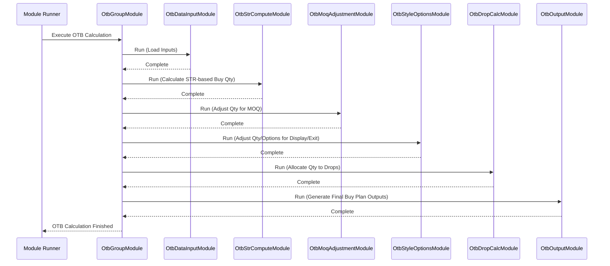

# Chapter 36: OTB Calculation (OtbGroupModule)

In the [previous chapter](35_assortment_plan_output__apoutputgroupmodule__.md), we learned how the **Assortment Plan Output** module consolidates the plan, telling us *how many different styles* (options/width) and *how many total units* (stocks/depth) we should aim for in each store for our product groups. That's great! We have a target assortment plan.

But how do we actually *buy* the inventory needed to achieve that plan? We need a budget and a specific purchasing plan. How much money can we spend? How many units of each item do we actually need to order from suppliers, considering things like how fast we expect items to sell, minimum order rules from suppliers, and maybe special display needs in stores?

## What Problem Does This Module Solve?

Imagine you've made a detailed shopping list for a big party (that's our Assortment Plan). You know you want 5 types of snacks and plan to have 50 total snack bags available. Now comes the practical part: going to the store to buy them.

You need a budget! How much money do you have available to spend on snacks? This budget is your **Open-To-Buy (OTB)**. It tells you how much you *can* purchase.

Furthermore, you need to figure out the exact quantities to put in your shopping cart:
*   If you already have some snacks at home (opening inventory), you don't need to buy all 50 bags.
*   If you expect to sell snacks *during* the party (planned sales), you need enough to cover those sales *and* still have some left if desired.
*   What if the chips only come in boxes of 10 (Minimum Order Quantity - MOQ)? You can't buy just 3 bags; you might have to buy 10.
*   What if you want at least 2 bags of each snack type visible on the table (Minimum Display Quantity)?

Calculating the right amount to buy involves balancing the plan, the budget, sales expectations, and practical constraints. Doing this manually for thousands of products and hundreds of stores is a massive headache.

The **OTB Calculation** process, orchestrated by the `OtbGroupModule`, solves this. It acts like the **master purchasing planner**. It takes the assortment plan (width and stocks/depth), considers sales forecasts (derived from the plan), desired sell-through rates, inventory we might already have, and constraints like MOQs, to calculate the final **buy quantity** needed for each product group or style. This ensures we buy enough to meet the plan without overspending or violating supplier rules.

## Core Concepts

1.  **Open-To-Buy (OTB):** This is the core concept. It represents the amount of inventory (usually measured in units or cost/retail value) that needs to be *purchased* during a specific period to achieve the planned sales and desired ending inventory levels. Think of it as the **purchasing budget or allowance**.

2.  **Planned Sales:** Derived from the assortment plan (width, depth, ASP) and potentially historical performance (OD segments). How many units do we expect to sell?

3.  **Sell-Through Rate (STR):** The planned percentage of available inventory (opening stock + purchases) that is expected to be sold during a period. If we want a 70% STR, it means we plan to have 30% left over at the end. A desired STR influences how much we *should* buy. A higher desired STR might mean buying less (planning to sell more of what you have), while a lower STR might mean buying more (planning to have more leftover).

4.  **Minimum Order Quantity (MOQ):** The smallest quantity of an item that a supplier will allow you to order. The OTB calculation must often round up the initial buy quantity to meet the MOQ.

5.  **Minimum Display Quantity (MDQ) / Exit Strategy:** Stores might need a minimum quantity just for display (MDQ). Alternatively, for items being phased out (Exit strategy), the goal might be to sell *all* inventory, influencing the buy decision (likely buying zero).

6.  **Drops:** Sometimes, purchases aren't made all at once but are staggered over time in multiple "drops". The OTB process might split the total buy quantity across these drops.

## The Orchestrator (`OtbGroupModule`)

Just like the other high-level planning steps (NOOS, ISS, OD, OW, AP Output), the OTB calculation involves several distinct calculation steps. The `OtbGroupModule` doesn't do the detailed math itself; it acts as the **project manager** for the OTB process.

It calls a sequence of specialized sub-modules in the correct order, ensuring that each step's output feeds correctly into the next:

1.  **`OtbDataInputModule`:** Gathers all the necessary inputs – Assortment Plan outputs (`OwOutputRow`), STR targets, MOQ rules (`OtbMinimumOrderQtyRow`), return rates, etc.
2.  **`OtbStrComputeModule`:** Calculates the required inventory based on the desired Sell-Through Rate (STR) and planned sales, considering expected returns. ([Chapter 37](37_otb_sell_through_rate__str__computation__.md))
3.  **`OtbMoqAdjustmentModule`:** Takes the quantities calculated based on STR and adjusts them upwards if necessary to meet the Minimum Order Quantities (MOQs) imposed by suppliers. ([Chapter 38](38_otb_minimum_order_quantity__moq__adjustment__.md))
4.  **`OtbStyleOptionsModule`:** Further refines the buy quantities and number of styles (options) based on minimum display requirements or specific exit strategies for certain categories. ([Chapter 39](39_otb_style_options_adjustment_.md))
5.  **`OtbDropCalcModule`:** If the buying period involves multiple delivery "drops", this module allocates the total buy quantity across these different drops. ([Chapter 40](40_otb_drop_calculation_.md))
6.  **`OtbOutputModule`:** Consolidates the final results and generates the various OTB output reports (e.g., final buy quantities per Store-AG, per style, per drop).

## How It Works (The Workflow)

You run `OtbGroupModule` after the main Assortment Plan (including Width and Depth/Stocks) has been finalized.

**Inputs:**
*   Assortment Plan Outputs: Primarily `OwOutputRow` (containing final width, predicted sales/OTB quantity, ASP) and potentially `ApOutputRow`.
*   Sell-Through Rate (STR) targets/overrides (`OtbStrOverrideRow`).
*   Return rate estimates (`OtbReturnsInputRow`).
*   Minimum Order Quantity rules (`OtbMinimumOrderQtyRow`).
*   Minimum Display Quantity rules (`OtbMinDisplayRow`).
*   Size Set minimum requirements (`SizeSetQtyRow`).
*   Period definitions ([`CommonData`](06_common_data_.md)), especially identifying "Drop" periods.
*   Product & Store Master Data ([`Cache`](05_cache_.md)).

**Outputs:**
The main goal is to produce the final **buy plan quantities**. This is often represented in several tables/files:
*   `OtbStoreBuyOutputRow`: Final buy options and quantity for each Store-AG combination.
*   `OtbStyleBuyOutputRow`: Final buy quantity per Store-Style (after allocating AG quantity across potential styles).
*   `OtbDropOutputRow`: Shows how the buy quantities are split across different drops (Drop 1 vs Drop 2).
*   `OtbDropStyleBuysRow`: Shows the buy quantity per style for each specific drop.
*   Denormalized output reports combining these figures with descriptive attributes for easier analysis.

These outputs are the final instructions for the purchasing or buying teams.

## Under the Hood

**1. Orchestration (`OtbGroupModule.java`):**
   Like the other `...GroupModule` classes, `OtbGroupModule` uses `@PostConstruct` and the `add()` method to define the strict sequence of its sub-modules.

```java
// File: src/main/java/com/increff/irisx/module/OtbGroupModule.java
package com.increff.irisx.module;

// Imports for all the OTB sub-modules
import com.increff.irisx.module.otb.*;
import org.springframework.beans.factory.annotation.Autowired;
import org.springframework.stereotype.Component;
import javax.annotation.PostConstruct;

@Component
public class OtbGroupModule extends AbstractUtilModuleGroup {

    // Inject instances of each sub-module
    @Autowired private OtbDataInputModule otbDataInputModule;
    @Autowired private OtbStrComputeModule otbStrComputeModule;
    @Autowired private OtbMoqAdjustmentModule otbMoqAdjustmentModule;
    @Autowired private OtbStyleOptionsModule otbStyleOptionsModule;
    @Autowired private OtbDropCalcModule otbDropCalcModule;
    @Autowired private OtbOutputModule otbOutputModule;
    // Standard snapshot/sync modules
    @Autowired private UtilOutputSnapshotModule utilOutputSnapshotModule;
    @Autowired private UtilOutputSyncModule utilOutputSyncModule;

    @PostConstruct // Run after creation
    public void init() {
        captureSnapshot();       // Standard step
        // --- Define the OTB execution order ---
        add(otbDataInputModule);      // 1. Load Inputs
        add(otbStrComputeModule);     // 2. Calculate STR-based needs
        add(otbMoqAdjustmentModule);  // 3. Adjust for MOQ
        add(otbStyleOptionsModule); // 4. Adjust for Display/Exit & Styles
        add(otbDropCalcModule);       // 5. Allocate quantities to Drops
        add(otbOutputModule);         // 6. Consolidate & Save Final Outputs
        uploadOutput();          // Standard step
    }

    // Standard methods inherited to add snapshot/sync steps
    @Override public void captureSnapshot() { add(utilOutputSnapshotModule); }
    @Override public void uploadOutput() { add(utilOutputSyncModule); }
}
```
**Explanation:** The `init()` method clearly lists the required steps in order: Input -> STR -> MOQ -> Style Options -> Drop Calc -> Output. `OtbGroupModule` ensures each runs sequentially.

**Sequence Diagram (High-Level Flow):**


**2. Key Logic Sneak Peek:**
   The detailed logic resides in the sub-modules, which we'll cover next:
   *   **`OtbStrComputeModule` ([Chapter 37](37_otb_sell_through_rate__str__computation__.md)):** Calculates initial buy needs using the formula `Total Need = (Planned Sales / Planned STR)`. `Buy = Total Need - Opening Stock`.
   *   **`OtbMoqAdjustmentModule` ([Chapter 38](38_otb_minimum_order_quantity__moq__adjustment__.md)):** Groups buy quantities by supplier/category and rounds them up to meet MOQ thresholds, potentially requiring iterative adjustments across related items.
   *   **`OtbStyleOptionsModule` ([Chapter 39](39_otb_style_options_adjustment__.md)):** Checks if the MOQ-adjusted quantities and options meet minimum display needs. If not, it might increase quantities or "borrow" styles from other groups to meet display minimums. It also handles exit styles.
   *   **`OtbDropCalcModule` ([Chapter 40](40_otb_drop_calculation_.md)):** Splits the final buy quantity for each item across different delivery periods (drops) based on configuration or timing rules.

## Conclusion

The **OTB Calculation** process, orchestrated by **`OtbGroupModule`**, translates the strategic Assortment Plan into a concrete **purchasing plan**.

*   It determines the **Open-To-Buy (OTB)**, essentially the budgeted quantity to purchase for each product group/style/store.
*   It considers **planned sales, desired sell-through rates (STR), supplier Minimum Order Quantities (MOQ), Minimum Display Quantities (MDQ), and potential delivery drops**.
*   `OtbGroupModule` manages a sequence of specialized modules that perform these calculations step-by-step.
*   The final outputs (like `OtbStoreBuyOutputRow`, `OtbStyleBuyOutputRow`, `OtbDropStyleBuysRow`) provide the actionable quantities for the buying team.

This module bridges the gap between planning *what* to sell and figuring out *how much* to actually buy to make that plan a reality.

The first critical input to this process is understanding the target Sell-Through Rate. Let's dive into how that's calculated in the next chapter.

[Next Chapter: OTB Sell-Through Rate (STR) Computation](37_otb_sell_through_rate__str__computation__.md)

---

Generated by [AI Codebase Knowledge Builder](https://github.com/The-Pocket/Tutorial-Codebase-Knowledge)