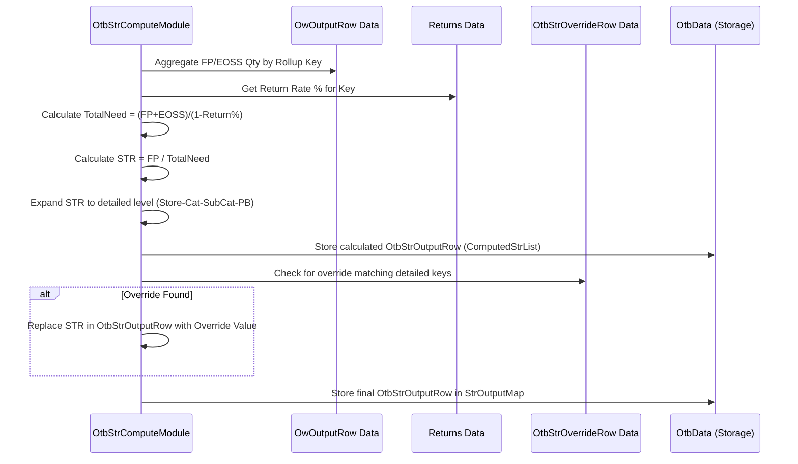

# Chapter 37: OTB Sell-Through Rate (STR) Computation

Welcome back! In the [previous chapter](36_otb_calculation__otbgroupmodule__.md), we got an overview of the **OTB Calculation** process, managed by `OtbGroupModule`, which aims to figure out the right quantities to buy. We saw it involves several steps like considering STR, MOQ, and Drops.

Now, let's zoom in on the first crucial calculation in that sequence: determining the target **Sell-Through Rate (STR)**. This step is handled by the `OtbStrComputeModule`.

## What Problem Does This Module Solve?

Imagine you're planning to bake bread for a week. You know you want to *eat* 7 loaves (your planned sales). But how much flour do you need to *buy*? Just enough for 7 loaves? What if some flour spills (like customer returns)? What if you want some flour leftover at the end of the week (planned closing stock)?

You need a target "usage rate" for your flour. If you plan to use 80% of the flour you have available (an 80% Sell-Through Rate), you can calculate how much total flour you need to start with to ensure you can make your 7 loaves.

Similarly, in retail, before we calculate the final "buy quantity", we need to decide how quickly we *want* items to sell relative to the total stock we plan to have. This desired rate is the **target Sell-Through Rate (STR)**.

The `OtbStrComputeModule` solves the problem of calculating this target STR for different product groups (like "Men's T-shirts, BrandX, Premium Price Bucket" in Store 101). This STR isn't just historical; it's a *forward-looking* plan based on expected sales in different periods (like Full Price season vs. End-of-Season Sale) and accounting for expected customer returns. Knowing this target STR is essential for calculating the total inventory needed to support the sales plan.

## Core Concepts

1.  **Sell-Through Rate (STR):** Generally, this is the percentage of available inventory that is sold over a period. `STR = Units Sold / (Units Sold + Ending Inventory)`. A higher STR means items sold quickly with little leftover; a lower STR means more was left unsold.

2.  **Planned STR for Buying:** In this module, we calculate a slightly different planning STR. It helps determine the total inventory required to meet sales targets across different selling periods (like Full Price and EOSS - End of Season Sale), while accounting for items coming back as returns.
    *   **Planned Sales:** We get the total planned sales quantity (`otbQty` from the [Optimum Width (OW) Module (ApOwGroupModule)](32_optimum_width__ow__module__apowgroupmodule__.md)) for both the Full Price (FP) period and the EOSS period.
    *   **Returns Adjustment:** Customers return items. If we expect a 10% return rate, for every 100 items shipped, only 90 effectively contribute to final sales. To achieve our total planned sales (FP + EOSS), we actually need *more* initial units to account for returns.
        `Total Units Needed = (Planned FP Sales + Planned EOSS Sales) / (1 - Return Rate %)`
    *   **Calculated STR:** The module calculates the target STR primarily based on the Full Price period:
        `STR = Planned FP Sales / Total Units Needed`
        This represents the proportion of the *total required inventory (accounting for returns)* that we plan to sell specifically during the Full Price period.

3.  **Rollup Level:** Calculating STR for every single tiny group might not be stable. The business might decide to calculate it at a higher level (like Store-Category) and apply that rate to all sub-groups within it (like Store-Category-Subcategory-PriceBucket). The `strRollupLevel` configuration controls this.

4.  **Overrides:** Sometimes, the business wants to set a specific STR target for a group, regardless of the calculation based on planned sales. This module allows for applying these manual overrides (`OtbStrOverrideRow`).

## How It Works (The Process)

The `OtbStrComputeModule` runs within the `OtbGroupModule` sequence.

**Inputs:**
*   Planned Sales Quantities: `owOutputRow.otbQty` from `OtbData`.
*   Period Definitions: To know which periods are Full Price (FP) and EOSS (from [Common Data](06_common_data_.md)).
*   Return Rate %: Per Store-Category (from `OtbData`).
*   STR Rollup Level: Configuration from `OtbArgs`.
*   STR Overrides: `OtbStrOverrideRow` input data.
*   Attribute Group and Price Bucket info: From the [Cache](05_cache_.md).

**Calculation Steps:**
1.  **Initialize:** Clear previous data, load `OtbArgs`.
2.  **Aggregate Sales (`updateStrQtyData`):**
    *   Loop through the planned sales quantities (`OwOutputRow`).
    *   Identify if the period is FP or EOSS using `CommonData`.
    *   Determine the correct grouping key based on the configured `strRollupLevel` (e.g., Key(Store, Cat) or Key(Store, Cat, Subcat, PB)).
    *   Sum up the `otbQty` for FP periods (`fullPriceQty`) and EOSS periods (`eossQty`) for each group key. Store these sums in an `OtbStrData` object within a map (`strMap`).
3.  **Calculate STR (`computeStr`):**
    *   Loop through the `strMap`.
    *   For each group (key):
        *   Get the total planned sales (`totalQty = fullPriceQty + eossQty`).
        *   Get the `returnPercent` for the group.
        *   Calculate the total units needed considering returns: `strQty = totalQty / (1 - returnPercent / 100)`.
        *   Calculate the STR: `str = fullPriceQty / strQty`.
        *   Store the calculated `str` back into the `OtbStrData` object.
4.  **Expand STR (`getStrRows`):**
    *   If STR was calculated at a rollup level (e.g., Store-Cat), expand it down to the most detailed level (Store-Cat-Subcat-PriceBucket). Create an `OtbStrOutputRow` for each detailed combination, assigning it the STR calculated for its parent group. Store these detailed rows (`otbData.addToStrRows`).
5.  **Write Initial Output (`writeOutput`):** Save the calculated (but not yet overridden) `OtbStrOutputRow` data.
6.  **Apply Overrides (`overrideStr`):**
    *   Read the `OtbStrOverrideRow` input.
    *   For each calculated `OtbStrOutputRow`:
        *   Check if an override rule exists for its Store-Cat-Subcat-PriceBucket.
        *   If yes, replace the calculated `str` value with the override value (converted from percentage).
    *   Store the final (potentially overridden) results in the main `OtbData` structure (`otbData.addToStrOutputMap`).

**Outputs:**
*   The primary output is the updated `OtbData` object, specifically the `otbStrOutputMap`. This map holds the final target STR value for each detailed group (Store-Cat-Subcat-PriceBucket) that subsequent OTB modules will use.
*   Intermediate `OtbStrOutputRow` data is also saved.

## Under the Hood: Aggregating, Calculating, Overriding

Let's trace the core logic with simplified code snippets.

**1. Aggregating Sales (`updateStrQtyData`):**

```java
// Simplified from OtbStrComputeModule.java
private Map<Key, OtbStrData> strMap; // Key depends on rollup level

private void updateStrQtyData(StrRollupLevel strRollupLevel) {
    Set<Integer> fullPricePeriods = commonData.getPeriodsOfType(PeriodType.FULL_PRICE_PERIOD);
    Set<Integer> eossPeriods = commonData.getPeriodsOfType(PeriodType.EOSS_PERIOD);

    // Loop through planned quantities from OW module output
    otbData.getAllOwOutputRows().forEach(owOutputRow -> {
        AgRow agRow = cache.getAgRow(owOutputRow.ag);
        // Create the key based on the specified rollup level
        Key strKey = getStrKey(owOutputRow.store, agRow, strRollupLevel);
        // Get existing data or create new for this key
        OtbStrData otbStrData = strMap.computeIfAbsent(strKey,
                                k -> new OtbStrData(owOutputRow.store));

        // Sum quantities based on period type
        if (fullPricePeriods.contains(owOutputRow.period))
            otbStrData.fullPriceQty += owOutputRow.otbQty;
        if (eossPeriods.contains(owOutputRow.period))
            otbStrData.eossQty += owOutputRow.otbQty;

        // Put back (although computeIfAbsent modifies in place)
        strMap.put(strKey, otbStrData);
    });
}

// Helper to create the key based on rollup level
private static Key getStrKey(int store, AgRow agRow, StrRollupLevel level) {
    switch (level) {
        case STORE_CAT_SUBCAT_PB:
            return new Key(store, agRow.cat, agRow.subcat, agRow.priceBucket);
        // ... other cases for STORE_CAT_SUBCAT, STORE_CAT ...
    }
    return null; // Should not happen if level is valid
}
```
**Explanation:** This code iterates through the planned sales quantities (`OwOutputRow`). For each row, it determines the correct grouping key based on the `strRollupLevel`. It uses `strMap.computeIfAbsent` to get or create an `OtbStrData` object for that key and then adds the `otbQty` to either `fullPriceQty` or `eossQty` depending on the period type.

**2. Calculating STR (`computeStr`):**

```java
// Simplified from OtbStrComputeModule.java
private void computeStr() {
    strMap.forEach((strKey, otbStrData) -> {
        int store = (int) strKey.part(0);
        String category = (String) strKey.part(1); // Assuming category is always part 1

        // Get the return rate for this store/category
        double returnPercent = otbData.getReturnsPercent(store, category);

        double totalQty = otbStrData.fullPriceQty + otbStrData.eossQty;
        // Calculate the non-return ratio (e.g., 1 - 0.10 = 0.90 for 10% returns)
        double nonReturnRatio = 1 - MathUtil.divide(returnPercent, 100.0);

        // Calculate total units needed accounting for returns
        double strQty = MathUtil.divide(totalQty, nonReturnRatio);

        // Calculate STR = Full Price Qty / Total Units Needed
        otbStrData.str = MathUtil.divide(otbStrData.fullPriceQty, strQty);
    });
}
```
**Explanation:** This iterates through the aggregated data in `strMap`. For each group, it fetches the return rate, calculates the `strQty` needed (total planned sales adjusted upwards for returns), and then calculates the `str` value as the ratio of planned full-price sales to this total required quantity. `MathUtil.divide` is used for safe division (handles division by zero).

**3. Applying Overrides (`overrideStr`):**

```java
// Simplified from OtbStrComputeModule.java
private void overrideStr() {
    // Loop through the STR rows generated *before* overrides
    otbData.getComputedStrList().forEach(otbStrOutputRow -> {
        // Check if an override rule exists for this specific row's keys
        OtbStrOverrideRow overrideRow = otbData.getOtbStrOverrideRow(
            otbStrOutputRow.store,
            otbStrOutputRow.category,
            otbStrOutputRow.subCat,
            cache.getPriceBucket(otbStrOutputRow.priceBucket).inputName // Use input name for lookup
        );

        // If an override rule is found...
        if (overrideRow != null) {
            // Apply the override STR value (converting from %)
            otbStrOutputRow.str = MathUtil.divide(overrideRow.str, 100.0);
        }

        // Add the final (potentially overridden) row to the main OTB data map
        otbData.addToStrOutputMap(otbStrOutputRow);
    });
}
```
**Explanation:** This method iterates through the initially calculated `OtbStrOutputRow` objects. For each one, it checks if a corresponding override rule exists in the data loaded from `OtbStrOverrideRow` (using the helper `otbData.getOtbStrOverrideRow`). If a rule exists, it overwrites the `str` value in the `otbStrOutputRow` with the value from the override rule. Finally, it stores this definitive `OtbStrOutputRow` in the main `OtbData` map for later use.

**Sequence Diagram (Simplified Calculation & Override):**



## Conclusion

The **OTB Sell-Through Rate (STR) Computation**, performed by `OtbStrComputeModule`, is a foundational step in the OTB process.

*   It calculates a **target planning STR** for product groups based on planned sales quantities (from OW output) across different periods (Full Price, EOSS) and adjusts for expected **customer returns**.
*   The formula used is effectively `STR = Planned FP Sales / ( (FP Sales + EOSS Sales) / (1 - Return Rate %) )`.
*   It allows STR to be calculated at different **rollup levels** for stability and then applies that rate down to detailed groups.
*   Crucially, it incorporates **manual overrides**, ensuring the final STR aligns with business strategy.
*   The resulting STR values (stored in `OtbData`) are used in subsequent OTB steps to determine the required inventory levels and initial buy quantities.

Understanding the target STR helps set the stage for calculating how much inventory we need. But what happens if suppliers have minimum order requirements? The next chapter explores how the system adjusts for these.

[Next Chapter: OTB Minimum Order Quantity (MOQ) Adjustment](38_otb_minimum_order_quantity__moq__adjustment_.md)

---

Generated by [AI Codebase Knowledge Builder](https://github.com/The-Pocket/Tutorial-Codebase-Knowledge)