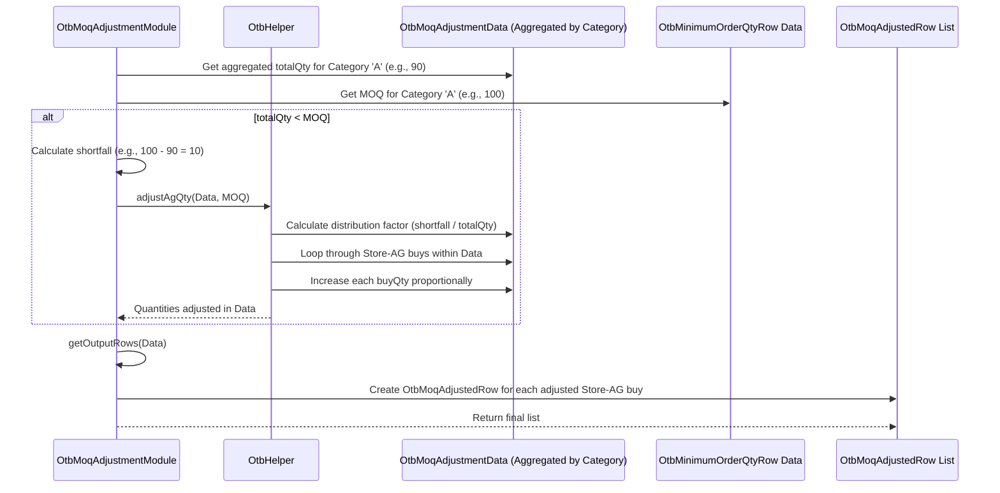

# Chapter 38: OTB Minimum Order Quantity (MOQ) Adjustment

Welcome back! In the [previous chapter](37_otb_sell_through_rate__str__computation__.md), we learned how the `OtbStrComputeModule` calculates the target Sell-Through Rate (STR) and uses it to determine an initial *required* inventory quantity. This quantity tells us how much stock we need to meet our sales goals, considering returns and target STR.

But when we go to actually *order* this inventory from our suppliers, we encounter a real-world constraint: suppliers often don't let us order *exactly* the quantity we calculated.

## What Problem Does This Module Solve?

Imagine you calculated that you need exactly 15 eggs for your baking plans (your STR-adjusted quantity). You go to the supermarket, but they only sell eggs in cartons of 12 or 18. You can't buy exactly 15! You have to decide: do you buy the carton of 12 (and potentially run short) or the carton of 18 (and have extra)?

Suppliers in the fashion industry often have similar rules, called **Minimum Order Quantities (MOQs)**. They might say, "For any order within the 'Men's Premium T-Shirts' category, you must order *at least* 100 units total, even if your calculation says you only need 85."

The **OTB Minimum Order Quantity (MOQ) Adjustment Module** (`OtbMoqAdjustmentModule`) solves this problem. It takes the buy quantities calculated based on STR and checks if they meet the supplier's MOQ rules (usually set at a category or supplier level). If the planned buy quantity for a group is *below* the MOQ, this module has to adjust the plan.

## Core Concepts

1.  **Minimum Order Quantity (MOQ):** The smallest number of units (or sometimes value) that a supplier requires you to purchase in a single order, often for a specific product category or group. This information typically comes from the `OtbMinimumOrderQtyRow` input data.

2.  **Rollup Level:** MOQ rules are often applied at a broader level than individual styles or even detailed Attribute Groups. For example, the MOQ might apply to the entire "Men's T-Shirts" category across all stores buying from a particular supplier. The calculation needs to aggregate the planned buy quantities up to this MOQ level (e.g., `CAT`, `CAT_SUBCAT`) to check against the rule.

3.  **Adjustment Logic:** If the aggregated planned buy quantity for an MOQ group is less than the required MOQ, an adjustment is needed. The module implements logic (often in `OtbHelper`) to handle this:
    *   **Check Feasibility:** Can the MOQ even be met, considering available budget or other constraints? (Though budget constraints might be handled later).
    *   **Increase Quantity:** The most common adjustment is to increase the total buy quantity for the group to meet the MOQ. This increase is often distributed proportionally across the items (Store-AG combinations) within that group based on their initial calculated buy quantity.
    *   **Dropping Styles/AGs (Less Common here):** While sometimes considered, dropping items is often handled in later steps (like Style Options Adjustment). This module primarily focuses on meeting the quantity requirement by increasing the buy.

4.  **Iterative Rollup:** The MOQ check and adjustment might happen at multiple levels. For instance, it might first check MOQs at a detailed level (like Cat-Subcat-PriceBucket), make adjustments, then roll up the adjusted quantities to check MOQs at the Subcategory level, and finally at the Category level. This ensures requirements are met at all necessary points in the hierarchy.

## How It Works (The Process)

This module runs as part of the `OtbGroupModule` sequence, right after the STR calculation (`OtbStrComputeModule`).

**Inputs:**
*   **STR-Adjusted Quantities:** The initial buy quantities calculated by `OtbStrComputeModule`, often stored internally in `OtbData` (e.g., accessible via `OtbBuyData` objects).
*   **MOQ Rules (`OtbMinimumOrderQtyRow`):** Defines the minimum quantity required for each category (or other level).
    ```java
    // File: src/main/java/com/increff/irisx/row/input/otb/OtbMinimumOrderQtyRow.java
    package com.increff.irisx.row.input.otb;

    public class OtbMinimumOrderQtyRow {
        public String category; // Category the MOQ applies to
        public int quantity;    // The minimum quantity required
    }
    ```
*   **Product Group Info:** Access to [AgRow](16_agrow_.md) data (via [Cache](05_cache_.md)) to know the category, subcategory, etc., for each AG.
*   Configuration: `OtbArgs` might define rollup levels, although the primary input is the MOQ rule itself.

**Calculation Steps (Simplified):**
1.  **Calculate Initial Buy:** Determine the initial buy quantity needed for each Store-AG based on the STR-adjusted total quantity (from `OtbStrComputeModule`).
2.  **Aggregate to MOQ Level:** Group these initial buy quantities based on the finest MOQ level (e.g., Cat-Subcat-PriceBucket). Sum the quantities within each group.
3.  **Adjust at Finest Level:** For each group at this level, compare the summed quantity against the category's MOQ. If below MOQ, increase the quantities for the Store-AGs within that group proportionally to meet the MOQ (using helpers like `OtbHelper.adjustAgQty`). Mark these quantities as "adjusted".
4.  **Roll Up and Adjust:** Aggregate the (potentially adjusted) quantities to the next higher level (e.g., Cat-Subcat). Check the total against the MOQ again. If the rolled-up total for a Cat-Subcat group (containing *only* quantities that were *not yet adjusted* at the lower level) is below MOQ, adjust the quantities of the *unadjusted* Store-AGs within that group proportionally. Repeat this rollup process up to the highest required level (e.g., CAT).
5.  **Store Results:** Store the final, MOQ-adjusted buy quantities.

**Outputs:**
*   **`OtbMoqAdjustedRow`:** This contains the final buy quantity and potentially width for each Store-AG *after* MOQ adjustments have been applied. This is the primary input for the next step.
    ```java
    // File: src/main/java/com/increff/irisx/row/output/otb/OtbMoqAdjustedRow.java
    package com.increff.irisx.row.output.otb;

    public class OtbMoqAdjustedRow {
        public int store;
        public int ag;
        public int quantity; // <<< Final MOQ-adjusted quantity
        public int width;    // Calculated width (may be adjusted later)

        // Constructors...
    }
    ```
*   `OtbMoqUnAdjustedRow`: Saved for reporting, showing which groups *initially* didn't meet MOQ before adjustments were made.
*   `OtbStrAdjustedRow`: Saved for reporting, showing the quantities before MOQ logic.

## Under the Hood: Grouping, Checking, Adjusting

The core logic involves grouping data, comparing totals to the MOQ, and distributing any required increase.

**1. Walkthrough (Conceptual):**
*   **Input:** Store-AG Buy Quantities (STR-Adjusted):
    *   Store1-AG1 (CatA, SubA, PB1): 30 units
    *   Store2-AG1 (CatA, SubA, PB1): 25 units
    *   Store1-AG2 (CatA, SubA, PB2): 20 units
    *   Store1-AG3 (CatA, SubB, PB1): 15 units
*   **MOQ Rule:** Category A (CatA) requires 100 units.
*   **Level 1 (Cat-Subcat-PB):**
    *   Group 1 (CatA, SubA, PB1): Total = 30 + 25 = 55 units.
    *   Group 2 (CatA, SubA, PB2): Total = 20 units.
    *   Group 3 (CatA, SubB, PB1): Total = 15 units.
*   **Level 2 (Cat-Subcat):**
    *   Group 4 (CatA, SubA): Contains Group 1 (55) + Group 2 (20) = 75 units.
    *   Group 5 (CatA, SubB): Contains Group 3 (15) = 15 units.
*   **Level 3 (Cat):**
    *   Group 6 (CatA): Contains Group 4 (75) + Group 5 (15) = 90 units.
*   **Check MOQ:** Total for CatA (90 units) is LESS THAN MOQ (100 units). Need to add 10 units.
*   **Adjust:** Distribute the extra 10 units proportionally back to the original Store-AG contributions:
    *   Total initial = 90. Increase needed = 10. Factor = 10/90 ≈ 0.111
    *   Store1-AG1: 30 + (30 * 0.111) ≈ 33 units
    *   Store2-AG1: 25 + (25 * 0.111) ≈ 28 units
    *   Store1-AG2: 20 + (20 * 0.111) ≈ 22 units
    *   Store1-AG3: 15 + (15 * 0.111) ≈ 17 units
    *   Total ≈ 33 + 28 + 22 + 17 = 100 units. MOQ is met. (Rounding might apply).
*   **Output:** The `OtbMoqAdjustedRow` records would contain these adjusted quantities (33, 28, 22, 17).

**Sequence Diagram (Simplified Adjustment at Category Level):**


**Code Dive:**

*   **Calculating Initial Buy & Grouping (`computeInitialBuyQty`, `createMoqAdjustmentDataAtPbLevel`):**
    ```java
    // Simplified from OtbMoqAdjustmentModule.java

    // Calculates buy quantity needed based on STR result
    private List<OtbBuyData> computeInitialBuyQty() {
        List<OtbBuyData> otbBuyDataList = new ArrayList<>();
        // Loop through OwOutput rows (planned sales)
        otbData.getAllOwOutputRows().forEach(k -> {
            AgRow agRow = cache.getAgRow(k.ag);
            // Get the final STR calculated in the previous module
            double str = otbData.getOtbStrOutputRow(k.store, agRow.cat, agRow.subcat, agRow.priceBucket).str;
            // Initial Buy Qty = Planned Sales / STR
            double otbQty = MathUtil.divide(k.otbQty, str);
            // Create simple object to hold Store, AG, and initial Buy Qty
            OtbBuyData otbBuyData = new OtbBuyData(k.store, k.ag);
            otbBuyData.buyQty = otbQty;
            otbBuyDataList.add(otbBuyData);
            // Also save the pre-MOQ result for reporting
            otbData.addToStrAdjustedRowMap(k.store, k.ag, OtbHelper.getStrRow(k, otbQty, /*...*/));
        });
        return otbBuyDataList;
    }

    // Groups the initial buy data up to the Price Bucket level initially
    private Map<Key, OtbMoqAdjustmentData> createMoqAdjustmentDataAtPbLevel(List<OtbBuyData> otbBuyDataList) {
        Map<Key, OtbMoqAdjustmentData> moqAdjustmentDataMap = new HashMap<>();
        otbBuyDataList.forEach(otbBuyData -> {
            AgRow agRow = cache.getAgRow(otbBuyData.ag);
            // Key = Cat, Subcat, PriceBucket
            Key key = new Key(agRow.cat, agRow.subcat, agRow.priceBucket);
            // Get/create data holder for this group
            OtbMoqAdjustmentData moqAdjustmentData = moqAdjustmentDataMap.computeIfAbsent(key, k -> new OtbMoqAdjustmentData());
            // Store the detailed Store-AG buy data within the group
            moqAdjustmentData.storeAgMap.computeIfAbsent(otbBuyData.store, k -> new ArrayList<>()).add(otbBuyData);
            // Store AG-level data within the group
            OtbMoqAGData otbMoqAGData = moqAdjustmentData.otbMoqAgDataLinkedHashMap.computeIfAbsent(otbBuyData.ag, k -> new OtbMoqAGData(otbBuyData.ag));
            otbMoqAGData.qty += otbBuyData.buyQty; // Sum Qty per AG
            // Sum total quantity for the entire group
            moqAdjustmentData.totalQty += otbBuyData.buyQty;
        });
        return moqAdjustmentDataMap;
    }
    ```
    **Explanation:** `computeInitialBuyQty` calculates the raw buy needed (`otbQty / str`) for each Store-AG. `createMoqAdjustmentDataAtPbLevel` then aggregates this data, grouping it by Category, Subcategory, and Price Bucket into `OtbMoqAdjustmentData` objects, summing up the `totalQty` for each group.

*   **Iterative Adjustment (`adjQtyAtLevel`, `adjQtyAtCategory`, `OtbHelper.adjustAgQty`):**
    ```java
    // Simplified from OtbMoqAdjustmentModule.java

    // Performs adjustment check and rolls up to the next level
    private void adjQtyAtLevel(Map<Key, OtbMoqAdjustmentData> moqAdjustmentDataMap, OtbMoqRollupLevel currentRollupLevel) {
        Map<Key, OtbMoqAdjustmentData> rollUpMoqAdjDataMap = new HashMap<>(); // For next level
        moqAdjustmentDataMap.forEach((key, otbMoqAdjustmentData) -> {
            Key rollUpKey = OtbHelper.getRollUpKey(key, currentRollupLevel); // e.g., Cat-Subcat -> Cat
            String category = (String) key.part(0);
            OtbMoqAdjustmentData rollUpOtbMoqAdjData = rollUpMoqAdjDataMap.computeIfAbsent(rollUpKey, k -> new OtbMoqAdjustmentData());
            int moq = otbData.getOtbMinimumOrderQtyRow(category).quantity;

            // If current group total < MOQ, just add it to rollup without adjustment yet
            if (otbMoqAdjustmentData.totalQty < moq) {
                 rollUpOtbMoqAdjData.addToRollup(otbMoqAdjustmentData);
                 return;
            }
            // If current group total >= MOQ, adjust quantities within it NOW
            OtbHelper.adjustAgQty(otbMoqAdjustmentData, moq); // Apply proportional increase
            // Add the adjusted data to the rollup map for the next level
            rollUpOtbMoqAdjData.addToRollup(otbMoqAdjustmentData);
        });
        // Replace current level map with the rolled-up map for next iteration
        moqAdjustmentDataMap.clear();
        moqAdjustmentDataMap.putAll(rollUpMoqAdjDataMap);
    }

    // Final adjustment at Category level (handles any remaining shortfalls)
    private void adjQtyAtCategory(Map<Key, OtbMoqAdjustmentData> moqAdjustmentDataMap) {
        moqAdjustmentDataMap.forEach((key, otbMoqAdjustmentData) -> {
            String category = (String) key.part(0);
            int moq = otbData.getOtbMinimumOrderQtyRow(category).quantity;
            // Only adjust if needed (handles cases where lower levels might sum up)
            if (otbMoqAdjustmentData.totalQty < moq) {
                return; // Cannot meet MOQ or handled at lower level
            }
            OtbHelper.adjustAgQty(otbMoqAdjustmentData, moq); // Apply final adjustment
        });
    }

    // Simplified logic from OtbHelper.adjustAgQty()
    public static void adjustAgQty(OtbMoqAdjustmentData moqAdjData, int moq) {
        // Calculate the difference needed
        double diff = moq - moqAdjData.totalQty;
        if (diff <= 0) return; // Already meets or exceeds MOQ

        // Calculate distribution factor
        double distFactor = MathUtil.divide(diff, moqAdjData.totalQty);

        // Loop through AGs within this group
        moqAdjData.otbMoqAgDataLinkedHashMap.values().forEach(agData -> {
            double agQty = agData.qty;
            double agIncrease = agQty * distFactor;
            agData.qty = agQty + agIncrease; // Increase AG total

            // Distribute the increase down to the Store-AG level
            moqAdjData.storeAgMap.values().forEach(storeBuys -> {
                storeBuys.stream()
                    .filter(buy -> buy.ag == agData.ag) // Find buys for this AG
                    .forEach(buy -> buy.buyQty += (buy.buyQty * distFactor)); // Increase Store-AG buy
            });
        });
        // Update the group's total quantity
        moqAdjData.totalQty = moq;
    }
    ```
    **Explanation:** `adjQtyAtLevel` iterates through groups at one level (e.g., Cat-SubCat-PB). If a group's total quantity meets the MOQ, it calls `OtbHelper.adjustAgQty` to distribute the quantity proportionally *within* that group (to meet exactly MOQ or stay above it cleanly, often rounding is involved). It then adds the (potentially adjusted) data to the map for the next higher rollup level. `adjQtyAtCategory` performs a final adjustment pass at the highest level. The `OtbHelper.adjustAgQty` calculates the shortfall (`diff`), determines a distribution factor, and proportionally increases the quantities at both the AG level and the underlying Store-AG level within the `OtbMoqAdjustmentData` object.

## Conclusion

The **OTB Minimum Order Quantity (MOQ) Adjustment**, performed by `OtbMoqAdjustmentModule`, is a crucial step that aligns the calculated buy plan with real-world supplier constraints.

*   It ensures that the total planned purchase quantity for designated product groups (like categories) meets the **minimum requirements (MOQ)** set by suppliers.
*   It **aggregates** the initial buy quantities (calculated based on STR) up to the level where MOQ rules apply.
*   If the aggregated quantity is below the MOQ, it **proportionally increases** the buy quantities of the constituent items (Store-AGs) until the MOQ is met.
*   This process might involve **iterative rollups** through different hierarchy levels (e.g., PriceBucket -> Subcategory -> Category).
*   The key output is the **`OtbMoqAdjustedRow`**, which contains the buy quantities ready for the next planning step, having satisfied MOQ constraints.

By incorporating MOQs, this module makes the buy plan more practical and executable. However, even with MOQs met, we might need to make further adjustments based on how many different *styles* we end up buying and whether we meet minimum display needs in stores.

[Next Chapter: OTB Style Options Adjustment](39_otb_style_options_adjustment_.md)

---

Generated by [AI Codebase Knowledge Builder](https://github.com/The-Pocket/Tutorial-Codebase-Knowledge)