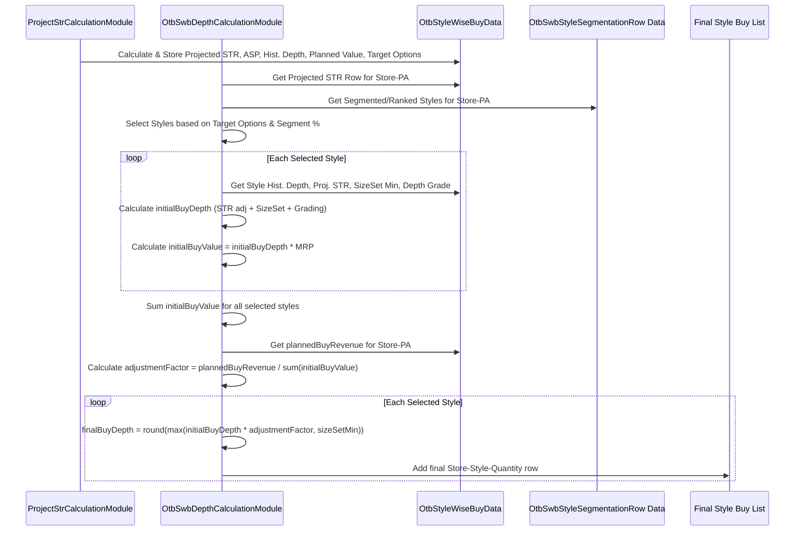

# Chapter 41: OTB Style Wise Buy Module

Welcome back! In the previous OTB chapters ([Chapter 36](36_otb_calculation__otbgroupmodule__.md) to [Chapter 40](40_otb_drop_calculation_.md)), we focused on calculating the overall buy quantity needed for product groups (like Attribute Groups), ensuring we met supplier minimums (MOQ) and planned deliveries across different drops. This gave us a total quantity to buy for broader categories.

But when a buyer actually places an order, they need to know exactly how many units of *each specific style* (like "Style 123: Red Cotton V-Neck" vs. "Style 456: Blue Striped V-Neck") to purchase. How do we translate the group-level buy plan into a detailed, style-by-style purchase list?

## What Problem Does This Module Solve?

Imagine the OTB plan says we need to buy 500 units total for the "Men's Premium V-Neck T-shirts" group (AG 500) in Store 101. Within AG 500, we might have 10 different styles available to purchase. How do we decide:
1.  **Which** of the 10 styles should we actually include in the buy? (Maybe we only planned for 6 options/width).
2.  **How many units** of each selected style should we buy, ensuring the total adds up to the planned 500 units?

Simply dividing the 500 units evenly across the top 6 styles might not be optimal. Some styles might be designated as "Key" items needing deeper stock, others might be "Core" basics, while some might be less critical "Brand Focus" items. We also need to consider their historical performance (how quickly they sold when available - their sales depth), their price (ASP), and potentially apply overrides or strategic adjustments (like a "freshness factor" for newness or "depth grading" to boost important items).

The **OTB Style Wise Buy Module** (orchestrated by `OtbStyleWiseBuyGroupModule` and mainly executed by `ProjectStrCalculationModule` and `OtbSwbDepthCalculationModule`) solves this detailed allocation problem. It takes the higher-level OTB plan and refines it down to the individual style level. It determines the final buy **depth** (quantity) for *each selected style*, considering its strategic segmentation, historical performance, minimum requirements, and target inventory levels, before the plan is broken down further to the size level.

## Core Concepts

This module focuses on calculating the final buy depth (quantity) for each style within a planning group (often Store + Planning Attributes). Key concepts include:

1.  **Planning Attributes (PA):** A specific level of product hierarchy used for this calculation (e.g., Category-Subcategory-Gender-Attribute1-PriceBucket). The calculation often happens at the Store-PA level.
2.  **Style Segmentation:** Styles within a Store-PA group are often segmented based on strategic importance (e.g., `OtbSwbStyleTag` like KEY, CORE, BRAND). This influences how many styles from each segment are chosen and potentially their target depth.
3.  **Projected STR & ASP:** The module first calculates a projected Sell-Through Rate (STR) and Average Selling Price (ASP) for the Store-PA group, applying overrides and potentially using historical data from different levels (Store-PA, StoreTier-PA, PA) as fallbacks ([ProjectStrCalculationModule](41_otb_style_wise_buy_module_.md) - covered later in this chapter's code).
4.  **Historical Sales Depth:** How many units of a style sold on average per period it was available historically? This forms a baseline for the required depth.
5.  **STR-Adjusted Depth:** The historical depth is adjusted based on the projected STR. If the target STR is higher than historical, the required depth might decrease (planning to sell faster). `Depth = Historical Depth / Projected STR`.
6.  **Size Set Minimum:** The calculated depth must be at least the minimum quantity needed to stock the required sizes ([`SizeSetQtyRow`](09_row_input_output_classes__.md)).
7.  **Depth Grading:** A factor (often from `DepthGradingRow`) applied to strategically increase or decrease the depth for certain styles based on business rules (e.g., multiply depth by 1.2 for KEY styles).
8.  **Style Selection:** Based on the planned total number of options (width) for the Store-PA group and the target percentages for each segment (e.g., 40% KEY, 30% CORE, 30% BRAND), the module selects the top-ranking styles from each segment.
9.  **Value Reconciliation:** The module calculates an initial buy value based on the calculated depths and style MRPs. It compares this to the target planned buy value (derived from OTB/AOP). An adjustment factor is calculated (`Planned Value / Calculated Value`) and applied proportionally to each style's calculated depth to ensure the final buy plan aligns with the overall budget/plan value.

## How It Works (The Workflow)

This module (`OtbStyleWiseBuyGroupModule`) runs after the main OTB calculations, taking the broader plan and refining it to the style level.

**Orchestration by `OtbStyleWiseBuyGroupModule`:**
This group module is simple; it just defines the sequence:
1.  Run `ProjectStrCalculationModule`: Calculates projected STR, ASP, and historical depth metrics at the Store-PA level, applying various overrides and fallbacks.
2.  Run `OtbSwbDepthCalculationModule`: Selects styles based on segmentation targets, calculates initial depth considering STR, size sets, and depth grading, then adjusts depths proportionally to meet the planned buy value.

**Inputs (Gathered by the sub-modules):**
*   OTB Planning Data: Planned buy revenue/value per Store-PA (derived from AOP/OD). Planned total options per Store-PA.
*   Historical Sales & Inventory Data: Used to calculate historical ASP and Sales Depth.
*   Style Segmentation Data (`OtbSwbStyleSegmentationRow`): Classifies styles (KEY, CORE, BRAND) and ranks them.
*   Overrides: For STR, ASP, Depth Grading (`OtbSwbOverridesRow`, `DepthGradingRow`).
*   Size Set Minimums (`SizeSetQtyRow`).
*   Product/Store Master Data ([Cache](05_cache_.md)).

**Outputs (Generated by `OtbSwbDepthCalculationModule`):**
*   **`OtbSwbDepthCalculationRow`:** Contains the detailed depth calculation steps for *each selected style*, including historical depth, STR-adjusted depth, graded depth, calculated buy value, final adjusted buy depth, and final buy value.
*   **`ExportOtbSwbStoreStyleBuyRow`:** A user-friendly export format showing the final buy quantity and value for each selected Store-Style, along with many supporting metrics and attributes. Includes rows for non-selected styles with zero quantity.
*   **`ExportOtbSwbOptionSplitRow`:** An aggregated export showing the planned vs. final buy value/quantity/options at the Store-PA level.

## Under the Hood

Let's break down the two main steps.

**Step 1: Calculate Projected STR, ASP, and Historical Depth (`ProjectStrCalculationModule`)**

This module prepares the key inputs needed for the depth calculation.
*   **Historical Metrics:** It calculates historical ASP and Sales Depth at various levels (Store-PA, StoreTier-PA, PA) using filtered sales data (`OdFilteredRelevantSalesRows`).
*   **Applying Overrides:** It retrieves override values for STR and ASP (`OtbSwbOverridesRow`) provided by the user.
*   **Determining Final Values:** For each Store-PA, it determines the final `historicalSalesAsp`, `aspOverride`, `adjustedAsp`, `historicalSalesDepth`, and `strOverride` to be used. It uses a fallback logic: try Store-PA level, then StoreTier-PA, then PA level, then potentially Average MRP or Size Set minimums as the last resort.
*   **Storing Results:** The results are stored in `OtbStyleWiseProjectedStrRow` objects within the shared `OtbStyleWiseBuyData`.

```java
// Simplified logic within ProjectStrCalculationModule.calculateMetrics()
odOutputMap.forEach((storePaPeriodKey, odSegmentationRows) -> {
    // ... setup projectedStrRow ...
    Key pA = (Key) storePaPeriodKey.part(1);

    // 1. Determine historical ASP using fallback logic
    getHistoricalAsp(projectedStrRow, pA); // Checks Store-PA, StoreTier-PA, PA, AvgMRP levels

    // 2. Get ASP override multiplier
    projectedStrRow.aspOverride = overrideData.getAspOverride(storePaPeriodKey);

    // 3. Calculate final Adjusted ASP
    projectedStrRow.adjustedAsp = projectedStrRow.historicalSalesAsp * projectedStrRow.aspOverride;

    // 4. Get Size Set minimum
    projectedStrRow.sizeSet = sizeSetQtyMapAtCatSubcat.getOrDefault(/*...*/, 0);

    // 5. Determine historical Sales Depth using fallback logic
    getHistoricalSalesDepth(projectedStrRow, pA, projectedStrRow.sizeSet); // Checks Store-PA, StoreTier-PA, then uses SizeSet

    // 6. Get STR override percentage
    projectedStrRow.strOverride = overrideData.getStrOverride(storePaPeriodKey);

    // 7. Calculate STR-adjusted depth (before size set minimum)
    projectedStrRow.strAdjustedSalesDepth = MathUtil.divide(projectedStrRow.historicalSalesDepth, projectedStrRow.strOverride);

    // 8. Calculate initial projected buy quantity and depth
    projectedStrRow.projectedBuyQty = MathUtil.divide(projectedStrRow.plannedBuyRevenue, projectedStrRow.adjustedAsp);
    projectedStrRow.calculatedBuyDepth = Math.max(projectedStrRow.strAdjustedSalesDepth, projectedStrRow.sizeSet); // Apply size set min

    // ... calculate target options, depth adjustment factor etc. ...

    otbStyleWiseProjectedStrRowMap.put(storePaPeriodKey, projectedStrRow);
});
```
**Explanation:** This sets up the `OtbStyleWiseProjectedStrRow` with all necessary planning parameters for the Store-PA group, including the final ASP and STR to use (after overrides and fallbacks) and the initial calculated buy depth considering size set minimums.

**Step 2: Select Styles and Calculate Final Depth (`OtbSwbDepthCalculationModule`)**

This module performs the core style selection and depth allocation.

*   **Style Selection (`getSegmentationStylesRow`):** Selects styles based on the target total options and the desired percentage split between KEY, CORE, and BRAND segments. It takes the top-ranking styles from each segment up to the calculated count for that segment.
    ```java
    // Simplified logic from OtbSwbDepthCalculationModule.getSegmentationStylesRow
    List<OtbSwbStyleSegmentationRow> keyStyles = /* ... get KEY styles sorted by rank ... */ ;
    int keyStyleCount = round(keyPercent * totalOptions / 100.0);
    List<OtbSwbStyleSegmentationRow> coreStyles = /* ... get CORE styles sorted by rank ... */ ;
    int coreStyleCount = round(corePercent * totalOptions / 100.0);
    List<OtbSwbStyleSegmentationRow> brandStyles = /* ... get BRAND styles sorted by rank ... */ ;
    int brandStyleCount = round(brandPercent * totalOptions / 100.0);

    // Select top styles from each segment
    List<OtbSwbStyleSegmentationRow> finalStyles = new ArrayList<>(keyStyles.subList(0, min(keyStyleCount, keyStyles.size())));
    finalStyles.addAll(coreStyles.subList(0, min(coreStyleCount, coreStyles.size())));
    finalStyles.addAll(brandStyles.subList(0, min(brandStyleCount, brandStyles.size())));
    return finalStyles;
    ```
*   **Calculate Initial Depth per Style (`toAllocatedRow`):** Calculates the initial depth for *each selected style*.
    ```java
    // Simplified logic from OtbSwbDepthCalculationModule.toAllocatedRow
    // ... (get historical depth, strOverride, sizeSet from projectedStrRow) ...
    row.strAdjustedSalesDepth = MathUtil.divide(row.historicalAgDepth, row.strFromOverrides);
    row.avgOrderDepth = Math.max(row.strAdjustedSalesDepth, row.sizeSet); // Apply size set min
    // ... (get depth grading factor and value) ...
    row.calculatedBuyDepth = round(max(row.avgOrderDepth * row.depthGradeValue, row.sizeSet)); // Apply grading
    row.styleMrp = /* ... get style MRP ... */;
    row.calculatedUnadjustedBuyValue = row.styleMrp * row.calculatedBuyDepth; // Initial value
    ```
    **Explanation:** For each selected style, this calculates the depth required based on historical performance adjusted by projected STR, ensures it meets the size set minimum, and applies any depth grading factor. It also calculates the initial buy value for this style based on this depth.

*   **Calculate Adjustment Factor & Final Depth (`calculateStyleMetrics`, `calculateFinalOptionsAndValue`):** Adjusts the initial depths proportionally to meet the overall planned buy value.
    ```java
    // Simplified logic from OtbSwbDepthCalculationModule.calculateStyleMetrics
    // projectedStrRow holds the overall target 'plannedBuyRevenue' for the Store-PA
    // finalSegmentationStyle holds the list of selected styles

    // 1. Calculate initial depths and values for selected styles
    List<OtbSwbDepthCalculationRow> otbSwbDepthCalculationRows = finalSegmentationStyle.stream()
        .map(k -> toAllocatedRow(k, projectedStrRow, /*...*/)).collect(Collectors.toList());

    // 2. Sum the initial calculated values
    projectedStrRow.calculatedUnadjustedBuyValueAtStorePA = otbSwbDepthCalculationRows.stream()
        .mapToDouble(d -> d.calculatedUnadjustedBuyValue).sum();

    // 3. Calculate the adjustment factor
    projectedStrRow.adjustmentFactor = MathUtil.divide(
        projectedStrRow.plannedBuyRevenue, // Target Value
        projectedStrRow.calculatedUnadjustedBuyValueAtStorePA // Initial Calculated Value
    );

    // 4. Apply the factor to get final depth and value for each style
    calculateFinalOptionsAndValue(otbSwbDepthCalculationRows, projectedStrRow);

    // Simplified logic from OtbSwbDepthCalculationModule.calculateFinalOptionsAndValue
    depthCalculationRows.forEach(row -> {
        // Adjust the initial calculated depth by the factor
        double adjustedDepth = projectedStrRow.adjustmentFactor * row.calculatedBuyDepth;
        // Ensure it still meets the size set minimum, round to integer
        row.finalBuyDepth = (int) Math.max(MathUtil.round(adjustedDepth, 0, Optional.empty()),
                                           projectedStrRow.sizeSet);
        // Calculate final value based on adjusted depth
        row.finalBuyValueAtOptionLevel = row.finalBuyDepth * row.styleMrp;
    });
    ```
    **Explanation:** After calculating the initial depth and value for each selected style, the code sums these initial values. It compares this sum to the `plannedBuyRevenue` target for the group to get an `adjustmentFactor`. This factor is then multiplied by each style's initial `calculatedBuyDepth`, and the result is rounded (and checked against size set minimums again) to get the `finalBuyDepth`.

**Sequence Diagram (Simplified Depth Calculation for one Store-PA):**


## Conclusion

The **OTB Style Wise Buy Module** provides the crucial step of translating group-level OTB plans into specific buy quantities for individual styles.

*   It operates at a defined **planning attribute (PA)** level within each store.
*   It uses **projected STR and ASP**, applies **overrides**, and calculates **historical sales depth** as inputs.
*   It **selects styles** based on strategic segmentation (Key/Core/Brand) and performance ranking, up to the planned number of options (width).
*   It calculates an initial **buy depth** for each selected style, considering STR adjustments, size set minimums, and depth grading factors.
*   Crucially, it **adjusts** these initial style depths proportionally to ensure the total buy value aligns with the overall **planned buy value** for the group.
*   The key output is the final buy quantity (depth) for each specific **Store-Style** combination, detailed in rows like `OtbSwbDepthCalculationRow` and exported in formats like `ExportOtbSwbStoreStyleBuyRow`.

This module delivers a refined, style-level purchase plan that balances strategic goals, historical performance, practical minimums, and overall budget targets, before the final step of breaking it down by size.

[Next Chapter: Style Wise to Size Wise Buy Module](42_style_wise_to_size_wise_buy_module_.md)

---

Generated by [AI Codebase Knowledge Builder](https://github.com/The-Pocket/Tutorial-Codebase-Knowledge)