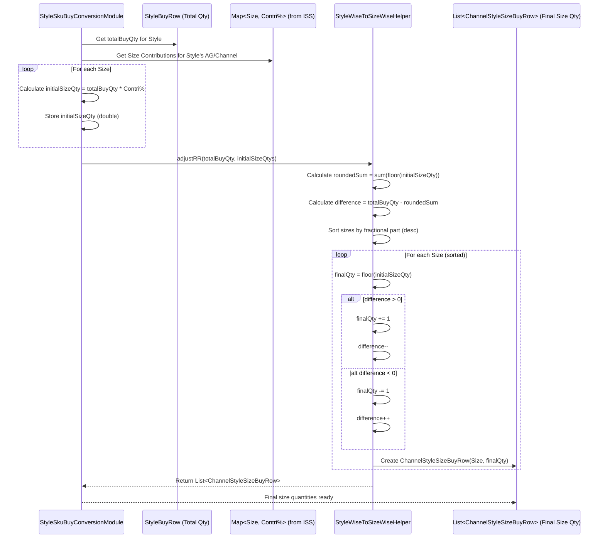

# Chapter 42: Style Wise to Size Wise Buy Module

Welcome back! In the [previous chapter](41_otb_style_wise_buy_module_.md), we figured out the final buy quantity for each *style* we want to purchase, ensuring our plan aligns with performance, strategy, and budget. We know we need to buy, say, 150 units of "Style 123: Red Cotton V-Neck".

But when we place the actual purchase order, the supplier needs to know how many of *each size* (Small, Medium, Large, XL, etc.) to send. How do we break down that total style quantity (150 units) into specific quantities for each size?

## What Problem Does This Module Solve?

Imagine you've decided to bake 12 cupcakes (your total style buy quantity). Now you need to decide how many should be chocolate, how many vanilla, and how many strawberry (the different sizes). You probably wouldn't make 4 of each. Based on past parties, you know chocolate is the most popular, followed by vanilla, and only a few people like strawberry. You'd use those past preferences (size contributions) to decide maybe 6 chocolate, 4 vanilla, and 2 strawberry cupcakes.

Similarly, for our "Style 123" T-shirt, we know size Medium and Large usually sell the most, while Small and XL sell fewer. We can't just divide the 150 units evenly. We need a way to split the total style buy quantity across the different sizes based on their **expected sales contribution**.

Furthermore, we might still have constraints:
*   Maybe the supplier has a minimum order quantity (MOQ) for the *entire category* (like all T-shirts), and our size-level plan needs to respect that overall total.
*   When we split 150 units using percentages, we might get fractions (like 52.5 units of Large). We need to round these to whole numbers and ensure the total *still* adds up exactly to 150.

The **Style Wise to Size Wise Buy Module** (orchestrated by `StyleWiseToSizeWiseGroupModule` and executed by `StyleSkuBuyConversionModule`) solves this final breakdown problem. It takes the total buy quantity planned for a style and intelligently distributes it across the individual SKUs (sizes) based on how much each size is expected to contribute to sales, while also handling adjustments for MOQs and rounding.

## Core Concepts

1.  **Size Contribution Percentages:** The most important input! This comes from the [Ideal Size Set (ISS) Module (ApIssGroupModule)](26_ideal_size_set__iss__module__apissgroupmodule__.md) analysis ([`StyleToSizeBuyFinalContriRow`](#relevant-code-snippets)). It tells us, for a specific product group (like AG 500) in a specific channel/store, what percentage of sales each size (S, M, L, XL) is expected to contribute (e.g., S: 10%, M: 40%, L: 35%, XL: 15%).
2.  **Proportional Allocation:** The basic idea is to multiply the total style buy quantity by each size's contribution percentage to get the initial quantity for that size.
    *   `Size Quantity = Total Style Quantity * Size Contribution %`
3.  **MOQ Adjustment (Category Level):** The provided code includes a check against category-level MOQs (`CategoryMoqRow`). If the initial calculated quantity for a specific *size* within a style falls below the MOQ defined for the *entire category* (which is a bit unusual, MOQ is usually per order/category total, but we follow the code's logic here), the code implements a specific adjustment: it removes the size failing the check and redistributes its quantity proportionally among the remaining sizes for that style. *(Note: This MOQ application seems specific; often MOQ applies to the sum, not individual size splits).*
4.  **Rounding and Round-Robin Adjustment:** Since multiplying by percentages often results in fractions, we need to round quantities to whole numbers. However, simple rounding might make the total size quantities not add up exactly to the original style quantity. A **round-robin adjustment** is used to fix this:
    *   Calculate the total quantity after simple rounding.
    *   Find the difference between the target style quantity and the rounded sum.
    *   Distribute this difference (usually just 1 or -1 unit per style after initial rounding) one unit at a time across the sizes, typically starting with the sizes that had the largest fractional parts removed or added during rounding. This ensures the final sum matches the target exactly.

## How It Works (The Process)

This module runs very late in the planning process, taking the style-level buy plan and producing the final size-level (SKU-level) buy plan.

**Inputs:**
*   **Style Buy Plan (`StyleBuyRow`):** Contains the final total buy quantity for each Channel-Style.
*   **Size Contributions (`StyleToSizeBuyFinalContriRow`):** Provides the percentage contribution for each size within a Channel-AG combination (from ISS).
*   **Category MOQ (`CategoryMoqRow`):** Minimum quantity rules potentially applied at the category level (used here to filter sizes).
*   **Product/Size Set Info:** [AgRow](16_agrow_.md), [StyleRow](09_row_input_output_classes__.md), [AgStyleRow](17_attribute_grouping__aggroupmodule___agcomputemodule__.md), available size sets (`catSizeSetsMap` from [Cache](05_cache_.md)).

**Calculation Steps (Simplified by `StyleSkuBuyConversionModule`):**
1.  **Load Data:** Read inputs (`StyleBuyRow`, `CategoryMoqRow`, `StyleToSizeBuyFinalContriRow`). Create necessary lookup maps (e.g., `styleBuyRowMap`, `catMoq`, `sizeWiseFinalContriRow`).
2.  **Calculate Initial Size Quantities (`createOutputChannelStyleSizeBuyRows`):**
    *   Iterate through each `StyleBuyRow`.
    *   Find the corresponding size contribution data (`StyleToSizeBuyFinalContriRow`) based on the style's Channel and Attribute Group (AG).
    *   For each size defined in the contribution data:
        *   Calculate the raw quantity: `pre_adj_qty = row.buy (Style Qty) * finalContriRow.finalContri (%)`.
        *   Store this in a temporary structure (`ChannelStyleSizeBuyPreAdjRow`), grouped by Channel-Style.
    *   Handle cases where no contribution data exists (e.g., zero sales) by creating zero-quantity rows for all available sizes in the category.
3.  **Adjust for Category MOQ (`moqAdjustementChannelStyleSizeBuy`):**
    *   Iterate through the pre-adjustment size quantities grouped by Channel-Style.
    *   Get the `moqValue` for the style's category.
    *   Use a helper (`StyleWiseToSizeWiseHelper.adjustMoq`) to iteratively remove sizes whose individual `pre_adj_qty` is less than `moqValue` and redistribute their quantity proportionally to the remaining sizes *for that style*. Store results in `ChannelStyleSizeBuyMoqAdjRow`. *(Again, note this specific MOQ logic)*.
4.  **Apply Round-Robin (`roundRobinAdj`):**
    *   Iterate through the MOQ-adjusted size quantities grouped by Channel-Style.
    *   Get the original target `buyQty` for the style.
    *   Use a helper (`StyleWiseToSizeWiseHelper.adjustRR`) to:
        *   Round the `moq_adj_qty` for each size down to the nearest integer.
        *   Calculate the sum of these integer quantities.
        *   Find the difference between the target `buyQty` and the rounded sum.
        *   Distribute this difference (usually small) one unit at a time across the sizes (typically starting with the ones that lost the largest fraction during rounding) until the sum exactly matches `buyQty`.
    *   Store the final integer quantity for each size in `ChannelStyleSizeBuyRow`.
5.  **Persist Outputs (`writeOutput`):** Save the final `ChannelStyleSizeBuyRow` list and generate/save user-friendly export formats (`ExportStyleWiseToSizeWiseRow`).

**Outputs:**
*   **`ChannelStyleSizeBuyRow`:** The primary output. Contains the final, integer buy quantity for each **Channel-Style-Size** combination, ready for PO generation.
    ```java
    // File: src/main/java/com/increff/irisx/row/output/StyleWiseToSizeWise/ChannelStyleSizeBuyRow.java
    package com.increff.irisx.row.output.StyleWiseToSizeWise;

    public class ChannelStyleSizeBuyRow {
        public String channel;
        public int style;    // Style ID
        public String size; // Size (e.g., "S", "M", "L")
        public int qty;      // <<< Final integer quantity to buy for this size
        public String remark; // Notes from the process (e.g., if zero sales)
    }
    ```
*   **`ExportStyleWiseToSizeWiseRow`:** A denormalized version for reporting, including brand, category, etc.
*   Intermediate results (`ChannelStyleSizeBuyPreAdjRow`, `ChannelStyleSizeBuyMoqAdjRow`) are also saved for debugging/analysis.

## Under the Hood: Allocation and Adjustments

The core logic revolves around proportional allocation and then carefully adjusting for MOQs (as implemented) and rounding.

**1. Proportional Allocation (`createOutputChannelStyleSizeBuyRows`):**
   This step directly applies the contribution percentages.

   ```java
   // Simplified from StyleSkuBuyConversionModule.java
   private void createOutputChannelStyleSizeBuyRows(List<StyleBuyRow> styleBuyRows, ...) {
       // Loop through each style we need to buy
       for (StyleBuyRow row : styleBuyRows) {
           int agId = /* ... find AG for this style ... */;
           // Get the size contribution map for this Channel-AG
           Key contriKey = new Key(row.channel, agId);
           List<StyleToSizeBuyFinalContriRow> contributions = sizeWiseFinalContriRow.get(contriKey);

           if (contributions == null) {
               // Handle case with no contribution data (e.g., zero sales)
               // Add zero-qty rows for all sizes in the cat
               channelStyleSizeBuyRowList.addAll(
                   StyleWiseToSizeWiseHelper.getZeroCategorySalesBuyRow(row, /*... catSizeSets ...*/)
               );
               continue;
           }

           // For each size with a contribution percentage...
           for (StyleToSizeBuyFinalContriRow finalContriRow : contributions) {
               // Calculate raw quantity = StyleBuyQty * SizeContri%
               double preAdjQty = finalContriRow.finalContri * row.buy; // finalContri is likely 0-1 scale

               // Store this pre-adjustment value
               ChannelStyleSizeBuyPreAdjRow preAdjRow = new ChannelStyleSizeBuyPreAdjRow();
               preAdjRow.channel = row.channel;
               preAdjRow.style = row.style;
               preAdjRow.size = finalContriRow.size;
               preAdjRow.pre_adj_qty = preAdjQty;
               // Add to map grouped by Channel-Style
               channelStyleSizeBuyPreMoqAdjRowMap
                   .computeIfAbsent(new Key(row.channel, row.style), k -> new ArrayList<>())
                   .add(preAdjRow);
           }
       }
   }
   ```
   **Explanation:** It loops through styles to buy. For each style, it finds the size contribution percentages from the `sizeWiseFinalContriRow` map (which holds ISS results). It then calculates the initial quantity for each size (`pre_adj_qty`) by multiplying the total style buy quantity (`row.buy`) by the size's contribution (`finalContriRow.finalContri`). These initial values are stored before MOQ and rounding adjustments.

**2. Round-Robin Adjustment (`StyleWiseToSizeWiseHelper.adjustRR`):**
   This helper ensures the final integer quantities sum correctly.

   ```java
   // Simplified from StyleWiseToSizeWiseHelper.java
   public static List<ChannelStyleSizeBuyRow> adjustRR(int targetBuyQty, List<ChannelStyleSizeBuyMoqAdjRow> moqAdjustedRows) {
       // 1. Calculate sum of integer parts after MOQ adjustment
       int sumOfFlooredQtys = moqAdjustedRows.stream()
                                   .mapToInt(d -> (int) d.moq_adj_qty) // Cast to int (floor)
                                   .sum();

       // 2. Calculate difference needed for exact total
       int difference = targetBuyQty - sumOfFlooredQtys;

       // 3. Sort rows descending by the *fractional part* lost during flooring
       //    (Highest fractional part gets priority for adding back units)
       moqAdjustedRows.sort(Comparator.comparingDouble(
           (ChannelStyleSizeBuyMoqAdjRow row) -> row.moq_adj_qty - Math.floor(row.moq_adj_qty)
       ).reversed());

       // 4. Distribute the difference (+ve or -ve) one unit at a time
       List<ChannelStyleSizeBuyRow> finalRows = new ArrayList<>();
       int remainderToDistribute = difference; // Can be positive or negative

       for (ChannelStyleSizeBuyMoqAdjRow row : moqAdjustedRows) {
           ChannelStyleSizeBuyRow finalRow = new ChannelStyleSizeBuyRow();
           // ... copy channel, style, size ...
           int baseQty = (int) row.moq_adj_qty; // Floored quantity
           int adjustment = 0;

           // Distribute positive difference (add units)
           if (remainderToDistribute > 0) {
               adjustment = 1;
               remainderToDistribute--;
           }
           // Distribute negative difference (remove units, less common if MOQ bumped up)
           else if (remainderToDistribute < 0 && baseQty > 0) { // Can only remove if qty > 0
               adjustment = -1;
               remainderToDistribute++;
           }

           finalRow.qty = baseQty + adjustment;
           finalRows.add(finalRow);
       }
       // Sanity check: log if remainderToDistribute is not zero
       return finalRows;
   }
   ```
   **Explanation:** This helper first calculates the sum of the integer parts of the quantities (`sumOfFlooredQtys`). It finds the `difference` needed to reach the `targetBuyQty`. It sorts the sizes based on the fractional amount lost during the integer conversion (highest fraction first). Then, it iterates through the sorted sizes, adding the integer part and distributing the `difference` one unit at a time (adding 1 if `difference > 0`, potentially subtracting 1 if `difference < 0`) until the difference is fully allocated. This ensures the final integer quantities sum exactly to the `targetBuyQty`.

**Sequence Diagram (Simplified: Percentage Split + Round-Robin):**



## Conclusion

The **Style Wise to Size Wise Buy Module** is the crucial final step in translating the OTB plan into a purchase order ready for suppliers.

*   It takes the total planned buy quantity for each **Style**.
*   It uses **Size Contribution Percentages** (from the ISS module) to proportionally allocate this quantity across the individual **Sizes** (SKUs).
*   It applies specific **MOQ adjustments** (as implemented, potentially filtering sizes).
*   It uses **Round-Robin Adjustments** to ensure the final integer quantities for sizes perfectly sum up to the original style quantity target.
*   The key output is the **`ChannelStyleSizeBuyRow`**, specifying the exact integer quantity to buy for each **Channel-Style-Size**, completing the buy plan at the most granular level.

This module ensures that the final purchase quantities align with expected sales patterns by size, adhere to constraints, and provide a precise list for procurement.

With the buy plan finalized down to the SKU level, what happens next? The inventory arrives, sales occur, and stock levels change. How does the system track the reduction (depletion) of the planned OTB budget as actual purchases are made?

[Next Chapter: OTB Depletion Module](43_otb_depletion_module_.md)

---

Generated by [AI Codebase Knowledge Builder](https://github.com/The-Pocket/Tutorial-Codebase-Knowledge)