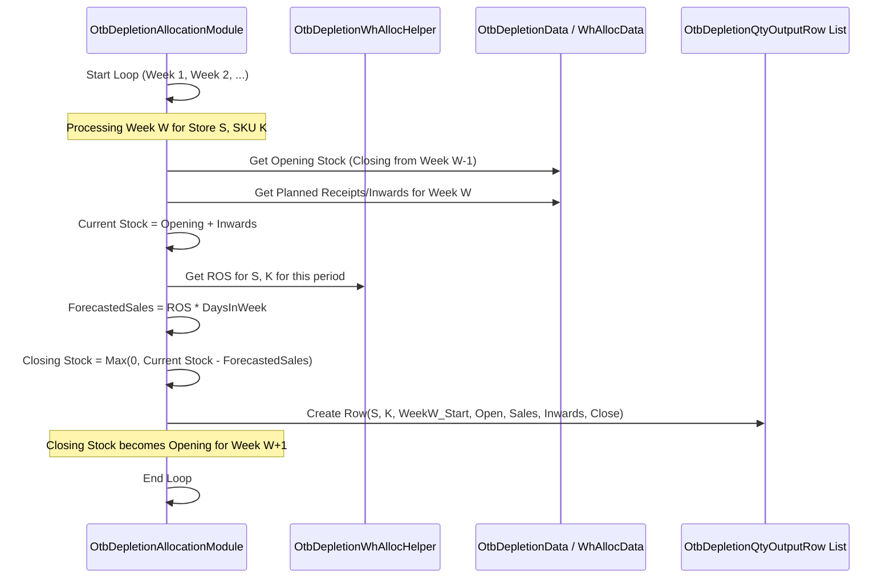

# Chapter 43: OTB Depletion Module

Welcome back! In the [previous chapter](42_style_wise_to_size_wise_buy_module_.md), we finalized our buy plan right down to the exact number of units for each size (`ChannelStyleSizeBuyRow`). We know what we need to order and when it should arrive (thanks to the [OTB Drop Calculation](40_otb_drop_calculation_.md)).

Now, imagine our plan is set, and the season begins. We bought inventory (our OTB plan), it starts arriving in stores, and customers start buying it. How do we keep track of how this carefully planned inventory is actually performing? Are we selling through it as expected? Are we likely to run out of a popular item too soon? Or is stock piling up for another item? We need a way to look into the near future and see how our inventory levels are expected to change based on our plan and predicted sales.

## What Problem Does This Module Solve?

Think of your OTB plan as the fuel you put in your car for a long road trip. You planned carefully based on the distance and expected mileage. Now, as you start driving, you want to monitor your fuel gauge and estimate how much fuel you'll have left after driving the next 50 miles, then the next 50, and so on. This helps you see if you're burning fuel faster or slower than expected and if you might need to refuel sooner or later than planned.

The **OTB Depletion Module** does something similar for our inventory. It takes the inventory we bought (based on the OTB plan) and simulates how it's expected to **deplete** (reduce) over time as sales occur.

It solves the problem of **monitoring inventory health against the plan**. By projecting future stock levels week by week (or sometimes month by month) for each product (SKU/style) in each store, it helps us:
*   See if we're selling faster or slower than planned (comparing projected stock to target stock).
*   Identify potential stock-outs (projected stock hitting zero too early).
*   Identify potential overstocks (projected stock remaining too high).
*   Make informed decisions about reordering more stock, cancelling future orders, or planning promotions/discounts.

It's like creating a forecast of your inventory's fuel gauge based on your starting fuel (opening stock + planned purchases) and your expected mileage (Rate of Sale - ROS).

## Core Concepts

1.  **Depletion:** The process of inventory reducing over time due to sales.
2.  **Projection/Simulation:** We are looking into the *future* (e.g., the next few weeks or months of the season) and *simulating* what we expect stock levels to be.
3.  **Rate of Sale (ROS):** How quickly do we expect items to sell? This is a crucial input, representing the forecasted sales rate per day or week for each SKU/style/store. This ROS might be calculated based on historical performance or other forecasting methods (e.g., by `OtbDepletionFirstMonthRosCalcModule`, `OtbDepletionPeriodRosCalcModule`).
4.  **Time Buckets:** The simulation usually happens in discrete time steps, typically weekly.
5.  **Stock Flow Calculation:** The core logic for each time step is similar to inventory calculation, but forward-looking:
    `Projected Closing Stock = Opening Stock + Planned Receipts (OTB Buy) - Forecasted Sales (ROS * Days)`

## How It Works (The Workflow)

The OTB Depletion process is managed by the `OtbDepletionGroupModule`, which coordinates several steps to perform the simulation.

**Orchestration by `OtbDepletionGroupModule`:**
This module defines the sequence of specialist modules needed for the depletion simulation:
1.  **Load Inputs (`OtbDepletionInputModule`):** Gathers necessary data like current stock levels (often implied from `WhStockRow`, `StoreStockRow`), the final OTB buy plan (`OtbDropStyleBuysRow` indicating planned receipts), lead times, ASP, etc.
2.  **Prepare Data (`OtbDepletionPrepareDataModule`, `OtbDepletionPrepareSalesModule`):** Cleans and organizes the input stock and potentially historical sales data.
3.  **Calculate ROS (`OtbDepletionFirstMonthRosCalcModule`, `OtbDepletionPeriodRosCalcModule`):** Determines the expected Rate of Sale (units per day/week) for each SKU/Store for the future periods being simulated. This might use historical averages or more complex forecasting logic.
4.  **Segmentation/Ranking (`OtbDepletionSegmentationModule`, `OtbDepletionComputeRevenueModule`, `OtbDepletionRankingModule`):** These modules analyze the products based on expected performance to potentially prioritize or apply different logic during the simulation (similar concepts to OD segmentation but applied to the forward-looking depletion).
5.  **Simulate Depletion (`OtbDepletionAllocationModule`):** This is the core engine. It iterates week by week, starting with current stock, adding planned incoming OTB quantities for that week, and subtracting the sales forecasted for that week (based on the calculated ROS). It tracks the projected stock levels.
6.  **Generate Outputs (`DepletionOutputsModule`):** Formats and saves the results, primarily the projected stock levels over time.

**Inputs:**
*   Current Inventory Levels (e.g., from `WhStockRow`, `StoreStockRow` representing the starting point).
*   Final Buy Plan broken down by drop (`OtbDropStyleBuysRow`, accessed via `OtbDepletionWhAllocData`).
*   Calculated Rate of Sale (ROS) per SKU/Store/Period (from `OtbDepletionPeriodRosCalcModule` output, stored in `OtbDepletionData`).
*   Store/Product Master Data ([Cache](05_cache_.md)).
*   Configuration ([`OtbDepletionArgs`](03_configuration___arguments__args_classes__.md)) defining the simulation duration, frequency (e.g., weekly), etc.

**Outputs:**
*   **`OtbDepletionQtyOutputRow`:** The key output. Records the projected inventory situation week by week (or for the defined frequency) for each SKU/Store. Includes opening stock, sales, planned inwards (from OTB), and projected closing stock.
    ```java
    // File: src/main/java/com/increff/irisx/row/output/depletion/OtbDepletionQtyOutputRow.java
    package com.increff.irisx.row.output.depletion;
    // ... imports ...

    // Holds the projected inventory status for a SKU/Store for a specific week
    public class OtbDepletionQtyOutputRow {
        public int store;
        public int sku;
        public LocalDate weekStartDate; // Start date of the simulation week
        public LocalDate weekEndDate;   // End date of the simulation week

        // --- Key Metrics ---
        public int openingQty;        // Projected stock at start of week
        public int salesQty;          // Forecasted sales during the week (ROS * Days)
        public int closingQty;        // Projected stock at end of week
        public int storeAlloc;        // Stock physically in store? (Context depends)
        public int storeInwards;      // Units arriving at store this week
        public int whAlloc;           // Stock allocated from WH? (Context depends)
        public int remWhStock;        // Remaining stock at Warehouse?
        public int whInwards;         // Units arriving at WH this week
        public int onlineReservationRequired; // Qty needed for online orders
        public int onlineReservationAchieved; // Qty available for online

        public PivotalTag sizeGroup; // Size Importance (P/NP/E)

        // Constructor and helper methods (like addWeekEnd, addSalesQty, etc.)
    }
    ```
*   Other outputs like `DenormDepletionOutputRow` and `ExportDepletionOutputRow` provide user-friendly views of the depletion forecast.
*   Outputs tracking stock levels before and after depletion (`OtbDepletionPreWhStockRow`, `OtbDepletionPostWhStoreStockRow`, etc.).

## Under the Hood: The Weekly Simulation Loop

The core of the simulation happens within the `OtbDepletionAllocationModule`. It iterates week by week over the defined depletion duration.

**Conceptual Steps within the Weekly Loop (for one Store-SKU):**
1.  **Get Opening Stock:** Start with the closing stock calculated from the *previous* week's simulation (or the actual current stock for the first week).
2.  **Add Planned Receipts:** Check the buy plan (`OtbDropStyleBuysRow`) to see if any units of this SKU are scheduled to arrive at the store (or warehouse, depending on the model) during *this* week. Add these units to the stock. (`addWhInwards`, `addStoreInwards` handle this).
3.  **Calculate Forecasted Sales:** Get the calculated Rate of Sale (ROS) for this SKU/Store for this period. Multiply ROS by the number of days in the week to get the forecasted sales quantity. (`whAllocHelper.getRosForStoreSkuMonth` is used, name implies monthly but logic uses it for the weekly simulation frequency).
4.  **Subtract Sales (Deplete):** Subtract the forecasted sales quantity from the current stock level. Ensure stock doesn't go below zero. (`depleteWarehouseStock` performs this, calculating `salesQty` and `closingStock`).
5.  **Record Results:** Store the opening stock, forecasted sales, inwards, and calculated closing stock for this week in an `OtbDepletionQtyOutputRow`.
6.  **Next Week:** The calculated closing stock becomes the opening stock for the *next* week's simulation.
7.  **Repeat:** Continue for the duration specified in the configuration.

**Sequence Diagram (Simplified Weekly Simulation for one SKU):**



**Code Dive (`OtbDepletionAllocationModule.java`):**

The `runDepletion` method orchestrates the loop, and `depleteWarehouseStock` performs the core calculation for a week.

*   **The Loop (`runDepletion`):**
    ```java
    // Simplified from OtbDepletionAllocationModule.java
    private void runDepletion(Properties props) {
        // ... initialization ...
        LocalDate startDate = commonArgs.endDate; // Start from current date
        LocalDate endDate = commonArgs.endDate.plusDays(otbDepletionArgs.depletionDuration);

        // Loop week-by-week (or by whAllocFreq) until simulation end date
        while (endDate.isAfter(startDate)) {
            logger.info("Depleting warehouse stock for week starting on " + startDate);
            int periodForDate = commonData.getInputPeriodForDate(startDate);
            commonData.setCurrentPeriod(periodForDate);

            // 1. Add Store Inwards scheduled for this week
            addStoreInwards(startDate, storeInwardsInLastWeek);

            // 2. Deplete stock based on ROS forecast for this week
            depleteWarehouseStock(startDate, whInwardsInLastWeek, storeInwardsInLastWeek);

            // 3. Add WH Inwards scheduled for this week (affects next week's start)
            addWhInwards(startDate, whInwardsInLastWeek);

            // Move to the start of the next simulation step
            startDate = LocalDateProvider.plusDays(startDate, otbDepletionArgs.whAllocFreq);
        }
        // ... handle final stock distribution if needed ...
    }
    ```
    **Explanation:** This method sets up the start and end dates for the simulation. The `while` loop iterates, advancing `startDate` by the allocation frequency (e.g., 7 days) each time. Inside the loop, it calls methods to handle inwards arriving *during* the week and the core `depleteWarehouseStock` function to simulate sales for that week.

*   **Weekly Depletion Calculation (`depleteWarehouseStock`):**
    ```java
    // Simplified from OtbDepletionAllocationModule.java
    private void depleteWarehouseStock(LocalDate date, /*...inwards maps...*/) {
        // Loop through all Store-Style combinations being tracked
        whAllocData.getStoreStyles().forEach(storeStyle -> {
            // Loop through each SKU within the style
            storeStyle.getSkuAllocationMap().forEach((sku, allocation) -> {
                // Get current total stock (Store + WH allocation for this store)
                int openingStockTotal = allocation.getStoreAllocation() + allocation.getWhAllocation();
                if (openingStockTotal <= 0) return; // Skip if no stock

                // Calculate forecasted sales for this week
                // Uses ROS and the frequency (e.g., 7 days)
                double currDepletedQty = whAllocHelper.getRosForStoreSkuMonth(storeStyle.getStore(), sku)
                                          * otbDepletionArgs.whAllocFreq;

                // Adjust based on previous week's rounding difference
                double prevDepletedQty = storeSkuDepletedQtyMap.getOrDefault(new Key(storeStyle.getStore(), sku), 0.0);
                double totalDepletedQty = Math.min(prevDepletedQty + currDepletedQty, openingStockTotal);
                int salesQty = (int) Math.round(totalDepletedQty); // Round forecasted sales

                // Calculate closing stock
                int closingStock = openingStockTotal - salesQty;

                // Get inwards that arrived this week (loaded by addStoreInwards/addWhInwards)
                int storeInwards = storeInwardsInLastWeek.getOrDefault(new Key(storeStyle.getStore(), sku), 0);
                int whInwards = /* ... get relevant whInwards ... */;

                // Create the output row for this week
                OtbDepletionQtyOutputRow outputRow = new OtbDepletionQtyOutputRow(storeStyle.getStore(), sku, date);
                outputRow.addOpeningQty(openingStockTotal); // Approx opening for week
                outputRow.addSalesQty(salesQty);
                outputRow.addClosingQty(closingStock + storeInwards); // Closing includes inwards
                // ... add other details like wh stock, inwards, etc. ...
                otbDepletionData.addToDepletionOutputRow(outputRow);

                // Reset allocation for next week & store rounding difference
                resetSkuAllocation(allocation);
                storeSkuDepletedQtyMap.put(new Key(storeStyle.getStore(), sku), totalDepletedQty - salesQty);

                // Add remaining stock back for next week's calculation
                if (closingStock > 0)
                    whAllocData.addSkuStoreStock(storeStyle.getStore(), sku, closingStock);
            });
        });
        // Clear weekly inwards maps
        whInwardsInLastWeekMap.clear();
        storeInwardsInLastWeek.clear();
    }
    ```
    **Explanation:** This function iterates through each Store-SKU. It gets the total `openingStockTotal` available at the start of the week. It calculates the forecasted `salesQty` for the week using the helper `getRosForStoreSkuMonth` (which retrieves the pre-calculated ROS) and the simulation frequency (`whAllocFreq`). It then calculates the `closingStock` and records all these metrics (along with weekly inwards) in the `OtbDepletionQtyOutputRow`. The closing stock is then used to update the inventory level (`whAllocData.addSkuStoreStock`) ready for the next week's iteration. Rounding differences are tracked (`storeSkuDepletedQtyMap`) to improve accuracy over multiple weeks.

## Conclusion

The **OTB Depletion Module**, managed by `OtbDepletionGroupModule`, simulates how the planned and purchased inventory is expected to decrease over time due to forecasted sales.

*   It acts like a **future inventory monitor**, projecting weekly stock levels based on opening stock, planned receipts (from the OTB buy plan), and expected Rate of Sale (ROS).
*   The core logic resides in `OtbDepletionAllocationModule`, which runs a **week-by-week simulation**.
*   It calculates `Projected Closing Stock = Opening Stock + Planned Receipts - Forecasted Sales (ROS * Days)`.
*   The key output is **`OtbDepletionQtyOutputRow`**, providing a time-phased view of expected inventory levels, crucial for monitoring plan health, identifying potential stock-outs or overstocks, and informing replenishment or markdown decisions.

This simulation provides valuable visibility into how the current buy plan is expected to perform throughout the season. What happens if this simulation shows we're likely to run out of a key item? That's where reordering comes in.

[Next Chapter: Reordering Module](44_reordering_module_.md)

---

Generated by [AI Codebase Knowledge Builder](https://github.com/The-Pocket/Tutorial-Codebase-Knowledge)