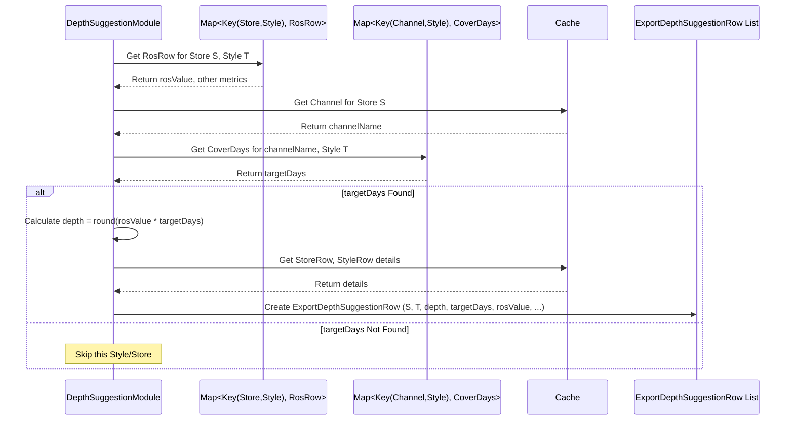

# Chapter 45: Depth Suggestion Module

Welcome back! In the [previous chapter](44_reordering_module_.md), we explored the **Reordering Module**, which helps automate the process of ordering more stock for important NOOS items to prevent stock-outs. It calculates *how much to reorder* (`reorderQty`) based on things like Rate of Sale (ROS), lead time, and safety stock.

That tells us the quantity needed for a *specific reorder event*. But sometimes, especially when planning initial stock levels or ongoing replenishment targets, we need a simpler, more direct recommendation: "Based on how fast this item sells, how many units should we ideally aim to keep on hand to cover the next X days?" This target quantity per item is often called the inventory **"depth"**.

## What Problem Does This Module Solve?

Imagine you've figured out your weekly grocery list (your reorder plan). You know you need to buy more coffee beans because you're running low. The reorder calculation tells you to buy one 12oz bag. But you also have a general goal: you always want to have enough coffee beans in your pantry to last for at least 7 days, just in case you can't get to the store next week. How many ounces does that 7-day supply represent?

To figure that out, you need two things:
1.  How many ounces of coffee do you use per day (your Rate of Sale)?
2.  How many days of supply do you want to cover (your Target Cover Days)?

If you use 1oz per day and want 7 days of cover, your target depth is 1oz/day * 7 days = 7 ounces.

Similarly, in retail replenishment, buyers or planners often need a quick suggestion for the target stock level (depth) for each SKU (Style + Size) or Style in a store. They might think in terms of "days of cover": "For this category of T-shirts in this channel, let's aim to keep 14 days' worth of stock."

The **Depth Suggestion Module** solves this problem. It provides a straightforward recommendation for the target inventory depth (quantity per SKU or Style) based on two key inputs:
*   The calculated **Rate of Sale (ROS)** for the item.
*   A configured **Target Cover Days** value.

It essentially answers the question: "If this item sells at rate X, how many units do I need to cover Y days?" This suggestion is particularly useful for setting initial stock targets or guiding replenishment decisions.

## Core Concepts

1.  **Depth:** The quantity of a specific item (often SKU, but sometimes Style) you aim to have in stock.
2.  **Rate of Sale (ROS):** How many units of the item sell per day, on average. This is a key input, typically calculated by other modules like the [OTB Depletion Module](43_otb_depletion_module_.md) or specific ROS calculation modules. The `DepthSuggestionModule` often uses a recent ROS calculation (e.g., from the last month).
3.  **Target Cover Days:** A configurable parameter specifying how many days of future sales the inventory level should ideally cover. This is a strategic input, often set differently for various channels or product categories (e.g., 21 days for online core items, 14 days for store fashion items). This information comes from the `DepthSuggestionCoverDaysRow` input.
4.  **Depth Suggestion Formula:** The core calculation is very simple:
    `Suggested Depth = Rate of Sale (units/day) * Target Cover Days`

## How It Works (The Workflow)

This module typically runs after the Rate of Sale (ROS) has been calculated for the relevant items and periods. It's often part of a broader planning or replenishment calculation cycle.

**Inputs:**
*   **Calculated Rate of Sale (ROS):** Per Style or SKU, per Store or Channel. Often uses ROS calculated over a recent period (e.g., last 30 days). This data usually comes from `OtbDepletionStyleRosRow` (generated by OTB Depletion ROS calculation steps) via the `DepthSuggestionData` helper.
*   **Target Cover Days Configuration (`DepthSuggestionCoverDaysRow`):** Specifies the desired cover days for different Channel-Style combinations.
    ```java
    // File: src/main/java/com/increff/irisx/row/input/depthSuggestion/DepthSuggestionCoverDaysRow.java
    package com.increff.irisx.row.input.depthSuggestion;

    public class DepthSuggestionCoverDaysRow {
        public String channel; // e.g., "ONLINE", "RETAIL", or "" for all
        public int style;     // Style ID (parent style if hierarchy exists)
        public int coverDays; // Target number of days to cover
    }
    ```
    *Example Input:*
    | channel | style | coverDays |
    | :------ | :---- | :-------- |
    | ONLINE  | 123   | 21        | *(Cover 21 days for Style 123 Online)*
    | RETAIL  | 123   | 14        | *(Cover 14 days for Style 123 Retail)*
    | ""      | 456   | 10        | *(Cover 10 days for Style 456 in ALL channels)*

*   **Product & Store Master Data:** ([Cache](05_cache_.md)) needed to link styles, categories, stores, and channels.

**Calculation Steps (`DepthSuggestionModule.runInternal`):**
1.  **Load Inputs:** Read the `DepthSuggestionCoverDaysRow` data and create a lookup map (`channelStyleTargetMap`). Load the pre-calculated ROS data (`styleRosRowsMap`). Define the ROS period (`rosDays` from `DepthSuggestionArgs`).
2.  **Calculate Depth (`calculateDepth`):**
    *   Iterate through the `styleRosRowsMap` (which contains ROS per Store-Style).
    *   For each Store-Style:
        *   Get the calculated `ros` (units/day).
        *   Find the applicable `targetDays` from the `channelStyleTargetMap` based on the store's channel and the style ID.
        *   If target days are found, calculate `depth = round(ros * targetDays)`.
        *   Create an `ExportDepthSuggestionRow` containing the store, style, calculated depth, target days, ROS, etc.
        *   Handle "new stores" by copying suggestions from their designated reference stores.
3.  **Persist Output:** Save the list of `ExportDepthSuggestionRow` objects.

**Outputs:**
*   **`ExportDepthSuggestionRow`:** The primary output. Each row provides the suggested inventory depth for a specific Store-Style combination.
    ```java
    // File: src/main/java/com/increff/irisx/row/output/depthSuggestion/ExportDepthSuggestionRow.java
    package com.increff.irisx.row.output.depthSuggestion;

    import com.increff.irisx.constants.otb.OtbRosRollupLevel;

    // Output row holding the suggested depth
    public class ExportDepthSuggestionRow {
        public String channel;
        public String storeCode;
        public String category;
        public String subcategory;
        public String styleCode;

        public OtbRosRollupLevel rollUpLevel; // How ROS was calculated
        public int target;         // <<< Target Cover Days used
        public int depth;          // <<< Calculated Suggested Depth (Qty)
        public int liveDays;       // Live days during ROS period
        public int salesQty;       // Sales qty during ROS period
        public double styleRos;     // ROS value used (units/day)

        public ExportDepthSuggestionRow() { /*...*/ }
    }
    ```
This output gives planners a concrete target quantity for each style in each store, based on desired coverage and recent sales velocity.

## Under the Hood: Applying the Formula

The module's core logic is straightforward: load the inputs (ROS and Target Cover Days) into efficient maps and then iterate through the items, applying the `Depth = ROS * TargetDays` formula.

**1. Preparing Inputs (`runInternal`, `createDepthTargetMap`, `getRosMap`):**
   The module first needs to prepare its two main ingredients.

   *   **Target Cover Days Map:** Reads `DepthSuggestionCoverDaysRow` and creates a map for quick lookup.
     ```java
     // Simplified from DepthSuggestionModule.createDepthTargetMap()
     private Map<Key, Integer> channelStyleTargetMap; // Key(Channel, Style) -> CoverDays

     private void createDepthTargetMap() {
         channelStyleTargetMap = new HashMap<>();
         // Loop through the input configuration rows
         for (DepthSuggestionCoverDaysRow row : db().select(DepthSuggestionCoverDaysRow.class)) {
             int style = cache.getStyleParent(row.style); // Use parent style ID
             // If channel is blank, apply to all channels
             if (row.channel.equals("")) {
                 for (String channel : cache.getAllChannels()) {
                     channelStyleTargetMap.put(new Key(channel, style), row.coverDays);
                 }
             } else { // Apply to the specified channel
                 channelStyleTargetMap.put(new Key(row.channel, style), row.coverDays);
             }
         }
     }
     ```
     **Explanation:** This reads the configuration file specifying target cover days. It creates a `Map` where the key combines the Channel and Style ID, and the value is the target number of cover days. It handles parent styles and applying rules to all channels if specified.

   *   **Rate of Sale (ROS) Map:** This module typically *retrieves* ROS calculated by a previous module (like OTB Depletion ROS steps). The code shows it potentially recalculating or refining ROS based on recent sales within a specific duration (`rosDays`). Let's assume `styleRosRowsMap` (Key: Store, Style -> `OtbDepletionStyleRosRow` which contains the ROS value) is populated correctly.
     ```java
     // Simplified flow assuming ROS map is populated by dependency or initial step
     // Map<Key, OtbDepletionStyleRosRow> styleRosRowsMap; // Populated earlier

     // In runInternal():
     // Load necessary sales data within the rosDays duration
     // Map<Key, Integer> saleQtyMap = getSaleQtyMap(...);
     // Call ROS calculation logic (potentially using RollUpRosHelper)
     // getRosMap(startDate, endDate, saleQtyMap); // Populates styleRosRowsMap
     ```
     **Explanation:** The module ensures it has the necessary ROS data (units/day) for each Store-Style combination, stored in `styleRosRowsMap`. This might involve loading pre-calculated data or running a calculation based on recent sales (`saleQtyMap`) and availability ([View](10_view_.md) helper used within `getRosMap`).

**2. Calculating Depth (`calculateDepth`):**
   This is the core loop where the formula is applied.

   ```java
   // Simplified from DepthSuggestionModule.calculateDepth()
   private void calculateDepth() {
       ArrayList<ExportDepthSuggestionRow> exportDepthSuggestionRows = new ArrayList<>();
       // Loop through each Store-Style combination that has a calculated ROS
       styleRosRowsMap.forEach((key, styleRosRow) -> {
           int store = (int) key.part(0);
           // Skip new stores initially (handled later by copying from ref store)
           if (cache.isNewStore(store)) return;

           int style = (int) key.part(1);
           StoreRow storeRow = cache.getStoreRow(store);
           StyleRow styleRow = cache.getStyleRow(style); // Needed for output info
           if (storeRow == null || styleRow == null) return; // Skip if master data missing

           // Get the calculated ROS (units/day)
           double ros = styleRosRow.styleRos;

           // Find the target cover days for this Channel-Style
           Integer targetDays = channelStyleTargetMap.get(new Key(storeRow.channel, style));

           // If no target is defined, skip this style
           if (targetDays == null) return;

           // --- Apply the Core Formula ---
           int depth = (int) Math.round(ros * targetDays);

           // Create the output row
           ExportDepthSuggestionRow exportRow = getExportDepthSuggestionRow(
                                                   styleRosRow, styleRow, storeRow, depth, targetDays);
           exportDepthSuggestionRows.add(exportRow);

           // If this is a reference store, copy the suggestion to its new stores
           if (cache.isRefStore(store)) {
               exportDepthSuggestionRows.addAll(
                   copyValueToNewStore(exportRow, /* Get new stores linked to ref store */)
               );
           }
       });

       // Persist the results
       db().truncateInsert(ExportDepthSuggestionRow.class, exportDepthSuggestionRows);
       db().persistTable(ExportDepthSuggestionRow.class);
   }

   // Helper to create the output row
   private ExportDepthSuggestionRow getExportDepthSuggestionRow(
       OtbDepletionStyleRosRow rosRow, StyleRow styleRow, StoreRow storeRow, int depth, int targetDays) {
       ExportDepthSuggestionRow exportRow = new ExportDepthSuggestionRow();
       // Populate fields like channel, storeCode, category, styleCode...
       exportRow.channel = storeRow.channel;
       exportRow.storeCode = storeRow.storeCode;
       exportRow.category = styleRow.cat;
       exportRow.styleCode = styleRow.styleCode;
       // ... other descriptive fields ...
       exportRow.target = targetDays;   // Target Cover Days
       exportRow.depth = depth;       // <<< Calculated Depth
       exportRow.styleRos = rosRow.styleRos; // ROS used
       exportRow.liveDays = rosRow.liveDays; // Info from ROS calc
       exportRow.salesQty = rosRow.qty;    // Info from ROS calc
       return exportRow;
   }
   ```
   **Explanation:** The code iterates through the `styleRosRowsMap`. For each Store-Style, it retrieves the `ros`. It looks up the `targetDays` from the `channelStyleTargetMap`. If found, it calculates `depth = round(ros * targetDays)`. It then creates the `ExportDepthSuggestionRow`, populating it with the calculated `depth`, the `targetDays` and `ros` used, and other descriptive information. It also includes logic to handle new stores by copying suggestions from reference stores. Finally, it saves the list of suggestions.

**Sequence Diagram (Calculating Depth for one Style):**



## Conclusion

The **Depth Suggestion Module** provides a direct recommendation for target inventory levels based on sales velocity and desired coverage duration.

*   It calculates a suggested **depth** (quantity) for each Store-Style combination.
*   It uses a simple formula: **`Suggested Depth = Rate of Sale (ROS) * Target Cover Days`**.
*   It relies on pre-calculated **ROS** data (often from OTB Depletion steps) and configurable **Target Cover Days** (`DepthSuggestionCoverDaysRow`).
*   The output (`ExportDepthSuggestionRow`) gives planners a clear target quantity to aim for, useful for setting stock levels in replenishment scenarios or initial buys.

This module offers a practical way to translate sales speed and strategic coverage goals into tangible inventory targets.

Now that we have calculated the OTB (how much to buy), potentially refined it with reordering logic, and possibly generated target depth suggestions, the final major step in inventory management is often **Distribution**: How do we physically allocate the inventory we have (or are about to receive) to the right stores or channels?

[Next Chapter: Distribution Module](46_distribution_module_.md)
```

---

Generated by [AI Codebase Knowledge Builder](https://github.com/The-Pocket/Tutorial-Codebase-Knowledge)