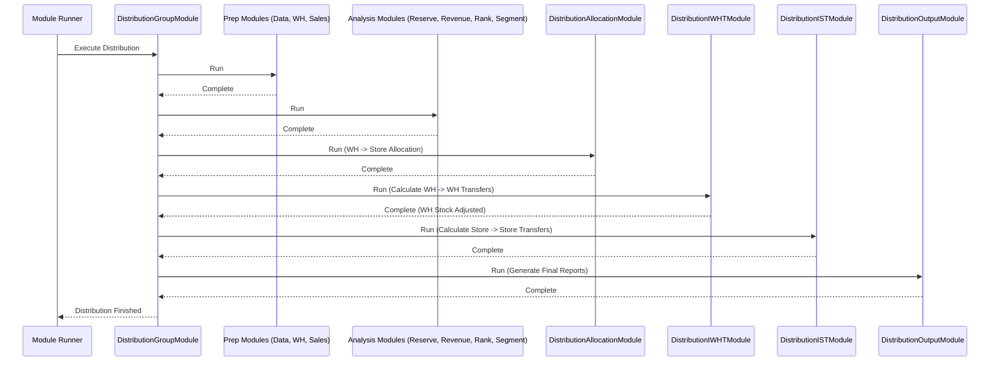
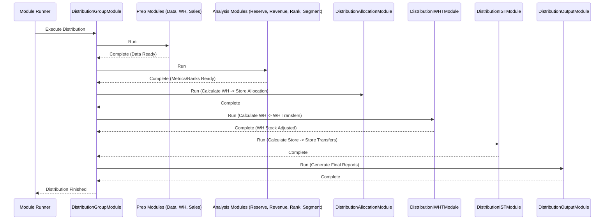

# Chapter 46: Distribution Module

Welcome back! In the [previous chapter](45_depth_suggestion_module_.md), we saw how the **Depth Suggestion Module** can recommend a target stock level (depth) for our products based on their Rate of Sale and desired coverage days.

So far, we've done a lot of planning: identifying NOOS items, deciding the ideal sizes (ISS), understanding performance (OD), setting assortment width (OW), determining the budget and buy quantities (OTB), and even forecasting future stock levels (Depletion). Now comes a very practical question: **How do we get the right products to the right place at the right time?**

We have inventory sitting in warehouses, and we have stores that need specific products based on our plans and customer demand. How do we decide exactly how much of each specific product (SKU) should be sent from the warehouses to each store? What if one store has too much of something another store needs? What if one warehouse is running low on an item that another warehouse has plenty of?

## What Problem Does This Module Solve?

Imagine you're a central dispatcher for a large pizza chain. You have several central kitchens (warehouses) making pizzas, and dozens of delivery outlets (stores) selling them. Each outlet has different customer demands (some sell more pepperoni, others more veggie). You also know how much inventory (pizzas) each kitchen has and how much each outlet currently holds.

Your job is to figure out:
*   How many pepperoni pizzas should Kitchen A send to Outlet 1?
*   Should Outlet 5 send some extra veggie pizzas to Outlet 7, which just ran out (an Inter-Store Transfer, IST)?
*   Should Kitchen B send a bulk supply of pizza dough to Kitchen C, which is running low (an Inter-Warehouse Transfer, IWHT)?

Manually coordinating these movements for hundreds of products (pizza types + sizes) across many locations is incredibly complex. You need an automated system to make these allocation and transfer decisions efficiently based on inventory levels, sales forecasts, store needs, and business priorities.

The **Distribution Module** (orchestrated by `DistributionGroupModule`) is this automated logistics coordinator for `irisx-algo`. It takes all the relevant information – current inventory levels everywhere, sales forecasts (like Rate of Sale), product/store priorities, planogram space constraints, and potentially specific "stories" or promotions – and runs a series of calculations to determine the optimal movement of inventory across the network. It decides how much of each SKU should be sent from warehouses to stores, potentially moved between stores (IST), or moved between warehouses (IWHT).

## Core Concepts

Distribution involves several key ideas:

1.  **Inventory Allocation:** The primary goal is deciding how to distribute available warehouse stock to meet store needs.
2.  **Store Need:** This isn't just about filling empty space. Need is calculated based on:
    *   **Sales Forecast (ROS):** How much is expected to sell in the near future?
    *   **Target Stock/Presentation Stock:** How much *should* the store ideally hold (based on planogram, desired cover days, safety stock)?
    *   **Current Stock:** How much does the store already have?
    *   **Need = Target Stock - Current Stock (+ maybe future sales cover)**
3.  **Prioritization (Ranking):** Not all stores or products are equal. The system often ranks stores and products based on performance or strategic importance. High-priority stores/products might get inventory allocated first.
4.  **Constraints:** Allocation must respect limits:
    *   **Warehouse Availability:** You can't send more than what the warehouse has.
    *   **Planogram Capacity:** Stores have limited shelf space.
    *   **Pack Sizes:** Items might need to be shipped in specific case pack sizes.
5.  **Allocation Iterations:** The process often happens in stages or iterations, addressing different needs:
    *   **Top Sellers:** Prioritize getting best-selling items to high-performing stores.
    *   **Replenishment:** Fulfill basic stock needs based on sales forecasts.
    *   **Planogram Filling:** Ensure minimum display quantities are met.
    *   **Non-Pivotal Sizes:** Allocate stock for less critical sizes if inventory allows.
6.  **Transfers:**
    *   **Inter-Store Transfer (IST):** Moving stock *between* stores to balance inventory (e.g., sending from an overstocked store to an understocked one).
    *   **Inter-Warehouse Transfer (IWHT):** Moving stock *between* warehouses, often to position inventory closer to regions with higher demand.

## The Orchestrator (`DistributionGroupModule`)

Calculating the optimal distribution involves many steps and complex logic. The `DistributionGroupModule` acts as the **main coordinator** for this entire process. It doesn't perform the specific allocation math itself but ensures that all the necessary specialist modules run in the correct sequence.

The typical flow managed by `DistributionGroupModule` includes:

1.  **Prepare Data (`DistributionPrepareDataModule`, `DistributionPrepareWhInventoryModule`, `DistributionPrepareSalesModule`):** Load current inventory (warehouse, store, in-transit), sales history, planogram data, store/product rankings, etc.
2.  **Reserve Warehouse Stock (`DistributionReserveWarehouseModule`):** Handle specific reservations or holds on warehouse inventory.
3.  **Calculate Performance/Ranking (`DistributionComputeRevenueModule`, `DistributionRankingModule`):** Calculate recent performance metrics used for prioritization.
4.  **Segment Stores/Products (`DistributionSegmentationModule`):** Classify stores or products based on performance to guide allocation logic.
5.  **Core Allocation (`DistributionAllocationModule`):** The main engine that runs through allocation iterations (Top Sellers, Replenishment, etc.) to determine warehouse-to-store quantities.
6.  **Inter-Warehouse Transfer (`DistributionInterWarehouseTransferModule`):** Calculates optimal stock movements between warehouses.
7.  **Update Warehouse Inventory (`DistributionComputeWhInventoryModule`):** Recalculates available warehouse stock after IWHT moves.
8.  **Inter-Store Transfer (`DistributionInterStoreTransferModule`):** Calculates optimal stock movements between stores.
9.  **Generate Outputs (`DistributionOutputModule`):** Consolidates all allocation and transfer decisions into final output files.

## How It Works (The Workflow)

You run `DistributionGroupModule` when you need to generate allocation plans, typically on a regular basis (e.g., daily or weekly) as new inventory arrives or sales occur.

**Inputs:**
*   Current Inventory Data: Warehouse stock, store stock, goods-in-transit.
*   Sales Forecasts / Rate of Sale (ROS).
*   Planogram Data (`PlanogramRow`).
*   Store & Product Master Data ([Cache](05_cache_.md)).
*   Store/Product Rankings & Priorities.
*   Output from previous planning steps (like OD segmentation, NOOS status).
*   Configuration ([`DistributionArgs`](03_configuration___arguments__args_classes__.md), `IstArgs`).

**Outputs:**
The module generates several outputs detailing the planned inventory movements:
*   **`DistOutputRow` / `DenormDistParentAllocRow`:** Shows the final quantity allocated from warehouses to stores for each SKU/Style.
*   **`IstOutputRow` / `ExportIstStoreOutputRow`:** Details recommended Inter-Store Transfers (which SKU, how many units, from which store, to which store).
*   **`IwhtOutputRow`:** Details recommended Inter-Warehouse Transfers.
*   Remarks and summary reports (`DenormDistRemarksRow`, `ExportDistStoreAgOutputRow`).

These outputs are used by warehouse management systems (WMS) and store operations teams to execute the physical movement of goods.

## Under the Hood

**1. Orchestration (`DistributionGroupModule.java`):**
   This class defines the sequence of the distribution process.

```java
// File: src/main/java/com/increff/irisx/module/DistributionGroupModule.java
package com.increff.irisx.module;

import com.increff.irisx.module.distribution.*; // Import distribution sub-modules
import org.springframework.beans.factory.annotation.Autowired;
import org.springframework.beans.factory.annotation.Qualifier;
import org.springframework.stereotype.Component;
import javax.annotation.PostConstruct;

@Component
public class DistributionGroupModule extends AbstractUtilModuleGroup {

    // Inject all the necessary sub-modules for distribution
    @Autowired private DistributionPrepareDataModule distributionPrepareData;
    @Autowired private DistributionPrepareWhInventoryModule distributionPrepareWhInventory;
    @Autowired private DistributionReserveWarehouseModule distributionReserveWarehouseModule;
    @Autowired private DistributionPrepareSalesModule distributionPrepareSales;
    @Autowired private DistributionComputeRevenueModule distributionComputeRevenue;
    @Autowired private DistributionRankingModule distributionRanking;
    @Autowired private DistributionSegmentationModule distributionSegmentation;
    @Autowired @Qualifier("distributionAllocation") // Specific qualifier might be needed
    private DistributionAllocationModule distributionAllocation;
    @Autowired private DistributionInterWarehouseTransferModule distributionInterWarehouseTransferModule;
    @Autowired private DistributionComputeWhInventoryModule distributionComputeWhInventory;
    @Autowired private DistributionInterStoreTransferModule distributionInterStoreTransfer;
    @Autowired private DistributionOutputModule distributionOutputModule;
    // Standard snapshot/sync modules
    @Autowired private UtilOutputSnapshotModule utilOutputSnapshotModule;
    @Autowired private UtilOutputSyncModule utilOutputSyncModule;

    @PostConstruct // Run after creation
    public void init() {
        captureSnapshot();       // Standard step
        // --- Define the Distribution execution order ---
        add(distributionPrepareData);           // 1. Prep Base Data
        add(distributionPrepareWhInventory);    // 2. Prep WH Inventory
        add(distributionReserveWarehouseModule);// 3. Handle Reservations
        add(distributionPrepareSales);          // 4. Prep Sales Data
        add(distributionComputeRevenue);        // 5. Calculate Revenue Metrics
        add(distributionRanking);               // 6. Rank Items/Stores
        add(distributionSegmentation);          // 7. Segment Items/Stores
        add(distributionAllocation);            // 8. << Core WH->Store Allocation >>
        add(distributionInterWarehouseTransferModule); // 9. Calculate IWHT
        add(distributionComputeWhInventory);    // 10. Update WH Stock post-IWHT
        add(distributionInterStoreTransfer);    // 11. Calculate IST
        add(distributionOutputModule);          // 12. Generate Final Outputs
        uploadOutput();          // Standard step
    }

    // Standard methods inherited to add snapshot/sync steps
    @Override public void captureSnapshot() { add(utilOutputSnapshotModule); }
    @Override public void uploadOutput() { add(utilOutputSyncModule); }
}
```
**Explanation:** The `init()` method meticulously defines the sequence of operations, starting with data preparation, moving through analysis and ranking, performing the core allocation, calculating inter-warehouse and inter-store transfers, and finally generating the outputs. `DistributionGroupModule` ensures this complex workflow executes correctly.

**Sequence Diagram (High-Level Flow):**


**2. Key Logic Sneak Peek:**
   The detailed logic for how allocation decisions are made resides within the sub-modules, especially `DistributionAllocationModule`, `DistributionInterWarehouseTransferModule`, and `DistributionInterStoreTransferModule`. We will explore these in the upcoming chapters. They typically involve:
   *   Calculating store needs based on ROS, target stock, and current stock.
   *   Iterating through ranked stores/products.
   *   Checking warehouse availability.
   *   Allocating stock based on need, priority, and availability, potentially using iterative loops until stock runs out or needs are met.
   *   Applying constraints like planogram capacity or pack sizes.

## Conclusion

The **Distribution Module**, orchestrated by `DistributionGroupModule`, is the central coordinator for planning the physical movement of inventory across the supply chain network.

*   It aims to get the **right product to the right place (store/warehouse) at the right time** by calculating optimal **allocations** (Warehouse->Store) and **transfers** (Store->Store, Warehouse->Warehouse).
*   It considers numerous inputs like **current stock, sales forecasts (ROS), store needs, product/store priorities, planogram limits, and other constraints**.
*   `DistributionGroupModule` manages a complex sequence of specialized modules for **data preparation, analysis, ranking, allocation, and transfer calculations**.
*   The final outputs provide actionable plans (`DistOutputRow`, `IstOutputRow`, `IwhtOutputRow`) used by logistics and store teams to execute inventory movements.

This module is critical for ensuring that the inventory purchased based on the OTB plan actually reaches the locations where it's most likely to sell, maximizing sales and minimizing stock imbalances.

To understand how distribution works, we first need to prepare the necessary data. Let's look at that process next.

[Next Chapter: Distribution Data Preparation](47_distribution_data_preparation_.md)
```
---
## Chapter 46: Distribution Module

Welcome back! In the [previous chapter](45_depth_suggestion_module_.md), we saw how the **Depth Suggestion Module** can recommend a target stock level (depth) for our products based on their Rate of Sale and desired coverage days.

So far, we've done a lot of planning: identifying NOOS items, deciding the ideal sizes (ISS), understanding performance (OD), setting assortment width (OW), determining the budget and buy quantities (OTB), and even forecasting future stock levels (Depletion). Now comes a very practical question: **How do we get the right products to the right place at the right time?**

We have inventory sitting in warehouses, and we have stores that need specific products based on our plans and customer demand. How do we decide exactly how much of each specific product (SKU) should be sent from the warehouses to each store? What if one store has too much of something another store needs? What if one warehouse is running low on an item that another warehouse has plenty of?

## What Problem Does This Module Solve?

Imagine you're a central dispatcher for a large pizza chain. You have several central kitchens (warehouses) making pizzas, and dozens of delivery outlets (stores) selling them. Each outlet has different customer demands (some sell more pepperoni, others more veggie). You also know how much inventory (pizzas) each kitchen has and how much each outlet currently holds.

Your job is to figure out:
*   How many pepperoni pizzas should Kitchen A send to Outlet 1? (Warehouse -> Store Allocation)
*   Should Outlet 5 send some extra veggie pizzas to Outlet 7, which just ran out (an Inter-Store Transfer, IST)?
*   Should Kitchen B send a bulk supply of pizza dough to Kitchen C, which is running low (an Inter-Warehouse Transfer, IWHT)?

Manually coordinating these movements for hundreds of products (pizza types + sizes) across many locations is incredibly complex. You need an automated system to make these allocation and transfer decisions efficiently based on inventory levels, sales forecasts, store needs, and business priorities.

The **Distribution Module** (orchestrated by `DistributionGroupModule`) is this automated logistics coordinator for `irisx-algo`. It takes all the relevant information – current inventory levels everywhere, sales forecasts (like Rate of Sale), product/store priorities, planogram space constraints, and potentially specific "stories" or promotions – and runs a series of calculations to determine the optimal movement of inventory across the network. It decides how much of each SKU should be sent from warehouses to stores, potentially moved between stores (IST), or moved between warehouses (IWHT).

## Core Concepts

Distribution involves several key ideas:

1.  **Inventory Allocation:** The primary goal is deciding how to distribute available warehouse stock to meet store needs.
2.  **Store Need:** This isn't just about filling empty space. Need is calculated based on:
    *   **Sales Forecast (ROS):** How much is expected to sell in the near future?
    *   **Target Stock/Presentation Stock:** How much *should* the store ideally hold (based on planogram, desired cover days, safety stock)?
    *   **Current Stock:** How much does the store already have?
    *   **Need = Target Stock - Current Stock (+ maybe future sales cover)**
3.  **Prioritization (Ranking):** Not all stores or products are equal. The system often ranks stores and products based on performance or strategic importance. High-priority stores/products might get inventory allocated first.
4.  **Constraints:** Allocation must respect limits:
    *   **Warehouse Availability:** You can't send more than what the warehouse has.
    *   **Planogram Capacity:** Stores have limited shelf space.
    *   **Pack Sizes:** Items might need to be shipped in specific case pack sizes.
5.  **Allocation Iterations:** The process often happens in stages or iterations, addressing different needs:
    *   **Top Sellers:** Prioritize getting best-selling items to high-performing stores.
    *   **Replenishment:** Fulfill basic stock needs based on sales forecasts.
    *   **Planogram Filling:** Ensure minimum display quantities are met.
    *   **Non-Pivotal Sizes:** Allocate stock for less critical sizes if inventory allows.
6.  **Transfers:**
    *   **Inter-Store Transfer (IST):** Moving stock *between* stores to balance inventory (e.g., sending from an overstocked store to an understocked one).
    *   **Inter-Warehouse Transfer (IWHT):** Moving stock *between* warehouses, often to position inventory closer to regions with higher demand.

## The Orchestrator (`DistributionGroupModule`)

Calculating the optimal distribution involves many steps and complex logic. The `DistributionGroupModule` acts as the **main coordinator** for this entire process. It doesn't perform the specific allocation math itself but ensures that all the necessary specialist modules run in the correct sequence.

The typical flow managed by `DistributionGroupModule` includes:

1.  **Prepare Data (`DistributionPrepareDataModule`, `DistributionPrepareWhInventoryModule`, `DistributionPrepareSalesModule`):** Load current inventory (warehouse, store, in-transit), sales history, planogram data, store/product rankings, etc. ([Chapter 47](47_distribution_data_preparation_.md))
2.  **Reserve Warehouse Stock (`DistributionReserveWarehouseModule`):** Handle specific reservations or holds on warehouse inventory.
3.  **Calculate Performance/Ranking (`DistributionComputeRevenueModule`, `DistributionRankingModule`):** Calculate recent performance metrics used for prioritization.
4.  **Segment Stores/Products (`DistributionSegmentationModule`):** Classify stores or products based on performance to guide allocation logic. ([Chapter 48](48_distribution_segmentation___ranking_.md))
5.  **Core Allocation (`DistributionAllocationModule`):** The main engine that runs through allocation iterations (Top Sellers, Replenishment, etc.) to determine warehouse-to-store quantities. ([Chapter 49](49_distribution_allocation_logic_.md))
6.  **Inter-Warehouse Transfer (`DistributionInterWarehouseTransferModule`):** Calculates optimal stock movements between warehouses. ([Chapter 50](50_inter_warehouse_transfer__iwht__module_.md))
7.  **Update Warehouse Inventory (`DistributionComputeWhInventoryModule`):** Recalculates available warehouse stock after IWHT moves.
8.  **Inter-Store Transfer (`DistributionInterStoreTransferModule`):** Calculates optimal stock movements between stores. ([Chapter 51](51_inter_store_transfer__ist__module_.md))
9.  **Generate Outputs (`DistributionOutputModule`):** Consolidates all allocation and transfer decisions into final output files.

## How It Works (The Workflow)

You run `DistributionGroupModule` when you need to generate allocation plans, typically on a regular basis (e.g., daily or weekly) as new inventory arrives or sales occur.

**Inputs:**
*   Current Inventory Data: Warehouse stock, store stock, goods-in-transit.
*   Sales Forecasts / Rate of Sale (ROS).
*   Planogram Data (`PlanogramRow`).
*   Store & Product Master Data ([Cache](05_cache_.md)).
*   Store/Product Rankings & Priorities.
*   Output from previous planning steps (like OD segmentation, NOOS status).
*   Configuration ([`DistributionArgs`](03_configuration___arguments__args_classes__.md), `IstArgs`).

**Outputs:**
The module generates several outputs detailing the planned inventory movements:
*   **`DistOutputRow` / `DenormDistParentAllocRow`:** Shows the final quantity allocated from warehouses to stores for each SKU/Style.
*   **`IstOutputRow` / `ExportIstStoreOutputRow`:** Details recommended Inter-Store Transfers (which SKU, how many units, from which store, to which store).
*   **`IwhtOutputRow`:** Details recommended Inter-Warehouse Transfers.
*   Remarks and summary reports (`DenormDistRemarksRow`, `ExportDistStoreAgOutputRow`).

These outputs are used by warehouse management systems (WMS) and store operations teams to execute the physical movement of goods.

## Under the Hood

**1. Orchestration (`DistributionGroupModule.java`):**
   This class defines the sequence of the distribution process using `@PostConstruct` and the `add()` method.

```java
// File: src/main/java/com/increff/irisx/module/DistributionGroupModule.java
package com.increff.irisx.module;

import com.increff.irisx.module.distribution.*; // Import distribution sub-modules
import org.springframework.beans.factory.annotation.Autowired;
import org.springframework.beans.factory.annotation.Qualifier;
import org.springframework.stereotype.Component;
import javax.annotation.PostConstruct;

@Component
public class DistributionGroupModule extends AbstractUtilModuleGroup {

    // Inject all the necessary sub-modules for distribution
    @Autowired private DistributionPrepareDataModule distributionPrepareData;
    @Autowired private DistributionPrepareWhInventoryModule distributionPrepareWhInventory;
    @Autowired private DistributionReserveWarehouseModule distributionReserveWarehouseModule;
    @Autowired private DistributionPrepareSalesModule distributionPrepareSales;
    @Autowired private DistributionComputeRevenueModule distributionComputeRevenue;
    @Autowired private DistributionRankingModule distributionRanking;
    @Autowired private DistributionSegmentationModule distributionSegmentation;
    // Specific qualifier might be needed if multiple beans implement the interface
    @Autowired @Qualifier("distributionAllocation")
    private DistributionAllocationModule distributionAllocation;
    @Autowired private DistributionInterWarehouseTransferModule distributionInterWarehouseTransferModule;
    @Autowired private DistributionComputeWhInventoryModule distributionComputeWhInventory;
    @Autowired private DistributionInterStoreTransferModule distributionInterStoreTransfer;
    @Autowired private DistributionOutputModule distributionOutputModule;
    // Standard snapshot/sync modules
    @Autowired private UtilOutputSnapshotModule utilOutputSnapshotModule;
    @Autowired private UtilOutputSyncModule utilOutputSyncModule;

    @PostConstruct // Run after creation
    public void init() {
        captureSnapshot();       // Standard step
        // --- Define the Distribution execution order ---
        add(distributionPrepareData);           // 1. Prep Base Data
        add(distributionPrepareWhInventory);    // 2. Prep WH Inventory
        add(distributionReserveWarehouseModule);// 3. Handle Reservations
        add(distributionPrepareSales);          // 4. Prep Sales Data
        add(distributionComputeRevenue);        // 5. Calculate Revenue Metrics
        add(distributionRanking);               // 6. Rank Items/Stores
        add(distributionSegmentation);          // 7. Segment Items/Stores
        add(distributionAllocation);            // 8. << Core WH->Store Allocation >>
        add(distributionInterWarehouseTransferModule); // 9. Calculate IWHT
        add(distributionComputeWhInventory);    // 10. Update WH Stock post-IWHT
        add(distributionInterStoreTransfer);    // 11. Calculate IST
        add(distributionOutputModule);          // 12. Generate Final Outputs
        uploadOutput();          // Standard step
    }

    // Standard methods inherited to add snapshot/sync steps
    @Override public void captureSnapshot() { add(utilOutputSnapshotModule); }
    @Override public void uploadOutput() { add(utilOutputSyncModule); }
}
```
**Explanation:** The `init()` method meticulously defines the sequence of operations, starting with data preparation, moving through analysis and ranking, performing the core allocation, calculating inter-warehouse and inter-store transfers, and finally generating the outputs. `DistributionGroupModule` ensures this complex workflow executes correctly.

**Sequence Diagram (High-Level Flow):**


**2. Key Logic Sneak Peek:**
   The detailed logic for *how* allocation decisions are made resides within the sub-modules, especially `DistributionAllocationModule`, `DistributionInterWarehouseTransferModule`, and `DistributionInterStoreTransferModule`. We will explore these in the upcoming chapters. They typically involve:
   *   Calculating store needs based on ROS, target stock, and current stock.
   *   Iterating through ranked stores/products.
   *   Checking warehouse availability.
   *   Allocating stock based on need, priority, and availability, potentially using iterative loops until stock runs out or needs are met.
   *   Applying constraints like planogram capacity or pack sizes.

## Conclusion

The **Distribution Module**, orchestrated by `DistributionGroupModule`, is the central coordinator for planning the physical movement of inventory across the supply chain network.

*   It aims to get the **right product to the right place (store/warehouse) at the right time** by calculating optimal **allocations** (Warehouse->Store) and **transfers** (Store->Store, Warehouse->Warehouse).
*   It considers numerous inputs like **current stock, sales forecasts (ROS), store needs, product/store priorities, planogram limits, and other constraints**.
*   `DistributionGroupModule` manages a complex sequence of specialized modules for **data preparation, analysis, ranking, allocation, and transfer calculations**.
*   The final outputs provide actionable plans (`DistOutputRow`, `IstOutputRow`, `IwhtOutputRow`) used by logistics and store teams to execute inventory movements.

This module is critical for ensuring that the inventory purchased based on the OTB plan actually reaches the locations where it's most likely to sell, maximizing sales and minimizing stock imbalances.

To understand how distribution works, we first need to prepare the necessary data. Let's look at that process next.

[Next Chapter: Distribution Data Preparation](47_distribution_data_preparation_.md)

---

Generated by [AI Codebase Knowledge Builder](https://github.com/The-Pocket/Tutorial-Codebase-Knowledge)