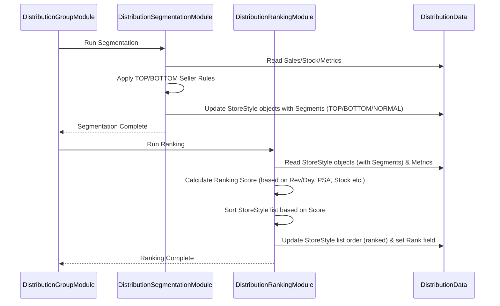

# Chapter 48: Distribution Segmentation & Ranking

Welcome! In the [previous chapter](47_distribution_data_preparation_.md), we learned how the **Distribution Data Preparation** step gathers all the necessary ingredients – like current stock levels, store details, and product information – before we start deciding where to send inventory.

Now that our pantry is stocked and ingredients prepped, we face a big question: **Who gets the inventory first?** We probably don't have enough stock of every single popular item to perfectly fill every single store immediately. We need a smart way to prioritize.

## What Problem Does This Step Solve?

Imagine you've just baked a limited number of delicious cookies (our available warehouse inventory). Many of your friends (stores) would love some. You can't give everyone exactly what they want right away. How do you decide who gets the first batch?
*   Do you give them to the friends who eat cookies the fastest (high Rate of Sale stores/products)?
*   Do you give them to the friends who are currently completely out of cookies (low stock stores)?
*   Do you give them to the friends who *really* love *this specific type* of cookie (high performance for a specific store-product combination)?

Doing this fairly and effectively requires **prioritization**. We need a system to look at all the possible places we *could* send inventory (all the Store-Style combinations) and decide which ones are the most deserving or strategically important to receive stock first.

This is exactly what **Distribution Segmentation & Ranking** solves. It analyzes the performance of different products and stores and creates a prioritized list, guiding the allocation engine on where to send inventory first to maximize sales and meet strategic goals.

## Core Concepts

This prioritization process generally involves two key ideas:

1.  **Segmentation (Categorizing Performance):**
    *   Just like sorting friends by how much they *love* cookies, we first categorize styles based on their recent sales performance. We assign a simple **segment** tag to each style.
    *   The [`Segment`](#code-dive-segment-enum) enum defines these tags:
        *   **`TOP_SELLER`:** Styles that are currently selling very well or contributing significantly to revenue. These are high priority.
        *   **`BOTTOM_SELLER`:** Styles with very poor recent sales, low stock turn, or high discounts. These might be excluded from certain allocations or handled differently.
        *   **`NORMAL_SELLER`:** Styles that fall in between – selling okay but not stars or duds.
    *   This segmentation helps apply broad strategies (e.g., "Always try to fulfill TOP_SELLER needs first"). It's often calculated in `DistributionSegmentationModule`.

2.  **Ranking (Creating an Ordered List):**
    *   Segmentation gives broad categories, but we need a more detailed order. Ranking creates a specific sequence for *every eligible store-style combination*. Imagine making a numbered list of which friend gets the *next* cookie.
    *   This ranking isn't based on just one thing. It considers multiple factors to calculate a "score" for each Store-Style combination:
        *   **Revenue Potential:** How much money is this style likely to generate in this store? This often uses a calculated "revenue per day" metric, possibly using historical data and applying "roll-up" logic (using performance from similar stores/regions if local data is sparse). Combinations with higher revenue potential get ranked higher.
        *   **Stock Levels vs. Target:** Does the store already have too much of this style compared to its planogram or target stock? Combinations where the need is higher (stock is further below target) might get ranked higher. (PSA - Planogram Stock Adherence - health is mentioned in the description and relates to this).
        *   **PSA Health:** How well is the store managing its stock according to the planogram? Stores maintaining good planogram health might be prioritized.
        *   **(Other factors):** NOOS status, segment (TOP_SELLER often gets a boost), etc.
    *   The `DistributionRankingModule` calculates this score and sorts all the Store-Style combinations from highest score (highest priority for allocation) to lowest.

**The Goal:** The output of this phase is essentially a **prioritized master list** that tells the next step ([Distribution Allocation Logic](49_distribution_allocation_logic_.md)): "Start allocating inventory to Combination #1 on this list, then #2, then #3, and so on, until you run out of stock or meet their needs."

## How It Works (The Process)

Segmentation and Ranking happen after data preparation, usually executed by dedicated modules within the `DistributionGroupModule` sequence.

**Inputs:**
*   **Prepared Distribution Data (`DistributionData`):** Containing sales history, current inventory, planogram info, store details, style details (all loaded in [Chapter 47](47_distribution_data_preparation_.md)).
*   **Configuration (`DistributionArgs`):** Defining thresholds for TOP/BOTTOM seller segmentation (e.g., revenue contribution percentages, discount levels), and potentially weights for different factors in the ranking score.

**Calculation Steps:**
1.  **Calculate Performance Metrics (`DistributionComputeRevenueModule`, `DistributionSegmentationModule`):** Calculate necessary metrics like revenue per day, total revenue contribution per style, average discounts, etc., often grouped by Store-Style or Channel-Category.
2.  **Segment Styles (`DistributionSegmentationModule`):** Compare style performance metrics against configured thresholds (e.g., top X% revenue = TOP_SELLER, high discount & low sales = BOTTOM_SELLER). Assign the appropriate `Segment` tag (TOP_SELLER, BOTTOM_SELLER, NORMAL_SELLER) to each relevant style or store-style combination and store it (e.g., within the `StoreStyle` object in `DistributionData`).
3.  **Calculate Ranking Score (`DistributionRankingModule`):** For every eligible Store-Style combination:
    *   Retrieve relevant metrics (revenue per day, current stock, target stock, PSA score, segment tag, NOOS status etc.) from `DistributionData`.
    *   Combine these metrics using a defined formula or weighting scheme to calculate a final ranking score. Higher scores mean higher priority. (The exact formula might be complex and involve multiple helper functions).
4.  **Rank Combinations (`DistributionRankingModule`):** Sort all the Store-Style combinations in descending order based on their calculated ranking score. Store this ranked list (e.g., update the order of `StoreStyle` objects in `DistributionData.storeStylesList`).
5.  **Generate Outputs (Optional):** Modules might save intermediate results like `DistStoreStyleListRow` which includes the calculated rank and performance metrics used.

**Outputs:**
*   **Updated `DistributionData`:** Key internal data structures (like `StoreStyle` objects) are now tagged with performance segments (TOP/BOTTOM/NORMAL).
*   **Ranked List:** The primary output used internally by the next module is the ordered list of `StoreStyle` objects within `DistributionData`, sorted from highest priority to lowest.
*   **`DistStoreStyleListRow` (Persisted Output):** Often saved to provide visibility into the ranking process, showing the calculated metrics, segment, and final rank for each Store-Style.

## Under the Hood: Segmentation Rules and Ranking Formula

Let's peek at the logic involved.

**1. Segmentation Logic (`DistributionSegmentationModule` / `AbstractSegmentationModule`):**
   This involves comparing metrics against benchmarks.

   ```java
   // Simplified logic for TOP_SELLER identification

   // Inputs: sales data, configuration args

   // 1. Calculate revenue per day for each Store-Style
   // storeStyleRevPerDayMap = computeStyleRevenuePerDay(...)

   // 2. Calculate benchmark revenue per day for peer groups (e.g., Channel-Category)
   // channelCatRevPerDayBenchmark = computeChannelCatPbRevPerDay(...) * args.topsellerMultiplier

   // 3. Compare and Tag
   storeStyleRevPerDayMap.forEach((storeStyleKey, revStylePerDay) -> {
       // ... get benchmarks for this storeStyle ...
       int styleId = (int) storeStyleKey.part(1);
       int store = (int) storeStyleKey.part(0);

       // Check live days condition
       int styleLiveDays = view.getStyleLiveDays(styleId, startDate, endDate, Optional.of(store));

       // Example TOP SELLER Conditions:
       if (revStylePerDay > revStoreCatPbBenchmark && // Outperforms store benchmark
           revStylePerDay > channelCatPbRevPerDay && // Outperforms channel benchmark
           styleLiveDays >= args.topsellerLiveDaysBenchmark) { // Was live long enough

           StoreStyle storeStyle = distributionData.getStoreStyle(store, styleId);
           if (storeStyle != null) {
               storeStyle.setSegment(Segment.TOP_SELLER); // Apply the tag
               distributionData.addStoreStyleSegment(store, styleId, Segment.TOP_SELLER);
           }
       }
       // ... (Similar logic for BOTTOM_SELLER using different metrics/thresholds) ...
   });
   ```
   **Explanation:** The code calculates the revenue per day for the specific Store-Style and compares it against benchmarks calculated for its peer group (e.g., at the Store-Category level and Channel-Category level). It also checks if the style was available long enough (`topsellerLiveDaysBenchmark`). If it meets these conditions (performing better than benchmarks and available long enough), it's tagged as `TOP_SELLER`. Similar logic applies for identifying `BOTTOM_SELLER` (e.g., low sales, high discounts). Styles not meeting TOP or BOTTOM criteria default to `NORMAL_SELLER`.

**2. Ranking Logic (`DistributionRankingModule` / `AbstractRankingModule`):**
   This involves calculating a score and sorting. The actual scoring formula isn't shown directly but is implied by the sorting criteria used. The `rank` method sorts based on multiple fields in a specific order of priority.

   ```java
   // Simplified from AbstractRankingModule.rank() method which sorts a List<StoreStyle>

   private List<StoreStyle> rank(List<StoreStyle> storeStyleList) {
       logger.info("Ranking on store"); // Less important sort?
       storeStyleList.sort(Comparator.comparingInt(StoreStyle::getStore));
       logger.info("Ranking on style"); // Less important sort?
       storeStyleList.sort(Comparator.comparingInt(StoreStyle::getStyle));

       // --- More Important Ranking Factors (Applied Last = Highest Priority) ---
       logger.info("Ranking on stock"); // Higher stock might be lower priority? (Reverse compare)
       storeStyleList.sort((s1, s2) -> Integer.compare(s2.getTotalStock(), s1.getTotalStock()));
       logger.info("Ranking on PSA"); // Higher PSA % is better (Reverse compare)
       storeStyleList.sort(Comparator.comparingDouble(StoreStyle::getPsaPercent).reversed());
       logger.info("Ranking on national revenue"); // Higher national style revenue is better
       storeStyleList.sort(Comparator.comparingDouble(
           (StoreStyle s) -> distributionData.getStyleRevPerDay(s.getStyle())
       ).reversed());
       logger.info("Ranking on rev per day"); // Higher store-style revenue/day is better
       storeStyleList.sort(Comparator.comparingDouble(StoreStyle::getRevPerDayForComparison).reversed());

       // After sorting, assign ranks
       int rank = 1;
       for(StoreStyle ss : storeStyleList) {
           ss.setRank(rank++);
           // Also update the corresponding DistStoreStyleListRow for output
           DistStoreStyleListRow row = storeStyleListRowMap.get(new Key(ss.getStore(), ss.getStyle()));
           row.rank = ss.getRank();
       }
       return storeStyleList;
   }
   ```
   **Explanation:** This method sorts the `storeStyleList` multiple times. Java's `sort` is stable, meaning the *last* sort criterion applied has the highest precedence for elements that are equal according to later criteria. The order here implies that `revPerDayForComparison` (likely the calculated revenue per day for the specific store-style, potentially using rollups) is the MOST important factor, followed by the style's overall national revenue, then PSA health, then total stock (higher stock -> lower rank seems implied by `s2` vs `s1`), etc. The final sorted list represents the ranked order, and ranks (1, 2, 3...) are assigned.

**Sequence Diagram (Conceptual Segmentation & Ranking):**


**Code Dive: `Segment` Enum:**

```java
// File: src/main/java/com/increff/irisx/constants/distribution/Segment.java
package com.increff.irisx.constants.distribution;

import com.increff.irisx.constants.EnumInterface;
import com.increff.irisx.constants.LanguageUtil;

// Defines the possible performance segments for distribution
public enum Segment implements EnumInterface {

    TOP_SELLER("TOP_SELLER", "MEJOR_VENDEDOR"),     // High performance
    BOTTOM_SELLER("BOTTOM_SELLER", "PEOR_VENDEDOR"),  // Low performance
    NORMAL_SELLER("NORMAL_SELLER", "VENDEDOR_NORMAL"),// Average performance
    EMPTY("","");                                  // Default/Unassigned

    // --- Standard Enum fields and methods ---
    private final String valueEN;
    private final String value;
    private final String valueESMX;

    Segment(String... values) { /* ... constructor ... */ }
    public static Segment fromValue(String val) { /* ... lookup logic ... */ return null; }
    @Override public String getValue() { return this.value; }
    @Override public String getValueEN() { return this.valueEN; }
    @Override public String getValueESMX() { return this.valueESMX; }

    // --- Helper methods ---
    public static boolean isTopseller(Segment segment) { return TOP_SELLER.equals(segment); }
    public static boolean isBottomseller(Segment segment) { return BOTTOM_SELLER.equals(segment); }
}
```
**Explanation:** This enum defines the simple `TOP_SELLER`, `BOTTOM_SELLER`, and `NORMAL_SELLER` tags used to categorize styles based on performance during distribution calculations.

## Conclusion

**Distribution Segmentation & Ranking** is a critical preparatory step within the overall Distribution process.

*   It **Segments** styles into performance categories (TOP_SELLER, BOTTOM_SELLER, NORMAL_SELLER) based on recent sales metrics and configured thresholds.
*   It **Ranks** every eligible Store-Style combination by calculating a score based on multiple factors like revenue potential (revenue per day), stock position (need vs target, PSA), and potentially the segment tag itself.
*   This process, executed by `DistributionSegmentationModule` and `DistributionRankingModule`, results in a **prioritized list** stored within `DistributionData`.
*   This ranked list dictates the order in which the subsequent **Allocation Logic** module will attempt to fulfill inventory needs, ensuring that the most important combinations are addressed first.

With this prioritized list ready, we can finally start allocating the available inventory.

[Next Chapter: Distribution Allocation Logic](49_distribution_allocation_logic_.md)

---

Generated by [AI Codebase Knowledge Builder](https://github.com/The-Pocket/Tutorial-Codebase-Knowledge)