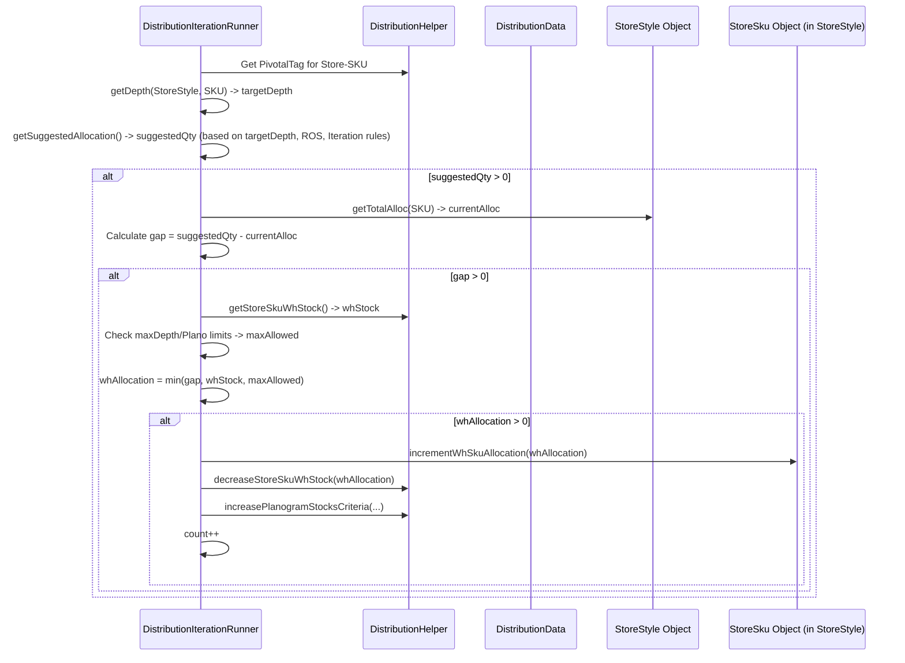

# Chapter 49: Distribution Allocation Logic

Welcome back! In the [previous chapter](48_distribution_segmentation___ranking_.md), we saw how the **Distribution Segmentation & Ranking** process analyzes store and product performance to create a prioritized list. We now have an ordered queue of "Store-Style" combinations, starting with the most important ones needing inventory down to the least important.

But just having a priority list isn't enough. We still have a limited amount of inventory in our warehouses. How do we actually *divide* that limited stock among all the competing stores based on the priority list and various rules?

## What Problem Does This Logic Solve?

Imagine you've baked a delicious, but limited, cake (our warehouse inventory). You have many friends (stores) who want a slice, and you've ranked them based on how hungry they are or how much they love cake (our ranked list). Now you need the *logic* to actually cut and distribute the slices:

*   Do you give the hungriest friend (highest rank) a huge slice first?
*   Do you make sure everyone gets at least a small sliver before giving seconds?
*   What if a friend only has a tiny plate (limited planogram space)?
*   What if a friend already has some leftover cake from yesterday (current store stock)?
*   How do you make sure you don't promise more cake than you actually have?

Manually deciding how much to give each friend, considering all these factors, is tricky. Similarly, allocating warehouse inventory requires a defined set of rules and procedures.

The **Distribution Allocation Logic** is the core engine within `irisx-algo` that handles this process. It takes the ranked list of store-style needs and the available warehouse inventory, then systematically works through the list, deciding how much inventory (if any) to allocate to each combination, based on a set of defined rules, conditions, and iteration goals. It's the part that actually "cuts the cake" according to the plan.

## Core Concepts

This allocation engine typically operates through several key ideas:

1.  **Iterative Allocation (Multiple Passes):** Allocation isn't usually a single pass. It often happens in distinct **iterations** or rounds, each with a specific focus, defined by the [`DistributionIteration`](#code-dive-distributioniteration-enum) enum. Think of these as different rounds of serving the cake:
    *   **Top Seller Iteration:** Maybe the first round focuses only on getting stock to the highest-ranked "TOP_SELLER" combinations.
    *   **Replenishment Iteration:** The next round might focus on fulfilling basic stock needs for many items based on their sales rate (ROS).
    *   **Planogram Filling:** Later rounds might try to fill remaining shelf space according to the planogram.
    *   **Non-Pivotal Size Iteration:** A specific round might focus only on allocating less critical (Non-Pivotal) sizes.
    *   Each iteration uses the *same* core logic engine but applies different rules or focuses on different subsets of the ranked list.

2.  **Ranked List Processing:** The engine processes the Store-Style combinations strictly according to the **rank** determined in the previous step ([Chapter 48](48_distribution_segmentation___ranking_.md)). Higher-ranked items get considered for allocation first within each iteration.

3.  **Allocation Conditions:** Before any stock is assigned, the engine checks several conditions for the current Store-Style combination:
    *   **Warehouse Stock:** Is there *any* stock left in the warehouse for the required SKUs?
    *   **Store Stock:** Does the store *already* have enough stock (compared to its need)?
    *   **Planogram Capacity:** Does the store have *space* according to its planogram targets (e.g., `PlanoQty`, `PlanoOptions`)? This includes checking "Planogram Stock Adherence" (PSA) health – how well the store is currently meeting its targets. Stores with poor PSA might be skipped.
    *   **Assortment Plan Targets:** Does the overall Assortment Plan (`ApOutputRow`) allow for more width (options) or depth (stocks) for this Attribute Group in this store?
    *   **Iteration Rules:** Does this Store-Style combination meet the criteria for the *current* iteration (e.g., is it a TOP_SELLER during the Top Seller iteration)? Is it already "resolved" (fully allocated) from a previous iteration?

4.  **Calculating Suggested Quantity:** If conditions are met, the logic calculates how much the store *ideally* needs. This is often based on:
    *   **Target Depth:** The desired stock level (e.g., from `getDepth`, considering minimums, size contributions).
    *   **ROS & Cover:** Rate of Sale multiplied by target cover days.
    *   **Gap:** `Target Stock - Current Stock`.

5.  **Determining Final Allocation:** The actual quantity allocated is the *minimum* of:
    *   The Suggested Quantity.
    *   The available Warehouse Stock for the SKU.
    *   Remaining Planogram Capacity.

6.  **Stock Source:** Allocation primarily comes from the **warehouse**. While the logic might *consider* store stock for calculating need, the core `DistributionAllocationModule` focuses on Warehouse-to-Store movement. Inter-Store Transfers are handled by a separate dedicated module ([Chapter 51](51_inter_store_transfer__ist__module_.md)).

7.  **Updating State:** Once allocation is determined:
    *   Warehouse stock is decreased.
    *   The allocated quantity is recorded for the Store-SKU.
    *   Planogram fulfillment counters are updated.
    *   The Store-Style might be marked as "resolved" for the current iteration.

## How It Works (The Process)

The allocation logic is primarily executed by the `DistributionAllocationModule` and its helper `DistributionIterationRunner`. This runs within the sequence managed by `DistributionGroupModule`, after data preparation and ranking.

**Inputs:**
*   **Prepared & Ranked Data (`DistributionData`):** Contains current stock (WH, Store), planogram targets, size contributions, ROS, and the crucial ranked list of `StoreStyle` objects.
*   **Iteration Definitions (`Iteration` class):** Defines the rules and constraints specific to each allocation pass (e.g., which segments to consider, PSA benchmarks, whether to breach planograms).
*   **Configuration (`DistributionArgs`):** General distribution settings.

**Calculation Steps:**
1.  **`DistributionAllocationModule` Selects Iteration:** It determines which allocation iteration (e.g., `TOP_SELLER_ITERATION`, `REPLENISHMENT_ITERATION`) needs to run based on the overall distribution run type (e.g., Fresh Allocation vs. Replenishment).
2.  **`IterationRunner` Executes Pass:** It calls `DistributionIterationRunner.run()`, passing the specific `DistributionIteration` enum value and its corresponding `IterationConstraint` object.
3.  **Loop Through Ranked List:** The `DistributionIterationRunner` iterates through the ranked list of `StoreStyle` objects stored in `DistributionData`.
4.  **Check Eligibility & Conditions:** For each `StoreStyle`, it checks if it's eligible for *this specific iteration* (based on flags in `IterationConstraint` and the `StoreStyle`'s segment/status) and if the basic allocation conditions (PSA health, etc. checked via `helper.checkAllocationConditions`) are met.
5.  **Calculate SKU Allocations (`computeSkuAllocations`/`allocateStoreStyle`):** If eligible, it loops through the SKUs (sizes) associated with the `StoreStyle`.
    a.  **Get Suggested Qty:** Calculates the ideal quantity needed for the SKU (`getSuggestedAllocation`), often based on target depth (`getDepth`).
    b.  **Check Constraints:** Verifies warehouse stock availability and remaining planogram capacity.
    c.  **Determine Allocation:** Calculates the final quantity to allocate from the warehouse (`whAllocation`) by taking the minimum of the need, available stock, and capacity.
    d.  **Update State:** Decreases warehouse stock, increases the allocation record for the Store-SKU, updates planogram fulfillment counters, and potentially marks the SKU or Style as resolved for this iteration. (`setSkuAllocations`, `updateSkuLevelCriteria`).
6.  **Repeat:** Continues through the ranked list for the current iteration.
7.  **Next Iteration:** `DistributionAllocationModule` might call the `IterationRunner` again for the next logical iteration (e.g., after TOP_SELLERS, run REPLENISHMENT).

**Outputs:**
*   **Updated `DistributionData`:** The primary result is the updated state within the `DistributionData` object, specifically the `whAllocation` values set for each `StoreStyle.StoreSku`.
*   **`DistAlloc...Row` (Persisted):** Intermediate rows might be saved after certain iterations (`DistAlloc1xRow`, `DistAllocXxRow`) for analysis and debugging, showing the state of allocation at that point. The final consolidation happens in `DistributionOutputModule`.

## Under the Hood: Iterating, Checking, Allocating

The core logic lives in `DistributionIterationRunner` and its helpers.

**1. Iteration Execution (`DistributionIterationRunner.run`):**
   This sets up the context for a specific pass (e.g., Top Seller pass).

   ```java
   // Simplified from BaseIterationRunner.run() called by DistributionIterationRunner
   public void run(Properties properties) {
       count = 0; // Count how many allocations happened in this iteration
       initFlags(); // Reset flags for this pass
       // Set constraints specific TO THIS ITERATION (e.g., only allocate Top Sellers?)
       distributionHelper.setIterationConstraint(iterationConstraint)
               .setArgs(args)
               .setBaseDistributionData(distributionData)
               .setCommonArgs(commonArgs);

       // Initialize any special criteria for this iteration (e.g., AP rollup)
       if (iterationConstraint.getRollupApNo() != GenericConstants.DEFAULT_AP_ROLLUP_NO)
           initializeRolledUpApCriteria();

        // *** Call the main loop ***
       iteration(); // Processes the ranked list based on current constraints
       // ... (Post-iteration logic, e.g., color allocation) ...
   }
   ```
   **Explanation:** This sets up the `distributionHelper` with the rules (`iterationConstraint`) for the current pass (defined by `iterationFlag`) before calling the `iteration()` method, which loops through the ranked list.

**2. Processing Each Store-Style (`iteration()` method):**
   This loops through the ranked list and decides whether to allocate.

   ```java
   // Simplified from BaseIterationRunner.iteration()
   protected void iteration() {
       logger.info("Start of Allocation Iteration No. " + iterationFlag);
       // Get the ranked list of Store-Style combinations
       for (StoreStyle storeStyle : distributionData.getStoreStylesList()) {
           helper.setColorAllocation(false); // Reset flags
           // Check basic health and eligibility for THIS iteration
           isStyleHealthy = helper.checkAllocationConditions(storeStyle);
           if (isStyleHealthy) {
               // If healthy, attempt to allocate SKUs for this style
               computeSkuAllocations(storeStyle);
               // (Other logic like handling remaining stock/GIT omitted for clarity)
           }
       }
       logger.warn("End of AllocationModule Iteration " + iterationFlag + ", No of Sku entries resolved - " + count);
   }
   ```
   **Explanation:** It iterates through the `StoreStyle` list (which is assumed to be ranked). For each one, it checks conditions using `checkAllocationConditions` (which uses the `iterationConstraint` to know the rules for this specific pass). If conditions pass, it calls `computeSkuAllocations` to handle the individual sizes.

**3. Allocating SKUs (`computeSkuAllocations` / `allocateStoreStyle`):**
   This handles the logic for individual SKUs within the chosen style.

   ```java
   // Simplified from DistributionIterationRunner.allocateStoreStyle()
   protected void allocateStoreStyle(StoreStyle storeStyle) {
       // Check if style should be excluded based on global/iteration rules
       setExclusionFlag(checkExclusion(storeStyle));
       // Loop through all sizes (SKUs) defined for this style
       for (int sku : cache.getAllSkusInStyle(storeStyle.getStyle())) {
           // Calculate how much this SKU ideally needs in this iteration
           int suggestedAllocation = getSuggestedAllocation(storeStyle, sku);
           // Skip if suggestion is zero (unless it's a special iteration like Min Age)
           if (suggestedAllocation <= 0 && iterationFlag != MIN_AGE_ITERATION)
               continue;
           // *** Perform the actual allocation ***
           setSkuAllocations(storeStyle, sku, suggestedAllocation);
           count++; // Increment count of allocations made
       }
       // If allocation happened successfully, update style-level criteria/flags
       if (isStyleHealthy)
           updateStyleLevelCriterias(storeStyle); // Mark style as resolved for iteration
       setExclusionFlag(false); // Reset exclusion flag
   }
   ```
   **Explanation:** It loops through each `sku` for the style. It calls `getSuggestedAllocation` to determine the target quantity based on the *current iteration's rules*. If a quantity is suggested, it calls `setSkuAllocations` to attempt the allocation. Finally, it updates the style's status using `updateStyleLevelCriterias`.

**4. Calculating Suggestion & Performing Allocation (`getSuggestedAllocation`, `setSkuAllocations`):**
   These helpers determine the need and execute the stock movement.

   ```java
   // Simplified from DistributionIterationRunner.getSuggestedAllocation()
   protected int getSuggestedAllocation(StoreStyle storeStyle, int sku) {
       // Get pivotal tag (P/NP/E) for this Store-SKU
       DIss dIss = distributionHelper.getDIss(storeStyle.getStore(), storeStyle.getStyle(), sku);
       PivotalTag pivotalTag = distributionHelper.getPivotalTag(sku, storeStyle, dIss);
       if (PivotalTag.isUntagged(pivotalTag)) return 0; // Skip untagged

       // Get target depth based on SizeSet rules, overrides, etc.
       int depth = getDepth(storeStyle, sku, dIss);

       // --- Logic specific to iteration type ---
       // If Replenishment for Top Seller, maybe use ROS * Cover Days?
       if (storeStyle.getSegment() == Segment.TOP_SELLER && iterationFlag == TOP_SELLER_ITERATION) {
            int rDays = distribution.getReplenishmentDays(/*...*/);
            double ros = distribution.getStoreSkuRos(storeStyle.getStore(), sku);
            return (int) Math.max(Math.round(ros * rDays * args.topsellerCoverDaysMultiplier), depth);
       }
       // Default suggestion is often the calculated target depth
       return depth;
   }

   // Simplified from DistributionIterationRunner.setSkuAllocations()
   protected void setSkuAllocations(StoreStyle storeStyle, int sku, int suggestedAllocation) {
       storeStyle.setSuggestedSkuAllocation(sku, suggestedAllocation); // Record suggestion
       int currentTotalAlloc = storeStyle.getTotalAlloc(sku); // How much already allocated?
       int gap = suggestedAllocation - currentTotalAlloc; // How much more is needed?
       if (gap <= 0) return; // Need already met or exceeded

       // Check available WH stock (for the store's mapped WH)
       int whStock = distributionHelper.getStoreSkuWhStock(storeStyle.getStore(), sku);
       // Check planogram / max depth limits
       int maxAllowedByDepth = Math.max(skuMaxDepth - currentTotalAlloc, 0);
       // (Planogram check might be separate or part of maxDepth)

       // Determine warehouse allocation: min of gap, available WH stock, max allowed
       int whAllocation = MathUtil.min(new Integer[]{gap, whStock, maxAllowedByDepth});

       // *** Execute Allocation ***
       if (whAllocation > 0) {
           storeStyle.incrementWhSkuAllocation(sku, whAllocation); // Record WH allocation
           updateSkuLevelCriteria(storeStyle, sku, 0, whAllocation, 0); // Update state
       }
   }

   // Simplified from DistributionIterationRunner.updateSkuLevelCriteria()
   protected void updateSkuLevelCriteria(StoreStyle ss, int sku, int storeAlloc, int whAlloc, int outwardAlloc) {
        // Decrease WH stock
        distributionHelper.decreaseStoreSkuWhStock(ss.getStore(), sku, whAlloc);
        // Increase Planogram fulfillment counts
        distributionHelper.increasePlanogramStocksCriteria(ss.getStore(), ss.getStyle(), storeAlloc + whAlloc + outwardAlloc);
        // ... (other updates like reserving quantity) ...
   }
   ```
   **Explanation:** `getSuggestedAllocation` determines the target quantity for the SKU, potentially using different logic based on the `iterationFlag` (e.g., using ROS for Top Sellers vs. just depth for others). `setSkuAllocations` calculates the `gap` needed, checks available `whStock` and `maxAllowedByDepth`, determines the actual `whAllocation` as the minimum of these, and if positive, calls `updateSkuLevelCriteria` to record the allocation and decrease the warehouse stock.

**Sequence Diagram (Allocating one SKU within an Iteration):**


## Conclusion

The **Distribution Allocation Logic**, executed primarily by the `DistributionAllocationModule` using the `DistributionIterationRunner`, is the heart of the distribution process where decisions are made.

*   It systematically processes a **ranked list** of Store-Style combinations.
*   It operates in defined **iterations** (Top Seller, Replenishment, Planogram Fill, etc.), applying specific rules for each pass.
*   For each combination, it checks **eligibility and constraints** (stock availability, planogram capacity, PSA health, rules for the current iteration).
*   It calculates a **suggested quantity** based on target depth or ROS.
*   It determines the final **allocation quantity** from the warehouse by taking the minimum of the need, warehouse stock, and capacity constraints.
*   It **updates** inventory levels and fulfillment status, providing the data needed to generate final allocation outputs.

This structured, iterative logic ensures that limited warehouse inventory is distributed effectively and efficiently according to business priorities and constraints.

Now that we've seen how warehouse stock gets allocated to stores, what happens if the stock isn't in the *right* warehouse to begin with? The next chapter explores Inter-Warehouse Transfers.

[Next Chapter: Inter-Warehouse Transfer (IWHT) Module](50_inter_warehouse_transfer__iwht__module_.md)
```
---
**Relevant Code Snippets for Context:**

```java
// File: src/main/java/com/increff/irisx/constants/distribution/DistributionIteration.java
package com.increff.irisx.constants.distribution;

// ... (Enum definition as provided in Chapter 48) ...
// Defines iterations like TOP_SELLER_ITERATION, REPLENISHMENT_ITERATION, PLANOGRAM_ITERATION etc.
public enum DistributionIteration implements EnumInterface {
    // ... enum values ...
}
```

```java
// File: src/main/java/com/increff/irisx/module/distributionCommons/data/IterationConstraint.java
package com.increff.irisx.module.distributionCommons.data;

import com.increff.irisx.constants.distribution.DistributionIteration;
import lombok.Getter;
import lombok.Setter;

// Holds the specific rules/flags for ONE allocation iteration
@Getter
@Setter
public class IterationConstraint {
    private final boolean isStoryAllocation; // Is this a Story/Collection based iteration?
    private final boolean checkPlanogramOptionsFlag; // Check against planned options width?
    private final boolean checkCategoryPlanogramFlag; // Check against category planogram stocks/options?
    private final boolean checkApFlag; // Check against Assortment Plan width/depth?
    private final boolean checkReplenishmentFlag; // Check against Replenishment needs (ROS*Cover)?
    private final boolean checkTopSellerFlag; // Only consider TOP_SELLER segment?
    private final boolean isMinAgeIteration; // Special rules for minimum age/GIT?
    private final boolean isInclusionIteration; // Special rules for adding new items?
    private final boolean checkHealthFlag; // Check PSA health benchmarks?
    private final boolean depthIncrementFlag; // Apply depth multipliers?
    private final double psaBenchmark; // PSA % benchmark for this iteration
    private final double depthMultiplier; // Multiplier for depth increment
    private final double planogramIncrementMultiplierForStocks; // Multiplier for planogram stocks
    private final int rollupApNo; // Level for AP rollup check
    private final DistributionIteration iteration; // The iteration name this applies to
    private final double planogramIncrementMultiplierForOptions; // Multiplier for planogram options

    public IterationConstraint(boolean isStoryAllocation, boolean checkPlanogramOptionsFlag, boolean checkCategoryPlanogramFlag, boolean checkApFlag, boolean checkReplenishmentFlag, boolean checkTopSellerFlag, boolean isMinAgeIteration, boolean isInclusionIteration, boolean checkHealthFlag, boolean depthIncrementFlag, double psaBenchmark, double depthMultiplier, double planogramIncrementMultiplierForStocks, int rollupApNo, DistributionIteration iteration, double planogramIncrementMultiplierForOptions) {
        // ... constructor assignments ...
    }
}
```

```java
// File: src/main/java/com/increff/irisx/module/distribution/DistributionIterationRunner.java
package com.increff.irisx.module.distribution;

// ... imports ...

@Component("distributionIterationRunner")
public class DistributionIterationRunner extends BaseIterationRunner {

    // ... Autowired dependencies (distribution, helper, args) ...

    // --- Methods shown in "Under the Hood" section ---
    // run() -> sets constraints, calls iteration()
    // iteration() -> loops ranked StoreStyles, calls checkAllocationConditions, computeSkuAllocations
    // computeSkuAllocations() / allocateStoreStyle() -> loops SKUs, calls getSuggestedAllocation, setSkuAllocations
    // getSuggestedAllocation() -> Calculates ideal qty based on iteration rules, depth, ROS
    // setSkuAllocations() -> Calculates final WH allocation based on gap, stock, limits
    // updateSkuLevelCriteria() -> Updates WH stock, planogram counts
    // getDepth() -> Determines target depth from SizeSet, overrides
    // ... other helper methods ...
}
```

---

Generated by [AI Codebase Knowledge Builder](https://github.com/The-Pocket/Tutorial-Codebase-Knowledge)