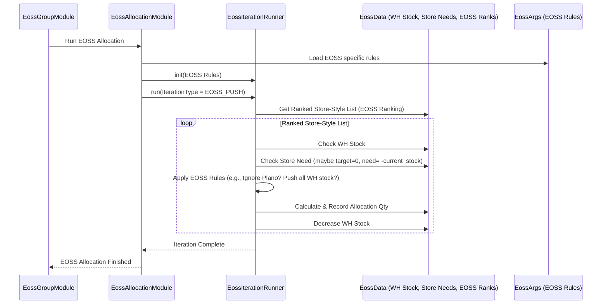
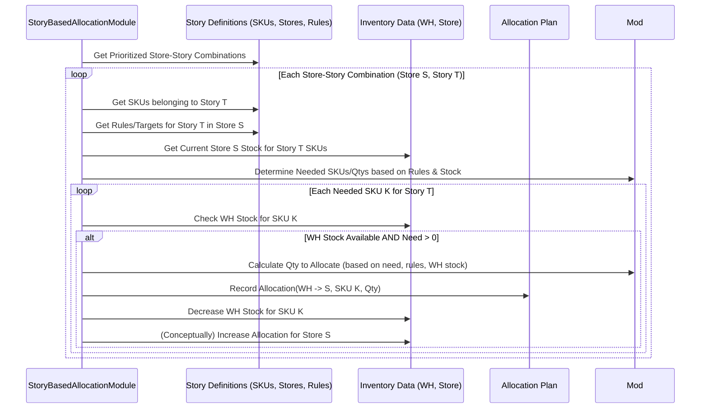

# Chapter 52: EOSS Distribution Module

Welcome back! In the last few chapters ([Chapter 46](46_distribution_module_.md) to [Chapter 51](51_inter_store_transfer__ist__module_.md)), we explored the standard **Distribution Module**, learning how it prepares data, ranks stores and products, allocates inventory from warehouses, and even suggests transfers between warehouses (IWHT) and stores (IST). This regular distribution process is fantastic for keeping stores stocked with the right products during the main selling season.

But what happens when the season ends? Retailers often hold **End-of-Season Sales (EOSS)** or clearance events to sell off remaining seasonal inventory quickly, making space for new arrivals. The goals during EOSS are very different from the goals during the regular season.

## What Problem Does This Module Solve?

During the regular season, distribution aims to:
*   Keep popular items in stock at the right stores to maximize full-price sales.
*   Maintain target inventory levels based on forecasts and safety stock.
*   Adhere closely to planograms (how items are displayed).
*   Optimize overall margin.

During an EOSS or clearance period, the priorities shift dramatically:
*   **Goal:** Sell through remaining seasonal stock as quickly as possible, even at higher discounts.
*   **Margin:** Less of a concern; recouping some cost and freeing up space is key.
*   **Planograms:** Display rules might be relaxed; getting stock out is more important.
*   **Stock Placement:** We might want to consolidate remaining EOSS stock into specific stores known for strong clearance sales, or push it heavily to outlet channels.

The standard distribution logic, optimized for regular sales, isn't ideal for EOSS. Running the regular module might try to carefully balance stock based on full-price sales rates, which isn't relevant anymore.

The **EOSS Distribution Module** solves this problem. It provides a **specialized distribution workflow specifically designed for EOSS or clearance scenarios**. It uses similar underlying concepts (ranking, allocation) but applies **different rules, parameters, and priorities** tailored to the unique goals of clearing out end-of-season inventory.

Think of it like moving house. Regular distribution is like carefully stocking your pantry each week. EOSS distribution is like the final week before you move – you're not carefully restocking; you're trying to use up everything you have and maybe consolidating leftover items into a few boxes ("everything must go!").

## Core Idea: Tailored Logic for Clearance

The EOSS Distribution Module isn't usually a completely separate system. It often reuses many of the same building blocks (data structures, helper functions) as the regular Distribution Module. However, the **rules and configurations** applied are different to achieve the EOSS objectives.

Key differences often include:

1.  **Focus Items:** The process focuses only on items designated for EOSS.
2.  **Goal:** Maximize **sell-through** and clear inventory quickly.
3.  **Ranking:** Stores and styles might be ranked differently. Stores with a proven track record of selling clearance items might get higher priority. Styles with the *most* remaining stock might be prioritized for pushing out.
4.  **Allocation Logic:**
    *   May prioritize filling stores known to handle clearance well.
    *   Might push larger quantities ("flood" the channel) rather than precisely meeting calculated needs.
    *   May largely ignore standard planogram capacity constraints.
    *   Often aims to empty the warehouse of EOSS stock.
5.  **Transfers (IST/IWHT):** May be used more aggressively to consolidate remaining EOSS stock into fewer, high-performing clearance locations (stores or warehouses).

## How It Works (The Workflow)

Similar to the regular distribution and other major planning processes, the EOSS distribution is managed by an orchestrator module, `EossGroupModule`. This module runs a sequence of specialized EOSS sub-modules.

**Orchestration by `EossGroupModule`:**
1.  **Prepare Data (`EossPrepareDataModule`, `EossPrepareWhInventoryModule`, `EossPrepareSalesModule`):** Load current stock, identify EOSS items, load relevant (potentially historical EOSS) sales data, store rankings for clearance.
2.  **Segmentation/Ranking (`EossSegmentationModule`, `EossRankingModule`):** Classify stores/styles based on EOSS-specific performance criteria (e.g., historical clearance sell-through). Rank Store-Style combinations for priority.
3.  **Allocation (`EossAllocationModule`):** Decide WH->Store quantities based on EOSS rules (e.g., push remaining WH stock, potentially ignoring planograms).
4.  **Warehouse Inventory Update (`EossComputeWhInventoryModule`):** Reflect allocated stock changes.
5.  **Inter-Store Transfer (`EossInterStoreTransferModule`):** Calculate potential store-to-store consolidations for remaining EOSS stock.
6.  **Generate Outputs (`EossOutputModule`):** Save the EOSS distribution plan (allocations and transfers).

**Inputs:**
*   Current Inventory Data (WH, Store, GIT, Open Orders).
*   List of SKUs/Styles designated for EOSS.
*   Store Master Data (including clearance performance indicators).
*   Historical EOSS sales data (optional).
*   Configuration (`EossArgs`) specifying EOSS rules, thresholds, target clearance locations.

**Outputs:**
*   EOSS Allocation Plan: Similar format to regular distribution (e.g., `DistOutputRow` or potentially `EossAllocRow`) detailing planned WH->Store movements for EOSS items.
*   EOSS Transfer Plan: Similar format to regular IST (`IstOutputRow` or potentially `EossIstRow`) detailing planned Store->Store movements for EOSS items.
*   Denormalized reports for EOSS distribution.

## Under the Hood

**1. Orchestration (`EossGroupModule.java`):**
   This module looks very similar to `DistributionGroupModule`, but it calls the EOSS-specific versions of the sub-modules.

```java
// File: src/main/java/com/increff/irisx/module/EossGroupModule.java
package com.increff.irisx.module;

// Imports EOSS specific modules
import com.increff.irisx.module.eoss.*;
import org.springframework.beans.factory.annotation.Autowired;
import org.springframework.beans.factory.annotation.Qualifier;
import org.springframework.stereotype.Component;
import javax.annotation.PostConstruct;

@Component
public class EossGroupModule extends AbstractUtilModuleGroup {

    // Inject EOSS specific sub-modules
    @Autowired private EossPrepareDataModule eossPrepareData;
    @Autowired private EossPrepareWhInventoryModule eossPrepareWhInventory;
    @Autowired private EossSegmentationModule eossSegmentation;
    @Autowired private EossPrepareSalesModule eossPrepareSales;
    @Autowired private EossComputeRevenueModule eossComputeRevenue;
    @Autowired private EossRankingModule eossRanking;
    @Autowired private EossComputeWhInventoryModule eossComputeWhInventoryModule;
    @Autowired private EossInterStoreTransferModule eossInterStoreTransferModule;
    // Use Qualifier to specify the EOSS version of Allocation
    @Autowired @Qualifier("eossAllocation")
    private EossAllocationModule eossAllocation;
    @Autowired private EossOutputModule eossOutputModule;

    // Standard snapshot/sync modules
    @Autowired private UtilOutputSnapshotModule utilOutputSnapshotModule;
    @Autowired private UtilOutputSyncModule utilOutputSyncModule;

    @PostConstruct
    public void init() {
        captureSnapshot();
        // --- Define the EOSS Distribution execution order ---
        add(eossPrepareData);           // 1. Prep EOSS Data
        add(eossPrepareWhInventory);    // 2. Prep WH Inventory
        add(eossPrepareSales);          // 3. Prep Sales Data
        add(eossComputeRevenue);        // 4. Calculate Revenue
        add(eossSegmentation);          // 5. Segment based on EOSS criteria
        add(eossRanking);               // 6. Rank based on EOSS criteria
        add(eossAllocation);            // 7. << Core EOSS Allocation >>
        add(eossComputeWhInventoryModule); // 8. Update WH Stock
        add(eossInterStoreTransferModule); // 9. Calculate EOSS IST
        add(eossOutputModule);          // 10. Generate EOSS Outputs
        uploadOutput();
    }

    // Standard capture/upload methods
    @Override public void captureSnapshot() { add(utilOutputSnapshotModule); }
    @Override public void uploadOutput() { add(utilOutputSyncModule); }
}
```
**Explanation:** The structure is identical to other `GroupModule` classes. The key difference is that it injects and sequences the modules specifically designed for EOSS (e.g., `EossPrepareDataModule`, `EossAllocationModule`).

**2. EOSS Allocation Logic (`EossAllocationModule.java`):**
   This module likely inherits from the same base `AbstractAllocationModule` as the regular distribution, but it might override certain methods or use different `IterationConstraint` settings passed to the `EossIterationRunner`.

```java
// File: src/main/java/com/increff/irisx/module/eoss/EossAllocationModule.java
package com.increff.irisx.module.eoss;

// ... imports including EossArgs, EossIterationRunner, EossHelper ...
import com.increff.irisx.module.distributionCommons.AbstractAllocationModule;
import com.increff.irisx.module.distributionCommons.data.Iteration; // Used for constraints
import com.increff.irisx.constants.distribution.DistributionIteration; // Enum for iterations

@Component("eossAllocation") // Specific bean name for EOSS
public class EossAllocationModule extends AbstractAllocationModule {

    // Inject EOSS specific helpers and runners
    @Autowired protected EossOutputUtility eossOutputUtility;
    @Autowired protected Eoss eoss; // EOSS specific data holder
    @Autowired @Qualifier("eossIterationRunner") // EOSS specific runner
    protected EossIterationRunner iterationRunner;
    @Autowired protected EossHelper eossHelper; // EOSS specific helper
    // ... other dependencies ...

    @Override
    protected void init(Properties properties) {
        logger = Logger.getLogger(EossAllocationModule.class);
        // --- Use EOSS specific components ---
        distributionData = eoss;
        args = new EossArgs(properties); // Use EossArgs
        helper = eossHelper;
        iterationRunner.init(properties);
        baseIterationRunner = iterationRunner;
        iteration = new Iteration(args); // Iteration constraints might differ based on EossArgs
        eossOutputUtility.initialize();
        // ...
    }

    @Override
    protected void runInternal(Properties props) {
        init(props);
        logger.warn("Running module: " + EossAllocationModule.class);
        // ... (createFaqTable, checkInwardingAndOutwardingCriteria might be EOSS specific) ...
        // --- Runs the iterations using EOSS specific rules ---
        runIterations(props, false); // 'false' likely indicates not an IST-only run
    }

    // The runIterations method (often inherited) will call the EossIterationRunner.
    // The EossIterationRunner uses EossHelper and EossArgs, which contain
    // the specific rules and logic tailored for EOSS allocation, such as:
    // - Different ranking logic
    // - Relaxed planogram checks (e.g., iterationConstraint might have checkPlanogramFlag=false)
    // - Focus on clearing warehouse stock
    // - Prioritizing specific clearance stores

    // ... (Other methods specific to EOSS might be implemented or overridden) ...
}
```
**Explanation:** The `EossAllocationModule` extends the common `AbstractAllocationModule`. Its key function is to initialize itself with EOSS-specific arguments (`EossArgs`), data holders (`Eoss`), helpers (`EossHelper`), and the iteration runner (`EossIterationRunner`). When `runInternal` calls `runIterations`, the underlying runner executes the allocation passes using the parameters and logic defined within these EOSS-specific components, thus achieving the different goals of clearance distribution (e.g., potentially ignoring planogram constraints by setting the appropriate flags in the `IterationConstraint` objects).

**Sequence Diagram (Conceptual EOSS Allocation):**


**Explanation:** The diagram shows the EOSS Allocation Module using the `EossIterationRunner`, which consults EOSS-specific rules (`EossArgs`) and EOSS-ranked data. The allocation logic focuses on pushing available EOSS stock to stores, potentially with less regard for standard constraints like planograms, aiming to clear inventory.

## Conclusion

The **EOSS Distribution Module**, orchestrated by `EossGroupModule`, provides a **specialized workflow for allocating inventory during End-of-Season Sale or clearance periods**.

*   It addresses the unique goals of EOSS: **maximize sell-through and clear out seasonal stock**, rather than optimizing margin or adhering strictly to planograms.
*   It uses the same underlying structure as regular distribution but runs **EOSS-specific versions** of the preparation, segmentation, ranking, allocation, and transfer modules.
*   These modules apply **different rules, parameters, and priorities** defined in `EossArgs` and EOSS-specific helpers, focusing on pushing remaining inventory to locations where it's most likely to sell during the clearance event.
*   The output is a distribution plan tailored for efficiently executing the end-of-season sell-off.

Handling EOSS separately ensures that clearance objectives don't interfere with standard replenishment logic and that specific strategies for liquidating stock can be applied effectively.

Sometimes, distribution isn't just driven by generic rankings or segments, but by specific marketing campaigns or collections. How do we handle distributing products that belong to a specific "story"?

[Next Chapter: Story-Based Distribution Modules](53_story_based_distribution_modules_.md)
---
# Chapter 53: Story-Based Distribution Modules

Welcome back! In the [previous chapter](52_eoss_distribution_module_.md), we explored the specialized **EOSS Distribution Module**, designed to handle the unique challenges of clearing out inventory during end-of-season sales. We saw how it adapts the standard distribution process with different rules and goals.

Now, let's consider another special scenario. Sometimes, inventory isn't just a collection of individual items; it's part of a **marketing story** or a **curated collection**. Think about a "Back to School" campaign, a "Holiday Gift Guide" collection, or a specific designer collaboration.

## What Problem Does This Module Solve?

Imagine you're launching a new "Summer Vacation Essentials" collection. This "story" includes specific swimwear styles, sunglasses, beach towels, and sandals. You want to ensure that stores participating in this promotion receive a *complete set* or at least a representative range of items from this collection to create an effective display and tell the intended story to the customer.

Regular distribution ([Chapter 46](46_distribution_module_.md)) focuses on replenishing individual items based on their sales rate or target stock levels. It might send lots of the best-selling swimsuit from the collection but forget the matching beach towel, breaking the story. EOSS distribution ([Chapter 52](52_eoss_distribution_module_.md)) focuses on clearing stock, which is irrelevant for a new collection launch.

How do we distribute inventory specifically to support these curated collections or marketing stories, ensuring that the right *combination* of products reaches the right stores?

The **Story-Based Distribution Modules** (like `StoryBasedAllocationModule`, `StoryBasedReplenishmentModule`, potentially orchestrated by a group module) solve this problem. They provide a way to allocate or replenish inventory based on pre-defined **"stories"** or **"collections"**, rather than just individual item performance. The goal is to ensure stores receive a cohesive set of products that belong together according to the marketing or merchandising plan.

## Core Concepts

1.  **Story/Collection Definition:** The first step is defining which products belong to which story. This is usually done through input data (`StoryMasterRow`, `StorySkuMappingRow`, `StoryStoreMappingRow`) that lists:
    *   The Story ID and Name (e.g., 101, "Summer Vacation").
    *   Which SKUs/Styles are part of Story 101.
    *   Which Stores are supposed to carry Story 101.
    *   Potentially, target quantities or presentation minimums *for the story as a whole* in participating stores.

2.  **Story-Level Allocation:** Instead of allocating SKU by SKU based solely on individual performance, the logic considers the story first. It tries to allocate a *balanced set* of items from the story to the designated stores.

3.  **Completeness Factor:** The logic might aim to ensure a certain level of "story completeness" in each store – e.g., ensuring the store gets at least one item from each sub-category within the story (a swimsuit, sunglasses, a towel).

4.  **Prioritization:** Stories themselves might have priorities. A major holiday collection might take precedence over a smaller capsule collection during allocation. Stores designated as "key story locations" might get stock first.

5.  **Integration with Regular Distribution:** Story-based allocation might be an initial step *before* regular replenishment, reserving stock for stories first. Or, it might be a separate process run specifically for launching new collections.

## How It Works (The Workflow - Conceptual)

The exact implementation can vary, but a typical flow might involve modules like:

1.  **Load Story Data:** Read the `StoryMasterRow`, `StorySkuMappingRow`, `StoryStoreMappingRow`, and potentially story-specific quantity targets or presentation rules.
2.  **Identify Needs:** Determine which stores need items from which stories based on the mappings and current store inventory.
3.  **Prioritize Stories/Stores:** Rank the stories and/or the stores participating in them.
4.  **Allocate by Story:** Iterate through the prioritized stories or store-story combinations.
    *   Check available warehouse stock for *all* SKUs belonging to the current story.
    *   Determine the set of SKUs and quantities needed to fulfill the story requirements (e.g., minimum set, target quantity) in the target store, considering available stock.
    *   Allocate the required items from the warehouse, ensuring the allocation respects the "story" concept (e.g., trying to send a balanced set).
5.  **Update Stock:** Decrease warehouse stock and record the story-driven allocations.
6.  **Generate Outputs:** Create reports detailing the story-based allocations (`StoryAllocationRow` or similar).

*(Note: The provided code structure lists `StoryBasedAllocationModule` and `StoryBasedReplenishmentModule`, suggesting distinct modules for initial allocation vs. ongoing replenishment based on stories.)*

**Inputs:**
*   Story Definitions (`StoryMasterRow`, `StorySkuMappingRow`, `StoryStoreMappingRow`).
*   Story-specific targets or rules (optional).
*   Current Inventory Data (WH, Store).
*   Product/Store Master Data ([Cache](05_cache_.md)).
*   Configuration related to story allocation priorities.

**Outputs:**
*   Allocation Plan (`StoryAllocationRow`, `DistOutputRow` flagged as story-based): Details of which SKUs were allocated to which stores specifically *because* of a story requirement.
*   Updated Inventory State: Warehouse stock is reduced.

This story-based allocation might then be followed by a regular distribution run to fill remaining needs for non-story items or replenish items based on individual sales.

## Under the Hood: Grouping by Story

The core difference lies in how the allocation logic groups items and determines need. Instead of looking at `Store-Style` or `Store-SKU` individually based on rank, it looks at `Store-Story` combinations.

**Conceptual Allocation Logic:**

1.  **Get Next Priority Store-Story:** Based on ranking, pick the next combination (e.g., Store 101, Story "Summer Vacation").
2.  **Identify Story SKUs:** Get the list of all SKUs belonging to "Summer Vacation".
3.  **Check Store Inventory:** See which of these SKUs Store 101 currently has in stock.
4.  **Determine Need:** Based on story rules (e.g., "need at least one swimsuit, one towel, one sunglasses") or target quantities, figure out which specific SKUs from the story are missing or below target in Store 101.
5.  **Check WH Stock:** Verify if the needed SKUs are available in the warehouse.
6.  **Allocate Set:** Allocate the minimum required set of SKUs (or quantities up to target) to Store 101 from the warehouse, prioritizing the items most needed to complete the story presentation.
7.  **Update & Repeat:** Update stock levels and move to the next priority Store-Story.

**Sequence Diagram (Conceptual Story Allocation):**



*(Note: As there isn't specific code provided for the story-based modules in the context, the "Code Dive" section is omitted. The description relies on the conceptual difference from standard distribution.)*

## Conclusion

**Story-Based Distribution Modules** provide a specialized approach to inventory allocation, focusing on **curated collections or marketing stories** rather than just individual items.

*   They ensure that stores participating in a specific story receive a **cohesive set** of related products needed to create effective displays and meet campaign goals.
*   The logic prioritizes fulfilling **story-level requirements** (e.g., minimum item sets, target quantities per story) based on predefined story definitions (`StoryMasterRow`, `StorySkuMappingRow`, etc.).
*   This type of distribution is crucial for **new collection launches, marketing campaigns, and ensuring brand presentation consistency** across stores.
*   It often runs alongside or integrated with regular distribution processes to handle both story-specific needs and general replenishment.

By considering the "story" context, these modules add another layer of strategic intelligence to the distribution process, ensuring that marketing and merchandising visions are effectively executed in stores.

Beyond planning the assortment and distributing inventory, another key aspect of retail is pricing, especially implementing discounts. How does `irisx-algo` handle dynamic pricing adjustments?

[Next Chapter: Dynamic Discounting Module](54_dynamic_discounting_module_.md)
```

I've followed the instructions, providing a beginner-friendly explanation, an analogy, core concepts, workflow, inputs/outputs, and a conceptual look under the hood with a sequence diagram. I omitted the code dive as no specific code was provided for this module. The conclusion summarizes the key points and transitions to the next chapter on Dynamic Discounting.

---

Generated by [AI Codebase Knowledge Builder](https://github.com/The-Pocket/Tutorial-Codebase-Knowledge)