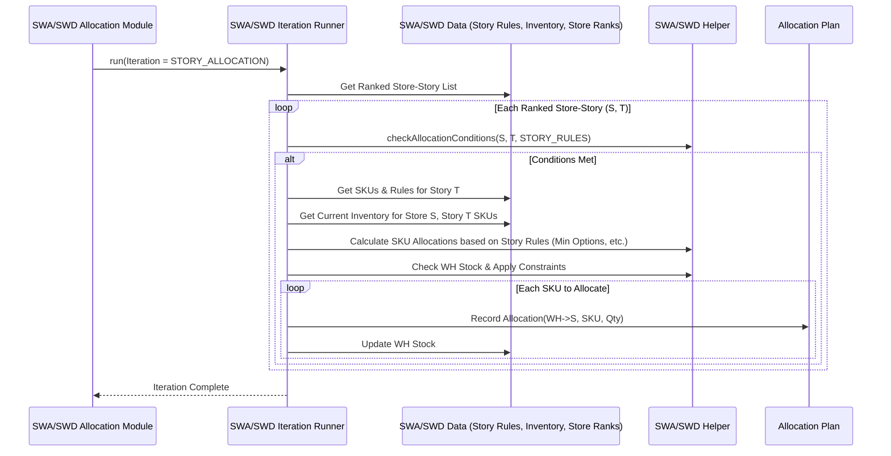

# Chapter 53: Story-Based Distribution Modules

Welcome back! In the [previous chapter](52_eoss_distribution_module_.md), we explored the specialized **EOSS Distribution Module**, designed to handle the unique challenges of clearing out inventory during end-of-season sales. We saw how it adapts the standard distribution process with different rules and goals.

Now, let's consider another special scenario. Sometimes, inventory isn't just a collection of individual items; it's part of a **marketing story** or a **curated collection**. Think about a "Back to School" campaign, a "Holiday Gift Guide" collection, or a specific designer collaboration like "Summer Vacation Essentials".

## What Problem Does This Module Solve?

Imagine you're launching that new "Summer Vacation Essentials" collection. This "story" includes specific swimwear styles, sunglasses, beach towels, and sandals. You want to ensure that stores participating in this promotion receive a *complete set* or at least a representative range of items from this collection to create an effective display and tell the intended story to the customer.

Regular distribution ([Chapter 46: Distribution Module](46_distribution_module_.md)) focuses on replenishing individual items based on their sales rate or target stock levels. It might send lots of the best-selling swimsuit from the collection but forget the matching beach towel, breaking the story. EOSS distribution ([Chapter 52: EOSS Distribution Module](52_eoss_distribution_module_.md)) focuses on clearing stock, which is irrelevant for a new collection launch.

How do we distribute inventory specifically to support these curated collections or marketing stories, ensuring that the right *combination* of products reaches the right stores?

The **Story-Based Distribution Modules** (like `SWAAllocationModule` for Story-Wise Allocation or `SWDAllocationModule` for Story-Wise Display, orchestrated by group modules like `StoryWiseAllocationGroupModule` or `StoryWiseDisplayGroupModule`) solve this problem. They provide a way to allocate or replenish inventory based on pre-defined **"stories"** or **"collections"**, rather than just individual item performance. The goal is to ensure stores receive a cohesive set of products that belong together according to the marketing or merchandising plan.

## Core Concepts

1.  **Story/Collection Definition:** First, we need to define which products belong to which story. This is usually done through input data (`StoryStyleListRow`, `StoryCatMinOptionsRow`, `StoryCatCombinationsRow`) that lists:
    *   The Story ID/Name (e.g., "SUMMER24", "BackToSchool").
    *   Which SKUs/Styles are part of which Story (and maybe Sub-Story).
    *   Which Stores are supposed to carry which Stories.
    *   Potentially, rules like "must have at least X options from Category Y within this Story" (`StoryCatMinOptionsRow`) or which categories need to be presented together (`StoryCatCombinationsRow`).

2.  **Story-Level Allocation:** Instead of allocating SKU by SKU based solely on individual performance, the logic considers the story first. It tries to allocate a *balanced set* of items from the story to the designated stores.

3.  **Completeness & Priority:** The logic might aim to ensure a certain level of "story completeness" in each store, potentially prioritizing certain combinations of categories within the story or specific styles defined as key to the story. Stores designated as key story locations might get stock first (`StoreStorySubStoryRankingRow`).

4.  **Integration:** Story-based allocation might be an initial distribution step for a new collection, or it might be a specific iteration *within* the regular distribution process to ensure story integrity is maintained during replenishment.

## How It Works (The Workflow - Conceptual)

The exact workflow depends on whether it's an initial allocation (like `SWA`) or focused on display (`SWD`). Let's consider a general flow:

1.  **Load Story Data:** The preparation module (e.g., `SWAPrepareDataModule`) reads the story definitions, store mappings, category combinations, and minimum option rules. This data is stored in a specialized data holder (like `SWA` or `SWD`).
2.  **Identify Needs:** Determine which stores need items from which stories based on the mappings, rules, and current store inventory.
3.  **Prioritize Stories/Stores:** Rank the stories and/or the Store-Story combinations based on input rankings (`StoreStorySubStoryRankingRow`).
4.  **Allocate by Story (`SWAAllocationModule` / `SWDAllocationModule`):** Iterate through the prioritized stories or store-story combinations.
    *   Check available warehouse stock for SKUs belonging to the current story/sub-story.
    *   Determine the set of SKUs and quantities needed to fulfill the story requirements (e.g., minimum category options, target quantity) in the target store, considering available stock.
    *   Allocate the required items from the warehouse, ensuring the allocation respects the "story" concept (e.g., fulfilling category combinations or minimums). This step uses an iteration runner (`SWAIterationRunner` / `SWDIterationRunner`) which applies story-specific constraints.
5.  **Update Stock:** Decrease warehouse stock and record the story-driven allocations.
6.  **Generate Outputs (`SWAOutputModule` / `SWDOutputModule`):** Create reports detailing the story-based allocations (e.g., `SWAOutputRow`).

**Inputs:**
*   Story Definitions & Rules: `StoryStyleListRow`, `StoryCatMinOptionsRow`, `StoryCatCombinationsRow`, `StoreStorySubStoryRankingRow`.
*   Current Inventory Data (WH, Store).
*   Product/Store Master Data ([Cache](05_cache_.md)).
*   Configuration related to story allocation (e.g., `SWAArgs`).

**Outputs:**
*   Allocation Plan: Rows detailing which SKUs were allocated to which stores specifically *because* of a story requirement (e.g., `SWAOutputRow`, or `DistOutputRow` flagged appropriately).
*   Updated Inventory State: Warehouse stock is reduced.

This story-based allocation ensures that merchandising intent is reflected in the final distribution.

## Under the Hood: Story Data and Allocation Iteration

The key differences from standard distribution lie in the data structures used and the rules applied during allocation iterations.

**1. Story Data Structures (`SWA.java` / `SWD.java`):**
   These classes extend the `BaseDistributionData` but add maps specifically for handling stories.

```java
// Simplified from SWA.java / SWD.java (concepts are similar)
// They extend BaseDistributionData, adding story-specific maps:

@Component("swa") // Or @Component("swd")
public class SWA extends BaseDistributionData {
    // Map: StoryName -> (SubStoryName -> List<StyleID>)
    private Map<String, Map<String, List<Integer>>> storyData;
    // Map: StoryName -> (CategoryName -> MinOptionsRequired)
    private Map<String, Map<String, Integer>> storyCatMinOptions;
    // Map: StoreID -> StoryName -> RankingData
    private Map<Key, StoreStoryRankingData> storeStoryStats;
    // Ranked List of Store-Story combinations to process
    private List<Key> storeStories; // Key(StoreID, StoryName)
    // Map: StyleID -> StoryName
    private Map<Integer, String> styleToStory;
    // Map: StyleID -> SubStoryName
    private Map<Integer, String> styleToSubStory;

    // Methods to add/get story data (e.g., addStory, getSubStories, getStyles)
    public void addStory(String story, String subStory, int style) {
        storyData.computeIfAbsent(story, e -> new HashMap<>())
                .computeIfAbsent(subStory, e -> new ArrayList<>()).add(style);
        styleToStory.put(style, story);
        styleToSubStory.put(style, subStory);
    }
    // ... other getters/setters ...
}
```
**Explanation:** These data holders store the definitions: which styles belong to which story/sub-story, the minimum options needed per category within a story, and the ranked order in which stores should receive stories. This structure allows the allocation logic to easily access story-specific rules and members.

**2. Orchestration (`StoryWiseAllocationGroupModule` / `StoryWiseDisplayGroupModule`):**
   These modules coordinate the specific steps needed for story-based allocation/display.

```java
// Simplified from StoryWiseAllocationGroupModule.java
@Component
public class StoryWiseAllocationGroupModule extends AbstractUtilModuleGroup {
    // Inject SWA specific modules
    @Autowired private SWAPrepareDataModule swaPrepareDataModule;
    @Autowired private SWAPrepareSalesModule swaPrepareSalesModule;
    @Autowired private SWAComputeRevenueModule swaComputeRevenueModule;
    @Autowired private SWARankingModule swaRankingModule;
    @Autowired private SWAAllocationModule swaAllocationModule; // Core SWA logic
    @Autowired private SWAOutputModule swaOutputModule;
    // ... standard snapshot/sync ...

    @PostConstruct
    public void init() {
        captureSnapshot();
        add(swaPrepareDataModule);    // Load story definitions & stock
        add(swaPrepareSalesModule);   // Load sales
        add(swaComputeRevenueModule); // Compute metrics
        add(swaRankingModule);        // Rank Store-Story combinations
        add(swaAllocationModule);     // <<< Allocate based on story rules
        add(swaOutputModule);         // Generate output
        uploadOutput();
    }
    // ... capture/upload methods ...
}
```
**Explanation:** Similar to other group modules, this defines the sequence. Note the `SWARankingModule` likely ranks `Store-Story` pairs, and `SWAAllocationModule` performs the core allocation guided by story rules.

**3. Allocation Logic (`SWAAllocationModule` / `SWDAllocationModule`):**
   These modules often use a specialized iteration runner that understands story constraints.

```java
// Simplified from SWAAllocationModule.java / SWDAllocationModule.java

@Component // e.g., @Component("swaAllocation")
public class SWAAllocationModule extends AbstractAllocationModule {

    // Uses SWA/SWD specific runner, data, args, helper
    @Autowired @Qualifier("swaIterationRunner") // Or "swdIterationRunner"
    private SWAIterationRunner iterationRunner;
    @Autowired @Qualifier("swa") // Or "swd"
    private SWA swa;
    @Autowired @Qualifier("swaHelper") // Or "swdHelper"
    private SWAHelper swaHelper;

    @Override
    protected void init(Properties properties) {
        // Initialize with SWA/SWD components
        args = new SWAArgs(properties); // Story-specific args
        distributionData = swa;
        helper = swaHelper;
        iteration = new Iteration(args); // Base iteration constraints
        // ...
        baseIterationRunner = iterationRunner; // Use the story-specific runner
    }

    @Override
    protected void runIterations(Properties properties, boolean isIst) {
        // Runs a specific iteration focused on story allocation
        // The exact iteration type (e.g., STORY_ALLOCATION_ITERATION) tells
        // the runner which rules to apply from the constraints.
        runIteration(properties, DistributionIteration.STORY_SUB_STORY_ALLOCATION_ITERATION);
        // ... potentially persist intermediate outputs ...
    }
    // ...
}
```
**Explanation:** The key here is that the allocation module uses a story-specific iteration runner (`SWAIterationRunner` or `SWDIterationRunner`) and helper (`SWAHelper` / `SWDHelper`). The `runIterations` method calls `runIteration` with a specific `DistributionIteration` type (like `STORY_SUB_STORY_ALLOCATION_ITERATION`). The runner then processes the ranked list (likely Store-Story combinations) and applies allocation logic that considers the story definitions, minimum category options, combinations, and other rules defined in the helper and constraints.

**Sequence Diagram (Conceptual Story Allocation Iteration):**


**Explanation:** The diagram shows the allocation module invoking the story-specific runner. The runner iterates through ranked Store-Story combinations. For each, it uses the helper to check conditions based on story rules. If eligible, it calculates the necessary SKU allocations to fulfill the story requirements (e.g., minimum options per category), checks stock, records the allocation, and updates inventory.

## Conclusion

**Story-Based Distribution Modules** (like `SWAAllocationModule` and `SWDAllocationModule`) add a crucial layer of merchandising intelligence to the distribution process.

*   They allow inventory to be allocated based on **curated collections, marketing stories, or display requirements**, ensuring brand vision is executed in stores.
*   They use specific **story definitions** (styles, stores, rules) as input.
*   The allocation logic prioritizes **story completeness** (e.g., minimum options per category, category combinations) alongside inventory availability.
*   They often run as specialized iterations within the broader distribution framework, using dedicated data holders (`SWA`, `SWD`) and helpers.

By incorporating story context, these modules ensure that distribution doesn't just fill stock based on individual item performance but also supports strategic merchandising initiatives and consistent brand presentation.

After planning our buys and distributing inventory strategically (considering regular replenishment, EOSS, and stories), how do we manage prices and potentially apply discounts dynamically during the selling season?

[Next Chapter: Dynamic Discounting Module](54_dynamic_discounting_module_.md)
```

---

Generated by [AI Codebase Knowledge Builder](https://github.com/The-Pocket/Tutorial-Codebase-Knowledge)