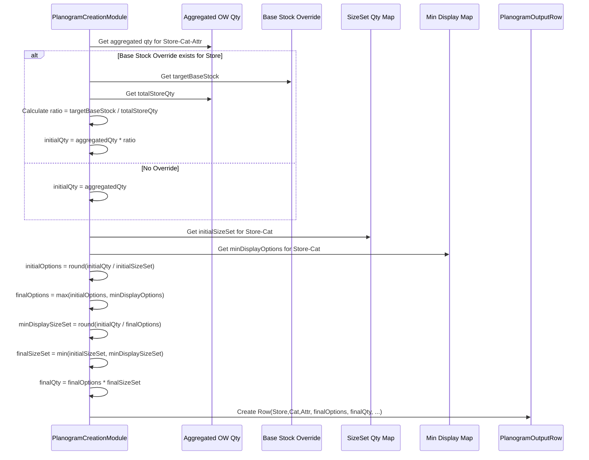

# Chapter 57: Planogram Creation Module

Welcome back! In the [previous chapter](56_gap_analysis_module_.md), we looked at the **Gap Analysis Module**, which helps us compare our plans to actual results and understand where things went differently than expected, like identifying when key sizes were missing.

Now, let's shift focus back to planning. We've calculated the Optimum Width (how many different styles/options) and have planned quantities (depth/OTB). How do we represent the *intended* look and stocking levels for a product group on the shelf? This involves creating a planogram output.

## What Problem Does This Module Solve?

Imagine you're an interior designer planning a bookshelf display for a client. You know the client wants 5 types of decorative items (the "width" or "options") and has space for about 30 items total (the "depth" or "quantity"). Your job is to create a plan that specifies this: "Bookshelf Section A: 5 options, 30 units total". This plan guides the final setup.

Similarly, in retail, after calculating the ideal number of styles (options) and the total planned quantity (stocks/depth) for a product group (like "BrandX T-shirts in Store 101"), we need to finalize and output this plan in a structured way. This structured plan, often reflecting targets for specific attributes on the shelf, is represented by the output of the **Planogram Creation Module**.

This module doesn't physically draw the shelf layout. Instead, it solves the problem of taking calculated planning figures (like the total quantity derived from the OTB calculation in the Optimum Width module) and potentially adjusting them based on higher-level constraints or rules (like minimum display requirements or overall store stock targets) to produce a final plan for the number of **options (width)** and total **quantity (depth)** at a specific planogram level (e.g., Store-Category-Attribute).

## Core Idea: Finalizing Options and Quantity at Planogram Level

Think of this module as finalizing the order details before sending them to the shelf stockers. It takes the detailed calculations from previous steps (especially the planned OTB quantity from the Optimum Width analysis) and performs these key actions:

1.  **Aggregate Quantity:** It sums up the planned quantities (e.g., `OwOutputRow.otbQty`) for all Attribute Groups ([AgRow](16_agrow_.md)) that fall under a specific **Planogram Attribute** (like Brand, Collection, or another designated attribute) within a Store and Category.
2.  **Apply Overrides/Redistribution (Optional):** If the business has set overall "base stock" targets for a store (`BaseStocksOverrideRow`), this module might redistribute the aggregated quantity proportionally across the different planogram attributes within that store to align with the base stock target.
3.  **Calculate Initial Options:** Based on the (potentially redistributed) quantity for a Store-Category-Attribute group and the required minimum depth per option (derived from `SizeSetQtyRow`), it calculates an initial number of options (styles). `Initial Options = Total Qty / Min Depth per Option (Size Set)`.
4.  **Apply Minimum Display Options:** It checks if the calculated `Initial Options` meets the minimum display requirement (`OtbMinDisplayRow`) for that Store-Category. The `Final Options` becomes the *maximum* of the calculated initial options and the minimum display requirement.
5.  **Calculate Final Quantity:** The `Final Quantity` is recalculated based on the `Final Options` and the necessary depth per option (`Final Size Set`, which might be adjusted if minimum display options forced the initial quantity to be spread thinner). `Final Quantity = Final Options * Final Size Set`.

This process results in a finalized plan (`PlanogramOutputRow`) specifying the target number of distinct styles (`finalOptions`) and the total units (`finalQty`) for each planning group (Store-Category-Attribute).

## How It Works (The Workflow)

The Planogram Creation process is typically run after the Optimum Width calculations are complete, as it uses the planned OTB quantity (`OwOutputRow.otbQty`) as a primary input. It's managed by the `PlanogramCreationGroupModule`.

**Orchestration by `PlanogramCreationGroupModule`:**
This group module is very simple, usually just running the main calculation module between standard snapshot and sync steps.
1.  Snapshot Inputs.
2.  Run `PlanogramCreationModule`: Performs the aggregation, redistribution, and final option/quantity calculation.
3.  Sync Outputs.

**Inputs (Used by `PlanogramCreationModule`):**
*   **OW Output (`OwOutputRow`):** Provides the planned quantity (`otbQty`) per Store-AG ([Chapter 32](32_optimum_width__ow__module__apowgroupmodule__.md)).
*   **Attribute Group Info (`AgRow`):** Used to link `OwOutputRow` to categories and planogram attributes ([Chapter 16](16_agrow_.md)).
*   **Size Set Minimums (`SizeSetQtyRow`):** Defines the minimum depth needed per option ([Chapter 9](09_row_input_output_classes_.md)).
*   **Min Display Options (`OtbMinDisplayRow`):** Defines the minimum number of options required ([Chapter 39](39_otb_style_options_adjustment_.md) context).
*   **Base Stock Overrides (`BaseStocksOverrideRow`):** Optional store-level total stock targets for redistribution.
*   **Configuration (`CommonArgs`):** Specifies which attribute level to use for planogram grouping (e.g., `planogramAttribute`).
*   Product/Store Master Data ([Cache](05_cache_.md)).

**Outputs:**
*   **`PlanogramOutputRow`:** The core output, detailing the final planned `finalOptions` (width) and `finalQty` (depth) for each Store-Category-Attribute combination.
    ```java
    // File: src/main/java/com/increff/irisx/row/output/planogramCreation/PlanogramOutputRow.java
    package com.increff.irisx.row.output.planogramCreation;

    public class PlanogramOutputRow {
        public int store;
        public String category;
        public String attribute; // The planogram attribute level (e.g., Brand)
        public int minDisplayOptions; // Minimum display required
        public int initialSizeSet;   // Min depth per option from SizeSetQtyRow
        public int finalSizeSet;     // Final depth per option used
        public int finalOptions;     // <<< Final Recommended Width/Options
        public int finalQty;         // <<< Final Recommended Quantity/Depth
        public int initialQty;       // Qty after aggregation & base stock adjustment
        public int initialOptions;   // Options calculated from initialQty & initialSizeSet

        // Constructors...
    }
    ```
*   **`ExportPlanogramOutputRow`:** A user-friendly, denormalized export format often containing store codes, channel info, etc.

## Under the Hood: Aggregation and Adjustment

The `PlanogramCreationModule` orchestrates the calculations.

**1. Load Helper Maps:**
   The module starts by loading the Size Set minimums, Minimum Display options, and Base Stock overrides into easily accessible maps.

   ```java
   // Simplified from PlanogramCreationModule.java
   private HashMap<Key, Integer> storeCatSizeSetMap;
   private HashMap<Key, Integer> storeCatMinDisplayOptionMap;
   private HashMap<Integer, Integer> storeBaseStocksMap;

   // Called in runInternal()
   private void createStoreCatSizeSetMap() {
       storeCatSizeSetMap = new HashMap<>();
       for (SizeSetQtyRow sizeSetRow : db().select(SizeSetQtyRow.class)) {
           Key storeCatKey = new Key(sizeSetRow.storeId, sizeSetRow.category);
           // Get max size set value if multiple defined for same store/cat
           int sizeSet = storeCatSizeSetMap.getOrDefault(storeCatKey, 0);
           storeCatSizeSetMap.put(storeCatKey, Math.max(sizeSet, sizeSetRow.sizeDepthNormalizationValue));
       }
   }
   // Similar methods: createStoreCatMinDisplayOptionsMap, createBaseStockOverrideMap
   ```
   **Explanation:** Helper methods read the configuration rows (`SizeSetQtyRow`, `OtbMinDisplayRow`, `BaseStocksOverrideRow`) and create maps for fast lookup based on Store/Category or Store keys.

**2. Aggregate OTB Quantity by Planogram Attribute (`calculateStoreCatAttributeQty`):**
   This step sums up the planned quantities from OW output based on the chosen planogram attribute level.

   ```java
   // Simplified from PlanogramCreationModule.java
   private HashMap<Integer, StoreCatPlanogram> storeCatPlanogramMap; // Store -> Cat -> Attribute -> Qty

   private void calculateStoreCatAttributeQty() {
       storeCatPlanogramMap = new HashMap<>();
       List<OwOutputRow> owOutputRows = db().select(OwOutputRow.class);
       // Simplified: Assume only one period in OW output for planogram

       for (OwOutputRow row : owOutputRows) {
           StoreCatPlanogram catPlanogram = storeCatPlanogramMap
               .computeIfAbsent(row.store, storeId -> new StoreCatPlanogram(storeId));
           AgRow agRow = cache.getAgRow(row.ag);
           // Get the specific attribute value (e.g., Brand) from the AG
           String attributeValue = view.getAttributeFromAg(agRow, commonArgs.planogramAttribute);
           // Add the quantity from OW output to the correct store/cat/attribute bucket
           catPlanogram.addStoreCatAttributeQty(agRow.cat, attributeValue, row.otbQty);
       }
   }
   // StoreCatPlanogram class has internal map: Map<Category, Map<Attribute, Double(Qty)>>
   ```
   **Explanation:** It iterates through the `OwOutputRow` results. For each row, it identifies the store, category, and the value of the designated `planogramAttribute` (e.g., "BrandX"). It then adds the `row.otbQty` to a running total for that specific Store-Category-Attribute combination, stored within the nested `storeCatPlanogramMap`.

**3. Redistribute Quantity by Base Stock (Optional) (`redistributeQty`):**
   If base stock overrides exist, this step adjusts the aggregated quantities.

   ```java
   // Simplified from PlanogramCreationModule.java
   private void redistributeQty() {
       storeCatPlanogramMap.forEach((store, storeCatPlanogram) -> {
           // Get the target base stock for this store (if any)
           int baseStocks = storeBaseStocksMap.getOrDefault(store, 0);
           if (baseStocks == 0) return; // No override for this store

           // Calculate the current total aggregated quantity for the store
           double totalQty = storeCatPlanogram.catAttributeQtyMap.values().stream()
               .flatMap(attrQtyMap -> attrQtyMap.values().stream())
               .mapToDouble(qty -> qty).sum();

           // Calculate the ratio needed to scale to the base stock target
           double ratio = MathUtil.divide(baseStocks, totalQty); // Safe division

           // Apply the ratio to every attribute's quantity within the store
           storeCatPlanogram.catAttributeQtyMap.forEach((category, attrQtyMap) ->
               attrQtyMap.forEach((attribute, qty) ->
                   attrQtyMap.put(attribute, qty * ratio) // Scale quantity
               )
           );
       });
   }
   ```
   **Explanation:** It loops through each store. If a `baseStocks` override exists, it calculates the total quantity currently aggregated for that store across all categories/attributes. It finds the ratio (`baseStocks / totalQty`) needed to hit the target. It then multiplies every aggregated quantity within that store by this ratio, proportionally scaling everything up or down to match the overall store target.

**4. Calculate Final Options and Quantity (`calculateOptions`):**
   This is the final calculation step, applying size set and minimum display rules.

   ```java
   // Simplified from PlanogramCreationModule.java
   private ArrayList<PlanogramOutputRow> planogramOutputRows;

   private void calculateOptions() {
       planogramOutputRows = new ArrayList<>();
       // Loop through the aggregated quantities (Store -> Cat -> Attribute -> Qty)
       storeCatPlanogramMap.forEach((store, storeCatPlanogram) ->
           storeCatPlanogram.catAttributeQtyMap.forEach((cat, attributeQtyMap) -> {
               Key storeCatKey = new Key(store, cat);
               // Get SizeSet (min depth/option) & Min Display Options for this Store/Cat
               int initialSizeSet = storeCatSizeSetMap.getOrDefault(storeCatKey, 0);
               int minDisplayOptions = storeCatMinDisplayOptionMap.getOrDefault(storeCatKey, 0);

               attributeQtyMap.forEach((attribute, qty) -> {
                   PlanogramOutputRow outputRow = new PlanogramOutputRow(store, cat, attribute);
                   outputRow.initialSizeSet = initialSizeSet;
                   outputRow.minDisplayOptions = minDisplayOptions;
                   outputRow.initialQty = (int) Math.round(qty); // Qty after aggregation/redistribution

                   // Calculate initial options based on size set
                   outputRow.initialOptions = (int) Math.round(
                       MathUtil.divide(outputRow.initialQty, initialSizeSet));

                   // --- Determine Final Options ---
                   // Must be at least min display, but not less than initially calculated
                   outputRow.finalOptions = Math.max(minDisplayOptions, outputRow.initialOptions);

                   // --- Determine Final Size Set (Depth per Option) ---
                   // Try to spread initial Qty over required final Options
                   int minDisplaySizeSet = (int) MathUtil.divide(
                       outputRow.initialQty, outputRow.finalOptions); // Use finalOptions here
                   // Final size set cannot exceed the original initialSizeSet,
                   // but might be reduced if finalOptions increased due to min display.
                   outputRow.finalSizeSet = (outputRow.finalOptions == 0) ? 0 :
                       Math.min(initialSizeSet, minDisplaySizeSet);

                   // --- Calculate Final Quantity ---
                   outputRow.finalQty = outputRow.finalOptions * outputRow.finalSizeSet;

                   planogramOutputRows.add(outputRow);
               });
           })
       );
   }
   ```
   **Explanation:** This core method iterates through each final Store-Category-Attribute quantity (`initialQty`). It retrieves the `initialSizeSet` (min depth per option) and `minDisplayOptions`. It calculates `initialOptions` based on `initialQty / initialSizeSet`. Then, `finalOptions` is determined by taking the *maximum* of `initialOptions` and `minDisplayOptions`. The `finalSizeSet` (depth per option) is calculated by trying to spread the `initialQty` across the `finalOptions`, but capped by the original `initialSizeSet`. Finally, `finalQty` is simply `finalOptions * finalSizeSet`.

**Sequence Diagram (Simplified Calculation for one Store-Cat-Attr):**



## Conclusion

The **Planogram Creation Module** finalizes the assortment plan width and depth at a specific planning attribute level (like Brand).

*   It **aggregates** planned buy quantities (from OW output) based on the chosen planogram attribute.
*   It can optionally **redistribute** these quantities based on store-level base stock targets.
*   It calculates the **final number of options (width)** and the **final total quantity (depth)** for each Store-Category-Attribute group, ensuring consistency with **minimum display requirements** and **size set depths**.
*   The key output is the **`PlanogramOutputRow`**, which provides a clear target for width and depth at the planogram level, guiding visual merchandising and final inventory placement.

This module acts as a bridge, translating calculated quantities into a structured plan ready for execution and display planning.

With our plan finalized, including width, depth, OTB, distribution, and potentially discounts, we often need ways to easily view and analyze this data, which might involve joining information from different output tables.

[Next Chapter: Denormalization Helpers](58_denormalization_helpers_.md)
```

---

Generated by [AI Codebase Knowledge Builder](https://github.com/The-Pocket/Tutorial-Codebase-Knowledge)