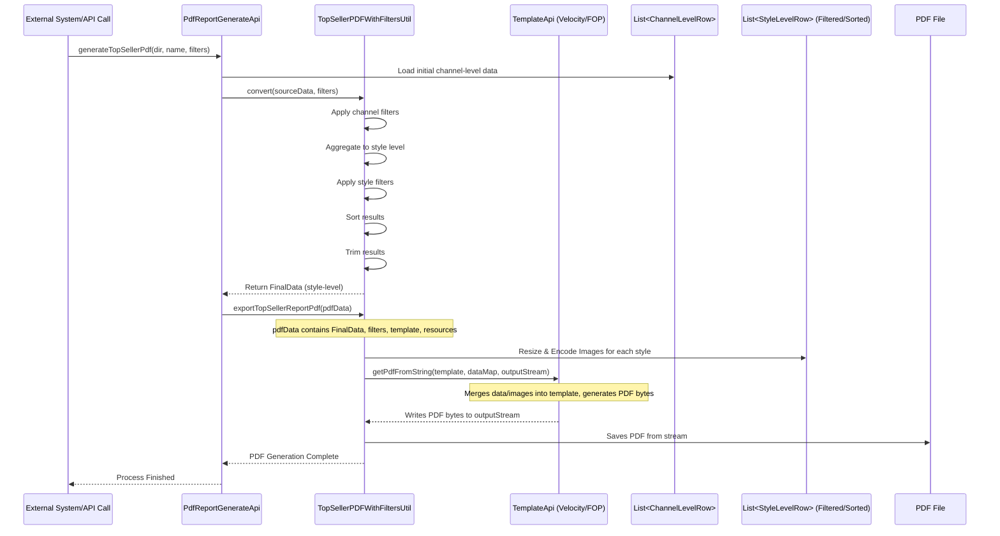
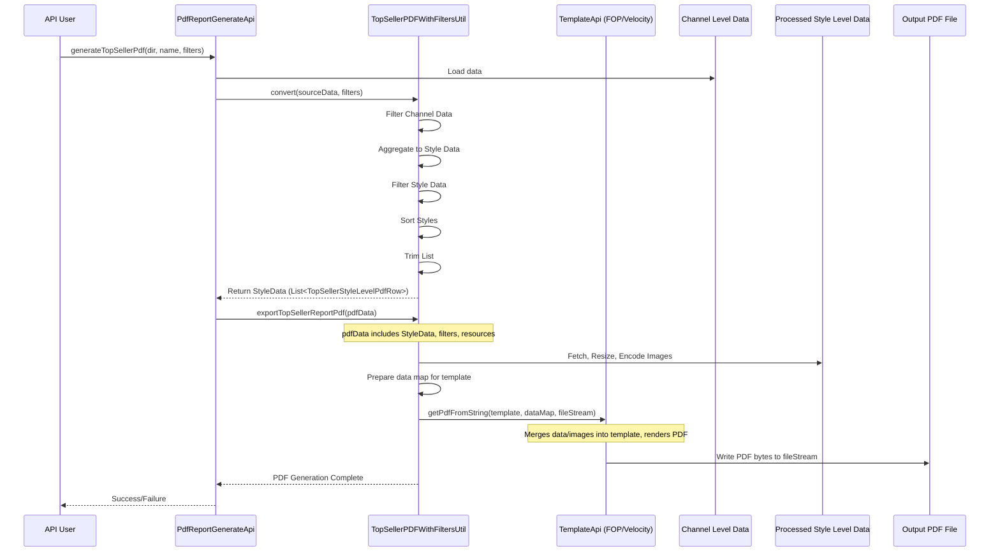

# Chapter 60: Top Seller PDF Report Generation

Welcome! In the [previous chapter](59_bi_data_preparation_module_.md), we learned how the **BI Data Preparation Module** gets data ready for analysis in Business Intelligence tools by summarizing it weekly or monthly. This is great for dashboards and finding trends.

But sometimes, you don't need an interactive dashboard; you need a polished, shareable report – like a PDF document highlighting the absolute best-selling products based on specific criteria. Imagine needing a quick snapshot for a meeting showing the Top 20 bestsellers in the "Women's Dresses" category for the "Online" channel last month, complete with product images.

## What Problem Does This Concept Solve?

While BI tools are powerful for exploration, creating specific, consistently formatted reports with embedded images directly from them can sometimes be tricky or require extra setup. Furthermore, you might want to generate these reports automatically as part of a regular process, perhaps emailed to managers.

The raw outputs from our planning modules or even the BI data might be just tables of numbers and IDs. How do we transform that into a visually appealing, easy-to-read PDF document that highlights key top-selling items, includes product pictures, and allows users to filter and sort the results dynamically when generating the report?

**Top Seller PDF Report Generation** solves this problem. It's a dedicated process within `irisx-algo` designed to:
1.  Take performance data (often aggregated at a style-channel level).
2.  Apply user-defined filters (like category, brand, channel).
3.  Aggregate data further to the style level.
4.  Sort the styles based on chosen metrics (like Rate of Sale, Revenue, Quantity Sold).
5.  Fetch, resize, and encode product images.
6.  Use a predefined template to format all this information, including images.
7.  Generate a finished PDF file.

Think of it like having a specialized desktop publishing tool integrated into the system. It takes raw data and, following specific instructions (filters, sorting) and a design layout (template), produces a professional PDF report.

## Core Idea: Filter, Aggregate, Sort, Format, Publish

The process follows a clear pipeline to transform raw data into a polished PDF:

1.  **Start with Detailed Data:** Begin with data showing performance at a relatively granular level, like `TopSellerStyleChannelLevelPdfRow`, which contains metrics for each style within each sales channel.
2.  **Filter (Channel Level):** Apply initial filters provided by the user, such as selecting only specific channels (`channel`) or styles that were available for a minimum number of days (`minLiveDays`).
3.  **Aggregate to Style Level:** Combine the filtered channel-level data to get a single performance summary for each style across the selected channels. This involves summing quantities and revenues, averaging rates (like ROS), and potentially counting the number of channels or stores the style appeared in. This results in `TopSellerStyleLevelPdfRow` objects.
4.  **Filter (Style Level):** Apply further filters directly to the aggregated style-level data, such as selecting specific categories (`category`), brands (`brand`), seasons (`season`), genders (`gender`), or specific performance thresholds (like minimum Sell-Through Rate - STR).
5.  **Sort:** Arrange the filtered list of styles based on a user-specified criterion, like highest Rate of Sale first (`ros_dec`), highest revenue (`revenue_dec`), highest quantity (`qty_dec`), or ascending versions (`_inc`).
6.  **Trim:** Limit the final list to a specific number of records (e.g., Top 50) suitable for the report format.
7.  **Image Processing:** For each style in the final list, retrieve its image URL, download the image, resize it to fit the report template, and encode it (usually in Base64 format) so it can be embedded directly in the PDF definition. Handle cases where images are missing.
8.  **Template Rendering:** Use a template engine (like Apache Velocity combined with Apache FOP - Formatting Objects Processor) to merge the final, sorted list of styles (including encoded images) and the filter parameters used into a predefined layout template (often an `.fo` or `.vm` file).
9.  **PDF Generation:** The template engine processes the merged data and template, generating the final PDF output file.

## How It Works (The Workflow)

This functionality is often exposed through an API or a specific module trigger. A user or another system provides the source data and the desired filtering/sorting parameters, and the system generates the PDF.

**Key Components/Inputs:**
*   **Source Data:** A list of `TopSellerStyleChannelLevelPdfRow` objects (presumably generated by an upstream process like BI Prep or a dedicated aggregation).
*   **Filters (`Map<String, List<String>> filters`):** A map specifying the filtering criteria. Keys might be "channel", "category", "brand", "minLiveDays", "minStrPercentage", etc. Values are lists of strings representing allowed values or thresholds.
*   **Sorting (`filters.get("sort_by")`):** A string like "ros_dec", "revenue_inc".
*   **Record Limit (`filters.get("no_of_records")`):** The maximum number of styles to include (e.g., "50").
*   **Template Files:** The `.fo` or `.vm` template defining the PDF layout, structure, fonts, etc.
*   **Image Resources:** URLs in the style data, a placeholder image for missing ones, potentially a company logo.
*   **Output Location:** Directory path and filename for the generated PDF.

**Process Flow (Conceptual):**
1.  An external system calls the `PdfReportGenerateApi.generateTopSellerPdf` method, providing the output directory, filename, and the `filters` map.
2.  The API reads the source `TopSellerStyleChannelLevelPdfRow` data (e.g., from `ImDb`).
3.  It calls `TopSellerPDFWithFiltersUtil.convert`, passing the data and filters.
4.  The Utility performs the sequence: filter channel data -> aggregate to style -> filter style data -> sort -> trim.
5.  The API then prepares a `TopSellerPdfData` object containing the filtered/sorted style list, filter parameters, and input streams for template/image resources.
6.  It calls `TopSellerPDFWithFiltersUtil.exportTopSellerReportPdf`, passing the `TopSellerPdfData`.
7.  The Utility handles image resizing/encoding and calls `TemplateApi.getPdfFromString` (from `common-templates`) to merge data with the template and generate the final PDF file in the specified location.

## Under the Hood: The Utility and Template Engine

The core logic resides in the `TopSellerPDFWithFiltersUtil` class, which orchestrates the data manipulation and interacts with a separate template processing library.

**Sequence Diagram (Simplified PDF Generation):**



**Key Steps in the Utility:**

*   **Filtering (`applyFiltersAtStyleChannelLevel`, `applyFiltersAtStyleLevel`):** These methods use Java Streams and helper functions (`filterAt...`) to check if each row meets the criteria specified in the `filters` map. Helper functions like `doesFilterContains` handle checking if a value exists in the filter list.
*   **Aggregation (`convertToStyleLevel`):** This method iterates through the filtered channel-level list. It uses a `Map<String, TopSellerStyleLevelPdfRow>` to accumulate values. For each channel-level row, it finds or creates the corresponding style-level row in the map and adds the quantities, revenues, etc., recalculating averages like ROS or STR as it goes.
*   **Sorting (`sortResults`):** Uses `List.sort()` with custom `Comparator`s based on the `sortBy` filter value (e.g., `Comparator.comparingDouble(TopSellerStyleLevelPdfRow::getHealthyRos).reversed()`).
*   **Image Handling (`resizeImagesAndEncodeIntoBase64`, `resizeImage`, `encodeImage`):** Uses standard Java `ImageIO` and `Graphics2D` to download images from URLs, resize them to fixed dimensions, and then encode the image data into a Base64 string prefixed with `data:image/jpeg;...`. This Base64 string can be directly embedded in the FOP template.
*   **Template Processing (`exportTopSellerReportPdf`):** Creates a data `HashMap` containing the final list of styles (`results`) and the filter parameters (`params`). It reads the template file content and passes the template string and the data map to `TemplateApi.getPdfFromString` (provided by a common library), which handles the complex task of merging the data and generating the PDF output stream.

**Code Dive:**

*   **API Entry Point (`PdfReportGenerateApi.java`):**
    ```java
    // Simplified from PdfReportGenerateApi.java
    @Component
    public class PdfReportGenerateApi {
        @Autowired private ImDb imDb; // Access to loaded data

        public void generateTopSellerPdf(String directory, String fileName, Map<String, List<String>> filters) throws IOException {
            try {
                // 1. Load source data
                ArrayList<TopSellerStyleChannelLevelPdfRow> sourceData = imDb.select(TopSellerStyleChannelLevelPdfRow.class);
                // 2. Filter, aggregate, sort using the utility
                List<TopSellerStyleLevelPdfRow> styleLevelData = TopSellerPDFWithFiltersUtil.convert(sourceData, filters);
                // 3. Prepare data bundle for PDF generation
                TopSellerPdfData pdfData = readDataAndResourcesForPdf(directory, fileName, filters, styleLevelData);
                // 4. Call utility to generate the PDF
                TopSellerPDFWithFiltersUtil.exportTopSellerReportPdf(pdfData);
            } catch (Exception e) { /* ... error handling ... */ }
        }

        // Helper to load template/image resources
        private TopSellerPdfData readDataAndResourcesForPdf(...) { /* ... loads streams ... */ }
        private InputStream loadResources(String path) { /* ... loads resource stream ... */ }
    }
    ```
    **Explanation:** The API orchestrates the process: load data, call the utility's `convert` method to process the data, prepare the `TopSellerPdfData` bundle, and call the utility's `exportTopSellerReportPdf` method to generate the file.

*   **Core Utility Logic (`TopSellerPDFWithFiltersUtil.java`):**
    ```java
    // Simplified from TopSellerPDFWithFiltersUtil.java
    public class TopSellerPDFWithFiltersUtil {

        // Main data processing pipeline
        public static List<TopSellerStyleLevelPdfRow> convert(List<TopSellerStyleChannelLevelPdfRow> channelData, Map<String, List<String>> filters) {
            List<TopSellerStyleChannelLevelPdfRow> filteredChannelData = applyFiltersAtStyleChannelLevel(channelData, filters);
            List<TopSellerStyleLevelPdfRow> styleData = convertToStyleLevel(filteredChannelData);
            List<TopSellerStyleLevelPdfRow> filteredStyleData = applyFiltersAtStyleLevel(styleData, filters);
            List<TopSellerStyleLevelPdfRow> sortedData = sortResults(filteredStyleData, filters.get("sort_by"));
            List<TopSellerStyleLevelPdfRow> trimmedData = trimResults(sortedData, filters.get("no_of_records"));
            return trimmedData;
        }

        // PDF Generation Trigger
        public static void exportTopSellerReportPdf(TopSellerPdfData topSellerPdfData) throws IOException {
            // 1. Encode placeholder images (logo, no-image)
            String noImageAvailable = encodeImage(ImageIO.read(topSellerPdfData.getNoImageAvailable()));
            String increffImage = encodeImage(ImageIO.read(topSellerPdfData.getIncreffLogo()));
            // 2. Read the FOP template content
            String fopTemplateString = readPdfTemplate(topSellerPdfData.getFopTemplateString());
            // 3. Process product images (parallel for speed)
            resizeImagesAndEncodeIntoBase64(topSellerPdfData.getStyleLevelData(), noImageAvailable);
            // 4. Prepare data map for the template engine
            HashMap<String, Object> dataForTemplate = new HashMap<>();
            dataForTemplate.put("params", topSellerPdfData.getFilters());
            dataForTemplate.put("results", topSellerPdfData.getStyleLevelData());
            dataForTemplate.put("increffLogo", increffImage);
            // 5. Create output file stream
            Files.createDirectories(Paths.get(topSellerPdfData.getDirectory()));
            File file = new File(topSellerPdfData.getDirectory() + "/" + topSellerPdfData.getFileName() + ".pdf");
            FileOutputStream fos = new FileOutputStream(file);
            // 6. Call common template library to generate PDF
            TemplateApi.getPdfFromString(fopTemplateString, dataForTemplate, fos);
            fos.close(); // Close the stream
        }

        // --- Helper methods ---
        private static List<TopSellerStyleChannelLevelPdfRow> applyFiltersAtStyleChannelLevel(...) { /* ... uses streams, calls filterAt... */ }
        private static List<TopSellerStyleLevelPdfRow> convertToStyleLevel(...) { /* ... uses map to aggregate ... */ }
        private static List<TopSellerStyleLevelPdfRow> applyFiltersAtStyleLevel(...) { /* ... uses streams, calls filterAt... */ }
        private static List<TopSellerStyleLevelPdfRow> sortResults(...) { /* ... uses List.sort with Comparators ... */ }
        private static List<TopSellerStyleLevelPdfRow> trimResults(...) { /* ... uses stream().limit() ... */ }
        private static void resizeImagesAndEncodeIntoBase64(...) { /* ... uses parallelStream, calls resizeImage, encodeImage ... */ }
        private static BufferedImage resizeImage(...) throws IOException { /* ... uses ImageIO, Graphics2D ... */ }
        private static String encodeImage(...) throws IOException { /* ... uses Base64OutputStream ... */ }
        private static String readPdfTemplate(...) throws IOException { /* ... reads InputStream to String ... */ }
    }
    ```
    **Explanation:** The utility class encapsulates the entire logic. `convert` handles the data filtering, aggregation, sorting, and trimming. `exportTopSellerReportPdf` handles reading resources, processing images, preparing the data map, and calling the external `TemplateApi` library function to perform the final PDF generation using the provided template string and data.

## Conclusion

The **Top Seller PDF Report Generation** process provides a mechanism to create polished, formatted PDF reports highlighting key products based on user-defined criteria.

*   It takes detailed performance data (often channel-level) as input.
*   It uses a dedicated utility (`TopSellerPDFWithFiltersUtil`) to **filter, aggregate, sort**, and **trim** the data according to specified parameters.
*   It handles **image processing** (resizing and Base64 encoding) to embed product pictures.
*   It leverages a common **template engine** (like Velocity/FOP via `TemplateApi`) to merge the processed data with a predefined layout template.
*   The result is a professional **PDF report** suitable for sharing, presentations, or automated distribution.

This capability allows `irisx-algo` to present key findings not just as raw data or BI summaries, but also as structured, visually appealing documents tailored to specific reporting needs.

Now that we've covered many specific modules and utilities, let's step back and look at how related modules are often organized together.

[Next Chapter: Abstract Module Group](61_abstract_module_group_.md)
---
# Chapter 60: Top Seller PDF Report Generation

Welcome! In the [previous chapter](59_bi_data_preparation_module_.md), we learned how the **BI Data Preparation Module** gets data ready for analysis in Business Intelligence tools by summarizing it weekly or monthly. This is great for creating interactive dashboards and exploring trends.

But sometimes, you need something different – not a dashboard, but a specific, formatted report you can easily share or print. Imagine needing to quickly generate a "Top 20 Best Selling Women's Dresses" report for the last quarter, complete with product images, sorted by revenue, perhaps filtered only for online channels, and saved as a PDF for a management meeting.

## What Problem Does This Concept Solve?

While BI tools offer great flexibility, generating highly specific, pixel-perfect reports with embedded images and consistent formatting directly from them can sometimes be complex or require specialized skills. Furthermore, you might want to automate the generation of such standard reports.

The **Top Seller PDF Report Generation** functionality within `irisx-algo` solves this. It provides a dedicated mechanism to:
1.  Take existing product performance data (often already aggregated to some extent).
2.  Apply specific **filters** requested by the user (e.g., category = 'Dresses', channel = 'Online').
3.  **Sort** the results based on a chosen performance metric (e.g., highest revenue first).
4.  **Format** the data, including automatically fetching, resizing, and embedding product **images**.
5.  Use a predefined visual **template** to lay out the information consistently.
6.  Produce a finished, shareable **PDF file**.

Think of it as having an automated report designer built into the system. You provide the data and the specifications (filters, sorting), and it uses a template to create a professional-looking PDF document highlighting the top sellers according to your criteria.

## Core Idea: Filter, Aggregate, Sort, Format, Publish

The process follows a defined pipeline to transform performance data into a polished PDF report:

1.  **Input Data:** Starts with data that likely shows style performance per sales channel (`TopSellerStyleChannelLevelPdfRow`). This data includes metrics like revenue, sales quantity, live days, discounts, and image URLs.
2.  **Channel-Level Filtering:** Apply filters that operate at the channel level, such as selecting only specific `channel` names or requiring a minimum number of `healthyDaysLive` within a channel.
3.  **Aggregation to Style Level:** Combine the data for the *same style* across the filtered channels. Sum up quantities and revenues, average discounts (weighted by sales), calculate overall Sell-Through Rate (STR), Days of Hand (DOH), Rate of Sale (ROS), etc. This creates a single summary row (`TopSellerStyleLevelPdfRow`) for each style.
4.  **Style-Level Filtering:** Apply filters directly to the aggregated style data. This could include filtering by `category`, `brand`, `season`, `gender`, `styleTag` (like NOOS status), or performance ranges (e.g., `minStrPercentage`).
5.  **Sorting:** Order the remaining styles based on a specified metric and direction (e.g., `healthyRos` descending, `revenue` ascending, `rawSalesQty` descending). Default is usually ROS descending.
6.  **Trimming:** Limit the list to the desired number of top records (e.g., top 20, top 50, up to a maximum defined limit).
7.  **Image Processing:** For each style in the final trimmed and sorted list:
    *   Get the `imageUrl`.
    *   Download the image.
    *   Resize it to standard dimensions suitable for the PDF template.
    *   Encode the resized image into Base64 format (a text representation of the image).
    *   Use a placeholder image if the original is missing or invalid.
8.  **PDF Generation using Templates:**
    *   Load a predefined template file (often using Apache FOP - Formatting Objects Processor - syntax, possibly processed via Apache Velocity). This template defines the layout, fonts, headers, footers, and placeholders for data and images.
    *   Prepare a data map containing the final list of `TopSellerStyleLevelPdfRow` objects (with their encoded images) and the filter criteria used.
    *   Use a template processing library (`TemplateApi` from `common-templates`) to merge the data map with the template and render the final PDF output to a file.

## How It Works (The Workflow)

Typically, a user or an automated process triggers this report generation via an API call, specifying the desired filters and output location.

**Key Components/Inputs:**

*   **Source Data:** `List<TopSellerStyleChannelLevelPdfRow>` (from `ImDb`).
*   **Filters (`Map<String, List<String>> filters`):** Defines criteria like `channel`, `category`, `brand`, `minLiveDays`, `minStrPercentage`, `sort_by`, `no_of_records`.
*   **Output Location:** `directory` and `fileName` for the PDF.
*   **Resources (loaded internally):**
    *   FOP/Velocity Template (`TOP_SELLER_TEMPLATE`).
    *   Placeholder "No Image Available" graphic (`NO_IMAGE_AVAILABLE`).
    *   Company Logo (`INCREFF_LOGO_AVAILABLE`).

**Process Execution:**

1.  Call `PdfReportGenerateApi.generateTopSellerPdf(directory, fileName, filters)`.
2.  `PdfReportGenerateApi` loads the source `TopSellerStyleChannelLevelPdfRow` data.
3.  It calls `TopSellerPDFWithFiltersUtil.convert(sourceData, filters)` to perform steps 2-6 (filtering, aggregation, sorting, trimming).
4.  `PdfReportGenerateApi` prepares a `TopSellerPdfData` object containing the results and streams for the template and image resources.
5.  It calls `TopSellerPDFWithFiltersUtil.exportTopSellerReportPdf(pdfData)`.
6.  `exportTopSellerReportPdf` handles image processing (step 7) and uses `TemplateApi.getPdfFromString` for steps 8 & 9 (template rendering and PDF generation).
7.  The PDF file is saved to the specified `directory`/`fileName`.

## Under the Hood: The Utility and Template Engine

The core work happens in `TopSellerPDFWithFiltersUtil`, which prepares the data and then hands it off to a generic template rendering library (`TemplateApi`).

**Sequence Diagram (Simplified PDF Generation):**



**Key Steps in the Utility:**

*   **Filtering (`applyFiltersAt...`, `filterAt...`, `doesFilterContains...`):** Uses Java Streams and boolean logic to check if rows match the criteria in the `filters` map.
*   **Aggregation (`convertToStyleLevel`):** Uses a `HashMap<String, TopSellerStyleLevelPdfRow>` to group channel data by style ID (`channelStyle.style`). It iterates through channel data, finds/creates the style entry in the map, and accumulates sums (qty, revenue, live days) and weighted averages (discount). It recalculates derived metrics like STR, DOH, ROS at the end.
*   **Sorting (`sortResults`):** Uses `List.sort()` with `Comparator` chains based on the `sort_by` filter (e.g., `Comparator.comparingDouble(TopSellerStyleLevelPdfRow::getHealthyRos).reversed()`).
*   **Image Handling (`resizeImagesAndEncodeIntoBase64`, `resizeImage`, `encodeImage`):** Downloads image from URL, uses `java.awt.Graphics2D` to resize it, then writes the resized image to a `ByteArrayOutputStream` wrapped in a `Base64OutputStream` to get the Base64 encoded string needed for embedding in FOP templates. Includes error handling to use a placeholder (`noImageAvailable`) if the image download/processing fails.
*   **Template Processing (`exportTopSellerReportPdf`):** Constructs the data `HashMap` expected by the template (containing the filtered style list under key "results", filters under "params", and encoded logos). It reads the template file content into a String. Finally, it calls the external library `TemplateApi.getPdfFromString(templateString, dataMap, fileOutputStream)`, which handles the complex FOP/Velocity processing to generate the PDF bytes and write them to the output file stream.

**Code Dive:**

*   **API Entry Point (`PdfReportGenerateApi.java`):**
    ```java
    // Simplified from PdfReportGenerateApi.java
    @Component
    public class PdfReportGenerateApi {
        @Autowired private ImDb imDb; // Access loaded data

        public void generateTopSellerPdf(String directory, String fileName, Map<String, List<String>> filters) throws IOException {
            logger.info("Creating:- Top Seller Pdf Report");
            try {
                // 1. Load source data
                ArrayList<TopSellerStyleChannelLevelPdfRow> topSellerListChannelStyle = imDb.select(TopSellerStyleChannelLevelPdfRow.class);
                // 2. Process data using utility
                List<TopSellerStyleLevelPdfRow> styleLevelData = TopSellerPDFWithFiltersUtil.convert(topSellerListChannelStyle, filters);
                // 3. Prepare data bundle for PDF generation helper
                TopSellerPdfData topSellerPdfData = readDataAndResourcesForPdf(directory, fileName, filters, styleLevelData);
                // 4. Call utility to generate the actual PDF file
                TopSellerPDFWithFiltersUtil.exportTopSellerReportPdf(topSellerPdfData);
                logger.info("Pdf Created");
            } catch (Exception e) {
                logger.error("Error in creating Pdf" + e);
                throw new IOException("Error in creating Top Seller Pdf");
            }
        }

        // Helper to load template and image resources from classpath
        private TopSellerPdfData readDataAndResourcesForPdf(...) { /* ... */ }
        private InputStream loadResources(String path) { /* ... */ }
    }
    ```
    **Explanation:** This API class handles the overall request. It retrieves the initial channel-level data, calls the `convert` method in the utility to get the processed style-level data, bundles everything needed (data, filters, template/image streams) into a `TopSellerPdfData` object, and then calls the `exportTopSellerReportPdf` method in the utility to perform the final generation.

*   **Core Utility Logic (`TopSellerPDFWithFiltersUtil.java`):**
    ```java
    // Simplified from TopSellerPDFWithFiltersUtil.java
    public class TopSellerPDFWithFiltersUtil {

        // Main data processing pipeline
        public static List<TopSellerStyleLevelPdfRow> convert(List<TopSellerStyleChannelLevelPdfRow> topSellerListChannelStyle, Map<String, List<String>> filters) {
            // Pipe operations: filter -> convert -> filter -> sort -> trim
            logger.debug("Applying filters at Style Channel Level");
            topSellerListChannelStyle = applyFiltersAtStyleChannelLevel(topSellerListChannelStyle, filters);
            logger.debug("Converting Style Channel to Style Level");
            List<TopSellerStyleLevelPdfRow> styleLevelList = convertToStyleLevel(topSellerListChannelStyle); // Renamed output variable
            logger.debug("Applying filters at Style Level");
            styleLevelList = applyFiltersAtStyleLevel(styleLevelList, filters); // Use filtered list
            logger.debug("Sorting the Results");
            styleLevelList = sortResults(styleLevelList, filters.get("sort_by")); // Use filtered list
            logger.debug("Trimming the Results");
            styleLevelList = trimResults(styleLevelList, filters.get("no_of_records")); // Use sorted list
            return styleLevelList; // Return final processed list
        }

        // PDF Generation Trigger
        public static void exportTopSellerReportPdf(TopSellerPdfData topSellerPdfData) throws IOException {
            // 1. Encode static images
            String noImageAvailable = encodeImage(ImageIO.read(Objects.requireNonNull(topSellerPdfData.getNoImageAvailable())));
            String increffImage = encodeImage(ImageIO.read(Objects.requireNonNull(topSellerPdfData.getIncreffLogo())));
            // 2. Read FOP template
            String fopTemplateString = readPdfTemplate(topSellerPdfData.getFopTemplateString());
            // 3. Process dynamic product images (resize & encode)
            resizeImagesAndEncodeIntoBase64(topSellerPdfData.getStyleLevelData(), noImageAvailable);
            // 4. Prepare data map for template engine
            HashMap<String, Object> dataForTemplate = new HashMap<>();
            dataForTemplate.put("params", topSellerPdfData.getFilters());
            dataForTemplate.put("results", topSellerPdfData.getStyleLevelData()); // The processed list
            dataForTemplate.put("increffLogo", increffImage);
            // 5. Generate PDF using common library
            logger.debug("Started Creating Pdf");
            Files.createDirectories(Paths.get(topSellerPdfData.getDirectory()));
            File file = new File(topSellerPdfData.getDirectory() + "/" + topSellerPdfData.getFileName() + ".pdf");
            FileOutputStream fos = new FileOutputStream(file);
            TemplateApi.getPdfFromString(fopTemplateString, dataForTemplate, fos);
            fos.close();
            logger.debug("Pdf Creation Completed");
        }

        // --- Helper methods shown previously (applyFilters..., convertToStyleLevel, sortResults, trimResults, image processing, readPdfTemplate) ---
        // ... implementation details omitted for brevity ...
    }
    ```
    **Explanation:** The utility class contains the `convert` method that orchestrates the data filtering, aggregation, sorting, and trimming pipeline. The `exportTopSellerReportPdf` method then takes the final data, handles all image encoding (static and dynamic), reads the template, prepares the data map, and crucially calls the external `TemplateApi.getPdfFromString` method to render the PDF into the specified output file stream.

## Conclusion

The **Top Seller PDF Report Generation** capability provides a robust way to create customized, formatted PDF reports directly from `irisx-algo`'s data.

*   It allows users to define specific **filters** and **sorting** criteria.
*   It **aggregates** performance data to the style level.
*   It automatically handles **image retrieval, resizing, and embedding**.
*   It uses a **template-based approach** (Velocity/FOP) for consistent layout and professional presentation.
*   The result is a shareable **PDF document** highlighting top-performing styles according to the user's specific needs.

This provides a valuable alternative or supplement to BI dashboards for specific reporting requirements.

Now that we've covered many specific modules and utilities, let's step back and look at how related modules are often organized together structurally within the codebase.

[Next Chapter: Abstract Module Group](61_abstract_module_group_.md)
---

**Note on Data Rows:**

*   `TopSellerStyleChannelLevelPdfRow`: Input row containing metrics like revenue, qty, live days, discount for a specific Style within a specific Channel.
*   `TopSellerStyleLevelPdfRow`: Output row (before template rendering) containing aggregated metrics for a Style across filtered channels, plus calculated STR, DOH, ROS, and the encoded image URL.
*   `TopSellerPdfData`: A simple helper class to bundle all necessary data (final style list, filters, resource streams) for passing to the `exportTopSellerReportPdf` method.

---

Generated by [AI Codebase Knowledge Builder](https://github.com/The-Pocket/Tutorial-Codebase-Knowledge)